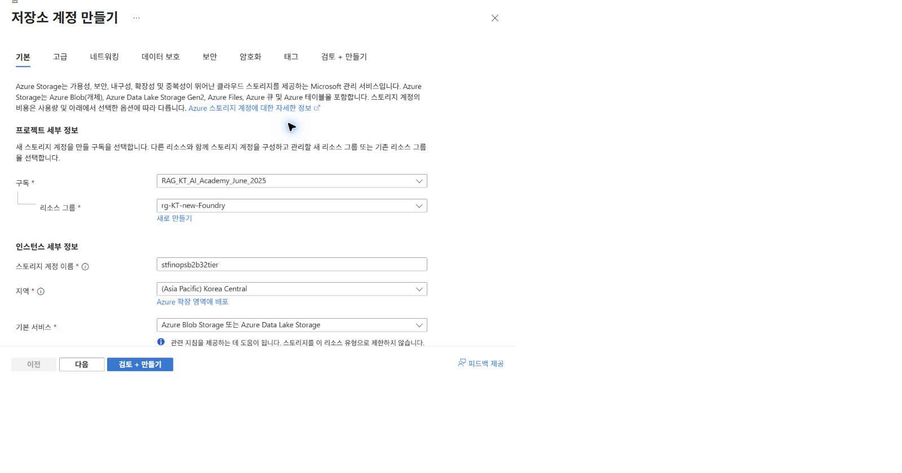
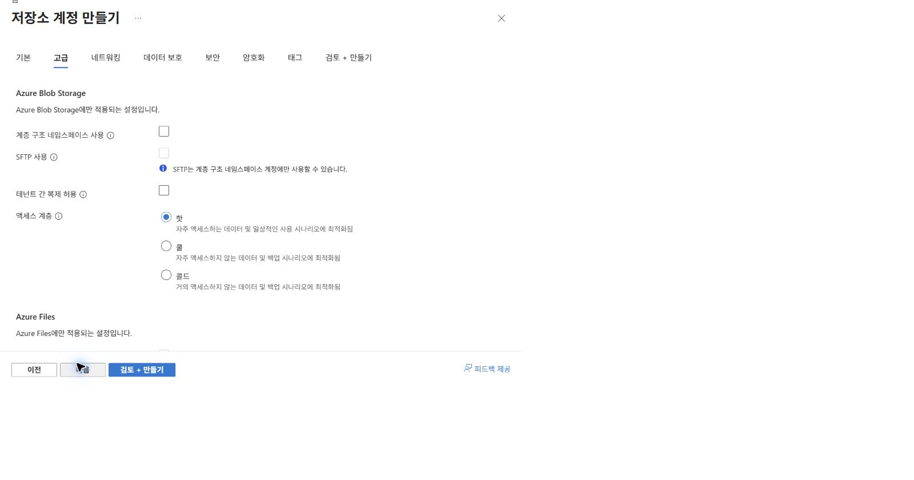
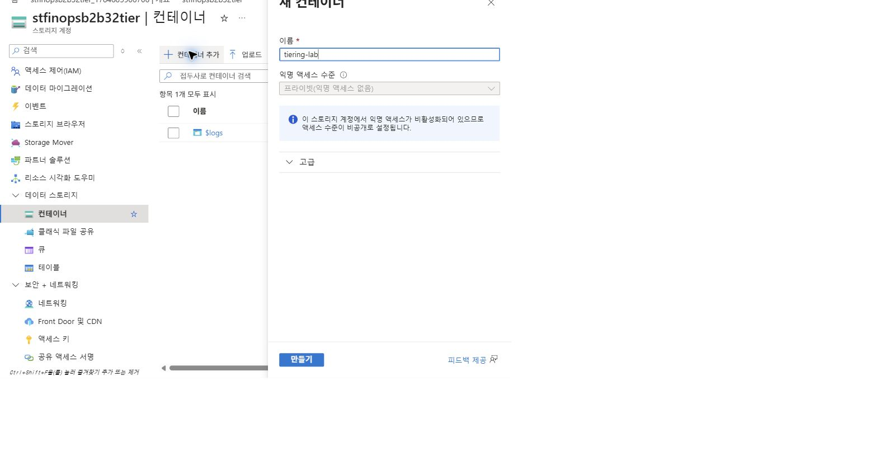
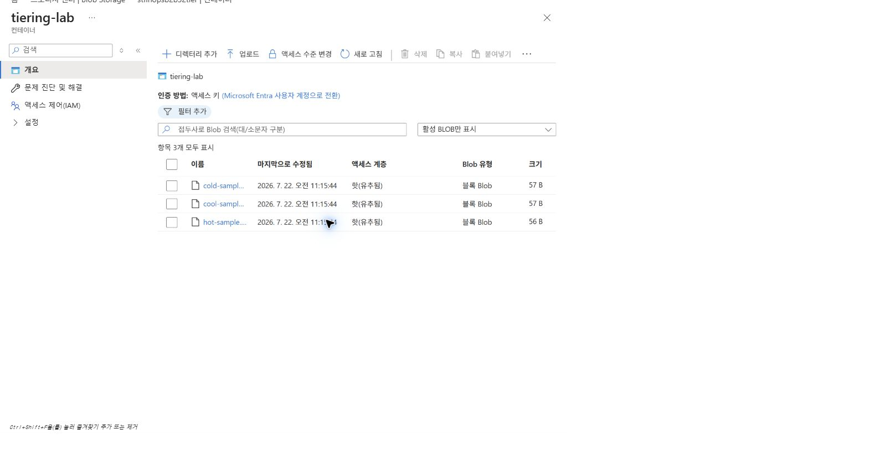
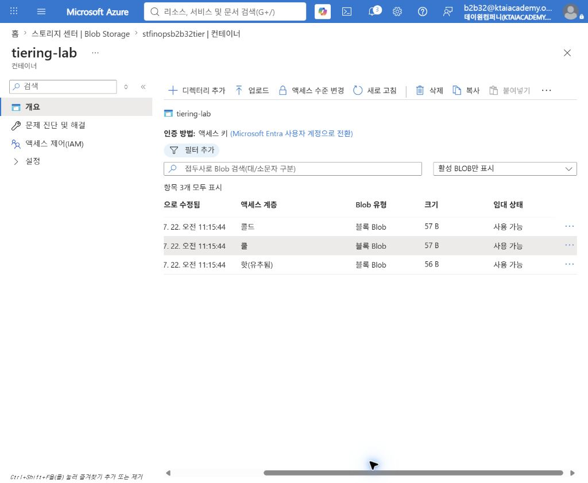

# Azure Blob 액세스 계층화와 수명 주기 관리

## 1. 실습 개요

데이터의 사용 빈도에 맞춰 Blob을 Hot, Cool, Cold, Archive 계층에 배치하고,  
수명 주기 정책으로 계층 이동을 자동화하는 실습임.

Blob 데이터는 시간이 지날수록 접근 빈도가 낮아지는 경우가 많음.  
계속 Hot 계층에 보관하면 접근성은 높지만 저장 비용 최적화 기회를 놓칠 수 있음.  
반대로 사용 패턴을 확인하지 않고 낮은 계층으로 이동하면 조회·복원 비용과 지연이 증가할 수 있음.

### 학습 목표

- 기존 리소스 그룹에 범용 v2 스토리지 계정 생성  
- 비공개 Blob 컨테이너와 실습 파일 구성  
- Blob별 Hot, Cool, Cold 계층 수동 설정 및 결과 비교  
- 마지막 수정 시점을 기준으로 자동 계층 이동 정책 구성  
- 저장 비용, 작업 비용, 조기 삭제 비용, 복원 지연 간의 트레이드오프 설명  

### 예상 소요 시간

약 40분임.

### 실습 흐름

```text
샘플 업로드 → 수동 계층 비교 → 사용 기간별 정책 정의 → 정책 저장 → 비용·운영 영향 검토
```

> [!NOTE]  
> 사용 패턴 기반 자동 계층화 실습은  
> [11-2. Azure Blob Smart Tiering](11-2.smart-tiering.md) 참조.

## 2. 액세스 계층 이해

| 계층 | 권장 사용 패턴 | 최소 권장 보존 기간 | 온라인 접근 | 주요 고려 사항 |  
|---|---|---:|---|---|  
| Hot | 자주 읽고 쓰는 데이터 | 없음 | 가능 | 저장 비용이 높고 접근 비용이 낮은 편임 |  
| Cool | 자주 사용하지 않지만 즉시 접근이 필요한 데이터 | 30일 | 가능 | 조기 삭제 비용 고려 필요 |  
| Cold | 거의 사용하지 않지만 즉시 접근이 필요한 데이터 | 90일 | 가능 | Cool보다 접근·트랜잭션 비용이 높은 편임 |  
| Archive | 장기 보관하며 즉시 접근이 필요 없는 데이터 | 180일 | 불가능 | 읽기 전 리하이드레이션 필요 |  

> [!IMPORTANT]  
> 최소 보존 기간보다 일찍 삭제하거나 더 높은 계층으로 이동하면 조기 삭제 비용이 발생할 수 있음.  
> 실제 비용은 지역, 중복 옵션, 데이터 크기, 작업 수, 조회량에 따라 달라짐.

## 3. 실습 환경

이 실습에서는 별도 리소스 그룹을 만들지 않고 기존 리소스 그룹을 재사용함.  
실습 종료 시 공유 리소스 그룹이 아닌 스토리지 계정만 삭제해야 함.

| 항목 | 검증 환경 값 |  
|---|---|  
| 구독 | `RAG_KT_AI_Academy_June_2025` |  
| 리소스 그룹 | `rg-KT-new-Foundry` |  
| 지역 | `Korea Central` |  
| 스토리지 계정 | `stfinopsb2b32tier` |  
| 계정 종류 | StorageV2, Standard, LRS |  
| 기본 액세스 계층 | Hot |  
| 컨테이너 | `tiering-lab` |  
| 익명 액세스 | 사용 안 함 |  
| 수명 주기 규칙 | `tier-samples-by-age` |  

> [!NOTE]  
> 스토리지 계정 이름은 Azure 전체에서 고유해야 함.  
> 다른 환경에서는 조직 약어와 임의 문자열을 조합한 고유 이름 사용 필요.

## 4. 사전 요구 사항

- Azure 구독에서 스토리지 계정을 만들 수 있는 권한  
- 수명 주기 관리 정책을 만들 수 있는 권한  
- 로컬 샘플 폴더 `hands-on/blob-tiering-samples`  
- 다음 세 파일의 존재 확인  
  - `hot-sample.txt`  
  - `cool-sample.txt`  
  - `cold-sample.txt`  

## 5. 스토리지 계정 생성

### 5.1 기본 설정

1. Azure Portal 상단 검색창에서 `스토리지 계정` 검색.  
2. `만들기` 선택.  
3. 다음 값 입력.  

| 항목 | 입력값 |  
|---|---|  
| 구독 | 실습 구독 |  
| 리소스 그룹 | 기존 `rg-KT-new-Foundry` |  
| 스토리지 계정 이름 | Azure 전체에서 고유한 이름 |  
| 지역 | `(Asia Pacific) Korea Central` |  
| 기본 서비스 | Azure Blob Storage 또는 Azure Data Lake Storage |  
| 성능 | Standard |  
| 중복 | LRS |  

스토리지 중복 옵션별 핵심 차이와 대표 운영 환경은 다음과 같음.

| 옵션 | 핵심 차이 | 운영 환경 유즈케이스 |  
|---|---|---|  
| LRS | 단일 데이터센터 내부 복제 | 재생성 가능한 데이터, 개발·실습 환경 |  
| ZRS | 동일 지역의 3개 이상 가용 영역에 복제 | 영역 장애에도 읽기·쓰기가 필요한 서비스 |  
| GRS | 주 지역 LRS와 보조 지역 LRS에 복제 | 지역 재해에 대비하는 백업·장기 보관 데이터 |  
| RA-GRS | GRS 구성에 보조 지역 읽기 기능 추가 | 주 지역 장애 중에도 읽기가 필요한 서비스 |  
| GZRS | 주 지역 ZRS와 보조 지역 LRS에 복제 | 영역 장애와 지역 재해를 모두 대비하는 서비스 |  
| RA-GZRS | GZRS 구성에 보조 지역 읽기 기능 추가 | 가장 높은 수준의 읽기 가용성이 필요한 서비스 |  

> [!NOTE]  
> 이 실습은 비용이 낮고 Archive 계층을 지원하는 LRS 사용.  
> Archive 계층은 ZRS, GZRS, RA-GZRS 계정에서 지원되지 않음.



### 5.2 고급 설정

1. `고급` 탭 선택.  
2. 보안 전송 필요를 사용으로 유지.  
3. 최소 TLS 버전을 1.2로 유지.  
4. 계층 구조 네임스페이스를 사용하지 않음으로 유지.  
5. Blob 익명 액세스 허용을 사용하지 않음으로 유지.  



### 5.3 검토 및 배포

1. `검토 + 만들기` 선택.  
2. 유효성 검사 통과 확인.  
3. 계정 종류가 `StorageV2`, 기본 액세스 계층이 `Hot`인지 확인.  
4. `만들기` 선택.  
5. 배포 완료 후 `리소스로 이동` 선택.  

## 6. 컨테이너 생성과 샘플 업로드

### 6.1 비공개 컨테이너 생성

1. 스토리지 계정 메뉴에서 `데이터 스토리지` > `컨테이너` 선택.  
2. `+ 컨테이너` 선택.  
3. 이름에 `tiering-lab` 입력.  
4. 익명 액세스 수준이 `프라이빗(익명 액세스 없음)`인지 확인.  
5. `만들기` 선택.  



### 6.2 파일 업로드

1. `tiering-lab` 컨테이너 선택.  
2. `업로드` 선택.  
3. `hands-on/blob-tiering-samples` 폴더의 세 파일 선택.  
4. 기본 액세스 계층을 변경하지 않고 업로드 실행.  
5. 세 파일의 액세스 계층이 `Hot(유추됨)`으로 표시되는지 확인.  



`유추됨` 표시는 Blob에 계층을 명시하지 않아 계정의 기본 계층인 Hot을 상속했다는 의미임.

## 7. Blob별 계층 수동 설정

샘플 파일별로 다른 계층을 지정하여 포털 표시와 계층 변경 절차를 비교함.  
Archive는 온라인에서 즉시 읽을 수 없고 리하이드레이션이 필요하므로 이 단계에서는 설정하지 않음.

### 7.1 `cool-sample.txt`를 Cool로 변경

1. `cool-sample.txt` 행 오른쪽의 `...` 선택.  
2. `계층 변경` 선택.  
3. 액세스 계층에서 `Cool` 선택.  
4. `저장` 선택.  
5. 목록의 액세스 계층이 `Cool`로 변경되었는지 확인.  

### 7.2 `cold-sample.txt`를 Cold로 변경

1. `cold-sample.txt` 행 오른쪽의 `...` 선택.  
2. `계층 변경` 선택.  
3. 액세스 계층에서 `Cold` 선택.  
4. `저장` 선택.  
5. 목록의 액세스 계층이 `Cold`로 변경되었는지 확인.  

### 7.3 결과 비교

| 파일 | 최종 계층 | 목적 |  
|---|---|---|  
| `hot-sample.txt` | Hot(유추됨) | 계정 기본값 유지 |  
| `cool-sample.txt` | Cool | 30일 이상 비활성 데이터 예시 |  
| `cold-sample.txt` | Cold | 90일 이상 비활성 데이터 예시 |  



> [!CAUTION]  
> 실습 파일은 매우 작아 비용 영향이 미미하지만, 운영 데이터의 계층 변경은 트랜잭션과 데이터 조회 비용을 유발할 수 있음.

## 8. 수명 주기 관리 정책 구성

### 8.1 정책 설계

마지막 수정 시점을 기준으로 다음 정책 적용.

| 조건 | 작업 | FinOps 의도 |  
|---|---|---|  
| 30일 초과 | Cool로 이동 | 접근 빈도가 낮아진 데이터의 저장 비용 절감 |  
| 90일 초과 | Cold로 이동 | 거의 사용하지 않는 온라인 데이터의 저장 비용 절감 |  
| 180일 초과 | Archive로 이동 | 즉시 접근이 불필요한 장기 보관 데이터의 저장 비용 절감 |  

규칙은 `tiering-lab/` 접두사에만 적용함.  
같은 계정의 `$logs` 등 다른 컨테이너가 실습 정책의 영향을 받지 않도록 범위를 제한하는 구성임.

### 8.2 규칙 세부 정보 입력

1. 스토리지 계정 메뉴에서 `데이터 관리` > `수명 주기 관리` 선택.  
2. `규칙 추가` 선택.  
3. 규칙 이름에 `tier-samples-by-age` 입력.  
4. 규칙 범위에서 `필터를 사용하여 Blob 제한` 선택.  
5. Blob 유형에서 `블록 Blob` 선택 상태 유지.  
6. Blob 하위 유형에서 `기본 Blob` 선택 상태 유지.  
7. `다음` 선택.  

### 8.3 기본 Blob 작업 설정

1. 기준을 `마지막으로 수정됨`으로 유지.  
2. 첫 조건을 `30일`과 `Cool 스토리지로 이동`으로 설정.  
3. `조건 추가` 선택.  
4. 두 번째 조건을 `90일`과 `Cold 스토리지로 이동`으로 설정.  
5. `조건 추가` 선택.  
6. 세 번째 조건을 `180일`과 `Archive 스토리지로 이동`으로 설정.  
7. Archive 조건의 `마지막에 리하이드레이션된 Blob 건너뛰기`를 선택 상태로 유지.  
8. 리하이드레이션 후 유예 기간을 기본값 `7일`로 유지.  
9. `다음` 선택.  

리하이드레이션된 Blob 건너뛰기 조건은 최근 복원한 Blob이 즉시 다시 Archive로 이동하는 상황을 줄이는 안전장치임.

### 8.4 필터와 정책 저장

1. Blob 접두사에 `tiering-lab/` 입력.  
2. Blob 인덱스 일치는 비워 둠.  
3. `추가` 선택.  
4. 정책 목록에서 `tier-samples-by-age`가 `사용` 상태인지 확인.  
5. 알림에서 스토리지 계정의 수명 주기 정책 업데이트 완료 확인.  

## 9. 정책 코드 확인

수명 주기 관리의 `코드 보기`에서 다음 구조 확인 가능.  
포털에서 저장한 실제 정책에는 최근 리하이드레이션 후 7일 동안 Archive 이동을 건너뛰는 조건도 포함됨.

```json
{
  "rules": [
    {
      "enabled": true,
      "name": "tier-samples-by-age",
      "type": "Lifecycle",
      "definition": {
        "actions": {
          "baseBlob": {
            "tierToCool": {
              "daysAfterModificationGreaterThan": 30
            },
            "tierToCold": {
              "daysAfterModificationGreaterThan": 90
            },
            "tierToArchive": {
              "daysAfterLastTierChangeGreaterThan": 7,
              "daysAfterModificationGreaterThan": 180
            }
          }
        },
        "filters": {
          "blobTypes": [
            "blockBlob"
          ],
          "prefixMatch": [
            "tiering-lab/"
          ]
        }
      }
    }
  ]
}
```

## 10. 검증

### 10.1 즉시 확인 가능한 항목

- 스토리지 계정 배포 성공  
- `tiering-lab` 컨테이너의 익명 액세스 비활성화  
- 샘플 파일 세 개 업로드  
- `hot-sample.txt`의 Hot 계층 유지  
- `cool-sample.txt`의 Cool 계층 변경  
- `cold-sample.txt`의 Cold 계층 변경  
- `tier-samples-by-age` 규칙의 사용 상태  
- 코드 보기의 30일, 90일, 180일 조건  
- 코드 보기의 `tiering-lab/` 접두사 필터  

### 10.2 즉시 확인할 수 없는 항목

수명 주기 정책은 비동기 방식으로 평가됨.  
정책이 계정의 모든 대상 Blob을 처리하는 데 여러 날이 걸릴 수 있으며,  
방금 업로드한 Blob은 30일 조건을 충족하지 않으므로 자동 계층 이동이 즉시 발생하지 않음.

따라서 이 실습의 자동화 완료 기준은 정책 저장과 코드 대조까지임.  
30일 이후 실제 이동 결과 확인은 장기 관찰 항목임.

## 11. FinOps 관점 분석

### 11.1 저장 비용만 비교하지 않는 이유

낮은 계층은 일반적으로 저장 단가가 낮지만 읽기, 쓰기, 조회, 계층 변경 비용이 증가할 수 있음.  
비용 최적화 여부는 다음 항목의 합계로 판단해야 함.

```text
총비용 = 저장 비용 + 작업 비용 + 데이터 조회 비용 + 조기 삭제 비용 + 리하이드레이션 비용
```

### 11.2 계층 임계값 결정 방법

- Azure Monitor와 애플리케이션 로그로 실제 접근 패턴 측정  
- 데이터 종류별 복구 시간 목표와 규제 보존 기간 확인  
- 30일, 90일, 180일을 시작점으로 사용 후 실제 사용량에 따라 조정  
- 정책 적용 전 예상 절감액과 예상 조회 비용 비교  
- 월별 비용과 리하이드레이션 건수를 검토하여 규칙 반복 개선  

### 11.3 Archive 사용 판단

리하이드레이션은 Archive Blob을 Hot 또는 Cool 온라인 계층으로 복원하는 과정임.  
우선순위와 데이터 크기에 따라 시간이 걸리며 관련 작업·조회 비용이 발생함.  
즉시 복구가 필요한 운영 데이터에는 Archive 미사용 권장.

## 12. 문제 해결

### `Cold` 또는 `Archive` 옵션이 표시되지 않음

- 계정 종류가 범용 v2 또는 Blob Storage인지 확인  
- 계정 중복 유형과 지역에서 해당 계층을 지원하는지 확인  
- 계층 구조 네임스페이스와 Blob 유형 등 기능 제한 확인  

### 수명 주기 관리 메뉴가 보이지 않음

- 스토리지 계정의 `데이터 관리` 메뉴 펼침  
- 계정 종류가 StorageV2인지 확인  
- 정책을 읽고 쓸 수 있는 Azure RBAC 권한 확인  

### 규칙을 저장했지만 계층이 바뀌지 않음

- 계정 규모와 작업량에 따라 정책 처리에 여러 날이 걸릴 수 있음을 확인  
- Blob의 마지막 수정 시점이 조건 일수를 초과했는지 확인  
- 접두사가 `tiering-lab/`으로 정확한지 확인  
- 코드 보기에서 규칙이 `enabled: true`인지 확인  

### Archive Blob을 열 수 없음

- Archive는 오프라인 계층임을 확인  
- Hot 또는 Cool 계층으로 리하이드레이션 요청  
- 리하이드레이션 완료 전 읽기 불가  
- 리하이드레이션 시간과 비용을 운영 계획에 반영  

## 13. 실습 정리

> [!CAUTION]  
> `rg-KT-new-Foundry`는 기존 공유 리소스 그룹이므로 리소스 그룹 전체 삭제 금지.

비용 발생을 원하지 않으면 다음 순서로 정리.

1. 스토리지 계정 `stfinopsb2b32tier` 선택.  
2. `삭제` 선택.  
3. 삭제 확인 절차 수행.  
4. 리소스 그룹에 다른 실습 리소스가 남아 있는지 확인.  

## 참고 자료

- [Azure Blob 데이터 액세스 계층 개요][access-tiers]  
- [Azure Blob Storage 수명 주기 관리 개요][lifecycle-overview]  
- [수명 주기 관리 정책 구성][lifecycle-configure]  
- [Archive Blob 리하이드레이션 개요][archive-rehydrate]  
- [Blob 비용 최적화 서비스 비교][cost-optimization-services]  

[access-tiers]: https://learn.microsoft.com/en-us/azure/storage/blobs/access-tiers-overview  
[lifecycle-overview]: https://learn.microsoft.com/en-us/azure/storage/blobs/lifecycle-management-overview  
[lifecycle-configure]: https://learn.microsoft.com/en-us/azure/storage/blobs/lifecycle-management-policy-configure  
[archive-rehydrate]: https://learn.microsoft.com/en-us/azure/storage/blobs/archive-rehydrate-overview  
[cost-optimization-services]: https://learn.microsoft.com/en-us/azure/storage/blobs/blob-cost-optimization-services
