# Azure Blob Smart Tiering

## 1. 실습 개요

접근 패턴을 예측하기 어려운 블록 Blob을 Smart 계층으로 관리하고, Microsoft 관리형 기준에 따라  
Hot, Cool, Cold 계층 사이를 자동 이동하도록 구성하는 실습임.

Smart Tiering을 사용하면 Hot → Cool → Cold 계층 이동용 수명 주기 규칙은 만들지 않아도 됨.  
다만 Archive 이동, 보존 기간 만료 삭제, 접두사·태그별 정책에는 수명 주기 관리가 필요함.

### 학습 목표

- Smart Tiering의 적용 조건과 자동 전환 기준 설명  
- Standard GPv2 ZRS 계정의 기본 액세스 계층을 Smart로 설정  
- 128KiB를 초과하는 블록 Blob을 Smart 계층으로 업로드  
- Blob 속성에서 Smart 관리 상태 확인  
- Azure Monitor에서 Smart 계층 분포 메트릭 구성  
- Smart 계층 이동과 수명 주기 삭제 정책의 책임 분리

### 예상 소요 시간

약 35분임.

### 실습 흐름

```text
ZRS 계정 생성 → Smart 기본 계층 설정 → 비공개 컨테이너 생성
→ 256KiB Blob 업로드 → Smart 상태 확인 → 메트릭 구성 → 365일 삭제 정책 구성
```

## 2. Smart Tiering과 수명 주기 관리 비교

| 요구 사항 | Smart Tiering | 수명 주기 관리 |  
|---|---|---|  
| Hot → Cool → Cold 이동 | 고정된 비활성 기간에 따라 자동 수행 | 사용자가 규칙과 일수 정의 |  
| Blob 접근 시 Hot 복귀 | 자동 수행 | Cool에 한하여 규칙 옵션 구성 가능 |  
| Archive 이동 | 미지원 | 지원 계정에서 구성 가능 |  
| 만료 후 삭제 | 미지원 | 지원 |  
| 접두사·Blob 태그별 범위 | 미지원 | 지원 |  
| 이전 버전·스냅샷 관리 | 전용 계층 규칙 미지원 | 계층 이동과 삭제 규칙 지원 |  
| 운영 주체 | Microsoft 관리형 | 사용자 관리형 |

> [!IMPORTANT]  
> Smart Blob에는 수명 주기 관리의 계층 이동 작업이 적용되지 않지만 삭제 작업은 적용됨.  
> 계층 이동은 Smart Tiering에 맡기고 만료 삭제만 수명 주기 관리로 구성 가능함.

## 3. 동작 기준과 비용

### 3.1 자동 전환 기준

| Smart 상태 | 조건 | 데이터 접근 시 동작 |  
|---|---|---|  
| SmartHot | 최초 저장 또는 최근 접근 | Hot 유지 및 타이머 재시작 |  
| SmartCool | 30일 동안 접근 없음 | SmartHot으로 자동 복귀 |  
| SmartCold | 총 90일 동안 접근 없음 | SmartHot으로 자동 복귀 |  
| SmartHot-small | 128KiB 미만 | Hot에 유지되고 자동 이동하지 않음 |

Smart Tiering을 활성화한 시점부터 접근 패턴 추적이 시작됨.  
최초 자동 이동은 활성화 후 30일이 지나야 발생 가능함.

`Get Blob`과 `Put Blob`은 접근 타이머를 갱신함.  
속성, 메타데이터, 태그 조회는 접근 타이머를 갱신하지 않음.

### 3.2 비용 기준

- SmartHot, SmartCool, SmartCold가 사용하는 기반 용량 계층의 저장 단가 적용  
- 128KiB를 초과하는 관리 Blob마다 월별 모니터링 작업 비용 발생  
- 128KiB 이하 Blob에는 모니터링 비용 미부과  
- Smart 내부 계층 전환, 조기 삭제, 데이터 조회 작업 비용 미부과  
- Blob을 읽는 작업에는 Hot 계층 작업 요율 적용  
- Smart 밖의 명시적 계층으로 이동할 때 쓰기 트랜잭션 비용 발생 가능

> [!NOTE]  
> 자동 이동 제외 기준은 `128KiB 미만`, 모니터링 비과금 기준은 `128KiB 이하`임.

## 4. 요구 사항과 검증 환경

### 4.1 요구 사항

- Standard 범용 v2(GPv2) 스토리지 계정  
- ZRS, GZRS 또는 RA-GZRS 중복성  
- 블록 Blob  
- 스토리지 계정과 컨테이너를 만들 수 있는 Azure 권한

LRS와 GRS 계정, 범용 v1 계정, Premium 계정에는 Smart Tiering을 설정할 수 없음.  
페이지 Blob과 추가 Blob은 Smart Tiering 대상이 아님.

### 4.2 실제 검증 환경

| 항목 | 검증값 |  
|---|---|  
| 리소스 그룹 | `rg-KT-new-Foundry` |  
| 스토리지 계정 | `stsmartb2b322026` |  
| 지역 | `Korea Central` |  
| 계정 종류 | StorageV2, Standard |  
| 중복도 | ZRS |  
| 기본 Blob 액세스 계층 | Smart |  
| 컨테이너 | `smart-tier-lab` |  
| Blob | `smart-sample.bin`, 256KiB, 블록 Blob |  
| 삭제 규칙 | `delete-smart-samples-after-365-days` |

> [!NOTE]  
> 기존 Blob 계층화 실습의 LRS 계정은 Smart Tiering을 지원하지 않음.  
> 기존 리소스 그룹을 재사용하고 Smart 전용 ZRS 계정만 새로 생성함.

## 5. Smart 전용 스토리지 계정 생성

### 5.1 기본 설정

1. Azure Portal에서 `스토리지 계정` 검색.  
2. `만들기` 선택.  
3. `기본` 탭에서 다음 값 입력.

| 항목 | 설정값 |  
|---|---|  
| 구독 | 실습 구독 |  
| 리소스 그룹 | 기존 `rg-KT-new-Foundry` |  
| 스토리지 계정 이름 | 전역에서 고유한 이름 |  
| 지역 | `(Asia Pacific) Korea Central` |  
| 기본 서비스 | `Azure Blob Storage 또는 Azure Data Lake Storage` |  
| 성능 | `표준` |  
| 중복도 | `ZRS` |

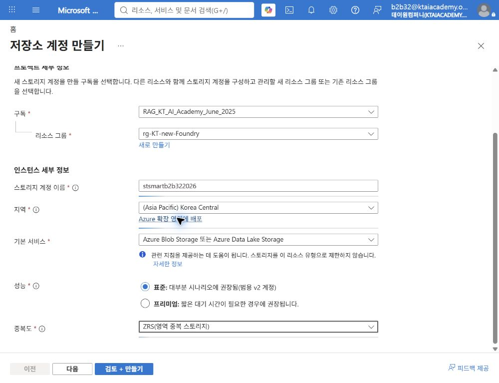

> [!NOTE]  
> 스토리지 계정 이름은 Azure 전체에서 고유해야 함.  
> 예시 이름을 사용할 수 없으면 조직 약어와 임의 숫자를 조합함.

### 5.2 Smart 액세스 계층 설정

1. `고급` 탭 선택.  
2. `Azure Blob Storage` 영역 확인.  
3. `액세스 계층`에서 `스마트` 선택.  
4. 계층 구조 네임스페이스는 사용하지 않음으로 유지.

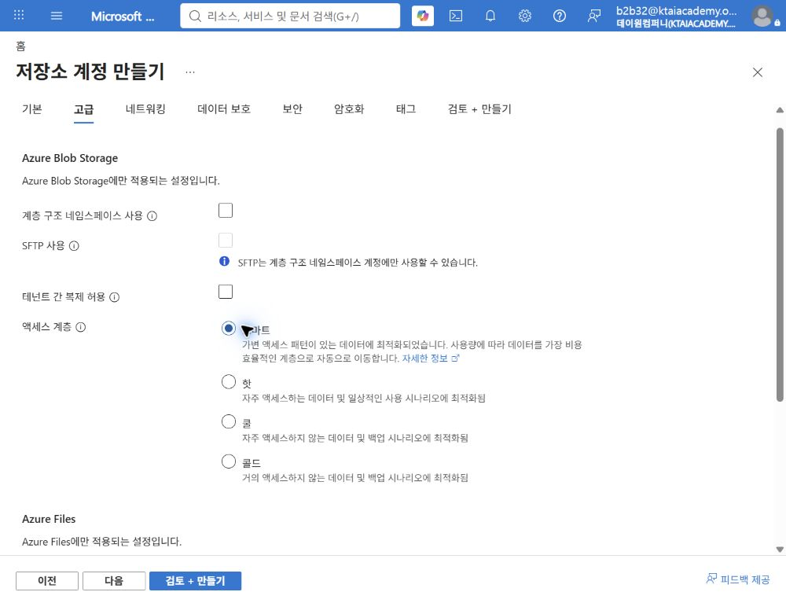

### 5.3 검토와 배포

1. `검토 + 만들기` 선택.  
2. 유효성 검사 완료 후 다음 값 확인.  
   - Standard  
   - ZRS  
   - 액세스 계층 Smart  
3. `만들기` 선택.

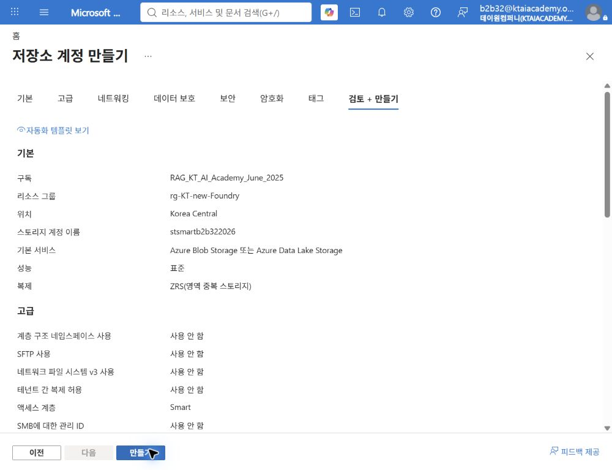

4. `배포가 완료됨` 메시지 확인.  
5. `리소스로 이동` 선택.

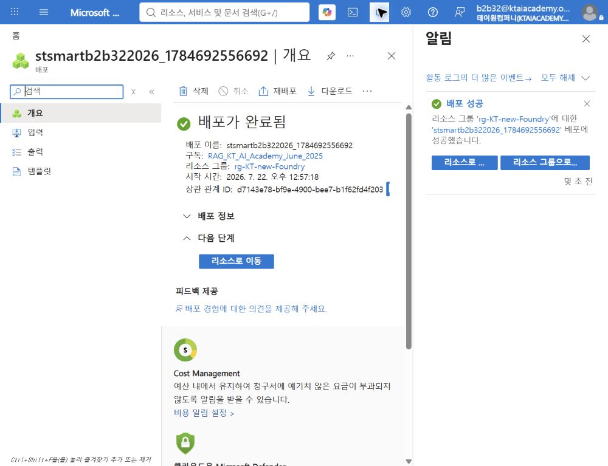

## 6. 계정 기본 계층 검증

1. 스토리지 계정에서 `설정` > `구성` 선택.  
2. 화면 아래쪽의 `Blob 액세스 계층(기본값)` 확인.  
3. `스마트`가 선택되어 있는지 확인.

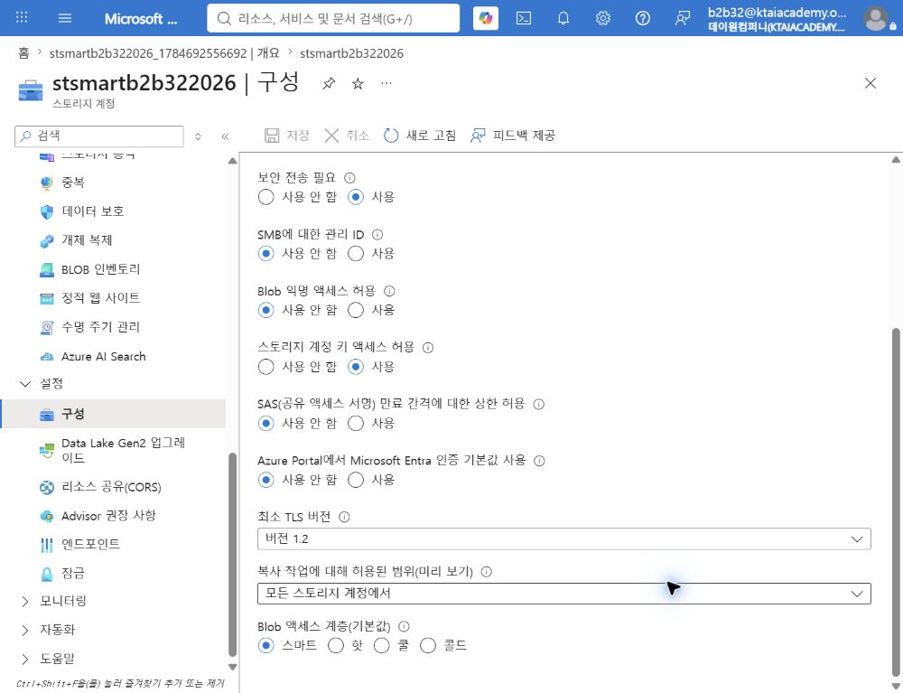

기존 지원 계정을 Smart로 변경하면 명시적 계층이 없는 Blob만 Smart 대상으로 이동함.  
이미 Hot, Cool 또는 Cold가 명시된 Blob은 Smart로 이동하지 않음.

## 7. 비공개 컨테이너 생성

1. `데이터 스토리지` > `컨테이너` 선택.  
2. `+ 컨테이너` 선택.  
3. 이름에 `smart-tier-lab` 입력.  
4. 익명 액세스 수준이 `프라이빗`인지 확인.  
5. `만들기` 선택.

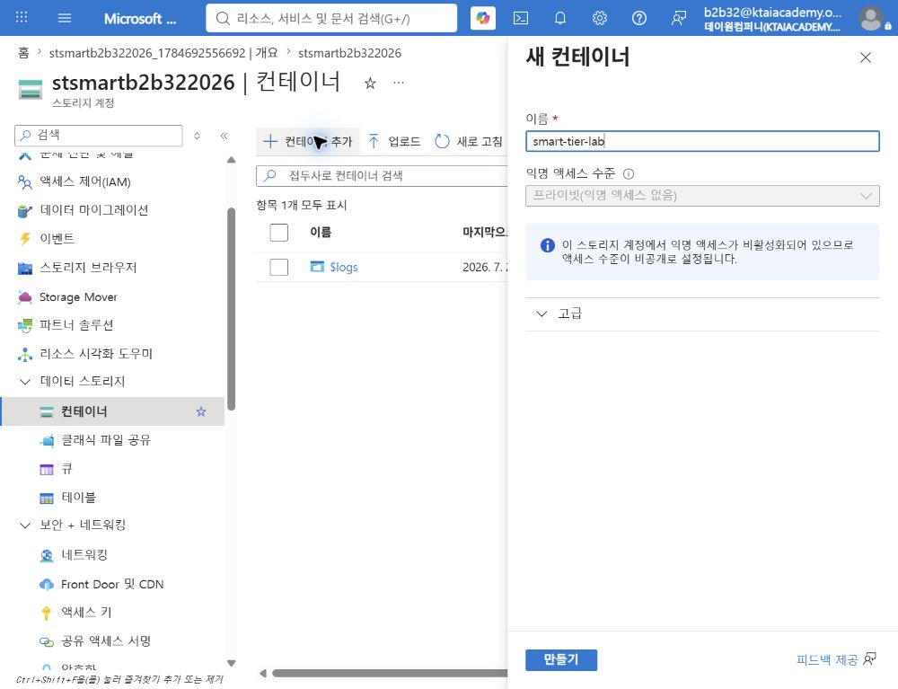

## 8. 256KiB 샘플 생성과 업로드

### 8.1 로컬 샘플 생성

기존 텍스트 샘플은 128KiB보다 작아 SmartHot-small에 유지됨.  
다음 PowerShell 명령으로 256KiB 검증 파일 생성.

```powershell
$samplePath = "hands-on\blob-tiering-samples\smart-sample.bin"
$buffer = New-Object byte[] (256KB)
[System.IO.File]::WriteAllBytes($samplePath, $buffer)
Get-Item $samplePath | Select-Object Name, Length
```

출력의 `Length`가 `262144`인지 확인함.

### 8.2 Blob 업로드

1. `smart-tier-lab` 컨테이너 선택.  
2. `업로드` 선택.  
3. 생성한 `smart-sample.bin` 선택.  
4. Hot, Cool 또는 Cold 계층을 명시적으로 선택하지 않음.  
5. 업로드 실행.  
6. 목록에서 다음 값 확인.  
   - 이름: `smart-sample.bin`  
   - 액세스 계층: `스마트(유추됨)`  
   - Blob 유형: `블록 Blob`  
   - 크기: `256 KiB`

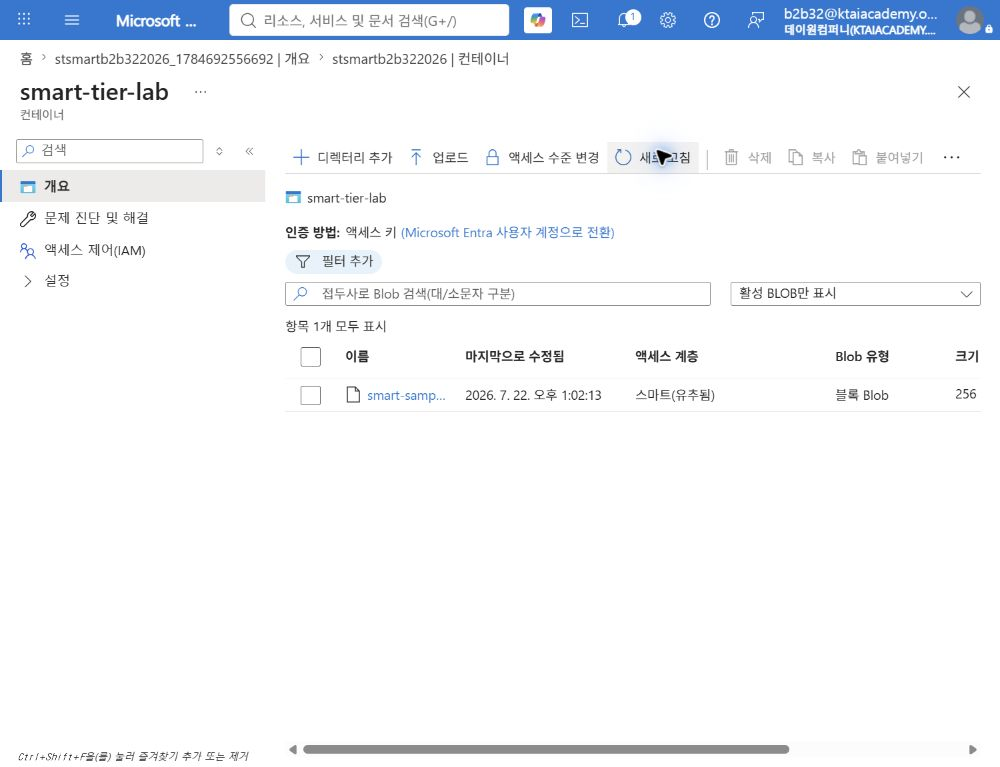

> [!CAUTION]  
> Blob을 Hot, Cool 또는 Cold로 명시적으로 이동하면 Smart 관리 대상에서 제외됨.  
> 명시적 계층으로 이동한 Blob은 다시 Smart Tiering 대상으로 변경할 수 없음.

### 8.3 Blob 속성 확인

1. `smart-sample.bin` 선택.  
2. `개요`에서 다음 속성 확인.  
   - 형식: 블록 Blob  
   - 크기: 256KiB  
   - 액세스 계층: 스마트(유추)  
   - 보존 액세스 계층: 핫  
   - 계층 수정일: 해당 없음

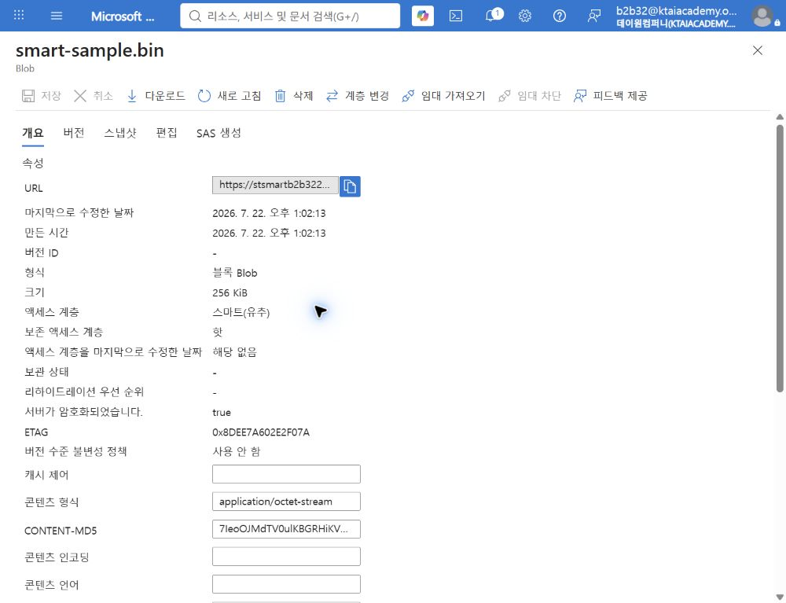

`유추`는 Blob에 계층을 직접 지정하지 않고 계정의 Smart 기본값을 상속했다는 의미임.

## 9. Smart 계층 분포 메트릭 구성

1. 스토리지 계정에서 `모니터링` > `메트릭` 선택.  
2. 메트릭 네임스페이스를 `Blob`으로 설정.  
3. 메트릭을 `Blob Count`로 설정.  
4. 집계가 `Avg`인지 확인.  
5. `분할 적용` 선택.  
6. `Blob tier`와 `Blob type`을 모두 선택.

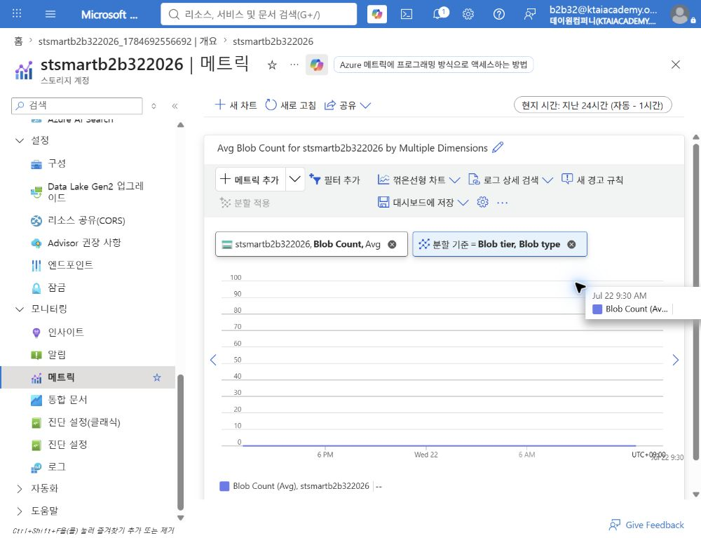

| 메트릭 값 | 의미 |  
|---|---|  
| SmartHot | Hot 용량 계층에서 관리 중인 Blob |  
| SmartCool | 30일 미접근 후 Cool로 이동한 Blob |  
| SmartCold | 총 90일 미접근 후 Cold로 이동한 Blob |  
| SmartHot-small | 128KiB 미만으로 Hot에 유지되는 Blob |  
| BlockBlob, Smart | 128KiB를 초과하여 모니터링되는 Smart 블록 Blob |

> [!NOTE]  
> Azure Monitor 메트릭에는 수집 지연이 있을 수 있음.  
> 당일 완료 기준은 차트 값의 출현이 아니라 네임스페이스, 메트릭, 분할 조건의 구성 완료임.

## 10. 365일 삭제 정책과 조합

Smart Tiering은 계층 이동을 담당하지만 만료 삭제는 수행하지 않음.  
본 실습에서는 Smart 이동 규칙을 추가하지 않고 365일 삭제 규칙만 구성함.

### 10.1 삭제 규칙 생성

1. `데이터 관리` > `수명 주기 관리` 선택.  
2. `+ 규칙 추가` 선택.  
3. 다음 세부 정보 입력.

| 항목 | 설정값 |  
|---|---|  
| 규칙 이름 | `delete-smart-samples-after-365-days` |  
| 규칙 범위 | 필터를 사용하여 Blob 제한 |  
| Blob 유형 | 블록 Blob |  
| Blob 하위 유형 | 기본 Blob |  
| 조건 | 마지막 수정 후 365일 |  
| 작업 | Blob 삭제 |  
| Blob 접두사 | `smart-tier-lab/` |

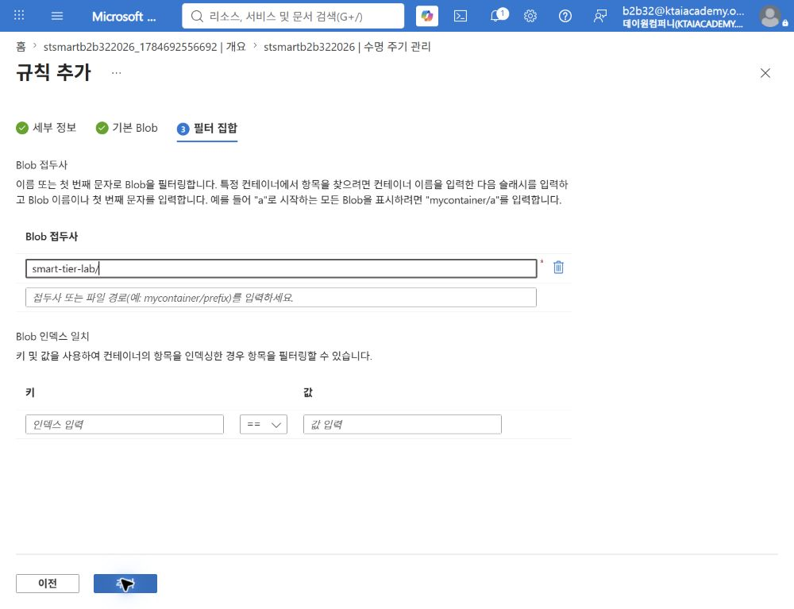

4. `추가` 선택.  
5. 정책 목록에서 규칙 상태가 `사용`인지 확인.

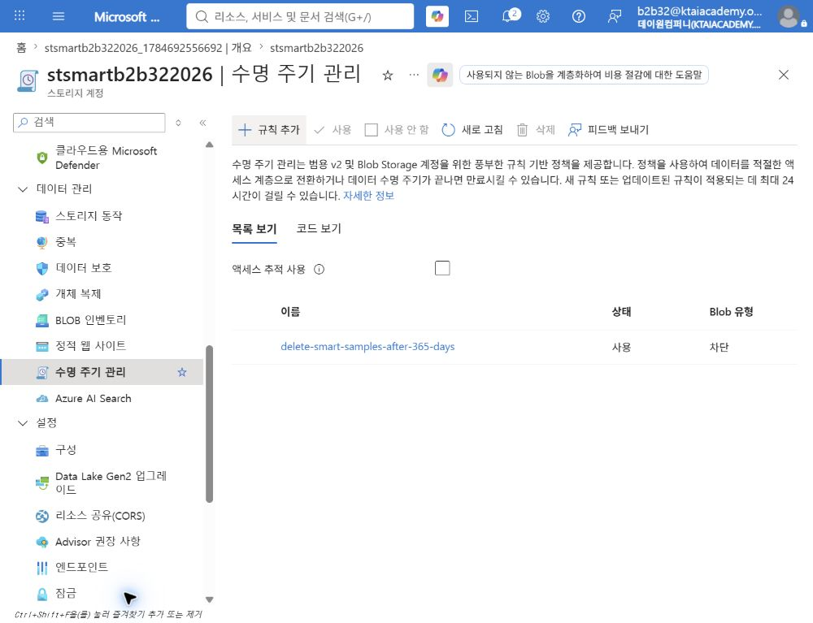

### 10.2 정책 코드 확인

1. `코드 보기` 선택.  
2. 다음 항목 확인.  
   - `delete` 작업만 존재  
   - `daysAfterModificationGreaterThan` 값이 `365`  
   - `blobTypes` 값이 `blockBlob`  
   - `prefixMatch` 값이 `smart-tier-lab/`  
   - `tierToCool`, `tierToCold`, `tierToArchive` 작업이 없음

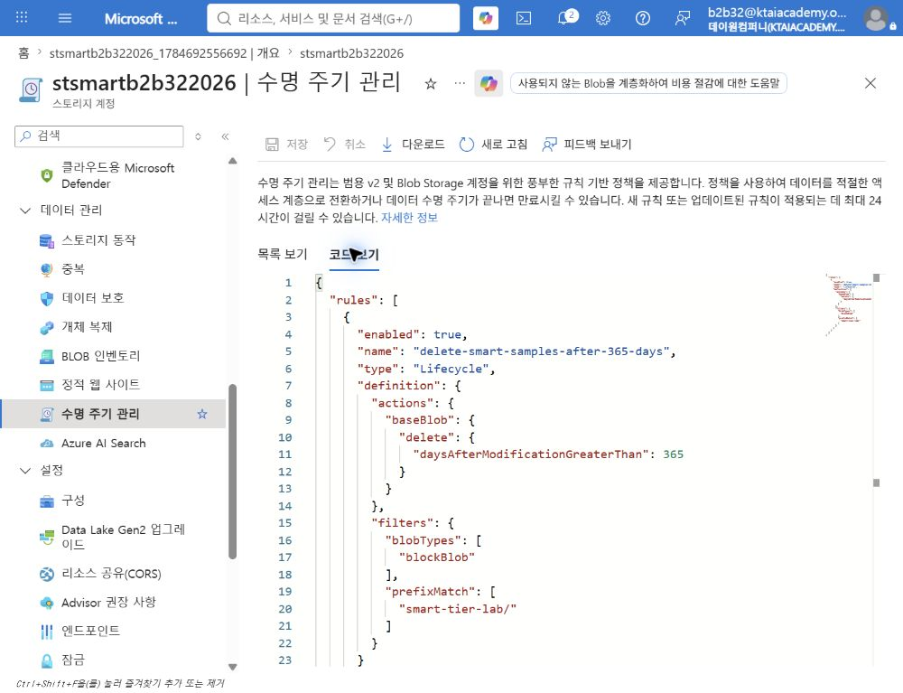

> [!IMPORTANT]  
> 새 수명 주기 규칙이나 변경된 규칙이 적용되는 데 최대 24시간이 걸릴 수 있음.  
> 365일 조건을 충족하지 않은 실습 Blob은 즉시 삭제되지 않음.

## 11. 검증

### 11.1 당일 완료 기준

- Standard GPv2 ZRS 계정 배포 성공  
- 계정 기본 Blob 액세스 계층 `Smart`  
- `smart-tier-lab` 컨테이너의 익명 액세스 비활성화  
- `smart-sample.bin`의 크기 256KiB와 블록 Blob 유형  
- Blob 액세스 계층 `스마트(유추)`  
- Blob tier와 Blob type 메트릭 분할 구성  
- 365일 삭제 규칙의 사용 상태  
- 정책 코드에 삭제 작업만 존재

### 11.2 장기 관찰 기준

- 활성화 후 30일 동안 접근이 없을 때 SmartCool 전환  
- 총 90일 동안 접근이 없을 때 SmartCold 전환  
- `Get Blob` 이후 SmartHot 복귀와 계층화 타이머 재시작

> [!CAUTION]  
> 실습 당일에는 SmartCool 또는 SmartCold 전환을 완료했다고 판단하지 않음.  
> 실제 전환 증거는 30일·90일 장기 관찰 후 메트릭과 Blob 속성으로 확인함.

## 12. FinOps 관점 분석

### 12.1 Smart Tiering이 적합한 경우

- 접근 패턴을 예측하기 어려운 블록 Blob  
- Hot, Cool, Cold의 고정 30일·90일 기준을 수용할 수 있는 데이터  
- 접근 발생 시 Hot 자동 복귀가 필요한 데이터  
- 접두사별로 서로 다른 계층 이동 기준이 필요하지 않은 데이터

### 12.2 수명 주기 관리가 필요한 경우

- Archive 이동 필요  
- 30일·90일과 다른 사용자 정의 임계값 필요  
- 접두사 또는 Blob 인덱스 태그별 정책 필요  
- 이전 버전과 스냅샷의 계층 이동 또는 삭제 필요  
- 보존 기간 만료 후 삭제 필요

### 12.3 비용 검증 방법

1. Smart 적용 전 Hot 저장 용량과 월간 작업 수 확인.  
2. 30일 이후 SmartHot, SmartCool, SmartCold 용량 분포 확인.  
3. 저장 비용 절감액과 월별 모니터링 비용 비교.  
4. 접근 작업의 Hot 요율과 운영 지연 영향 확인.  
5. 예상 절감액보다 모니터링 비용이 큰 소형 Blob 집합 제외 검토.

## 13. 문제 해결

### Smart 옵션이 표시되지 않음

- Standard 범용 v2 계정인지 확인  
- 중복성이 ZRS, GZRS 또는 RA-GZRS인지 확인  
- LRS 또는 GRS 계정이 아닌지 확인  
- 사용 중인 Azure 클라우드의 기능 제공 상태 확인

### Blob이 Smart로 표시되지 않음

- 계정 기본 Blob 액세스 계층이 Smart인지 확인  
- Blob에 Hot, Cool 또는 Cold를 명시하지 않았는지 확인  
- 페이지 Blob이나 추가 Blob이 아닌 블록 Blob인지 확인  
- `스마트`, `Smart`, `유추됨` 등 포털 언어별 표시 차이 확인

### Smart Blob이 Cool로 이동하지 않음

- Smart 활성화 후 30일이 지났는지 확인  
- Blob 크기가 128KiB 이상인지 확인  
- `Get Blob` 또는 `Put Blob`으로 타이머가 다시 시작되지 않았는지 확인  
- 속성 조회만으로 접근 타이머가 갱신된 것으로 오해하지 않았는지 확인

### 메트릭에 값이 표시되지 않음

- 네임스페이스가 `Blob`인지 확인  
- 메트릭이 `Blob Count` 또는 `Blob Capacity`인지 확인  
- 집계가 `Avg`인지 확인  
- Blob tier와 Blob type 분할이 적용되었는지 확인  
- Azure Monitor 수집 지연 후 다시 확인

## 14. 실습 정리

> [!CAUTION]  
> `rg-KT-new-Foundry`는 기존 공유 리소스 그룹이므로 리소스 그룹 전체를 삭제하지 않음.

비용 발생을 원하지 않으면 다음 순서로 정리함.

1. 보존이 필요한 `smart-sample.bin` 다운로드 여부 확인.  
2. 스토리지 계정 `stsmartb2b322026` 선택.  
3. `삭제` 선택.  
4. 계정 이름 입력 후 삭제 확인.  
5. 로컬 `smart-sample.bin`이 불필요하면 삭제.

## 참고 자료

- [Smart tier로 Azure Blob 비용 최적화][smart-tier]  
- [Azure Blob 데이터 액세스 계층 개요][access-tiers]  
- [Blob 비용 최적화 서비스 비교][cost-optimization-services]  
- [Azure Blob Storage 수명 주기 관리 개요][lifecycle-overview]

[smart-tier]: https://learn.microsoft.com/en-us/azure/storage/blobs/access-tiers-smart  
[access-tiers]: https://learn.microsoft.com/en-us/azure/storage/blobs/access-tiers-overview  
[cost-optimization-services]: https://learn.microsoft.com/en-us/azure/storage/blobs/blob-cost-optimization-services  
[lifecycle-overview]: https://learn.microsoft.com/en-us/azure/storage/blobs/lifecycle-management-overview
