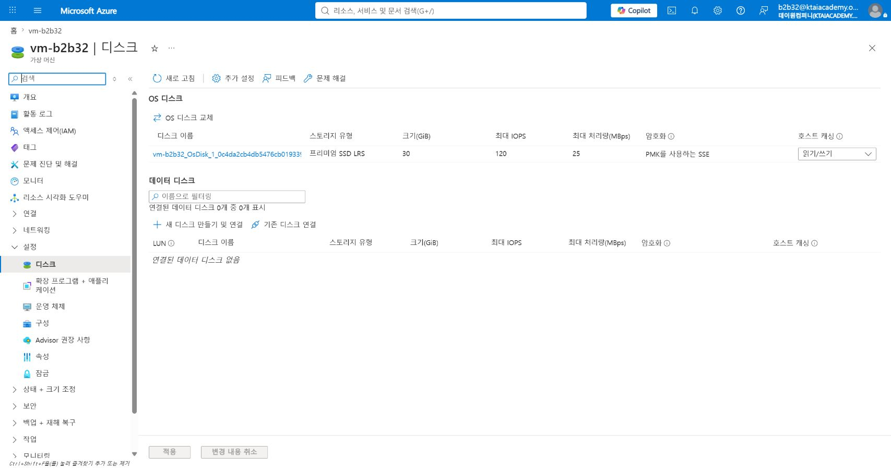
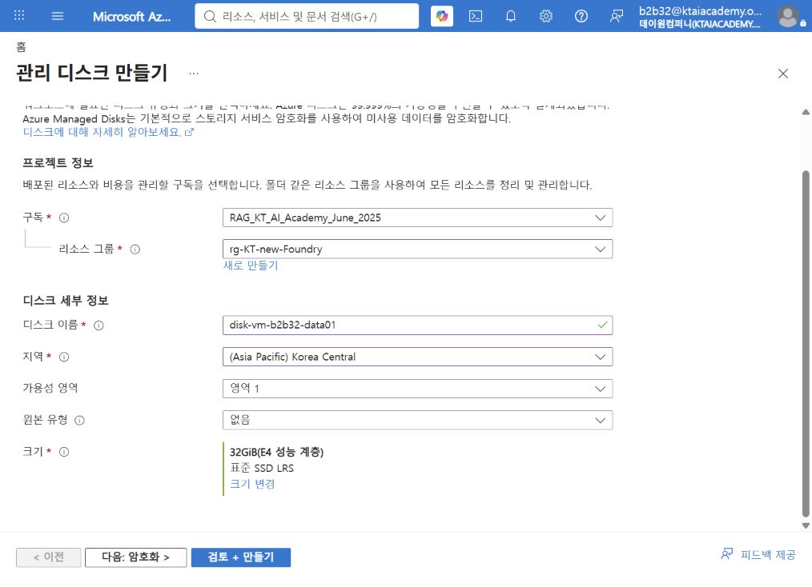
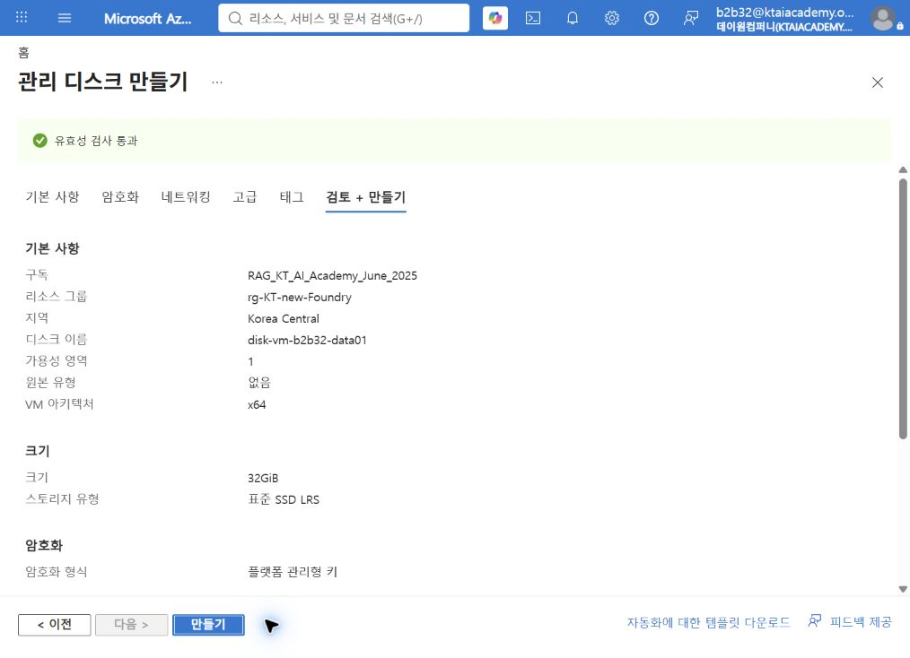
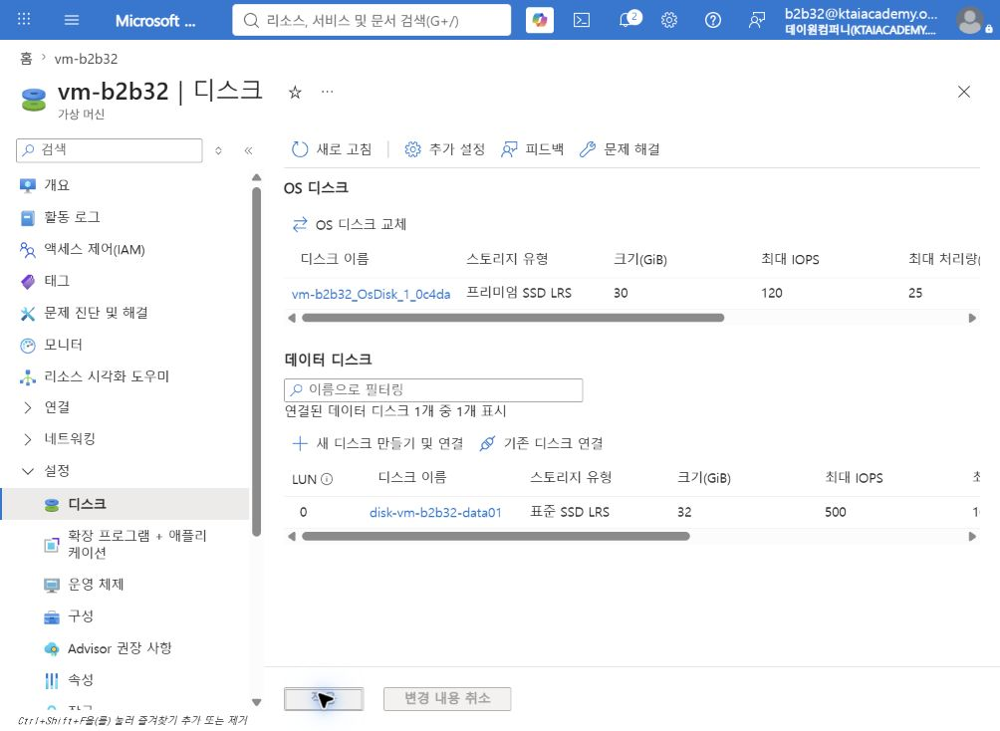
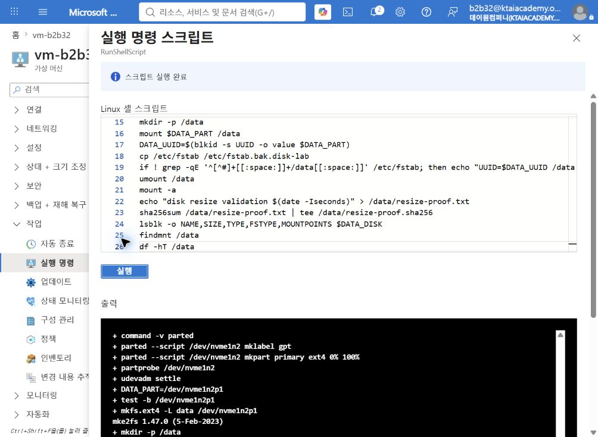
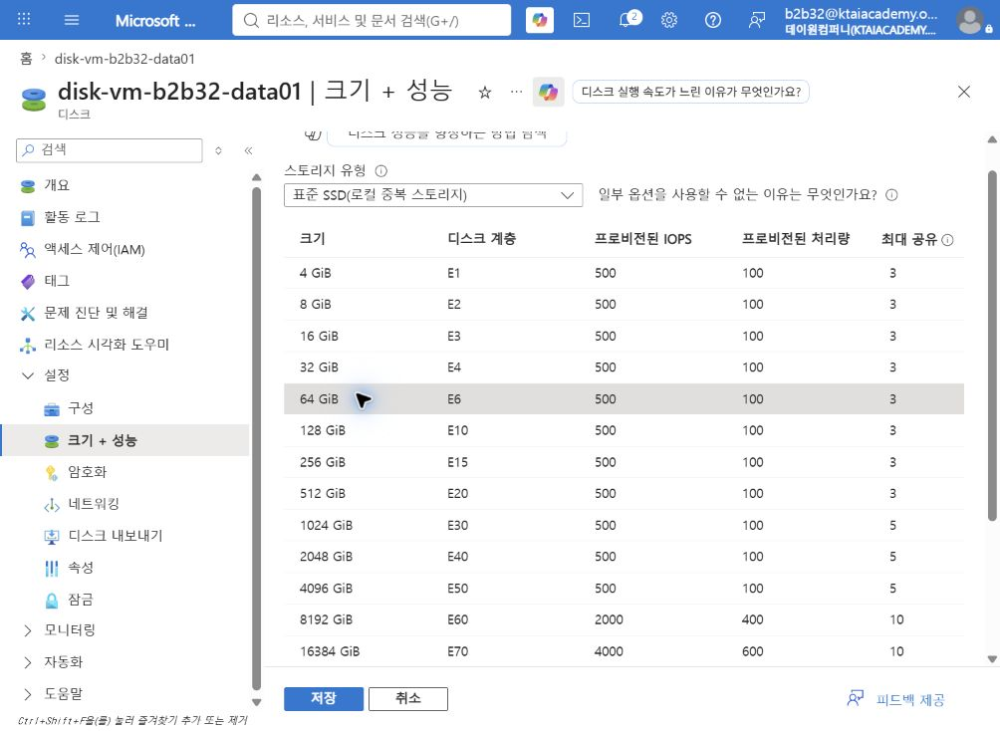
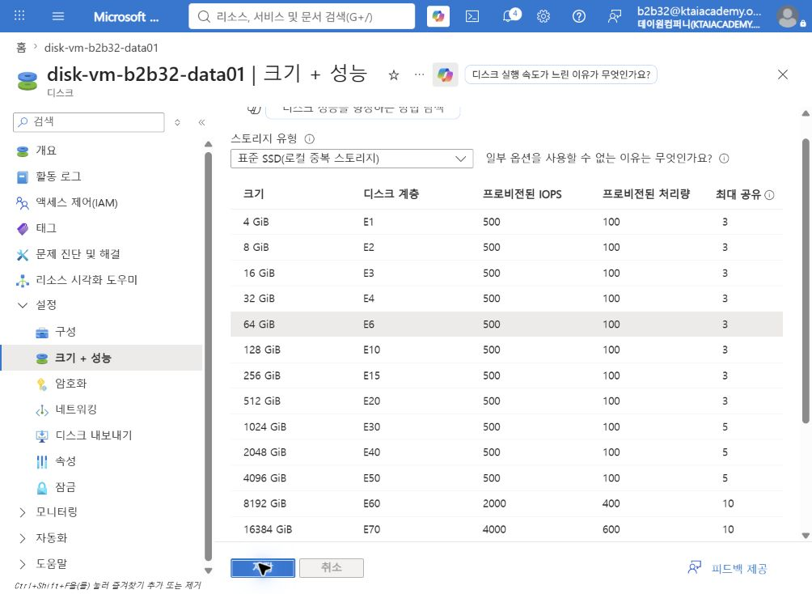
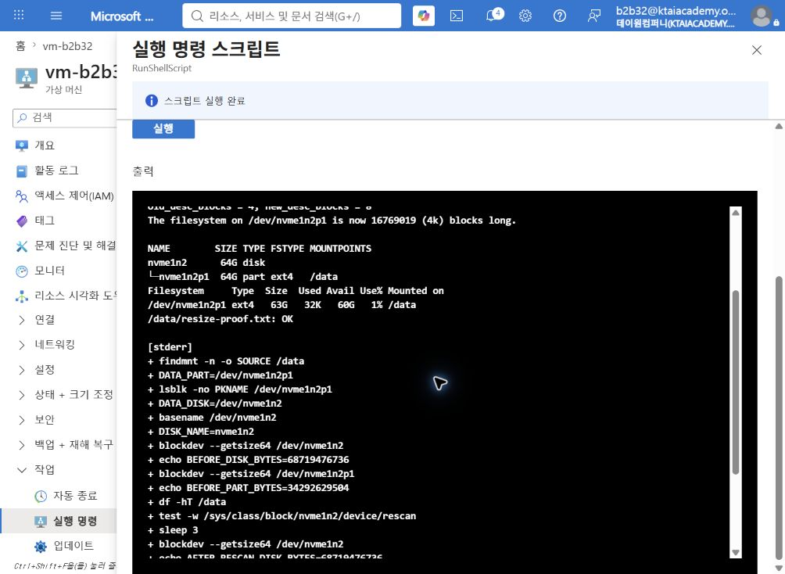

# Azure Managed Disk 추가 및 용량 확장

## 1. 실습 개요

기존 Ubuntu VM에 32GiB Standard SSD 관리 디스크를 추가하고 64GiB로 확장하는 실습임.  
Azure Portal의 디스크 크기 변경과 Linux의 파티션·파일시스템 확장이 서로 다른 작업임을 확인함.

### 학습 목표

- Azure Managed Disk와 Azure Files의 용도 차이 설명
- 기존 VM에 빈 데이터 디스크 생성 및 연결
- GPT 파티션, ext4 파일시스템, 영구 마운트 구성
- 관리 디스크를 32GiB에서 64GiB로 온라인 확장
- 파티션과 ext4 파일시스템 확장 및 데이터 보존 검증
- 디스크 계층 변경에 따른 비용 영향과 정리 절차 설명

### 예상 소요 시간

약 40분임.

### 실습 흐름

```text
32GiB 관리 디스크 생성 → VM 연결 → GPT/ext4 구성 → /data 마운트
→ 64GiB로 확장 → 파티션·파일시스템 확장 → 체크섬 검증 → 비용 검토
```

## 2. Azure Files가 아닌 Managed Disk를 사용하는 이유

Azure Files는 SMB 또는 NFS로 여러 클라이언트가 공유하는 파일 서비스임.  
VM에 블록 장치로 연결하여 파티션과 파일시스템을 직접 확장하는 본 실습에는 Managed Disk가 적합함.

| 구분 | Azure Managed Disk | Azure Files |
|---|---|---|
| 제공 방식 | VM에 연결하는 블록 스토리지 | SMB 또는 NFS 파일 공유 |
| OS 표시 | `/dev/sdX`, `/dev/nvmeXnY` 등의 디스크 장치 | 네트워크 공유 마운트 지점 |
| 파티션 생성 | 가능 | 해당 없음 |
| 파일시스템 생성 | 사용자가 ext4, XFS 등으로 구성 | Azure가 파일 서비스를 제공 |
| 대표 용도 | OS 디스크, 데이터베이스, 애플리케이션 데이터 | 공용 파일, 사용자 홈, 공유 콘텐츠 |
| 본 실습 적합성 | 적합 | 부적합 |

> [!NOTE]
> Azure Files에서도 공유 할당량 조정 실습은 가능함.  
> 다만 `growpart`, `resize2fs`를 사용하는 VM 디스크 확장 실습과는 학습 대상이 다름.

## 3. 검증 환경

| 항목 | 검증값 |
|---|---|
| 리소스 그룹 | `rg-KT-new-Foundry` |
| VM | `vm-b2b32` |
| 운영 체제 | Ubuntu 24.04 LTS |
| VM 크기 | `Standard D2alds v6` |
| 디스크 컨트롤러 | NVMe |
| 관리 디스크 | `disk-vm-b2b32-data01` |
| 초기 디스크 | Standard SSD LRS, 32GiB, E4 |
| 확장 디스크 | Standard SSD LRS, 64GiB, E6 |
| LUN / 호스트 캐싱 | `0` / `없음` |
| 파티션 / 파일시스템 | GPT / ext4 |
| 마운트 지점 | `/data` |

> [!IMPORTANT]
> Linux 장치명은 VM 크기, 컨트롤러, 연결 순서에 따라 달라질 수 있음.  
> 본 검증 환경에서는 OS 디스크가 `/dev/nvme1n1`, 새 데이터 디스크가 `/dev/nvme1n2`로 표시됨.

## 4. 사전 요구 사항과 안전 수칙

- Azure 구독에서 VM 및 관리 디스크를 변경할 수 있는 권한
- 실행 중인 Ubuntu VM과 Azure VM 에이전트의 정상 상태
- 중요한 데이터가 있는 디스크의 스냅샷 또는 백업
- OS 디스크와 임시 디스크를 제외한 새 빈 데이터 디스크의 정확한 식별

> [!CAUTION]
> `parted`, `mkfs.ext4`는 대상 디스크의 기존 데이터를 파괴할 수 있음.  
> 장치명, 크기, 마운트 상태, 기존 서명을 확인하기 전에는 실행하지 않음.

> [!CAUTION]
> Azure Managed Disk의 기존 크기 축소는 지원되지 않으며 데이터 손실 위험이 있음.  
> 본 실습에서는 용량 증가만 수행함.

## 5. 32GiB 관리 디스크 생성과 연결

### 5.1 기존 데이터 디스크 확인

1. Azure Portal에서 `가상 머신` 검색 및 선택.
2. `vm-b2b32` 선택.
3. `설정` > `디스크` 선택.
4. 연결된 데이터 디스크가 없는지 확인.



### 5.2 빈 관리 디스크 생성

1. Azure Portal에서 `디스크` 검색 및 선택.
2. `만들기` 선택.
3. 다음 값 입력.

| 항목 | 설정값 |
|---|---|
| 리소스 그룹 | `rg-KT-new-Foundry` |
| 디스크 이름 | `disk-vm-b2b32-data01` |
| 지역 | VM과 같은 `Korea Central` |
| 가용성 영역 | VM과 같은 `1` |
| 원본 유형 | `없음` |
| 스토리지 유형 | `표준 SSD LRS` |
| 크기 | `32GiB`, E4 |
| 암호화 | 플랫폼 관리형 키 사용 |



4. `검토 + 만들기` 선택.
5. 유효성 검사 통과와 32GiB 설정 확인.
6. `만들기` 선택.



### 5.3 기존 관리 디스크 연결

1. `가상 머신` > `vm-b2b32` > `설정` > `디스크` 선택.
2. 데이터 디스크 영역에서 `기존 디스크 연결` 선택.
3. 디스크 이름으로 `disk-vm-b2b32-data01` 선택.
4. LUN을 `0`, 호스트 캐싱을 `없음`으로 설정.
5. `적용` 선택.
6. 데이터 디스크 목록에서 Standard SSD LRS와 32GiB 확인.



## 6. Ubuntu에서 32GiB 볼륨 구성

본 실습은 `가상 머신` > `작업` > `실행 명령` > `RunShellScript`를 사용함.  
SSH로 접속한 경우에도 같은 명령 실행 가능함.

### 6.1 새 디스크 식별

다음 읽기 전용 명령 실행.

```bash
lsblk -o NAME,SIZE,TYPE,FSTYPE,MOUNTPOINTS,MODEL,SERIAL
findmnt /
sudo fdisk -l
```

다음 기준으로 새 데이터 디스크 식별.

- 크기가 32GiB인 디스크
- 파티션과 파일시스템이 없는 디스크
- `/`, `/boot`, `/boot/efi`, `/mnt/resource`에 사용되지 않는 디스크
- Azure Portal의 LUN 및 디스크 수와 일치하는 디스크

검증 환경의 식별 결과는 다음과 같음.

```text
nvme1n1   30G  disk
├─nvme1n1p1  29G  part  ext4  /
nvme0n1  110G  disk  Microsoft NVMe Direct Disk v2
nvme1n2   32G  disk
```

`/dev/nvme1n1`은 OS 디스크, `/dev/nvme0n1`은 로컬 임시 디스크임.  
따라서 본 환경의 새 관리 디스크는 `/dev/nvme1n2`임.

### 6.2 기존 서명 확인

식별한 장치명을 변수에 지정하고 기존 서명을 읽기 전용으로 확인.

```bash
DATA_DISK=/dev/nvme1n2
sudo test -b "$DATA_DISK"
sudo blockdev --getsize64 "$DATA_DISK"
sudo lsblk -o NAME,SIZE,TYPE,FSTYPE,MOUNTPOINTS "$DATA_DISK"
sudo wipefs -n "$DATA_DISK"
```

32GiB의 바이트 값은 `34359738368`임.  
`wipefs -n` 결과에 기존 파일시스템 또는 파티션 서명이 없어야 다음 단계 진행 가능함.

### 6.3 GPT 파티션과 ext4 파일시스템 생성

```bash
sudo apt-get update
sudo apt-get install -y parted cloud-guest-utils

sudo parted --script "$DATA_DISK" mklabel gpt
sudo parted --script "$DATA_DISK" mkpart primary ext4 0% 100%
sudo partprobe "$DATA_DISK"
sudo udevadm settle

DATA_PART=/dev/nvme1n2p1
sudo test -b "$DATA_PART"
sudo mkfs.ext4 -L data "$DATA_PART"
```

> [!IMPORTANT]
> 다른 환경에서는 `DATA_DISK`와 `DATA_PART` 값을 실제 식별 결과로 변경해야 함.

### 6.4 `/data` 영구 마운트

```bash
sudo mkdir -p /data
sudo mount "$DATA_PART" /data

DATA_UUID=$(sudo blkid -s UUID -o value "$DATA_PART")
sudo cp /etc/fstab "/etc/fstab.bak.$(date +%Y%m%d%H%M%S)"
echo "UUID=$DATA_UUID /data ext4 defaults,nofail 0 2" | sudo tee -a /etc/fstab

sudo umount /data
sudo mount -a
findmnt /data
df -hT /data
```

`nofail`은 디스크가 없거나 마운트에 실패한 경우에도 VM 부팅을 계속하도록 하는 옵션임.

### 6.5 데이터 보존 검증 파일 생성

```bash
echo "disk resize validation $(date -Iseconds)" | sudo tee /data/resize-proof.txt
sudo sha256sum /data/resize-proof.txt | sudo tee /data/resize-proof.sha256
```

검증 환경에서 32GiB 디스크, 약 32GiB ext4 파일시스템, `/data` 마운트를 확인함.



## 7. Azure 관리 디스크를 64GiB로 확장

### 7.1 포털에서 디스크 크기 변경

1. Azure Portal에서 `디스크` 검색 및 선택.
2. `disk-vm-b2b32-data01` 선택.
3. `설정` > `크기 + 성능` 선택.
4. Standard SSD의 `64GiB`, E6 계층 선택.
5. 사용자 지정 디스크 크기가 `64`인지 확인.
6. `저장` 선택.



7. 저장 완료 후 E6 계층과 사용자 지정 크기 `64` 확인.



> [!NOTE]
> 본 검증 환경의 Standard SSD는 4TiB 이하이며 VM을 할당 해제하지 않고 확장 가능함.  
> 디스크 유형, 크기, 공유 설정 등에 따라 중지·분리가 필요한 제한이 있으므로 공식 문서 확인 필요함.

## 8. Ubuntu 파티션과 ext4 파일시스템 확장

### 8.1 마운트 지점에서 장치 다시 식별

장치명을 고정하지 않고 `/data`의 실제 원본 장치로부터 파티션과 디스크를 식별.

```bash
DATA_PART=$(findmnt -n -o SOURCE /data)
DATA_DISK="/dev/$(lsblk -no PKNAME "$DATA_PART")"
DISK_NAME=$(basename "$DATA_DISK")

echo "DATA_PART=$DATA_PART"
echo "DATA_DISK=$DATA_DISK"
sudo blockdev --getsize64 "$DATA_DISK"
sudo blockdev --getsize64 "$DATA_PART"
df -hT /data
```

검증 환경에서 관리 디스크는 이미 64GiB로 인식되지만 파티션은 약 32GiB로 유지됨.

```text
BEFORE_DISK_BYTES=68719476736
BEFORE_PART_BYTES=34292629504
```

### 8.2 디스크 재검색

온라인 확장 후 새 크기가 보이지 않을 때 다음 명령 실행.

```bash
RESCAN_FILE="/sys/class/block/$DISK_NAME/device/rescan"
if sudo test -w "$RESCAN_FILE"; then
  echo 1 | sudo tee "$RESCAN_FILE"
else
  echo "재검색 파일을 사용할 수 없으므로 VM 재부팅 후 다시 확인 필요"
fi

sleep 3
sudo blockdev --getsize64 "$DATA_DISK"
```

64GiB의 바이트 값 `68719476736` 확인.  
새 크기가 보이지 않으면 잠시 후 재검색하거나 VM 재부팅 후 다시 확인.

### 8.3 파티션과 ext4 확장

```bash
sudo apt-get update
sudo apt-get install -y cloud-guest-utils

sudo growpart "$DATA_DISK" 1
sudo resize2fs "$DATA_PART"
```

`growpart`는 1번 파티션을 디스크의 연속된 여유 공간까지 확장함.  
`resize2fs`는 마운트된 ext4 파일시스템을 온라인으로 확장함.

### 8.4 결과와 데이터 보존 확인

```bash
lsblk -o NAME,SIZE,TYPE,FSTYPE,MOUNTPOINTS "$DATA_DISK"
df -hT /data
sudo sha256sum -c /data/resize-proof.sha256
```

검증 환경의 최종 결과는 다음과 같음.

```text
nvme1n2       64G  disk
└─nvme1n2p1   64G  part  ext4  /data

Filesystem            Type  Size  Used  Avail  Use%  Mounted on
/dev/nvme1n2p1         ext4   63G   32K    60G    1%  /data

/data/resize-proof.txt: OK
```

체크섬 `OK`는 확장 전에 만든 파일의 내용이 확장 후에도 동일함을 의미함.



## 9. FinOps 관점의 비용 확인

Standard SSD 비용은 디스크 계층, 트랜잭션, 중복성, 공유 여부의 영향을 받음.  
32GiB E4에서 64GiB E6로 확장하면 더 큰 계층을 기준으로 과금됨.

| 확인 항목 | 비용 관점 |
|---|---|
| 프로비전된 크기 | 실제 파일 사용량이 아닌 선택한 디스크 계층 기준 비용 발생 |
| Standard SSD 트랜잭션 | 읽기·쓰기 I/O 트랜잭션 비용 발생 가능 |
| LRS | 단일 지역 내 로컬 중복으로 ZRS보다 단순한 복원력 구성 |
| 스냅샷 | 디스크와 별도의 저장 비용 발생 가능 |
| 분리된 디스크 | VM에서 분리해도 관리 디스크 리소스가 남으면 비용 발생 가능 |
| 크기 축소 | 기존 디스크 축소 불가, 작은 새 디스크로 데이터 이전 필요 |

> [!IMPORTANT]
> 디스크를 연결 해제하는 것만으로 관리 디스크가 삭제되지 않음.  
> 실습 종료 후 불필요한 디스크와 스냅샷을 삭제하여 비용 누수 방지 필요함.

## 10. 실습 완료 확인

- [ ] VM에 `disk-vm-b2b32-data01`이 LUN 0으로 연결됨
- [ ] Azure Portal에서 Standard SSD LRS, 64GiB, E6 확인
- [ ] Linux에서 데이터 디스크와 파티션이 64GiB로 표시됨
- [ ] `/data`의 ext4 파일시스템이 약 63GiB로 표시됨
- [ ] `/etc/fstab`에 UUID 기반 `/data` 항목 존재
- [ ] `mount -a` 실행 시 오류 없음
- [ ] 체크섬 검증 결과가 `OK`임

## 11. 정리

정리 시 Linux 마운트 설정 제거 후 Azure 리소스 분리·삭제 순서 준수.

### 11.1 Linux 마운트 설정 제거

```bash
sudo cp /etc/fstab "/etc/fstab.before-disk-cleanup.$(date +%Y%m%d%H%M%S)"
sudo sed -i '\|[[:space:]]/data[[:space:]]|d' /etc/fstab
sudo umount /data
sudo mount -a
```

### 11.2 Azure 리소스 정리

1. `가상 머신` > `vm-b2b32` > `디스크` 선택.
2. `disk-vm-b2b32-data01` 행의 `분리` 선택 후 `적용` 선택.
3. `디스크`에서 `disk-vm-b2b32-data01` 선택.
4. 다른 실습에서 사용하지 않음을 확인한 뒤 `삭제` 선택.
5. 관련 스냅샷이 있으면 보존 필요성 검토 후 별도 삭제.

> [!CAUTION]
> 삭제한 관리 디스크는 복구할 수 없음.  
> 삭제 전 대상 이름, 연결 상태, 백업 필요성을 다시 확인해야 함.

## 12. 참고 자료

- [Linux VM에 데이터 디스크 연결](https://learn.microsoft.com/azure/virtual-machines/linux/attach-disk-portal)
- [Linux VM의 관리 디스크 확장](https://learn.microsoft.com/azure/virtual-machines/linux/expand-disks)
- [Azure Managed Disk 유형](https://learn.microsoft.com/azure/virtual-machines/disks-types)
- [Azure Disk Storage 청구 이해](https://learn.microsoft.com/azure/virtual-machines/disks-understand-billing)
