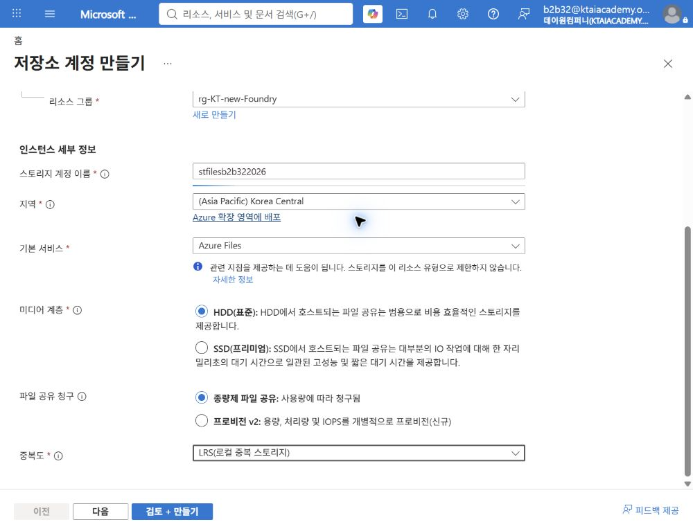
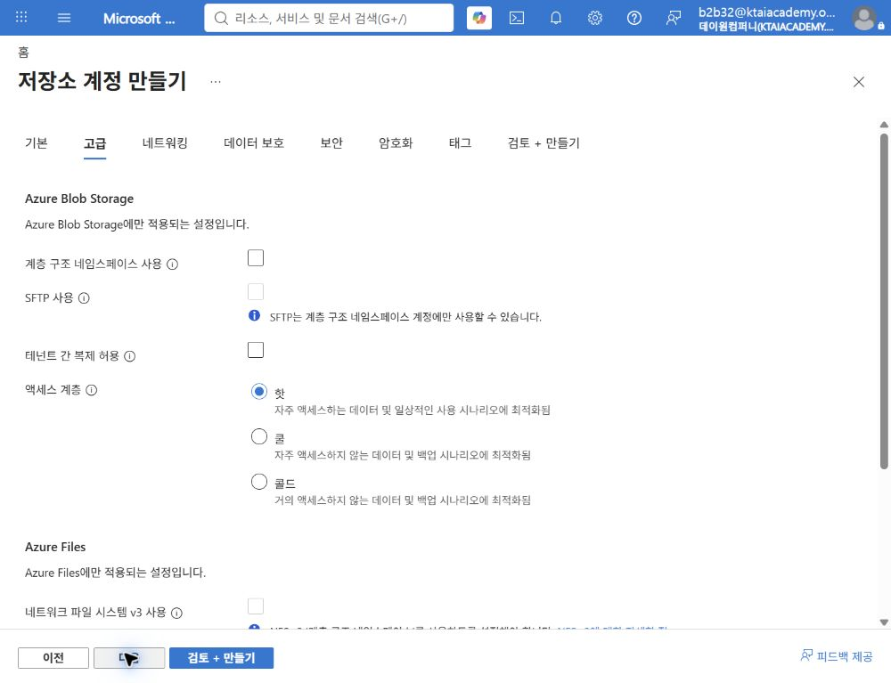
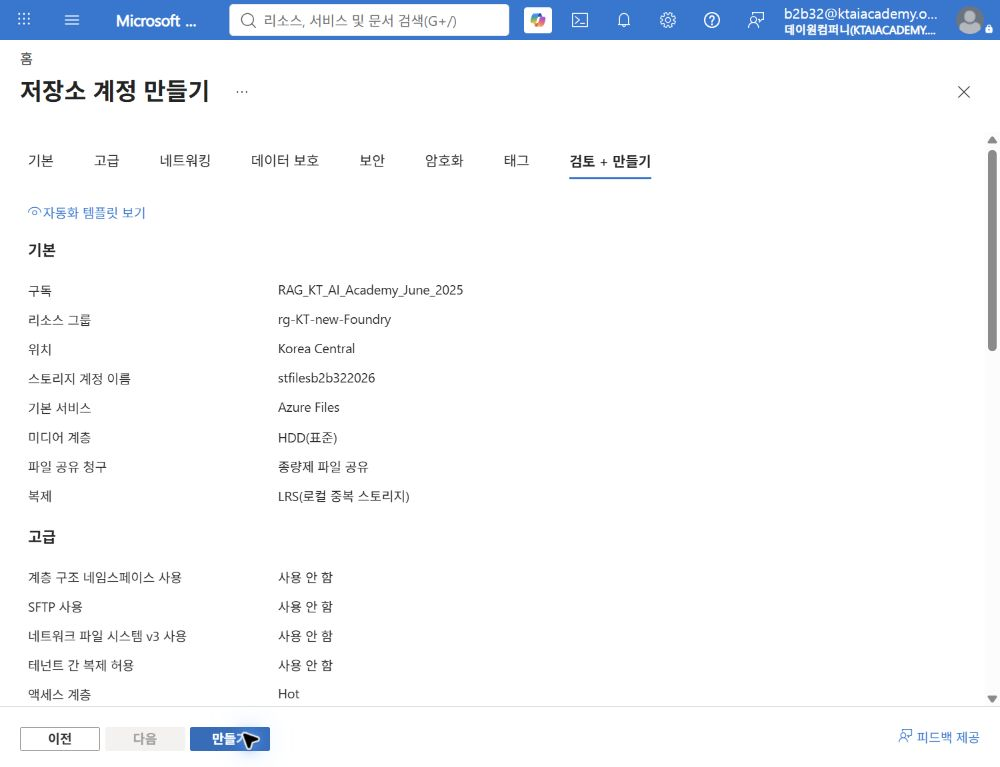
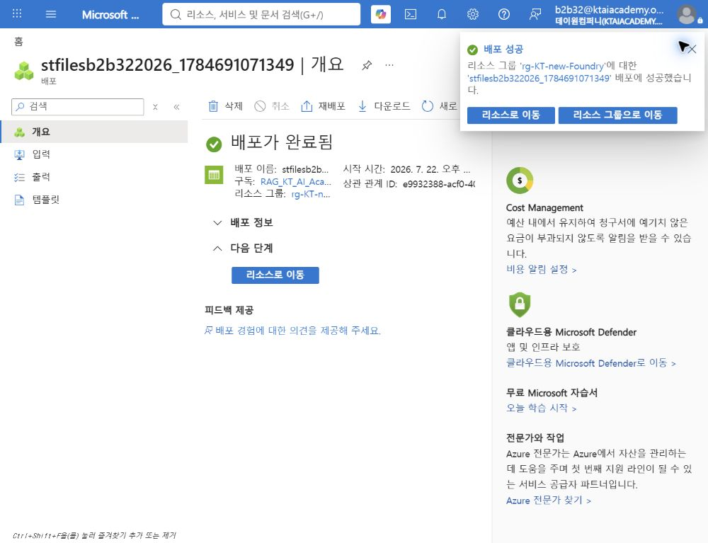
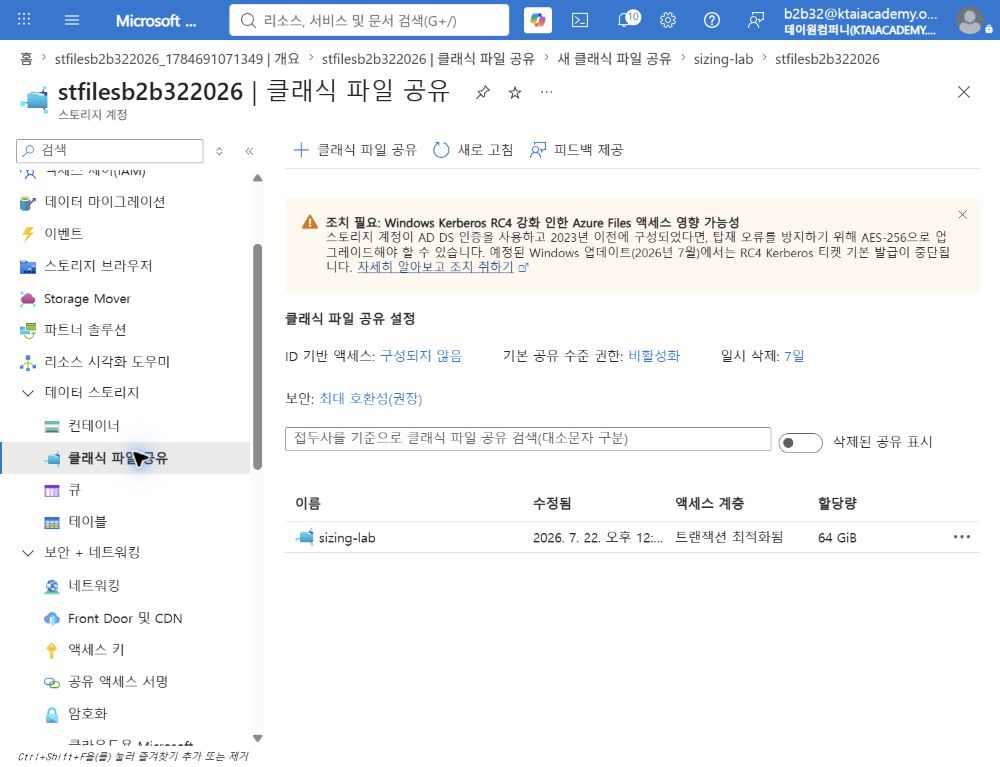
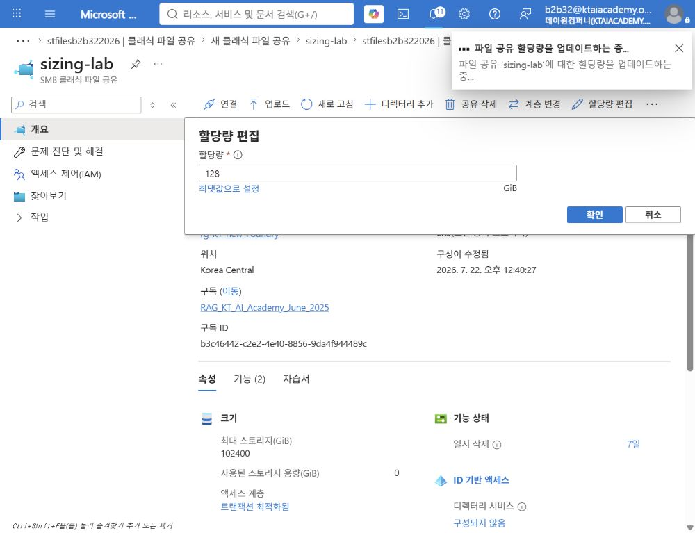
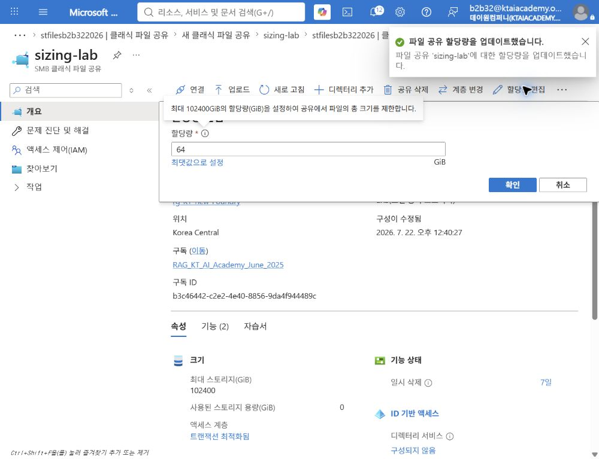
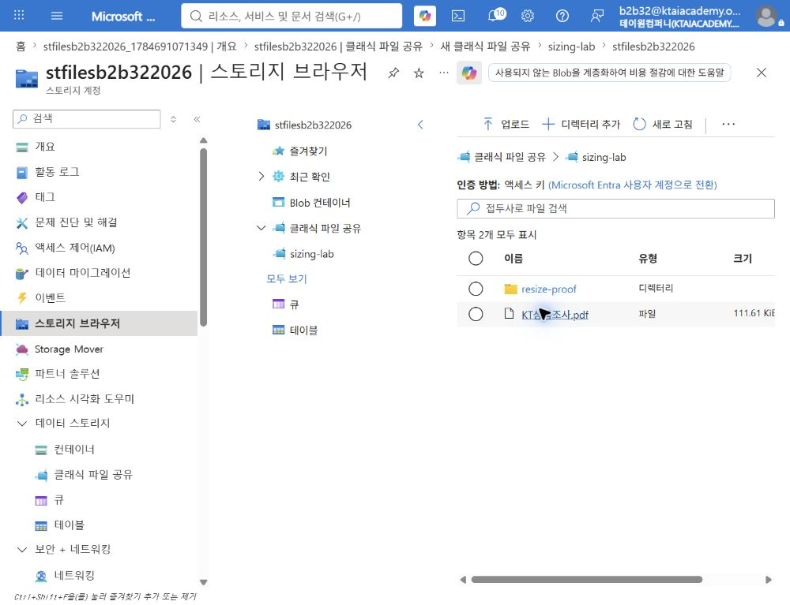

# Azure Files 공유 할당량 조정

## 1. 실습 개요

Azure Files용 스토리지 계정과 SMB 파일 공유를 생성하고, 공유 할당량을 64GiB에서 128GiB로 확대한 뒤  
64GiB로 다시 축소하는 실습임. 축소 후에도 기존 디렉터리와 파일이 유지되는지 확인함.

> [!IMPORTANT]
> Azure Storage 계정 자체에는 사용자가 조정하는 고정 용량이 없음.  
> 본 실습에서 조정하는 대상은 스토리지 계정 안의 **Azure Files 공유 할당량**임.

### 학습 목표

- Azure Files용 범용 v2 스토리지 계정 생성
- 종량제 SMB 파일 공유 생성 및 할당량 설정
- 공유 할당량의 확대와 축소 수행
- 축소 후 기존 데이터 보존 확인
- 할당량과 실제 청구 비용의 차이 설명

### 예상 소요 시간

약 30분임.

### 실습 흐름

```text
스토리지 계정 생성 → SMB 파일 공유 생성 → 64GiB 설정 → 데이터 준비
→ 128GiB 확대 → 64GiB 축소 → 데이터 보존 확인 → 비용 의미 정리
```

## 2. 먼저 알아둘 개념

Azure Files에는 종량제와 프로비저닝 v2의 두 가지 주요 청구 모델이 있음.  
동일 수업 시간 안에 확대와 축소를 모두 실습하기 위해 종량제 파일 공유를 사용함.

| 구분 | 종량제 파일 공유 | 프로비저닝 v2 파일 공유 |
|---|---|---|
| 크기 설정의 의미 | 공유가 증가할 수 있는 최대 할당량 | 예약하여 제공받는 스토리지 용량 |
| 기본 청구 기준 | 사용한 논리적 데이터 용량과 트랜잭션 | 프로비저닝한 용량, IOPS, 처리량 |
| 할당량만 축소할 때 | 저장 데이터가 같으면 저장 용량 비용도 거의 같음 | 프로비저닝 용량 감소 시 비용 절감 가능 |
| 증가 후 감소 제한 | 포털에서 즉시 조정 가능 | 증가 후 24시간 동안 감소 불가 |
| 최소 크기 | 계정과 공유 설정에 따른 할당량 범위 | 32GiB |
| 본 실습 적합성 | 적합 | 2일 과정 또는 운영 검증에 적합 |

> [!NOTE]
> 종량제 파일 공유의 할당량은 비용 예약량이 아니라 성장 제한값임.  
> 할당량을 128GiB에서 64GiB로 줄여도 저장된 데이터가 같으면 저장 용량 비용은 자동으로 절반이 되지 않음.

## 3. 검증 환경

| 항목 | 검증값 |
|---|---|
| 기존 리소스 그룹 | `rg-KT-new-Foundry` |
| 스토리지 계정 | `stfilesb2b322026` |
| 지역 | `Korea Central` |
| 주 서비스 | Azure Files |
| 성능 | 표준 HDD |
| 청구 모델 | 종량제 파일 공유 |
| 중복도 | LRS |
| 파일 공유 | `sizing-lab` |
| 프로토콜 | SMB |
| 액세스 계층 | 트랜잭션 최적화됨 |
| 파일 공유 일시 삭제 | 7일 |

> [!NOTE]
> 본 검증에서는 기존 리소스 그룹을 재사용함.  
> 교육 환경의 네이밍 정책에 따라 스토리지 계정 이름을 전역에서 고유한 값으로 변경 가능함.

## 4. 스토리지 계정 생성

### 4.1 기본 설정

1. Azure Portal에서 `스토리지 계정` 검색 및 선택.
2. `만들기` 선택.
3. 다음 값 입력.

| 항목 | 설정값 |
|---|---|
| 구독 | 실습 구독 |
| 리소스 그룹 | `rg-KT-new-Foundry` |
| 스토리지 계정 이름 | `stfilesb2b322026` 또는 전역 고유 이름 |
| 지역 | `Korea Central` |
| 주 서비스 | `Azure Files` |
| 성능 | `표준` |
| 중복도 | `LRS` |



### 4.2 고급 설정

1. `고급` 탭 선택.
2. SMB 트래픽의 전송 중 암호화 사용 확인.
3. 나머지 항목은 기본값 유지.



### 4.3 검토 및 생성

1. `검토 + 만들기` 선택.
2. 유효성 검사 통과와 다음 핵심값 확인.
   - Azure Files
   - 표준 HDD
   - 종량제 파일 공유
   - LRS
3. `만들기` 선택.



4. 배포 완료 후 `리소스로 이동` 선택.



## 5. SMB 파일 공유 생성

1. 스토리지 계정에서 `데이터 스토리지` > `클래식 파일 공유` 선택.
2. `+ 클래식 파일 공유` 선택.
3. 다음 값 입력.

| 항목 | 설정값 |
|---|---|
| 이름 | `sizing-lab` |
| 액세스 계층 | `트랜잭션 최적화됨` |
| 프로토콜 | `SMB` |
| 백업 | 실습에서는 사용 안 함 |

4. `만들기` 선택.

> [!CAUTION]
> 백업을 활성화하면 Recovery Services 자격 증명 모음과 백업 정책이 추가로 생성될 수 있음.  
> 백업 실습이 목적이 아니라면 생성 화면에서 백업 사용 여부를 확인함.

## 6. 초기 할당량 64GiB 설정

1. `클래식 파일 공유`에서 `sizing-lab` 선택.
2. 상단 메뉴에서 `할당량 편집` 선택.
3. `할당량`에 `64` 입력.
4. `확인` 선택.
5. 파일 공유 목록의 할당량이 `64 GiB`인지 확인.



> [!NOTE]
> 공유 개요의 `최대 스토리지` 카드가 이전 기본값을 잠시 표시할 수 있음.  
> 실제 저장값은 `할당량 편집`을 다시 열거나 공유 목록의 `할당량` 열에서 확인함.

## 7. 검증용 데이터 준비

할당량을 축소해도 기존 데이터가 삭제되지 않는지 확인하기 위한 단계임.

### 방법 A: 디렉터리 생성

1. `sizing-lab`에서 `스토리지 브라우저에서 찾아보기` 또는 계정의 `스토리지 브라우저` 선택.
2. `클래식 파일 공유` > `sizing-lab` 선택.
3. `디렉터리 추가` 선택.
4. 이름에 `resize-proof` 입력 후 생성.

### 방법 B: 샘플 파일 업로드

1. `sizing-lab`에서 `업로드` 선택.
2. 저장소의 `hands-on/azure-files-sizing-sample.txt` 선택.
3. 업로드 완료 후 파일 이름 확인.

> [!TIP]
> 실제 업무 데이터 대신 삭제 가능한 샘플 파일을 사용함.  
> 파일 공유의 사용량보다 작은 값으로 할당량을 축소하는 시험은 본 기본 실습에서 수행하지 않음.

## 8. 할당량을 128GiB로 확대

1. `sizing-lab` 개요에서 `할당량 편집` 선택.
2. `128` 입력 후 `확인` 선택.
3. 작업 완료 알림 확인.
4. `할당량 편집`을 다시 열어 저장된 값이 `128`인지 확인.



### 확인 포인트

- 서비스 중단 없이 공유 할당량 변경 가능
- 공유 경로와 이름 유지
- 기존 디렉터리와 파일 유지

## 9. 할당량을 64GiB로 축소

1. 열린 `할당량 편집` 창에서 `64` 입력.
2. `확인` 선택.
3. 작업 완료 알림 확인.
4. `할당량 편집`을 다시 열어 저장된 값이 `64`인지 확인.



> [!CAUTION]
> 운영 환경에서는 사용 중인 데이터 용량, 스냅샷, 백업, 애플리케이션 증가율을 먼저 확인함.  
> 너무 작은 할당량은 데이터 삭제가 아니라 새 쓰기 실패와 애플리케이션 오류를 유발할 수 있음.

## 10. 축소 후 데이터 보존 확인

1. 스토리지 계정에서 `스토리지 브라우저` 선택.
2. `클래식 파일 공유` > `sizing-lab` 선택.
3. `resize-proof` 디렉터리와 기존 파일이 표시되는지 확인.



### 완료 기준

- 파일 공유 할당량이 `64GiB`로 저장됨
- `resize-proof` 디렉터리가 조회됨
- 축소 전에 존재한 파일이 조회됨
- 공유 이름과 SMB 엔드포인트가 유지됨

## 11. FinOps 관점 해석

### 11.1 본 실습에서 확인한 의미

종량제 파일 공유의 할당량 축소는 용량 상한을 낮추는 거버넌스 조치임.  
현재 사용량을 직접 줄이는 작업이 아니므로 저장 용량 비용 절감 증거로 단독 사용하면 안 됨.

### 11.2 실제 비용 절감 절차

1. Azure Monitor와 Cost Management에서 사용량 및 트랜잭션 추세 확인.
2. 불필요한 파일, 스냅샷, 백업 보존분 식별.
3. 보존 정책과 데이터 소유자 승인 후 데이터 정리.
4. 향후 증가율을 반영한 적정 할당량 설정.
5. 변경 전후 사용량과 청구 비용 비교.

### 11.3 프로비저닝 v2 확장 실습

프로비저닝 v2에서는 프로비저닝한 스토리지 용량 자체가 청구 요소임.  
비용 최적화 효과를 더 직접적으로 확인하려면 다음과 같은 2일 과정으로 구성 가능함.

```text
1일 차: 32GiB 이상으로 공유 생성 → 프로비저닝 용량 확대
24시간 이후: 실제 사용량 확인 → 프로비저닝 용량 축소 → 비용 추세 비교
```

> [!IMPORTANT]
> 프로비저닝 v2는 용량 증가 후 24시간 동안 감소할 수 없음.  
> 같은 수업 시간에 확대와 축소를 연속 수행하는 본 실습에는 적합하지 않음.

## 12. 리소스 정리

계속 사용할 계획이 없는 경우 실습에서 생성한 스토리지 계정만 삭제함.

1. `스토리지 계정` > `stfilesb2b322026` 선택.
2. `삭제` 선택.
3. 영향을 받는 파일 공유와 데이터를 확인.
4. 스토리지 계정 이름 입력 후 삭제 확인.

> [!CAUTION]
> `rg-KT-new-Foundry`는 기존 리소스 그룹이므로 삭제하지 않음.  
> 계정 삭제 전 보존해야 할 파일과 일시 삭제 정책의 복구 범위를 확인함.

## 13. 참고 자료

- [Azure 파일 공유의 계층을 변경하는 방법](https://learn.microsoft.com/azure/storage/files/modify-file-share)
- [Azure Files 청구 이해](https://learn.microsoft.com/azure/storage/files/understanding-billing)
- [Azure Files 확장성 및 성능 대상](https://learn.microsoft.com/azure/storage/files/storage-files-scale-targets)
- [클래식 SMB 파일 공유 만들기](https://learn.microsoft.com/azure/storage/files/create-classic-file-share)
