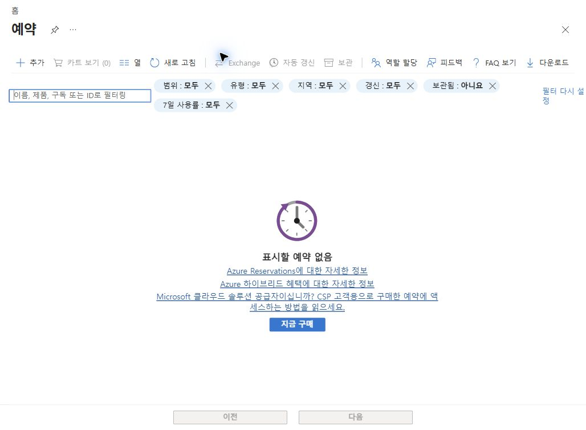
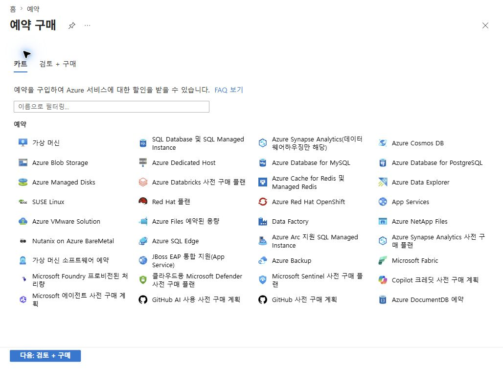
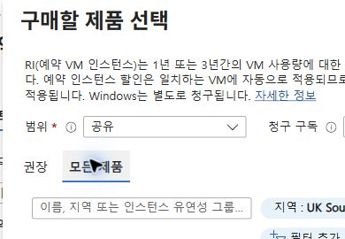
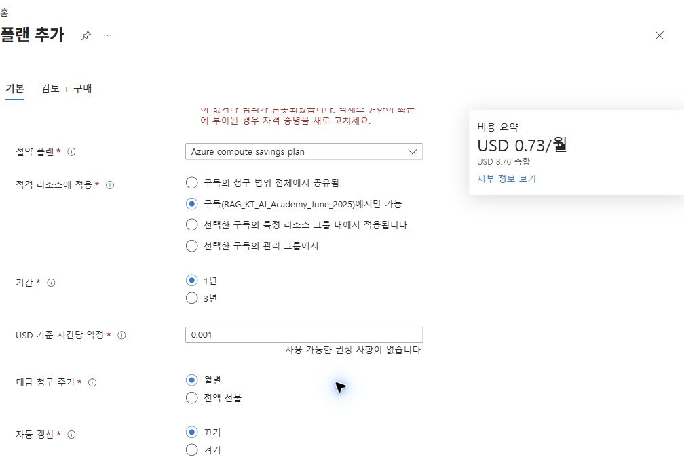
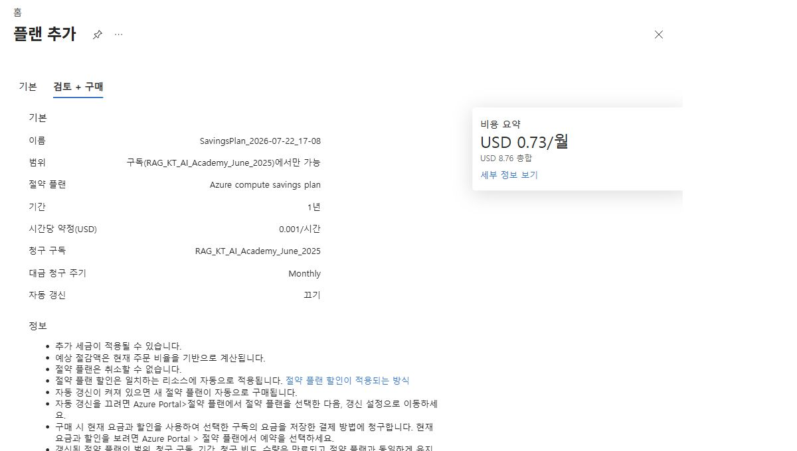
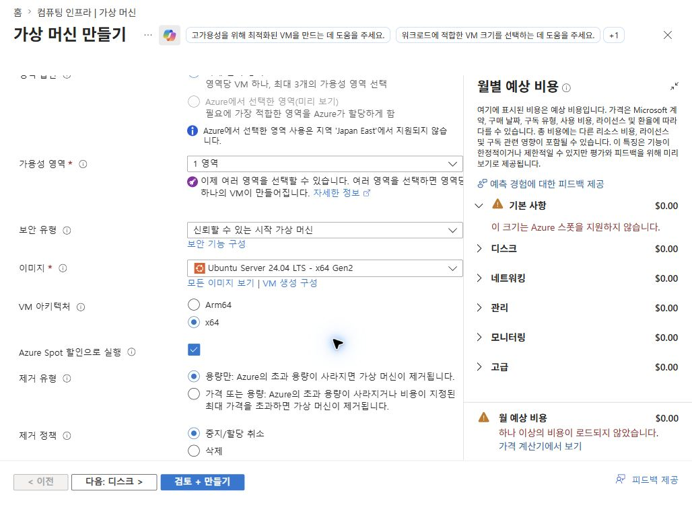
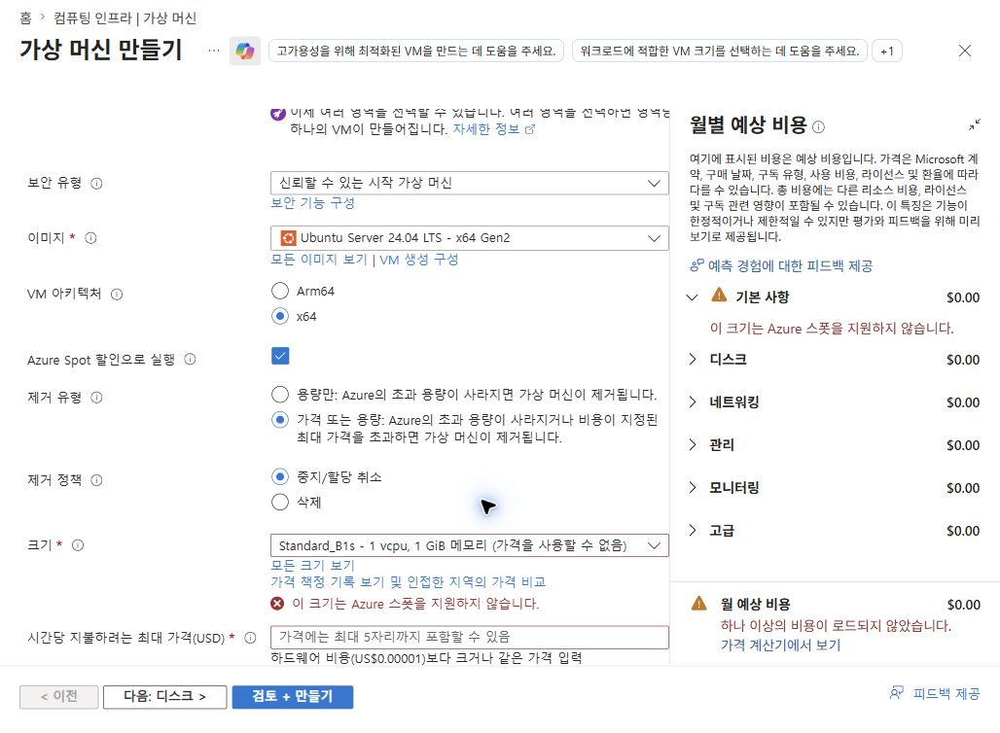
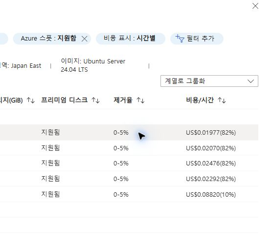
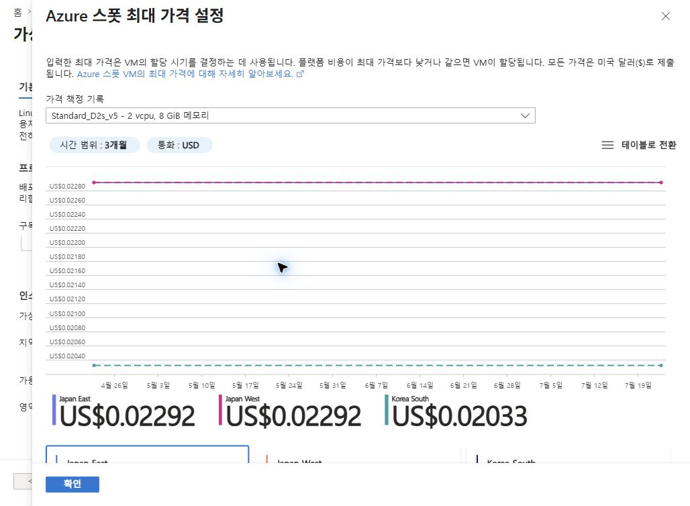

# Azure RI·Savings Plan·Spot 비결제 실습

## 1. 실습 개요

### 1.1 학습 목표

- Azure Reservation(RI)의 구매 상품과 적용 범위 확인
- Azure Compute Savings Plan(SP)의 시간당 약정과 예상 비용 확인
- Azure Spot VM의 제거 조건과 가격 이력 확인
- 결제 또는 리소스 배포 없이 최종 검토 화면에서 실습 종료

### 1.2 안전 원칙

> [!CAUTION]
> RI와 SP의 `지금 구매`, Spot VM의 `만들기` 선택 금지.  
> 해당 버튼 선택 시 실제 약정 구매 또는 과금 리소스 배포가 발생할 수 있음.

### 1.3 실습 검증 결과

| 항목 | 실제 확인 범위 | 최종 상태 |
|---|---|---|
| RI | 예약 목록 → 제품 선택 → VM 예약 구성 | 구매하지 않음 |
| SP | Savings plans → 기본 설정 → 검토 + 구매 | 구매하지 않음 |
| Spot | VM 만들기 → Spot 옵션 → 크기별 가격 이력 | VM을 만들지 않음 |

- 포털 확인일: 2026-07-22
- 표시 가격은 실습 시점·지역·통화·구독 조건에 따른 예시임
- 수강생 환경에서는 계약 유형, 권한, 사용량에 따라 화면과 권장값이 달라질 수 있음

## 2. 사전 준비

### 2.1 공통 준비 사항

- Azure Portal 로그인
- 사용할 디렉터리와 구독 확인
- 구매 또는 배포 권한이 있는 실습 계정 준비
- 최종 구매·만들기 버튼을 선택하지 않는다는 원칙 확인

### 2.2 권한

| 실습 | 권장 권한 |
|---|---|
| RI | 대상 구독의 `Owner` 또는 `Reservation purchaser` |
| SP | 대상 구독의 `Owner` 또는 `Savings plan purchaser` |
| Spot | VM 배포 화면을 열 수 있는 읽기·만들기 권한 |

SP는 EA·MCA·MPA 계약에서 지원됨.  
EA 관리자는 쓰기 권한, MCA 사용자는 청구 프로필 기여자 이상의 청구 권한으로도 구매 가능함.

## 3. RI 구매 직전 실습

### 3.1 예약 목록 열기

1. Azure Portal 상단 검색창에서 `예약` 검색
2. 서비스 결과의 `예약` 선택
3. 현재 예약 목록과 `예약 추가` 확인

실습 계정에서는 기존 예약이 없으며 카트가 0인 상태 확인됨.

### 3.2 예약 제품 선택

1. `예약 추가` 선택
2. 예약 제품 목록에서 `가상 머신` 선택
3. 카트 및 `검토 + 구매` 단계가 존재하는지 확인

### 3.3 VM 예약 조건 확인

1. `범위` 확인
2. 청구 구독 확인
3. `권장` 또는 `모든 제품` 탭 확인
4. 지역, 기간, 청구 빈도, 최근 사용량 필터 확인
5. 구매 가능한 SKU가 표시되는 경우 다음 항목 기록
   - 지역
   - VM 제품군과 크기
   - 1년 또는 3년 기간
   - 월별 또는 선불 청구
   - 수량과 예상 절감액

### 3.4 중지 지점

- 제품을 카트에 담지 않거나 카트 수량을 0으로 유지
- `검토 + 구매` 이후의 최종 `지금 구매` 선택 금지
- 실습 종료 후 예약 목록과 카트가 비어 있는지 확인

### 3.5 권한 오류 해결

`Microsoft.Capacity/register/action` 오류가 나타나면 다음 항목 확인 필요함.

1. 실제 청구에 사용할 구독 선택 여부 확인
2. 기본 제공 `Reservation purchaser` 또는 `Owner` 역할 확인
3. 구독의 `Microsoft.Capacity` 리소스 공급자 등록 여부 확인
4. 역할을 방금 부여한 경우 포털 세션 새로 고침

## 4. Savings Plan 구매 직전 실습

### 4.1 올바른 진입 경로

`Savings plan purchaser` 역할을 사용하는 경우 다음 경로 권장함.

1. Azure Portal `홈` 이동
2. 상단 검색창에 영문 `Savings plans` 입력
3. `서비스` 범주의 `Savings plans` 선택
4. `추가` 선택

한국어 `절약 플랜` 검색은 서비스 결과가 나타나지 않을 수 있으므로 영문 검색 권장함.

`Cost Management + Billing > 절약 플랜` 경로도 존재함.  
해당 경로는 EA 관리자 또는 MCA 청구 프로필 권한을 이용하는 구매에 적합함.

### 4.2 기본 조건 설정

실습에서는 다음과 같이 설정함.

| 항목 | 실습 설정 | 의미 |
|---|---|---|
| 이름 | 포털 자동 생성 이름 | 구매 후 식별용 이름 |
| 청구 구독 | 역할을 부여한 구독 | SP 요금이 청구되는 구독 |
| 절약 플랜 | Azure compute savings plan | 컴퓨팅 사용량 대상 |
| 적용 범위 | 선택한 구독에서만 | 실습 범위를 단일 구독으로 제한 |
| 기간 | 1년 | 비교적 짧은 약정 기간 |
| 시간당 약정 | USD 0.001/시간 | 포털에서 허용한 교육용 예시 |
| 청구 주기 | 월별 | 총비용을 월별 분할 청구 |
| 자동 갱신 | 끄기 | 만료 시 자동 재구매 방지 |

실습 당시 사용 가능한 권장 사항이 없었으며 다음 비용이 표시됨.

- 예상 월 비용: USD 0.73
- 1년 총액: USD 8.76
- 추가 세금과 환율은 별도 적용 가능

시간당 약정은 매시간 사용할 수 있는 할인 적용 금액임.  
사용량이 약정액보다 적어도 사용하지 않은 시간당 약정은 다음 시간으로 이월되지 않음.

### 4.3 검토 + 구매

1. `다음: 검토 + 구매` 선택
2. 다음 항목 대조
   - 적용 범위
   - 기간
   - 시간당 약정
   - 청구 구독
   - 청구 주기
   - 자동 갱신
   - 월 예상 비용과 총액
3. 취소 또는 교환이 불가능하다는 안내 확인
4. `지금 구매`를 선택하지 않고 실습 종료

### 4.4 실제 확인된 권한 동작

대상 구독에 `Savings plan purchaser` 역할을 부여한 후 다음 항목이 활성화됨.

- 적용 범위
- 1년·3년 기간
- 시간당 약정
- 월별·전액 선불 청구
- 자동 갱신
- `검토 + 구매` 화면

단, 계정이 접근 가능한 다른 구독에 `Microsoft.Capacity/register/action` 권한이 없으면  
해당 구독의 검증 오류가 함께 표시되고 최종 `지금 구매`가 비활성화될 수 있음.

### 4.5 `지금 구매`가 비활성화된 경우

1. 오류 메시지에 표시된 구독과 현재 청구 구독이 같은지 확인
2. 오류가 다른 구독을 가리키면 해당 구독의 권한 또는 공급자 등록 상태 확인
3. 구독 `설정 > 리소스 공급자`에서 `Microsoft.Capacity` 등록 상태 확인
4. 등록이 필요하면 `Owner` 또는 `Contributor` 권한의 관리자가 등록
5. 권한 변경 후 Azure Portal 세션 새로 고침
6. `홈 > Savings plans` 경로에서 다시 실행

> [!NOTE]
> 실습에서는 최종 구매가 목적이 아니므로 `검토 + 구매` 화면 도달을 완료 기준으로 사용함.

## 5. Spot VM 배포 직전 실습

### 5.1 VM 만들기 화면 열기

1. Azure Portal에서 `가상 머신` 이동
2. `만들기 > Azure 가상 머신` 선택
3. 구독과 지역 확인
4. VM을 실제로 만들지 않도록 리소스 그룹과 인증 정보 입력 생략 가능

### 5.2 Azure Spot 설정

1. `Azure Spot 할인으로 실행` 선택
2. 제거 유형 확인
   - `용량만`: Azure에 용량이 필요한 경우 제거
   - `가격 또는 용량`: 가격 상한 초과 또는 용량 회수 시 제거
3. 제거 정책 확인
   - `중지/할당 취소`: OS 디스크를 유지하고 컴퓨팅 할당 해제
   - `삭제`: VM과 선택된 연결 리소스 삭제 가능

### 5.3 Spot 지원 크기 선택

기본 VM 크기가 Spot을 지원하지 않으면 다음 절차 수행함.

1. `모든 크기 보기` 선택
2. `Azure 스폿: 지원함` 필터 확인
3. 가격과 제거율을 함께 비교
4. 실습에서는 `Standard_D2s_v5` 선택

실습 당시 Japan East의 일부 표시값은 다음과 같음.

| VM 크기 | 제거율 | Spot 시간당 가격 | 할인율 |
|---|---:|---:|---:|
| Standard_D2ls_v5 | 0 ~ 5% | USD 0.01977 | 82% |
| Standard_D2as_v5 | 0 ~ 5% | USD 0.02070 | 82% |
| Standard_D2ads_v5 | 0 ~ 5% | USD 0.02476 | 82% |
| Standard_D2s_v5 | 0 ~ 5% | USD 0.02292 | 82% |

가격과 제거율은 수시로 변동되므로 실습 시점의 포털 값 사용 필요함.

### 5.4 가격 이력 확인

1. 제거 유형을 `가격 또는 용량`으로 선택
2. 최대 가격 입력
3. 가격 이력 링크 선택
4. 최근 3개월 가격과 제거율 비교

실습에서는 다음 값이 표시됨.

| 지역 | 시간당 가격 | 제거율 |
|---|---:|---:|
| Japan East | USD 0.02292 | 0 ~ 5% |
| Japan West | USD 0.02292 | 0 ~ 5% |
| Korea South | USD 0.02033 | 0 ~ 5% |

### 5.5 중지 지점

- `검토 + 만들기` 이후 최종 `만들기` 선택 금지
- VM 목록에서 새 VM이 생성되지 않았는지 확인
- Spot VM에는 SLA가 없으며 용량 회수로 제거될 수 있음을 확인

## 6. RI·SP·Spot 비교

| 구분 | RI | Savings Plan | Spot |
|---|---|---|---|
| 약정 기준 | 특정 제품·지역·기간 | 시간당 사용 금액 | 약정 없음 |
| 할인 안정성 | 약정 기간 동안 적용 | 약정 기간 동안 적용 | 시장 가격·용량에 따라 변동 |
| 유연성 | 상대적으로 낮음 | RI보다 높음 | 워크로드 중단 허용 필요 |
| 중단 위험 | 없음 | 없음 | Azure에 의해 제거 가능 |
| 적합 워크로드 | 안정적인 기준 사용량 | 다양한 컴퓨팅 사용량 | 배치·테스트·재시도 가능 작업 |
| 실습 중지점 | 최종 구매 전 | 최종 구매 전 | 최종 만들기 전 |

## 7. 실습 완료 체크리스트

- [ ] RI 예약 제품과 적용 범위 확인
- [ ] RI 카트 또는 예약 목록에 구매 결과가 없음을 확인
- [ ] SP 청구 구독과 `Savings plan purchaser` 역할 확인
- [ ] SP 1년·시간당 약정·월별 비용 확인
- [ ] SP `검토 + 구매` 화면 도달
- [ ] SP `지금 구매` 미선택
- [ ] Spot 제거 유형과 제거 정책 비교
- [ ] Spot 지원 VM 크기와 가격 이력 확인
- [ ] Spot VM 미생성 확인

## 8. 참고 자료

- [Azure 예약 구매 준비](https://learn.microsoft.com/azure/cost-management-billing/reservations/prepare-buy-reservation)
- [Azure Savings Plan 구매](https://learn.microsoft.com/azure/cost-management-billing/savings-plan/buy-savings-plan)
- [SP 구매 권한](https://learn.microsoft.com/azure/cost-management-billing/savings-plan/permission-buy-savings-plan)
- [Azure Spot Virtual Machines](https://learn.microsoft.com/azure/virtual-machines/spot-vms)
