# Copilot Studio FinOps 비용분석팀 에이전트 개발 가이드

## 개요

Azure 비용분석 대시보드와 Power BI Desktop의 비용분석 레포트를 분석하는 Copilot Studio 에이전트 개발   

**목표**   

- Azure Portal 비용 대시보드 분석 
- Power BI 비용 리포트 분석 
- 전체 분석 결과를 Markdown 보고서 파일로 생성
- 채팅 화면에는 핵심 요약과 실제 파일만 표시
- Teams와 Microsoft 365 Copilot 채널 게시 및 동작 확인
  
---
  
## 사전 준비

### 권한 및 환경

- Copilot Studio 사용 권한이 있는 Microsoft 365 계정
- 에이전트를 생성할 Power Platform 환경
- 에이전트 저장·게시 권한
- Microsoft 365 Copilot 또는 Teams 사용 권한
  
---

## Copilot Studio 로그인과 에이전트 생성

1. [Copilot Studio](https://copilotstudio.microsoft.com/) 접속
2. 왼쪽 탐색 메뉴에서 **Agents** 선택
3. 새 에이전트 생성 선택
4. **Name your agent**에 `FinOps 비용분석팀` 입력
5. **Save** 선택
6. 상단 제목이 `FinOps 비용분석팀`으로 표시되는지 확인

---

## 공통 지침 등록

### Agent instructions 등록

1. **Build** 화면에서 **Agent instructions** 선택
2. `hands-on/copilot/instruction.md` 전체 내용 입력
3. 편집 영역 밖을 선택하여 입력 반영
4. **Save** 선택
5. 저장 상태가 `No unsaved changes`인지 확인
6. 화면을 새로 고친 후 지침이 남아 있는지 확인

실습에서는 새로 고친 뒤 지침 본문이 다시 표시되는 것을 확인함.

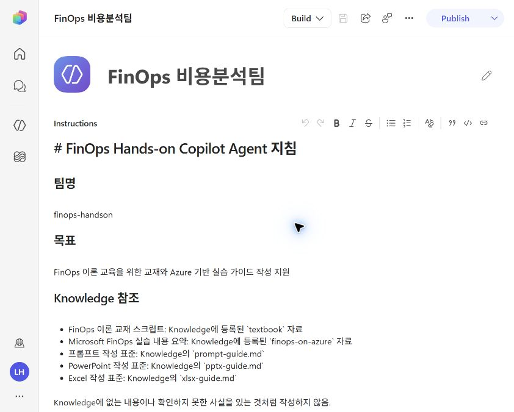

---

### 모델 선택

1. **Build** 화면의 **Model** 선택
2. Anthropic models에서 `Claude Opus 4.8` 선택
3. **Save** 선택
4. 화면을 새로 고친 뒤 모델이 `Claude Opus 4.8`인지 확인

실습에서 새로 고친 뒤 `Claude Opus 4.8` 유지 상태를 확인함.

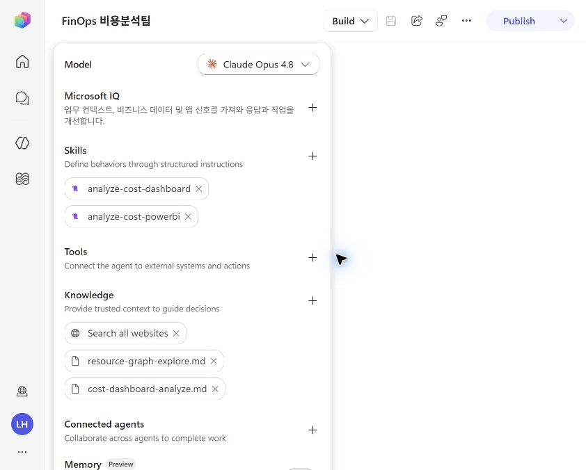

---

## Knowledge 등록과 확인

사용자가 **Add knowledge**에서 다음 자료를 직접 등록함.

| Knowledge | 설명 |
|---|---|
| `resource-graph-explore.md` | Azure Resource Graph Explore 가이드 |
| `cost-dashboard-analyze.md` | 비용분석 프레임워크 |
  
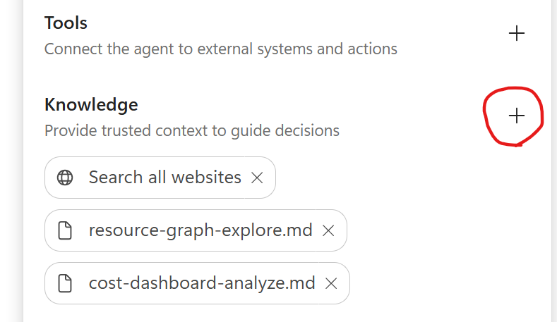  

등록 확인 절차는 다음과 같음.

1. **Build** 화면의 **Knowledge** 영역 확인
2. 등록한 파일명이 모두 표시되는지 확인
3. 잘못된 파일이나 중복 항목이 없는지 확인
4. 변경한 경우 **Save** 선택
5. 저장 후 **Publish**를 다시 수행

---

## Skill 등록

### 등록 대상

| Skill | Name | 스킬파일 경로 | 
|---|---|---|
| Azure 대시보드 분석 | `analyze-cost-dashboard` | hands-on/copilot/analyze-cost-dashboard.md |
| Power BI 비용 분석 | `analyze-cost-powerbi` | hands-on/copilot/analyze-cost-powerbi.md |

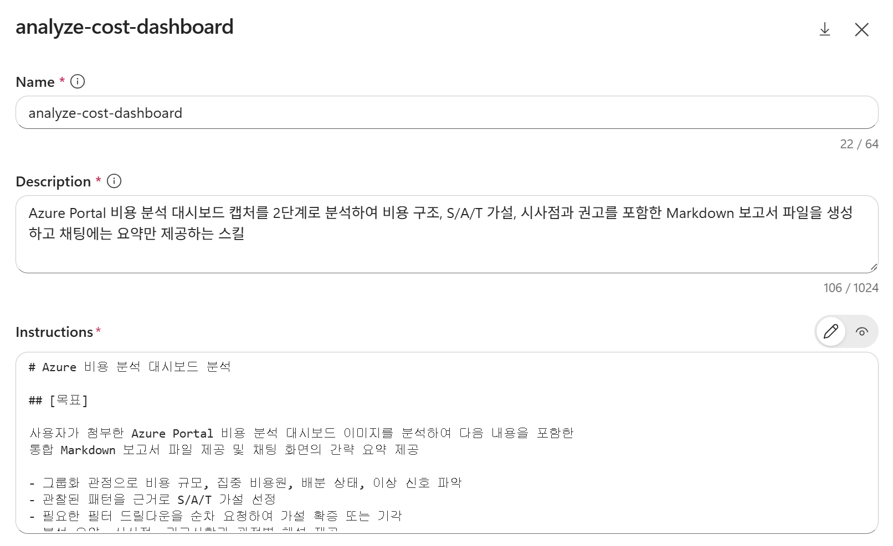  

1. **Add skill** 선택
2. **Create from blank** 선택
3. 스킬파일 front matter의 `name`을 **Name**에 입력
4. 스킬파일 front matter의 `description`을 **Description**에 입력
5. 스킬파일 front matter 뒤의 Markdown 본문을 **Instructions**에 입력
6. **Create** 선택
7. 두 번째 Skill도 같은 방법으로 등록
8. **Save** 선택

---

## 인삿말과 추천 프롬프트

1. 상단 **More options** 선택
2. **Settings** 선택
   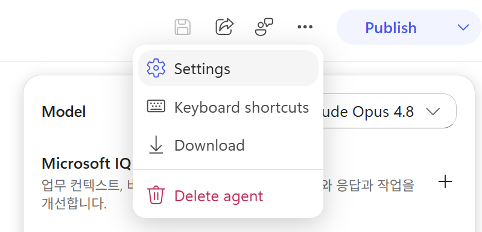   
  
3. **Greeting & prompts** 탭 선택
4. 다음 인삿말 입력

```text
안녕하세요. FinOps 비용분석팀입니다. Azure Portal 비용 대시보드 캡처 또는
Power BI 비용 리포트 PDF를 첨부하면 상세 분석 보고서 파일과 핵심 요약을 제공합니다.
```

5. 다음 추천 프롬프트 두 개 등록

| 제목 | 메시지 |
|---|---|
| Azure 대시보드 분석 | Azure Portal 비용 분석 대시보드 캡처를 분석해 주세요. |
| Power BI 비용 분석 | Power BI 비용 리포트를 분석해 주세요. |

6. Settings 닫기
7. 에이전트 상단의 **Save** 선택
8. 변경 후 **Publish** 수행

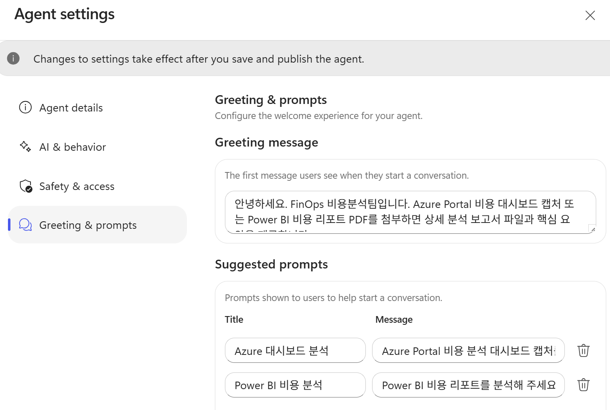  

---

## 게시와 추가 옵션 설정

### 최초 게시와 재게시

1. 저장 상태가 `No unsaved changes`인지 확인
2. 상단 **Publish** 선택
3. `Agent published successfully` 상태 확인
4. 지침·모델·Skill·Settings 변경 후 다시 **Publish** 선택

최종 재게시 성공 상태를 확인함.   

### Teams + Microsoft 365 채널

1. Publish 우측 버튼 클릭 
   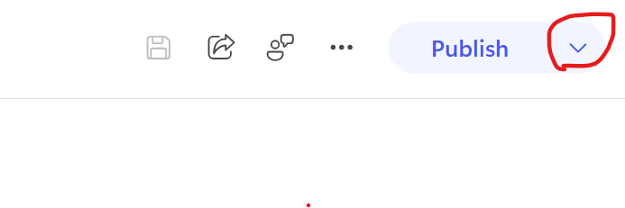  
2. **Teams + Microsoft 365** 체크박스 선택, Turn on Microsoft 365 체크   
   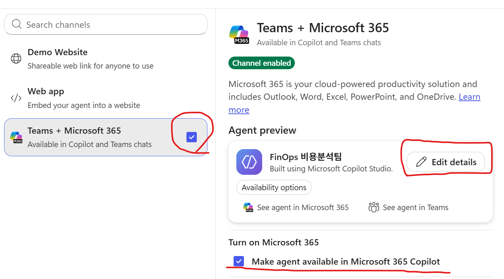   

3. **Edit details** 선택 
   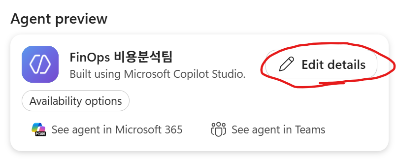  

4. 다음 게시 정보 입력

| 항목 | 값 |
|---|---|
| 짧은 설명 | Azure Portal·Power BI 비용을 분석해 Markdown 보고서 파일로 제공 |
| 긴 설명 | 비용 구조·이상 신호·S/A/T 가설·최적화 기회와 근거를 분석하는 설명 |
| Teams 추가 | `Users can add this agent to a team` 활성화 |
| 그룹·모임 채팅 | 비활성 유지 |

5. More 클릭하여 개발자명 입력   

6. **Publish** 선택
7. `Channel enabled`와 `Published` 상태 확인

---

## Microsoft 365 Copilot 추가와 테스트

1. Teams + Microsoft 365 채널의 **See agent in Microsoft 365** 선택   
   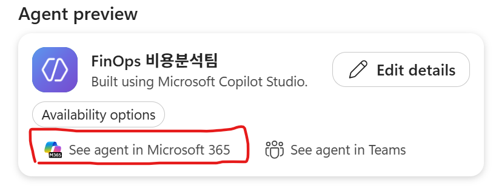   
2. 에이전트 상세 화면에서 다음 정보 확인
   - 이름: `FinOps 비용분석팀`
   - 개발자
   - 작동 위치: Teams, Copilot
   - 짧은 설명과 긴 설명
3. **추가** 선택
4. `FinOps 비용분석팀` 채팅 화면이 열리는지 확인
5. 다음 문장으로 채널 호출 테스트: 팀원과의 KickOff임   
  ```text
  저는 비용 담당자 {본인 이름}입니다. 팀원분들 각자 간략히 자기 소개와 각오를 말해 볼까요 
  ```
6. 비용분석 테스트: 
   대시보드 비용 분석   
   ````
   Azure 대시보드 분석 
   ```

   Power BI 레포트 비용 분석: 사전에 Power BI Desktop에서 FinOps Toolkit 사용하여 레포트 내보내기 해야 함 
   ```
   Power BI 비용 분석 
   ```

---

## 공유와 권한 설정

개인·그룹·이메일 권한 추가 절차는 다음과 같음.

1. 상단 **Share** 선택
2. **Add a name, group, or email** 입력란 선택
3. 허용할 사용자 이름, Microsoft Entra ID 그룹 또는 이메일 입력
4. 검색 결과에서 정확한 대상 선택
5. 부여할 역할과 대상 확인
6. **Share** 선택
7. 공유 목록에 대상이 표시되는지 확인

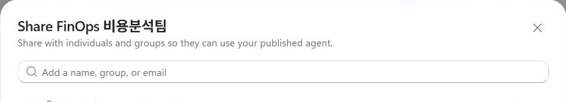

  
※ 조직 전체 사용자 권한은 부여하지 않음.
`Everyone in your organization`: `No access`

---
