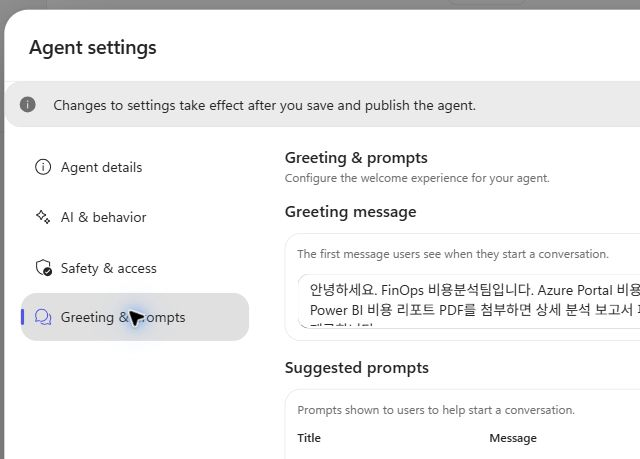
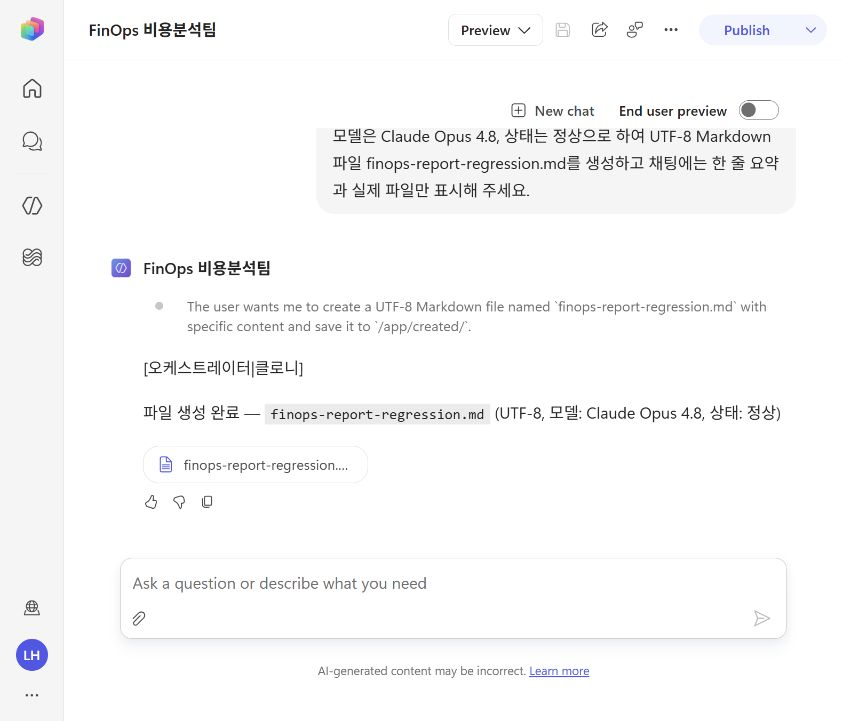
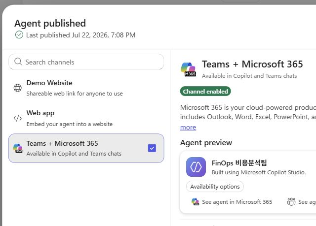
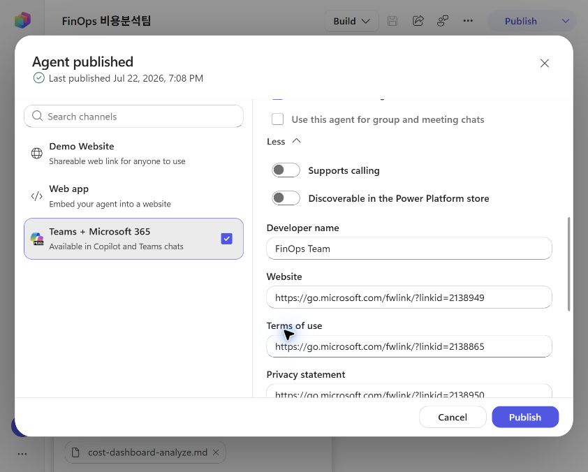

# Copilot Studio FinOps 비용분석팀 에이전트 개발 가이드

## 1. 실습 개요

Claude Code의 프로젝트 지침과 비용 분석 Skill을 Copilot Studio 에이전트로 이관하는 실습임.  
생성할 에이전트 이름은 `FinOps 비용분석팀`임.

### 목표

- 프로젝트 공통 지침을 Copilot Studio의 Agent instructions로 등록
- Azure Portal 비용 대시보드 분석 Skill 등록
- Power BI 비용 리포트 분석 Skill 등록
- 전체 분석 결과를 Markdown 보고서 파일로 생성
- 채팅 화면에는 핵심 요약과 실제 파일만 표시
- Teams와 Microsoft 365 Copilot 채널 게시 및 동작 확인

### 입력 파일

| 구분 | 파일 |
|---|---|
| 에이전트 지침 | `hands-on/copilot/instruction.md` |
| Azure 대시보드 분석 Skill | `hands-on/copilot/analyze-cost-dashboard.md` |
| Power BI 비용 분석 Skill | `hands-on/copilot/analyze-cost-powerbi.md` |
| 작성 형식 참고 | `.temp/develop-copilot-agent.md` |

참고 자료는 GitHub의  
[`develop-copilot-agent.md`](https://github.com/unicorn-campus/prd/blob/main/references/develop-copilot-agent.md)임.

## 2. 참고 가이드 적용 범위

참고 가이드의 전체 절차를 다음과 같이 FinOps 에이전트에 대응함.

| 참고 절차 | FinOps 적용 결과 |
|---|---|
| Copilot Studio 로그인 | 동일 적용 |
| 새 에이전트 생성 | `FinOps 비용분석팀`으로 생성 |
| AGENTS.md 붙여넣기 | 변환된 `instruction.md` 등록 |
| OneDrive 자료 업로드 | 사용자가 등록한 Knowledge 파일 확인 |
| 모델 선택 | `Claude Opus 4.8` 적용 |
| Knowledge 등록 | 등록된 두 파일과 웹 검색 확인 |
| Skill 등록 | 비용 분석 Skill 2개 등록 |
| OneDrive Tools | 직접 저장을 사용하지 않아 비적용 |
| 인삿말·추천 프롬프트 | FinOps 입력에 맞게 등록 |
| 최초 게시·재게시 | 최초 게시와 변경 후 재게시 확인 |
| 추가 게시 옵션 | Teams·Microsoft 365 Copilot 채널 적용 |
| Copilot·Teams 추가 | Microsoft 365 Copilot 추가와 호출 확인 |
| 조직 전체 권한 | 사용자 요청에 따라 제외 |
| PRD 작성 | 비용 분석과 보고서 파일 생성 테스트로 대체 |

## 3. 사전 준비

### 권한 및 환경

- Copilot Studio 사용 권한이 있는 Microsoft 365 계정
- 에이전트를 생성할 Power Platform 환경
- 에이전트 저장·게시 권한
- Microsoft 365 Copilot 또는 Teams 사용 권한
- 입력 파일을 열 수 있는 로컬 작업 환경

본 실습에서 사용한 Power Platform 환경은 `Unicorn (default)`임.

### Chrome 파일 업로드 설정

Chrome 확장 기능으로 Skill 파일을 업로드하려면 다음 설정이 필요함.

1. Chrome에서 `chrome://extensions` 열기
2. ChatGPT Chrome Extension의 **Details** 선택
3. **Allow access to file URLs** 활성화

설정 안내는  
[Chrome extension 파일 업로드 문서](https://developers.openai.com/codex/app/chrome-extension#upload-files) 참조.

## 4. Copilot Studio 로그인과 에이전트 생성

1. [Copilot Studio](https://copilotstudio.microsoft.com/) 접속
2. 왼쪽 탐색 메뉴에서 **Agents** 선택
3. 새 에이전트 생성 선택
4. 환경이 `Unicorn (default)`인지 확인
5. **Name your agent**에 `FinOps 비용분석팀` 입력
6. **Save** 선택
7. 상단 제목이 `FinOps 비용분석팀`으로 표시되는지 확인

에이전트 편집 URL은 다음 형식임.

```text
https://copilotstudio.microsoft.com/environments/{environment-id}/agents/{agent-id}
```

## 5. 공통 지침 변환과 등록

### Claude Code 지침 변환

Claude Code의 런타임 전용 규칙은 Copilot Studio에서 실행할 수 있는 표현으로 변환함.

| 원본 개념 | Copilot Studio 변환 |
|---|---|
| `references/prompt-guide.md` | Knowledge의 `prompt-guide.md` |
| `references/pptx-guide.md` | Knowledge의 `pptx-guide.md` |
| `references/xlsx-guide.md` | Knowledge의 `xlsx-guide.md` |
| Agent 도구로 팀원 위임 | 적합한 팀원 관점을 선정하여 위임 |
| Git 연동 | 삭제 |
| URL을 curl로 저장 | 삭제 |
| Claude Code Lessons Learned | 삭제 |
| Advisor 호출 | 삭제 |
| 환경변수·로컬 런타임 규칙 | 삭제 |

다음 Copilot 전용 규칙을 추가함.

- Knowledge에 없거나 확인하지 못한 사실 생성 금지
- 외부 시스템 기능이 없으면 수행 불가 범위 안내
- 상세 비용 분석 결과를 UTF-8 Markdown 파일로 생성
- 채팅 화면에는 최대 5개 항목의 요약과 실제 파일만 표시
- 가상 링크·로컬 경로·확인하지 않은 파일 참조 생성 금지
- OneDrive 직접 저장과 대화의 다운로드 파일 생성을 구분

### Agent instructions 등록

1. **Build** 화면에서 **Agent instructions** 선택
2. `hands-on/copilot/instruction.md` 전체 내용 입력
3. 편집 영역 밖을 선택하여 입력 반영
4. **Save** 선택
5. 저장 상태가 `No unsaved changes`인지 확인
6. 화면을 새로 고친 후 지침이 남아 있는지 확인

실습에서는 새로 고친 뒤 지침 본문이 다시 표시되는 것을 확인함.


## 6. 모델 선택

1. **Build** 화면의 **Model** 선택
2. Anthropic models에서 `Claude Opus 4.8` 선택
3. **Save** 선택
4. 화면을 새로 고친 뒤 모델이 `Claude Opus 4.8`인지 확인

참고 가이드의 모델 항목을 동일하게 적용함.  
실습에서 새로 고친 뒤 `Claude Opus 4.8` 유지 상태를 확인함.


## 7. Knowledge 등록과 확인

사용자가 **Add knowledge**에서 다음 자료를 직접 등록함.

| Knowledge | 확인 결과 |
|---|---|
| `resource-graph-explore.md` | 등록 이름 표시 확인 |
| `cost-dashboard-analyze.md` | 등록 이름 표시 확인 |
| `Search all websites` | 활성 상태 표시 확인 |

등록 확인 절차는 다음과 같음.

1. **Build** 화면의 **Knowledge** 영역 확인
2. 등록한 파일명이 모두 표시되는지 확인
3. 잘못된 파일이나 중복 항목이 없는지 확인
4. 변경한 경우 **Save** 선택
5. 저장 후 **Publish**를 다시 수행

`instruction.md`가 참조하는 다른 자료는 화면에서 확인되지 않았으므로 등록 완료로 단정하지 않음.

- `textbook` 자료
- `finops-on-azure` 자료
- `prompt-guide.md`
- `pptx-guide.md`
- `xlsx-guide.md`

Knowledge 검색이 게시 직후 실패하면 게시 반영 시간을 기다린 뒤 새 채팅에서 다시 확인함.

## 8. Skill 등록

### 등록 대상

| Skill | Name |
|---|---|
| Azure 대시보드 분석 | `analyze-cost-dashboard` |
| Power BI 비용 분석 | `analyze-cost-powerbi` |

### 방법 A. Skill 파일 업로드

1. **Build** 화면에서 **Add skill** 선택
2. **Upload a skill** 선택
3. `SKILL.md` 파일 또는 `SKILL.md`가 포함된 ZIP 파일 선택
4. 등록된 Skill 이름 확인
5. 두 번째 Skill도 같은 방법으로 등록

Copilot Studio 업로드 요구 사항에 따라 파일 이름이 `SKILL.md`여야 함.  
원본을 변경하지 않으려면 각 Skill을 별도 폴더에 복사하여 사용함.

```powershell
New-Item -ItemType Directory -Force '.temp/analyze-cost-dashboard'
New-Item -ItemType Directory -Force '.temp/analyze-cost-powerbi'

Copy-Item 'hands-on/copilot/analyze-cost-dashboard.md' `
  '.temp/analyze-cost-dashboard/SKILL.md'
Copy-Item 'hands-on/copilot/analyze-cost-powerbi.md' `
  '.temp/analyze-cost-powerbi/SKILL.md'
```

### 방법 B. Create from blank

파일 업로드 권한을 사용할 수 없으면 원문을 직접 등록함.

1. **Add skill** 선택
2. **Create from blank** 선택
3. YAML front matter의 `name`을 **Name**에 입력
4. YAML front matter의 `description`을 **Description**에 입력
5. YAML front matter 뒤의 Markdown 본문을 **Instructions**에 입력
6. **Create** 선택
7. 두 번째 Skill도 같은 방법으로 등록
8. **Save** 선택

실습에서는 Chrome의 파일 URL 접근 권한이 비활성화되어 방법 B를 사용함.

### Skill 변경 반영

보고서 파일 출력 규칙을 추가한 뒤 다음 절차로 기존 Skill을 갱신함.

1. **Skills**에서 Skill 이름 선택
2. **Description**을 로컬 YAML front matter와 일치하도록 수정
3. **Instructions**를 최신 Markdown 본문으로 교체
4. Skill 편집 창의 **Save** 선택
5. 두 번째 Skill도 같은 방법으로 수정
6. 에이전트 상단의 **Save** 선택
7. **Publish**를 다시 수행

## 9. Tools와 보고서 파일 출력

참고 가이드의 OneDrive Tools는 현재 에이전트에 등록하지 않음.

- OneDrive 직접 저장 위치와 접근 권한이 지정되지 않음
- 분석 결과는 대화에서 다운로드 가능한 Markdown 파일로 제공
- OneDrive 저장이 필요하면 파일을 다운로드한 뒤 승인된 위치에 업로드
- OneDrive에 실제로 저장하지 않았다면 저장 완료로 보고하지 않음

Copilot Studio Preview에서 별도 Tool 없이 Markdown 파일 첨부가 생성되는 것을 확인함.  
따라서 보고서 파일 생성만을 위해 OneDrive Tool을 추가하지 않음.

## 10. 인삿말과 추천 프롬프트

1. 상단 **More options** 선택
2. **Settings** 선택
3. **Greeting & prompts** 탭 선택
4. 다음 인삿말 입력

```text
안녕하세요. FinOps 비용분석팀입니다. Azure Portal 비용 대시보드 캡처 또는
Power BI 비용 리포트 PDF를 첨부하면 상세 분석 보고서 파일과 핵심 요약을 제공합니다.
```

5. 다음 추천 프롬프트 두 개 등록

| 제목 | 메시지 |
|---|---|
| Azure 대시보드 분석 | Azure Portal 비용 분석 대시보드 캡처를 분석해 주세요. |
| Power BI 비용 분석 | Power BI 비용 리포트를 분석해 주세요. |

6. Settings 닫기
7. 에이전트 상단의 **Save** 선택
8. 변경 후 **Publish** 수행



## 11. 미리 보기 테스트

### 테스트 1. Azure 대시보드 Skill 라우팅

```text
Azure Portal 비용 분석 대시보드 캡처를 분석해 주세요.
```

확인 결과는 다음과 같음.

- `analyze-cost-dashboard` Skill 로드 확인
- 입력 이미지가 없으므로 비용 수치 생성 없음
- 분석 목적과 표준 태그 키 질문 확인
- 최소 권장 캡처인 `01.total-trend`, `02.services` 요청 확인

결과는 통과임.

### 테스트 2. Power BI Skill 라우팅

```text
Power BI 비용 리포트를 분석해 주세요.
```

확인 결과는 다음과 같음.

- `analyze-cost-powerbi` Skill 로드 확인
- 입력 PDF가 없으므로 비용과 절감액 생성 없음
- Power BI 리포트 PDF 1 ~ 3개 요청 확인
- 지원 리포트 종류와 분석 목적 질문 확인

결과는 통과임.

### 테스트 3. 보고서 파일과 화면 요약

`Claude Opus 4.8`로 다음 회귀 테스트를 수행함.

```text
파일 출력 회귀 테스트입니다. 제목은 FinOps 보고서 회귀 테스트,
모델은 Claude Opus 4.8, 상태는 정상으로 하여 UTF-8 Markdown 파일
finops-report-regression.md를 생성하고 채팅에는 한 줄 요약과 실제 파일만 표시해 주세요.
```

확인 결과는 다음과 같음.

- 채팅에 한 줄 요약 표시
- `finops-report-regression.md` 파일 버튼 표시
- 전체 파일 본문의 채팅 중복 출력 없음
- 가상 URL이나 로컬 다운로드 경로 표시 없음

결과는 통과임.  
파일 버튼 표시까지 확인했으며 다운로드한 파일의 바이트·인코딩 검사는 수행하지 않음.



### 실제 비용 자료 회귀 테스트

최종 Skill로 실제 비용 수치까지 검증하려면 승인된 Azure 캡처 또는 Power BI PDF가 필요함.  
현재 최종 출력 규칙으로 다음 항목은 검증하지 않음.

- 이미지의 비용 수치 판독 정확도
- PDF 페이지별 근거 연결 정확도
- 정량 절감액과 원문 수치 대조
- 다운로드한 보고서의 실제 3부 구조와 UTF-8 한글 검사

## 12. 게시와 추가 옵션 설정

### 최초 게시와 재게시

1. 저장 상태가 `No unsaved changes`인지 확인
2. 상단 **Publish** 선택
3. `Agent published successfully` 상태 확인
4. 지침·모델·Skill·Settings 변경 후 다시 **Publish** 선택

최종 재게시 성공 상태를 확인함.

### Teams + Microsoft 365 채널

1. **Customize publish channels** 선택
2. **Teams + Microsoft 365** 선택
3. **Publish to Teams + Microsoft 365** 활성화
4. **Make agent available in Microsoft 365 Copilot** 활성화
5. **Edit details** 선택
6. 다음 게시 정보 입력

| 항목 | 값 |
|---|---|
| 짧은 설명 | Azure Portal·Power BI 비용을 분석해 Markdown 보고서 파일로 제공 |
| 긴 설명 | 비용 구조·이상 신호·S/A/T 가설·최적화 기회와 근거를 분석하는 설명 |
| Teams 추가 | `Users can add this agent to a team` 활성화 |
| 그룹·모임 채팅 | 비활성 유지 |
| 개발자명 | `FinOps Team` |
| 아이콘·색상 | 기존값 유지 |

7. 상세 화면의 **Save** 선택
8. 채널 화면의 **Publish** 선택
9. `Channel enabled`와 `Published` 상태 확인





## 13. Microsoft 365 Copilot 추가와 테스트

1. Teams + Microsoft 365 채널의 **See agent in Microsoft 365** 선택
2. 에이전트 상세 화면에서 다음 정보 확인
   - 이름: `FinOps 비용분석팀`
   - 개발자: `FinOps Team`
   - 작동 위치: Teams, Copilot
   - 짧은 설명과 긴 설명
3. **추가** 선택
4. `FinOps 비용분석팀` 채팅 화면이 열리는지 확인
5. 다음 문장으로 채널 호출 테스트

```text
이 에이전트가 지원하는 비용 분석 유형 2개와 결과 제공 방식을 간략히 알려주세요.
```

확인 결과는 다음과 같음.

- Azure 대시보드 분석과 Power BI 분석 설명 확인
- 전체 결과는 Markdown 파일로 제공한다는 안내 확인
- 채팅에는 요약과 실제 파일만 표시한다는 안내 확인
- 파일 생성 실패 시 완료로 보고하지 않는 규칙 확인

Microsoft 365 Copilot 추가와 기본 호출 테스트 결과는 통과임.  
Teams 앱 내부의 별도 채팅 호출은 수행하지 않음.

## 14. 공유와 권한 설정

조직 전체 사용자 권한은 부여하지 않음.

- 현재 소유자: `LEE HAEKYUNG`
- `Everyone in your organization`: `No access`
- 사용자 요청에 따라 Everyone 권한 확대 제외

개인·그룹·이메일 권한 추가 절차는 다음과 같음.

1. 상단 **Share** 선택
2. **Add a name, group, or email** 입력란 선택
3. 허용할 사용자 이름, Microsoft Entra ID 그룹 또는 이메일 입력
4. 검색 결과에서 정확한 대상 선택
5. 부여할 역할과 대상 확인
6. **Share** 선택
7. 공유 목록에 대상이 표시되는지 확인


권한을 추가하기 전에 대상과 역할을 사용자에게 확인해야 함.  
조직 전체 권한이 필요하지 않으면 `Everyone in your organization`을 `No access`로 유지함.

## 15. 완료 확인

| 항목 | 결과 | 증거 |
|---|---|---|
| 새 에이전트 생성 | 완료 | 제목 `FinOps 비용분석팀` 확인 |
| 공통 지침 등록 | 완료 | 새로 고침 후 지침 본문 유지 확인 |
| 모델 변경 | 완료 | 새로 고침 후 `Claude Opus 4.8` 확인 |
| Knowledge 확인 | 완료 | 파일 2개와 웹 검색 표시 확인 |
| Azure 대시보드 Skill | 완료 | Skills 목록과 Preview 로드 기록 확인 |
| Power BI 비용 분석 Skill | 완료 | Skills 목록과 Preview 로드 기록 확인 |
| 입력 누락 안전 동작 | 통과 | 캡처·PDF 요청 응답 확인 |
| Markdown 파일 생성 | 통과 | `finops-report-regression.md` 파일 버튼 확인 |
| 화면 요약 제한 | 통과 | 한 줄 요약과 파일만 표시 확인 |
| 인삿말·추천 프롬프트 | 완료 | Settings 입력·저장·게시 수행 |
| Teams + Microsoft 365 채널 | 완료 | `Channel enabled`, `Published` 확인 |
| 개발자명 | 완료 | Microsoft 365에서 `FinOps Team` 확인 |
| Microsoft 365 추가·호출 | 통과 | 에이전트 추가 후 응답 확인 |
| Teams 내부 호출 | 미수행 | Teams 앱에서 별도 호출하지 않음 |
| 실제 비용 수치 분석 | 미수행 | 최종 회귀 테스트 자료 미제공 |
| 조직 전체 권한 | 제외 | Everyone 권한 부여 제외 요청 반영 |
| 개인·그룹 권한 추가 | 미수행 | 대상 사용자·그룹·이메일 미제공 |

## 16. 운영 시 주의 사항

- 지침·모델·Skill·Settings 변경 후 반드시 **Save**와 **Publish** 재수행
- Skill 변경 후 Preview에서 해당 Skill의 로드 여부 재확인
- Knowledge 검색 실패 시 게시 반영 시간을 기다린 뒤 새 채팅에서 재시도
- 사용자가 제공하지 않은 비용, 절감액, 필터 결과 생성 금지
- 실제 비용 데이터는 조직의 데이터 분류와 공유 정책에 따라 취급
- 구매, 중지, 삭제, 크기 변경은 담당자 승인 후 실행
- 파일 버튼 표시와 다운로드한 파일 내용 검증을 구분하여 기록
- Publish 성공과 채널 활성화, 사용자 권한 부여를 각각 구분하여 보고
- 조직 전체 권한 대신 필요한 개인·그룹·이메일만 최소 권한으로 추가
