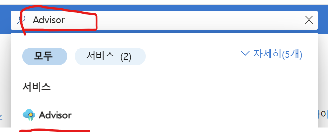

# 비용 최적화

## Advisor 이용 
- 
  

가상 머신(VM) — 저활용 시 크기 조정/종료, 예약 인스턴스 구매 → 이 구독에 VM 없음
관리 디스크 / 공용 IP — 미연결·유휴 시 삭제 → 없음
게이트웨이·부하 분산 장치·ExpressRoute — 유휴 시 정리 → 없음
SQL / Cosmos DB / Synapse 예약·크기 조정 → 없음