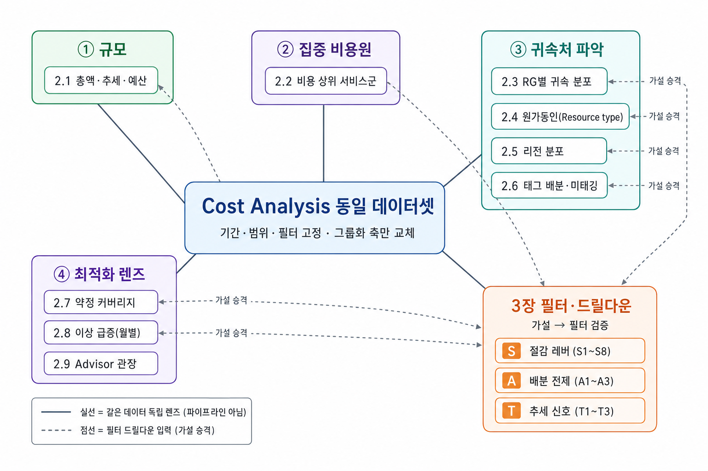
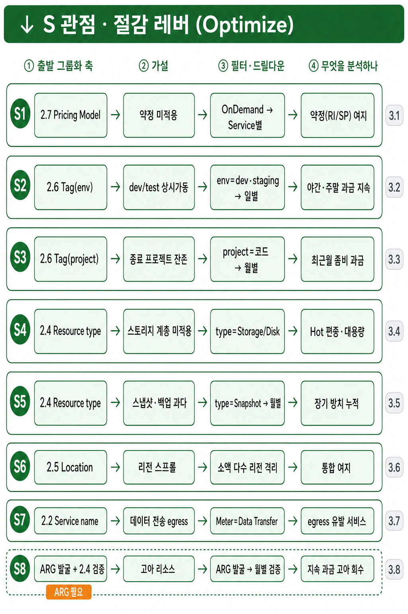
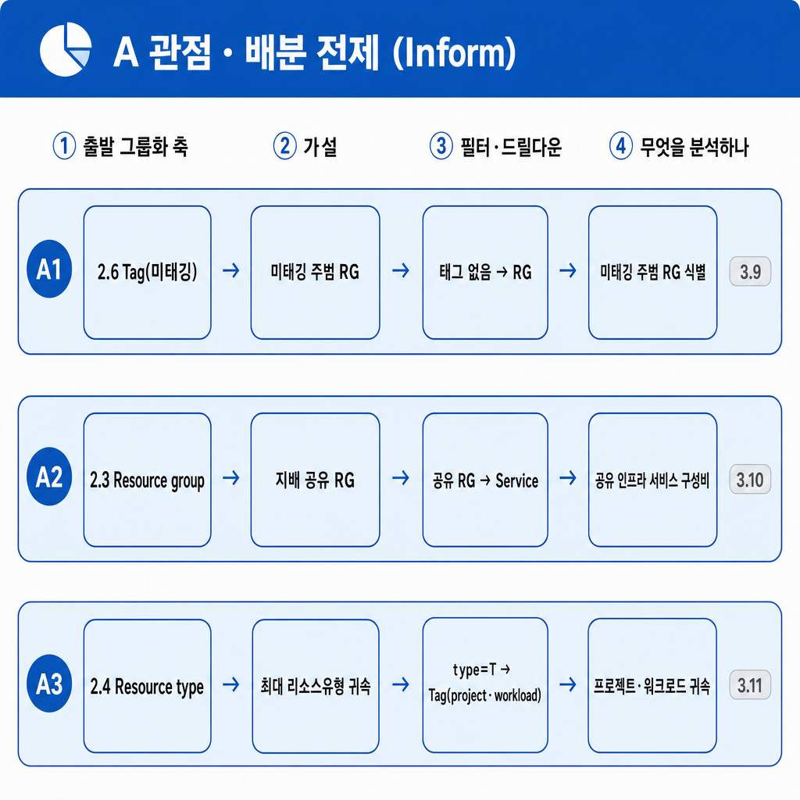
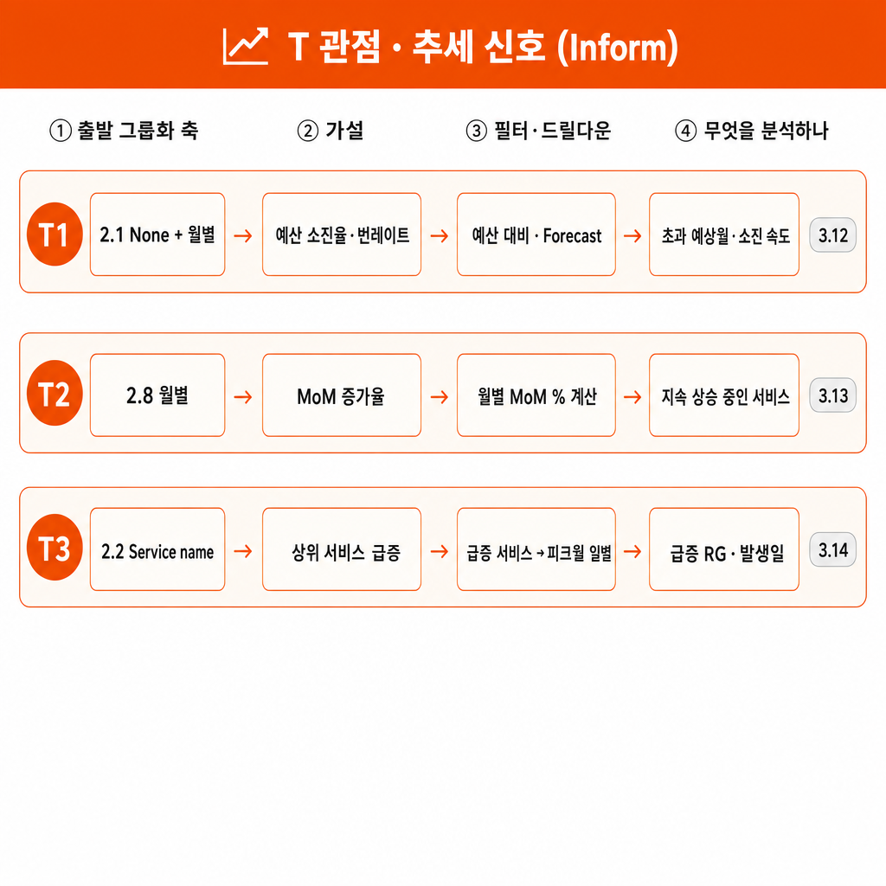

# Azure Cost analysis 범용 비용 분석 가이드

> Azure Portal 네이티브 **비용 분석(Cost analysis)** 대시보드를 **어떤 구독·환경에도 재사용**하기 위한 범용 분석 가이드임.  
> 그룹화(Group by) 9축으로 전체를 조망하고, 필터(Filter) 드릴다운으로 원인을 규명하는 순서를 다룸(비용 절감 3그룹으로 배열).  
> 각 축·패턴에 **인라인 FinOps 태그**(Inform·Optimize·역량)를 붙여 "지금 어느 FinOps 활동을 하는가"를 명시함.

---

## 0. 개요와 사용법

### 0.1 목적

- Azure 포털 비용 분석 화면에서 **비용의 구조·집중·원인을 재현 가능하게 읽어내는 표준 절차**를 제공함.  
- 특정 구독의 수치가 아니라 **분석 렌즈(각 축에서 무엇을 읽는가)** 를 전이하는 것이 목표임.  
- 결과물은 Inform(가시화·배분)에서 시작해 Optimize(최적화 기회 탐색)로 넘어가는 브릿지까지 이어짐.

### 0.2 대상·전제

- **대상**: 구독·리소스그룹 범위의 비용을 스스로 분석해야 하는 FinOps 실무자·엔지니어·재무 담당자.  
- **접근 권한 전제**: 분석 대상 범위(Scope)에 대한 **Cost Management Reader 이상** 권한 보유.  
- **환경 전제**: 계약 유형(EA·MCA·CSP)에 따라 노출되는 컬럼·그룹화 옵션이 일부 다를 수 있음을 인지.  
- **데이터 전제**: 당월 비용은 미확정(변동) 상태이며, 확정 수치는 마감 후 조회가 정확함.

### 0.3 분석 철학: "그룹화 = 지도, 필터 = 확대경"

- **그룹화(Group by)** 는 전체를 한 축으로 분해해 **"무엇이 얼마나?"** 를 답함 → breadth-first(조망).  
- **필터(Filter)** 는 특정 부분집합으로 범위를 좁혀 **"이 대상 안에서는? 왜?"** 를 답함 → depth-first(드릴다운).  
- 표준 흐름은 **그룹화 먼저(어디에 비용이 있나) → 필터 나중(그 대상만 격리해 원인)** 임.  
- 그룹화 = 지도, 필터 = 확대경. 둘은 상충이 아니라 상호보완임.

### 0.4 분석 목적 3분류

| 목적 | 답하는 질문 | 주로 쓰는 축·패턴 | FinOps 활동 |
|---|---|---|---|
| **가시화(Reporting)** | 총액·추이·집중 비용원이 무엇인가? | None+월별, Service name, Location | Inform |
| **배분(Allocation)** | 이 비용을 누구·어느 프로젝트에 귀속하나? | Resource group, Tag, 미태깅·공유 필터 | Inform |
| **최적화 기회탐색(Optimize)** | 어디를 줄일 수 있나(약정·워크로드·고아)? | Pricing Model, Resource type, 최적화 블레이드 | Optimize |

- 세 목적은 순차적임: **가시화로 규모 파악 → 배분으로 책임 귀속 → 최적화로 조치 대상 도출**.

---

## 1. 사전 준비: 컨트롤 이해

분석 전, 화면 상단의 컨트롤 5종의 역할을 먼저 이해함. 이 컨트롤 조합이 모든 축·패턴의 재현 단위임.

| 컨트롤 | 역할 | 실무 팁 |
|---|---|---|
| **범위(Scope)** | 분석 대상 경계(관리그룹·구독·리소스그룹) 지정 | 상단 범위 선택 → 원하는 구독·RG로 고정. 범위가 결론의 분모임 |
| **기간(Charge period)** | 분석할 청구 기간 = 입력 변수 `{분석기간}` | 사용자 지정값 우선. 미전달 시 아래 **1.1 분석기간 결정 규칙** 적용 |
| **세분성(Granularity)** | 시간축 단위(누적·월별·일별) | 누적=단일 합계, 월별=추세, **일별=단기 정밀** |
| **차트 유형(Chart type)** | 시각화 형태(세로 막대·꺾은선·테이블 등) | **테이블 = 정확 수치·정렬·행수 확인에 최적** |
| **그룹화 vs 필터** | 그룹화=축 분해 / 필터=부분집합 격리 | 그룹화로 지도 그리고, 필터로 확대함 |

### 1.1 분석기간 결정 규칙 (변수 `{분석기간}`)

- 분석기간은 이 가이드의 **입력 변수 `{분석기간}`** 임 — 분석을 수행하는 사용자가 지정한 값을 **최우선**으로 사용함.  
- `{분석기간}` 이 **전달되지 않은 경우에만** 아래 **분석 목적별 기본 기간 표**로 결정함.  
- 앵커 주의: Azure 포털 Cost analysis의 실제 **기본 날짜 범위는 "이번 달(This month)"** 이며,  
  "12개월"은 정석·기본값이 아니라 **추세 분석 시 자주 쓰는 범위**일 뿐임(목적에 따라 조정).  
- 원칙: **기간은 목적의 함수임** — 목적이 렌즈(그룹화·필터)를 결정하듯, 기간도 목적이 결정함.

| 분석 목적 | 기본 분석기간(미전달 시) | 이유 |
|---|---|---|
| 일상 운영 모니터링 | 이번 달 / 지난 30일 | 포털 기본값, 당월 소비 추적(단, 당월은 미확정 변동) |
| 추세·계절성·YoY | 지난 6 ~ 12개월 | 월별 패턴·주기·전년 대비 포착 |
| 원인 격리·이상 급증 | 특정 피크월(단월) | 기간을 좁혀야 일별 세분성 사용 가능 |
| 약정 추천 검증 | Advisor Lookback(7/30/60일)과 정합 | 추천 산정 창과 기간을 일치시켜 비교 |

### 1.2 표준 태그키 결정 규칙 (변수 `{표준태그키}`)

- 배분·거버넌스 분석에 쓸 태그 키는 이 가이드의 **입력 변수 `{표준태그키}`** 임 — 조직의 태그 표준(회사별 상이)을 **최우선**으로 사용함.  
- `{표준태그키}` 가 **전달되지 않은 경우에만** 기본값 **`team · workload · CostCenter · project · env · owner`** 를 사용함.  
- 태그 축(2.6)과 필터의 배분·프로젝트 키(3.9 미태깅·3.11 원가동인·3.3 프로젝트)는 모두 이 `{표준태그키}` 집합을 참조함.  
- 원칙: **표준에 없는 임의 태그는 배분 판단 대상에서 제외** — 배분·귀속은 조직이 합의한 표준 키로만 수행함.

**기본 키 의미(축)** — 여섯 키는 배타적이지 않은 **독립 축**임(한 리소스가 복수 키 동시 보유 가능).  
- `team`: 소유·운영 조직(팀 단위 배분 경계)  
- `workload`: **상시(ongoing) 운영되는 서비스·애플리케이션·워크로드**(지속 존재)  
- `CostCenter`: 재무 귀속 대상(chargeback 단위·예산 주체)  
- `project`: **기간이 한정된 이니셔티브·예산 추적 단위**(착수·종료 존재)  
- `env`: 환경 구분(prod·dev·staging 등 수명주기)  
- `owner`: 책임 주체(담당자·팀 연락처)

**`project` vs `workload`**: 상시 서비스는 `workload`로 귀속함(기본), 기간 한정 과제는 `project`로 표시함.  
둘은 택일이 아니며, 상시 서비스가 특정 이니셔티브에 참여하면 **두 키를 함께** 부여함.

**명명·값 규칙(권고)**: 키 이름은 **소문자·snake_case**로 통일하고, `workload`는 FOCUS/Azure 기본 차원 **`Service name`(공급자 서비스명)과 혼동을 피하기 위해** 의도적으로 다른 이름을 씀.  
값은 **자유문자 대신 코드/ID로 등록**(허용값 사전 정의)하고, 사람이 읽는 명칭·소유자·속성은 **CMDB 조인**으로 리포트에서 해석함.

**세분성 상세**  
- **누적(Accumulated)**: 기간 전체를 하나의 합계로 봄. "이 범위 총액은?"에 적합.  
- **월별(Monthly)**: 월 단위 추세·피크·유휴월 식별. 추세 분석 시 자주 쓰는 범위(6 ~ 12개월, 기본값 아님).  
- **일별(Daily)**: 특정 일 급증·중단 정밀 추적. **단, 장기간(예: 1년 범위)에서는 선택 불가**할 수 있어 **피크월로 기간을 좁힌 뒤** 사용함.

**차트 유형 상세**  
- **테이블**: 정확한 금액·비중·행수(N행)를 읽는 기본. 정렬·CSV 내보내기 가능.  
- **세로 막대형(누적)**: 월별 총액 추세 조망에 적합.  
- **세로 막대형(그룹화)**: 월별 × 축(예: 서비스) 교차로 "어느 달 무엇이 튀었나" 확인에 적합.

**그룹화 vs 필터 역할 구분**  
- **그룹화**: 전체를 축으로 쪼갬(예: 서비스별). 조망·survey 단계.  
- **필터**: 조건에 맞는 부분만 남김(예: 특정 서비스만). 드릴다운·원인 규명 단계.  
- **주의**: 그룹화 축과 필터 조건은 동시에 조합 가능함(예: 그룹화=RG + 필터=Tag 미태깅).

### 1.3 분석 프레임워크: 9축 관계와 그룹화 → 필터 연결

**9축 관계** — 9축은 **파이프라인이 아님**. 동일 데이터셋(기간·범위·필터 고정)에 **그룹화 축만 교체**하는  
**독립 렌즈**임(실선=같은 데이터 조회, 방향·의존 없음). 번호(2.1→2.9)는 **권장 읽는 순서**(인지적 우선순위)일 뿐  
데이터 의존이 아니며, 앞 그룹화의 **가설을 필터로 넘겨 드릴다운**하는 진짜 입력 의존은 **3장과 4.2 드릴다운 행**에서만 발생(점선).

**그룹화 → 가설 → 필터 → 분석 연결표** — 그룹화(2장)에서 발견한 값을 **필터 조건으로 승격**해 3장 드릴다운으로 잇는 다리임.  
비용 절감 가설을 **성격별 3그룹**으로 묶고 **그룹 약자 단일 ID**를 부여함 — **S**(Save·절감 레버) S1 ~ S8 · **A**(Allocate·배분 전제) A1 ~ A3 · **T**(Trend·추세 신호) T1 ~ T3.  
**그룹은 목적 분류이고, 그룹 내 번호는 권장 읽기 순서(우선순위)일 뿐 파이프라인이 아님**(각 가설은 독립 실행 가능).  
이 **S/A/T ID는 3장 드릴다운 소제목·4.2 액션표에서 동일하게 쓰는 안정 ID**임(각 행 **연결**의 3.x는 대응 절 번호).

**① 절감 레버 그룹 — Optimize(바로 지출이 줄어듦)** · 그룹 내 순서 = 잠재 절감액 큰 순(조직 지출구조에 따라 가변)

| 가설 | 출발 그룹화 | 필터·드릴다운 | 무엇을 분석하나 | 연결 |
|---|---|---|---|---|
| **S1 약정 미적용** | 2.7 Pricing Model | `Pricing Model=OnDemand` → Service별 | steady-state 서비스의 **약정(RI/SP) 여지** | 3.1 · 2.9 Advisor |
| **S2 dev/test 상시가동** | 2.6 Tag(env) | `env=dev·staging` → 일별 | **야간·주말 과금 지속**(스케줄링 여지) | 3.2 |
| **S3 종료 프로젝트 잔존** | 2.6 Tag(project) | `Tag(project)=특정 코드` → 월별 | **최근월 잔존(좀비) 과금** 여부 | 3.3 |
| **S4 스토리지 계층 미적용** | 2.4 Resource type | `Resource type=Storage/Disk` | Hot 편중·대용량(계층화 여지, **접근 메트릭 병행**) | 3.4 |
| **S5 스냅샷·백업 과다** | 2.4 Resource type | `Resource type=Snapshot` → 월별 | **장기 방치 스냅샷** 누적(ARG 발굴 병행) | 3.5 · 3.8(S8) |
| **S6 리전 스프롤** | 2.5 Location | 소액 다수 리전 격리 | **거버넌스 오버헤드·통합** 여지 | 3.6 |
| **S7 데이터 전송(egress)** | 2.2 Service name | `Meter=Data Transfer` | **egress 유발 서비스**(메터 상세 병행) | 3.7 |

**② 배분 전제 그룹 — Inform(절감 전 귀속·가시성 확보, 절감액 아닌 커버리지로 판단)**

| 가설 | 출발 그룹화 | 필터·드릴다운 | 무엇을 분석하나 | 연결 |
|---|---|---|---|---|
| **A1 미태깅 주범 RG** | 2.6 Tag(미태깅) | `Tag=태그 없음` → RG | 미태깅 **주범 RG** | 3.9 |
| **A2 지배 공유 RG** | 2.3 RG | `Resource group=공유 RG` → Service | 공유 인프라 **내부 서비스 구성비** | 3.10 |
| **A3 최대 리소스유형 귀속** | 2.4 Resource type | `Resource type=T` → Tag(project→workload) | T의 **프로젝트·워크로드 귀속** | 3.11 |

**③ 추세 신호 그룹 — Inform(절감액 아닌 긴급도 — 언제 개입할지)**

| 가설 | 출발 그룹화 | 필터·드릴다운 | 무엇을 분석하나 | 연결 |
|---|---|---|---|---|
| **T1 예산 소진율·번레이트** | 2.1 None+월별 | 예산 대비·Forecast | **초과 예상월·소진 속도** | 3.12 |
| **T2 MoM 증가율** | 2.8 월별 | 월별 MoM % 계산 | **지속 상승 중인 서비스** | 3.13 |
| **T3 상위 서비스 급증** | 2.2 Service name | `Service name=급증 서비스` → (피크월)일별 | 급증 **RG·발생일** | 3.14 |

> **한 줄 공식:** [그룹화 축에서 튄 값]을 **필터로 고정** → [다른 축 재그룹화 또는 일별/월별 전환] →  
> "그 부분집합의 **내부 구성·발생 시점·귀속처**"를 규명함. (그룹화=지도, 필터=확대경 — 0.3·3.15와 정합)

> **정렬 주의:** 3그룹은 성격(절감레버/배분전제/추세신호) 분류이며 **단일 "비용영향도" 축으로 줄세우지 않음** —  
> 절감레버는 잠재 절감액, 배분전제는 커버리지, 추세신호는 긴급도로 각기 다른 기준을 씀. 그룹 내 순서도 조직 지출구조에 따라 가변임.

---

## 2. 그룹화(Group by) 9축

각 축은 **[목적(무엇을 읽나) + FinOps 태그]** 소제목과 **[수행 절차]** 로 구성함.  
표준 순서는 규모(2.1) → 집중 비용원(2.2) → 귀속처 파악(2.3 ~ 2.6) → 최적화 렌즈(2.7 ~ 2.9)임.  
9축의 **관계도·그룹화→필터 연결**은 **1.3 분석 프레임워크** 참조(9축은 파이프라인이 아닌 독립 렌즈임).

### 2.1 None + 월별 — 총액·추이 & 예산 대비

**목적 · FinOps: Inform (Reporting · Forecasting · Budgeting)**  
전체 총액과 **월별 추세**를 읽어 소비 패턴(꾸준함 vs 간헐적)을 파악하고 예산 대비 초과월을 확인함.

**수행:** 그룹화 방법=None · 세분성=월별 · 차트=세로 막대형(누적)

**읽는 팁:** 막대 호버 시 툴팁으로 월별 값 확인. 피크월·유휴월(0에 가까운 월)의 분포로 **패턴 유형**을 판정.  
**주의:** 소비가 불규칙·간헐적이면 Azure 예측(Forecast)이 산출 불가할 수 있음 → 예측 부재 자체가 "패턴 신호"임.

### 2.2 Service name — 집중 비용원

**목적 · FinOps: Inform (Reporting · Allocation)**  
어떤 **서비스**에 비용이 집중되는지 읽어 최적화 1순위 후보(비용 상위 서비스군)를 식별함.

**수행:** 그룹화 방법=Service name · 세분성=없음(누적) · 차트=테이블

**읽는 팁:** 테이블을 금액 내림차순 정렬 → 상위 1 ~ 2개 서비스가 총액의 대부분을 차지하는지(집중도) 확인. 행수(N행)로 서비스 다양성 파악.  
**주의:** 서비스명 축의 최상위 서비스가 반드시 관리 주체와 일치하진 않음 → 2.4 Resource type 축과 **교차 확인** 필요.

### 2.3 Resource group name — 비용 귀속 분포

**목적 · FinOps: Inform (Allocation)**  
**리소스그룹(RG)** 별 비용 귀속 분포를 읽어 팀·프로젝트별 소비를 파악하고, 공유 인프라 RG와 팀별 RG를 구분함.

**수행:** 그룹화 방법=Resource group name · 세분성=없음(누적) · 차트=테이블

**읽는 팁:** 상위 RG의 비용 분포가 (a) **한 RG에 집중(단일 지배 RG)** 인지 (b) **여러 RG에 분산**인지 먼저 확인.  
집중형이면 그 RG가 **공유 인프라**인지 **단일 팀 워크로드**인지 2.4 Resource type·2.6 Tag와 교차 확인.  
분산형이면 RG 명명 규칙이 팀·프로젝트별 비용 귀속을 자연스럽게 표현하는지 점검.  
**주의:** RG 총 개수가 많으면 하단에 **0원 근접·유휴 RG**가 다수일 수 있음 → 정리·거버넌스 대상으로 기록.

### 2.4 Resource type — 원가동인 재확인 (같은 비용, 두 렌즈)

**목적 · FinOps: Inform → Optimize**  
동일 비용을 **리소스 유형** 축으로 다시 봐, 서비스명 축과 **다른 원가 맥락**(예: 관리 주체)을 드러냄.

**수행:** 그룹화 방법=Resource type · 세분성=없음(누적) · 차트=테이블

**읽는 팁:** Service name 축의 최대 서비스와 Resource type 축의 최대 유형을 나란히 비교 → 같은 지출을 **조직/서비스 두 렌즈**로 보는 것임(모순 아님).  
**주의:** 이 포털의 개별 리소스명 그룹화는 **Resource guid(GUID)** 로만 제공될 수 있어 판독이 어려움 → 사람이 읽을 수 있는 **Resource type 권장**.

### 2.5 Location — 리전 분포

**목적 · FinOps: Inform**  
**리전(Location)** 별 비용으로 지리적 집중도와 리전 스프롤(불필요하게 흩어진 리전)을 점검함.

**수행:** 그룹화 방법=Location · 세분성=없음(누적) · 차트=테이블

**읽는 팁:** 특정 리전에 대부분 집중되면 데이터 전송·레지던시(데이터가 특정 국가·지역 내에 저장·처리되도록 하는 규제 요건) 관점은 양호. 소액 다수 리전은 **거버넌스 오버헤드**로 기록.  
**주의:** 정확 확인은 **테이블**로 함. 포털 Location 그룹화는 테이블·막대로 전체 리전을 표시함(지도 시각화는 상위 일부만 보일 수 있어 정밀 판독에 부적합).

### 2.6 Tag — 태그 기반 배분·거버넌스

**목적 · FinOps: Inform (Allocation)**  
배분용 **표준 태그 키**(변수 `{표준태그키}`, 1.2 참조)별 비용을 읽어 showback/chargeback 가능성과 **미태깅 비중**을 확인함.

**수행:** 그룹화 방법=Tag → 키(`{표준태그키}` 중 선택, 예: 프로젝트 키) 선택 · 세분성=없음(누적) · 차트=테이블

**읽는 팁:** "태그 없음(미태깅)" 행의 금액·비중을 먼저 확인 → 이 값이 크면 배분 사각지대임. 시스템 자동생성 태그와 조직 배분용 태그를 구분.  
**주의:** 프로젝트 코드 체계가 있어도 **enforcement(강제)가 없으면** 미태깅이 큼 → Azure Policy로 필수화 + 태그 상속 검토.

### 2.7 Pricing Model — 커버리지(온디맨드 vs 약정)

**목적 · FinOps: Optimize (Rate Optimization)**  
**요금 모델**(OnDemand·Reservation·Savings Plan·Spot)별 비중을 읽어 약정 커버리지와 요금 최적화 여지를 판단함.

**수행:** 그룹화 방법=Pricing Model · 세분성=없음(누적) · 차트=테이블

**읽는 팁:** 온디맨드 비중이 높을수록 요금 최적화 여지가 큼. 단, **처방은 소비 패턴에 따라 달라짐**(2.1과 교차).  
**주의:** 간헐적(bursty) 소비에는 RI/SP가 유휴월 낭비를 유발할 수 있음 → **약정은 무조건 정답이 아님**. steady-state에서만 유효.

### 2.8 Service name + 월별·일별 — 이상 신호(급증 원인 attribution)

**목적 · FinOps: Inform (Anomaly Management)**  
**월별 × 서비스** 교차로 "어느 달 어떤 서비스가 튀었나"를 즉시 귀속(attribution)해 이상 급증을 탐지함.

**수행 (2단계):**  
1. **월별 귀속**: 그룹화=Service name · 세분성=월별 · 차트=세로 막대형(그룹화) → 어느 달, 어떤 서비스가 튀었나(피크월·급증 서비스) 식별.  
2. **피크월 일별 정밀**: 기간을 피크월(단월)로 좁힘 · 세분성=일별 · 차트=테이블 → 급증이 특정 일(1회성)인지 월 전반(지속)인지 판정, 발생일을 이벤트와 상관.

**읽는 팁:** 특정 월에만 나타나는 서비스(연 총액이 한 달에 집중)를 찾아 **일회성 이벤트**(초기 구축·인덱싱·배포)로 해석.  
월별만으로는 '한 달 급증'이 **하루짜리인지 월 전반인지 구분 불가** → 반드시 일별로 확정.  
**주의:** 포털 일별은 장기 범위(예: 12개월)에서 막힘 → **월별로 피크월을 특정한 뒤** 그 단월만 일별로 좁혀야 함(그래서 2단계).  
급증은 프로젝트 착수 이벤트와 상관되는 경우가 많음.

### 2.9 최적화 블레이드 — Advisor 권장

**목적 · FinOps: Optimize (Workload · Rate Optimization)**  
Azure Advisor의 **비용 권장**을 읽어 자동 발굴된 최적화 후보(주로 RI 등 약정)를 확인함.

**수행:** 좌측 메뉴 **최적화 > 관리자 권장 사항** 진입 · (예약 추천은 약정기간/Lookback 필터 조정)

**읽는 팁:** Advisor score의 **Cost 카드**에 집중. 컬럼(Impact · Description · Potential yearly savings · Impacted)로 우선순위 판단. 약정기간(1년/3년) 필터로 term별 비교.  
**주의:** **"권장 0건 = 이미 최적"이 아님.** Advisor는 최근 사용량 기반이라 소강기엔 빈 결과일 수 있음.  
**태그 거버넌스·고아 리소스·Spot 전환은 다루지 않음** → 수동 분석 병행 필수. 절감액은 정가(retail)·steady-state 가정임.

---

## 3. 필터(Filter) 드릴다운 패턴 (비용 절감 3그룹)

그룹화로 "어디에 비용이 있나"를 조망한 뒤, **필터로 부분집합을 격리해 "누가·무엇을·왜·언제"** 를 규명함.  
각 패턴은 **[규명 대상 + 역량 태그]** 소제목과 **[수행 절차]** 로 구성함. 필터 추가는 화면 상단 **필터 추가(Add filter)** 로 수행함.  
패턴은 **1.3의 3그룹(절감 레버 → 배분 전제 → 추세 신호) 순서**로 배열함. **그룹은 성격 분류, 그룹 내 번호는 권장 우선순위(파이프라인 아님)** —  
각 패턴은 독립 실행 가능하며 소제목의 **S/A/T(안정 ID)** 로 4.2 액션표·1.3 연결표와 대응함. 일부 절감 레버는 Cost Analysis만으로 확정 불가해 **외부 도구(Advisor·ARG·메트릭) 병행**을 명시함.

**그룹 ① 절감 레버 — Optimize (바로 지출이 줄어듦, 그룹 내 순서=잠재 절감액 큰 순·조직별 가변)**

### 3.1 약정 커버리지·여지 격리 (S1)

**규명 대상 · FinOps: Rate Optimization**  
온디맨드로 과금되는 **steady-state 서비스**를 격리해 약정(RI/Savings Plan) 전환 여지를 판정함.

**수행:** 필터=Pricing Model = OnDemand · 그룹화 방법=Service name · 세분성=월별 · 차트=테이블

**읽는 팁:** 온디맨드 상위 서비스 중 월별 소비가 **꾸준한(steady-state)** 것이 약정 1순위. 2.1 소비 패턴·2.9 Advisor 예약 추천과 교차.  
**주의:** 간헐적(bursty) 소비는 약정 시 유휴월 낭비 → **무조건 약정은 오답**. 정확 할인율·손익분기는 Advisor·약정 계산기로 확정함(Cost Analysis는 여지 발굴까지).

### 3.2 dev/test 스케줄링 여지 (S2)

**규명 대상 · FinOps: Workload Optimization**  
비운영(dev·staging·test) 환경이 **야간·주말에도 상시 과금**되는지 확인해 auto-shutdown·scale-to-0 여지를 판정함.

**수행:** 필터=Tag(`env` 키) = dev·staging·test · 그룹화 방법=Resource type · 세분성=일별(피크월 범위) · 차트=세로 막대형(누적) 또는 테이블

**읽는 팁:** 일별 막대가 **주말·야간에도 평일과 동일**하면 상시 가동(스케줄링 미적용). 평일 주간만 과금되면 이미 스케줄링됨.  
**주의:** `env` 미태깅이 크면 이 분석 자체가 불가 → **배분 전제(3.9/A1) 선행** 필요. 일별은 장기 범위에서 막히므로 **피크월로 좁힌 뒤** 사용함.

### 3.3 프로젝트 타임라인 — 종료 잔존 회수 (S3)

**규명 대상 · FinOps: Reporting (→ Workload Optimization 연계)**  
특정 프로젝트의 **월별 소비 타임라인**으로 **수명주기 상태(활성·축소·종료)** 를 판정함. 핵심 질문:  
1. **종료됐어야 할 프로젝트가 최근월에도 과금 중인가** → 잔존(좀비) 리소스 회수 대상(actionable)  
2. **CMDB 상 시작/종료일이 실제 과금월과 정합하는가** → 배분 타이밍 검증(reporting)

**수행:** 필터=Tag(`project` 키) = (특정 프로젝트) · 그룹화 방법=None · 세분성=월별 · 차트=세로 막대형(누적) 또는 테이블

**읽는 팁:**  
- **최근월에도 과금이 지속**되는데 프로젝트가 명목상 종료·비활성이면 → **잔존 리소스 회수 대상**(고아 리소스 3.8/S8과 교차 확인).  
- 최근월이 0에 가까우면 **이미 자연 종료** → 회수 여지 없음(지금 최적화해도 절감 0). 소비 집중월을 실제 데이터로 확인.  
**주의:** `project` 태그 값에는 **프로젝트 코드/ID만** 담음 — 연월 등 속성 임베딩은 금지(1.2 값 규칙). 기간·타이밍은 **CMDB(시작/종료일)** 에서 조인함.  
일부 조직이 명칭·코드에 연월(예: `YYMM`)을 박는 **안티패턴**을 쓰는데, 그 날짜는 **실제 과금월과 다를 수 있음** → 타이밍은 이름으로 추정 말고 CMDB 또는 필터+월별 실제 과금으로 검증함.

### 3.4 스토리지 계층 규모 (S4)

**규명 대상 · FinOps: Workload Optimization**  
스토리지·디스크 유형의 비용 규모를 격리해 계층화(Hot→Cool/Archive, Premium→Standard) 후보를 발굴함.

**수행:** 필터=Resource type = Microsoft.Storage/* 또는 Disks · 그룹화 방법=Resource type(또는 Meter) · 세분성=없음(누적) · 차트=테이블

**읽는 팁:** Hot/Premium 티어에 큰 금액이 몰리면 계층화 후보. 대용량 상위 계정·디스크를 식별함.  
**주의:** **계층 판정은 접근 빈도가 필요** → Cost Analysis는 규모 발굴까지, 실제 계층 결정은 **Storage Insights·Blob 접근 메트릭·수명주기 정책**으로 검증함. Cool/Archive 조기 삭제 위약금 확인.

### 3.5 스냅샷·백업 보존 과다 (S5)

**규명 대상 · FinOps: Workload Optimization**  
장기 방치 스냅샷·백업의 **누적 과금**을 확인해 보존정책 초과분 회수 대상을 판정함.

**수행:** 필터=Resource type = Snapshots(또는 Backup) · 그룹화 방법=None · 세분성=월별 · 차트=테이블

**읽는 팁:** 월별로 계속 증가하면 보존정책 없이 누적 중. 감소 없이 우상향이면 정리 대상.  
**주의:** **연결 상태·생성일은 Cost Analysis에 없음** → 고아(원본 삭제)·장기(>보존일) 스냅샷 **발굴은 ARG**로 수행함(고아 리소스 3.8/S8·[resource-graph-explore.md](resource-graph-explore.md)). 여기선 **월별 지속 과금 규모만** 확인함.

### 3.6 리전 스프롤 (S6)

**규명 대상 · FinOps: Workload Optimization (거버넌스)**  
불필요하게 흩어진 리전의 **소액 다수 과금**을 격리해 통합·정리 여지를 판정함.

**수행:** 그룹화 방법=Location · 세분성=없음(누적) · 차트=테이블 → 주력 외 소액 리전을 필터로 격리 후 Resource type 재그룹화

**읽는 팁:** 주력 리전 외 소액 리전이 다수면 **테스트 잔재·미승인 배포** 가능. 각 리전의 Resource type으로 정리 대상 확인.  
**주의:** 데이터 레지던시·DR 요건상 **의도적 분산**일 수 있음 → 정리 전 목적 확인. 리전 이전은 전송비·다운타임을 동반함.

### 3.7 데이터 전송(egress) 유발원 (S7)

**규명 대상 · FinOps: Workload Optimization**  
데이터 전송(egress) 과금을 격리해 유발 서비스·구조(크로스리전·인터넷 아웃바운드)를 규명함.

**수행:** 필터=Meter category(또는 Meter) = Data Transfer/Bandwidth · 그룹화 방법=Service name · 세분성=월별 · 차트=테이블

**읽는 팁:** egress 상위 서비스가 **크로스리전·CDN 미적용·중복 복제**인지 확인. 월별 추세로 급증 여부 파악.  
**주의:** **전송비는 메터 레벨 상세가 필요** → Cost Analysis 메터 필터로 규모는 보이나 **목적지·경로 attribution은 제한적**. 상세는 네트워크 모니터링·NSG 흐름 로그 병행.

### 3.8 고아 리소스 검증 (S8)

**규명 대상 · FinOps: Workload Optimization**  
고아 의심 리소스(미연결 디스크·미할당 공인 IP·유휴 NIC/LB/NAT Gateway 등)를 **효율적으로 발굴**하고, 그 리소스가 **지속 과금인지·과거 일회성인지** 확인해 회수 대상을 판정함.

**수행 (발굴 → 비용 검증 2단계):**  
1. **발굴(상태 기반, 효율적)**: **Azure Resource Graph Explorer**로 비연결 상태를 질의(예: 디스크 `managedBy`가 빈 값·공인 IP 미할당)하거나 **Orphaned Resources 워크북**·**Advisor 비용 권장**으로 고아 후보를 일괄 추출. → 탐색 리스트·KQL 쿼리·Copilot 프롬프트는 [resource-graph-explore.md](resource-graph-explore.md) 참조.  
2. **비용 검증**: 발굴된 후보에 대해 Cost Analysis에서 필터=Resource type = (해당 유형) · 그룹화 방법=None · 세분성=월별 · 차트=테이블로 **월별 지속 과금 여부** 확인.

**읽는 팁:** 최근 월에도 계속 과금되면 **회수 대상 고아 리소스**.  
과거 단일월만 발생하고 이후 0이면 **이미 사라진 일회성**(회수 대상 아님).  
**주의:** **Cost Analysis만으로 고아를 "발굴"하지 말 것** — 비용 데이터에는 리소스 **연결 상태가 없어** Resource type 필터로는 "유형별 비용"만 보임(고아 여부 판별 불가).  
발굴은 **상태 기반(Resource Graph)**, Cost Analysis는 **비용 검증**으로 역할 분리. 회수 판정 전 월별 지속 과금 확인 필수.

**3.3과의 관계:** 3.3(프로젝트 타임라인)은 `project` **수명주기**(종료 프로젝트의 잔존) 관점, 3.8은 리소스 **연결 상태** 관점 — 서로 **다른 모집단**을 잡음.  
3.3은 **미태깅 고아**와 **활성 프로젝트에서 분리된 고아**를 놓치므로 3.8을 대체할 수 없음(상호 보완).

**그룹 ② 배분 전제 — Inform (절감 전 귀속·가시성 확보, 절감액 아닌 커버리지로 판단)**

### 3.9 미태깅 범인 식별 (A1)

**규명 대상 · FinOps: Allocation**  
미태깅 비용 덩어리가 **실제 어느 리소스그룹에서 발생하는지** 식별해 배분 사각지대의 주범을 찾음.

**수행:** 필터=Tag(배분 키) = "태그 없음" · 그룹화 방법=Resource group name · 세분성=없음(누적) · 차트=테이블

**읽는 팁:** 필터 후 상위 RG가 미태깅의 몇 %인지 계산. 단일 대형 RG(공유 인프라)가 주범인지, 여러 RG에 얇게 분산된 롱테일인지 구분.  
**주의:** 공유 인프라 RG는 단일 프로젝트로 못 붙이는 **공유비용(shared cost) 문제**임 → 단일 프로젝트 태그 Policy 강제만으로는 해결 불가.  
단, **"미태깅으로 방치"는 오답**임. `CostCenter=Shared`(공유) 등 **공유 식별 태그를 부여**해 미태깅 버킷에서 빼내(거버넌스 가시화), 실제 귀속은 **배분 규칙**(균등·비례·사용량 기반, 3.10)으로 처리함.  
**주의(순환):** 공유 태그 부여 후에는 그 RG가 **미태깅으로 더는 안 잡힘** → 이후 공유 분석은 이 필터(미태깅) 대신 `CostCenter=Shared` 필터로 재격리함(3.10 입력의 "공유 태깅 후" 경로).

### 3.10 공유 리소스 구성 (A2)

**규명 대상 · FinOps: Allocation (Shared Cost)**  
공유 인프라 RG **내부의 서비스 구성**을 분해해 "왜 공유되는지(다수 프로젝트 공유)"를 규명하고 배분 모델을 설계함.

**입력(공유 RG 식별) — 태깅 성숙도에 따라 2경로:**  
- **태깅 전(crawl)**: **미태깅 범인 식별(3.9/A1)** 에서 미태깅 상위를 차지한 **단일 대형 RG**가 공유 RG 후보임.  
- **공유 태깅 후(walk)**: 3.9 권고대로 `CostCenter=Shared`(공유 식별 태그)를 부여했다면 **더는 미태깅으로 잡히지 않음** → 필터=`CostCenter` = `Shared`(공유 식별 태그)로 공유 RG를 **직접 격리**함.

**수행:** 필터=Resource group name = (위에서 식별한 공유 RG) · 그룹화 방법=Service name · 세분성=없음(누적) · 차트=테이블

**읽는 팁:** 상위 서비스들이 **모든 팀이 공통 호출하는 플랫폼**(예: 추론·API 게이트웨이·검색)인지 확인 → 사용량 기반 chargeback 대상.  
**주의:** 공유비용은 균등 분할 또는 사용량(호출 수·토큰) 기반 배분이 필요함 → 단일 태그로 귀속 불가.

### 3.11 원가동인 귀속 — 프로젝트·서비스 2축 (A3)

**규명 대상 · FinOps: Allocation**  
최대 원가동인(가장 비싼 리소스 유형)을 **어느 프로젝트·어느 상시 서비스가 얼마나 소비하는지** 2축으로 귀속해 최적화 1순위 타깃을 확정함.

**수행 (2축 교차):** 공통 필터=Resource type = (최대 유형) · 세분성=없음(누적) · 차트=테이블  
1. **프로젝트 축**: 그룹화 방법=Tag(`project` 키) → 기간 한정 과제별 귀속.  
2. **워크로드 축**: 그룹화 방법=Tag(`workload` 키) → 상시 서비스별 귀속.

**읽는 팁:** 두 축을 교차해야 원가동인 주체를 놓치지 않음 — `project` 축에서 **"태그 없음" 비중이 크면** 원가동인이 기간 한정 과제가 아니라 **상시 서비스**일 가능성이 높으므로 `workload` 축으로 재귀속함. 각 축에서 단일 값이 원가동인을 지배하는지, 태깅률도 함께 읽음.  
**주의:** `project` 단일 축만 보면 **상시 서비스가 실주체인 원가동인을 미태깅으로 오판**할 수 있음. 그룹화 단계의 가설("미태깅 = 특정 워크로드일 것")은 필터로 **반증될 수 있음** → 가설 교정이 이 단계의 핵심 가치임.

**그룹 ③ 추세 신호 — Inform (절감액 아닌 긴급도 — 언제 개입할지)**

### 3.12 예산 소진율·번레이트 (T1)

**규명 대상 · FinOps: Forecasting · Budgeting**  
월별 소비 속도를 **예산·예측과 대조**해 예산 초과 예상월과 소진 속도(번레이트)를 판정함.

**수행:** 그룹화 방법=None · 세분성=월별 · 차트=세로 막대형(누적) → 비용 관리 > **예산(Budgets)**·Forecast와 대조

**읽는 팁:** 최근 월 소비가 월 예산의 몇 %인지, 잔여 예산으로 몇 개월 버티는지(번레이트) 계산. Forecast 초과선 교차월 확인.  
**주의:** 당월은 미확정(변동) → 소진율은 **경향으로만** 해석. 실제/예측 예산 알림 룰 설정 여부 점검. 간헐적 소비는 Forecast 산출 불가할 수 있음(2.1).

### 3.13 MoM 증가율 추적 (T2)

**규명 대상 · FinOps: Anomaly Management (추세)**  
전월 대비(MoM, **Month-over-Month** — 특정 지표를 직전 달과 비교한 증감률) 증가율이 높은 서비스를 추적해  
**구조적 상승**(1회성 급증과 구분)을 조기 포착함.

**수행:** 그룹화 방법=Service name · 세분성=월별 · 차트=세로 막대형(그룹화) 또는 테이블 → 서비스별 월간 증감 계산

**읽는 팁:** **3개월 이상 연속 상승**하는 서비스는 구조적 증가(급증과 다름). 신규 등장·꾸준히 우상향 서비스를 표시.  
**주의:** MoM은 **긴급도 신호이지 절감액이 아님** → 상승 원인은 급증 격리(3.14/T3)로 규명. 계절성(연말·배포주기)과 구조적 증가를 혼동 금지.

### 3.14 급증 격리 (T3)

**규명 대상 · FinOps: Anomaly Management**  
특정 월·일 급증을 유발한 서비스를 **어느 RG가 100% 차지하는지** 격리하고, 급증이 **어느 날 발생했는지**까지 확정함.

**수행 (2단계):**  
1. **RG 격리(지점)**: 필터=Service name = (급증 서비스) · 그룹화 방법=Resource group name · 세분성=없음(누적) · 차트=테이블 → 어느 RG가 급증을 차지하는지 격리.  
2. **발생일 정밀(시점)**: 기간을 피크월(단월)로 좁힘 · 세분성=일별 · 차트=테이블(또는 세로 막대형) → 급증이 특정 일(1회성)인지 월 전반(지속)인지, 정확한 발생일 확정.

**읽는 팁:** 필터 후 단일 RG가 전액을 차지하면 **일회성 배포·게이트웨이 가동** 등으로 해석. 2.8의 월별→일별 attribution 결과와 정합 확인.  
**주의:** **월 합계만 보면 하루짜리 급증이 월 전반 증가로 오인**될 수 있어 반드시 일별로 확정함. 포털 일별은 장기 범위에서 막히므로 **피크월(단월)로 좁힌 뒤** 일별 세분성을 사용함.

### 3.15 축 교차 원칙

**원칙 · FinOps: 전 역량 공통**  
그룹화(지도)로 찾고 필터(확대경)로 규명하되, **하나의 축·필터로 단정하지 않고 여러 축을 교차**해 결론을 검증함.

**수행 원칙:**  
- **다중 필터 조합** 가능 — 예: `Service name=(특정 서비스) AND Tag=(특정 프로젝트)` 로 교집합 격리.  
- **차트 슬라이스 클릭**으로도 해당 조건으로 드릴다운 가능(빠른 필터).  
- 그룹화로 세운 가설을 **필터로 반드시 검증·교정**(그룹화 조망 → 필터 규명 → 가설 교정 순).  
- Service name 축과 Resource type 축처럼 **같은 비용을 두 렌즈로 교차**해 원가 맥락을 놓치지 않음.

**주의:** 필터는 부분집합을 격리하므로 **분모(전체 범위)를 잊지 말 것** → 필터 후 비중 계산 시 전체 총액 대비인지, 필터 부분집합 대비인지 명시.

---

## 4. 종합

### 4.1 표준 시퀀스: 규모 → 집중 비용원 → 귀속처 파악 → 원인 규명 → 조치

1. **규모(가시화)**: 2.1 None+월별로 총액·추세·예산 대비 확인 → 소비 패턴(꾸준함/간헐적) 판정.  
2. **집중 비용원(가시화)**: 2.2 Service name으로 비용 상위 서비스군(집중도)을 식별.  
3. **귀속처 파악(배분)**: 2.3 RG → 2.4 Resource type → 2.5 Location → 2.6 Tag 순으로 "누구·어디에 귀속되나"를 다차원 조망.  
4. **원인 규명(이상·드릴다운)**: 2.7 Pricing Model·2.8 월별·일별 이상 신호로 렌즈를 좁힌 뒤, 3장 필터로 "누가·무엇을·왜·언제" 격리.  
5. **조치(최적화)**: 2.9 Advisor + 수동 분석 결과를 합쳐 최적화 대상 도출 → 4.5 Inform→Optimize 브릿지로 이관.

- 앞 3단계(규모·집중 비용원·귀속처 파악)는 **2장 그룹화 축 순서와 동일 용어**임.  
- 뒤 2단계(원인 규명·조치)는 3장 필터·조치를 포함하는 **스코프 확장 단계**(2장에는 없음)임.  
- 핵심: **그룹화로 지도를 그린 뒤 필터로 확대**함. 그룹화 단계의 가설은 필터로 검증·교정함.

### 4.2 액션 시퀀스 표 (재현용)

| # | 분석 질문 | 그룹화 축 | (필요 시) 필터 | 세분성 | 차트 | 읽을 지표 |
|---|---|---|---|---|---|---|
| 1 | 총액·추세·예산 초과는? | None | — | 월별 | 세로 막대형(누적) | 월별 총액·피크/유휴월 |
| 2 | 비용 상위 서비스는? | Service name | — | 없음 | 테이블 | 상위 서비스 비중·집중도 |
| 3 | 팀·RG별 비용 귀속 분포는? | Resource group name | — | 없음 | 테이블 | 상위 RG·RG 개수 |
| 4 | 진짜 원가동인 유형은? | Resource type | — | 없음 | 테이블 | 최대 유형(서비스축과 교차) |
| 5 | 리전 집중·스프롤은? | Location | — | 없음 | 테이블 | 최대 리전 비중·리전 수 |
| 6 | 배분 태깅·미태깅 비중은? | Tag(배분 키) | — | 없음 | 테이블 | 미태깅 비중·배분 키별(team/workload/project 등) |
| 7 | 약정 커버리지는? | Pricing Model | — | 없음 | 테이블 | 온디맨드 vs 약정 비율 |
| 8 | 어느 달 무엇이 튀었나? | Service name | — | 월별 | 세로 막대형(그룹화) | 월별 급증 서비스 |
| 9 | 자동 최적화 권장은? | (최적화 블레이드) | — | — | Advisor | Cost 권장·연간 절감액 |
| **드릴다운 ① 절감 레버** | *잠재 절감액 큰 순(조직별 가변)* |  |  |  |  |  |
| S1 | 약정(RI/SP) 전환 여지는? | Service name | Pricing Model=OnDemand | 월별 | 테이블 | steady-state 온디맨드 상위(+2.9 Advisor) |
| S2 | dev/test 야간·주말 상시 가동인가? | Resource type | Tag(env)=dev·staging | 일별(피크월) | 세로 막대형(누적) | 비운영 시간대 과금 지속 |
| S3 | 종료 프로젝트 잔존 과금·타이밍은? | None | Tag(project)=특정 프로젝트 | 월별 | 세로 막대형(누적) | 최근월 과금 지속(잔존)·소비 집중월 |
| S4 | 스토리지 계층화 규모는? | Resource type(Meter) | Resource type=Storage/Disk | 없음 | 테이블 | Hot/Premium 대용량(+접근 메트릭) |
| S5 | 스냅샷·백업 누적 과금은? | None | Resource type=Snapshot | 월별 | 테이블 | 월별 지속 증가(+ARG 발굴) |
| S6 | 리전 스프롤·통합 여지는? | Location | (주력 외 소액 리전 격리) | 없음 | 테이블 | 주력 외 소액 리전 다수 |
| S7 | egress 유발 서비스는? | Service name | Meter=Data Transfer | 월별 | 테이블 | 전송비 상위 서비스(+네트워크 로그) |
| S8 | 고아(ARG 발굴) 지속 과금인가? | None | Resource type=ARG 발굴 고아 후보 | 월별 | 테이블 | 최근월 과금 지속 여부 |
| **드릴다운 ② 배분 전제** | *절감 전 귀속·가시성 확보* |  |  |  |  |  |
| A1 | 미태깅 범인 RG는? | Resource group name | Tag=태그 없음 | 없음 | 테이블 | 미태깅 최대 RG |
| A2 | 공유 RG 내부 구성은? | Service name | Resource group name=공유 RG(태깅 전: A1 미태깅 최대 RG / 태깅 후: CostCenter=Shared) | 없음 | 테이블 | 공유 서비스 구성비 |
| A3 | 원가동인의 프로젝트·워크로드 귀속은? | Tag(project) → Tag(workload) | Resource type=최대 유형 | 없음 | 테이블 | 프로젝트·워크로드별 비중·태깅률 |
| **드릴다운 ③ 추세 신호** | *긴급도(언제 개입할지)* |  |  |  |  |  |
| T1 | 예산 소진율·번레이트는? | None | (예산·Forecast 대조) | 월별 | 세로 막대형(누적) | 초과 예상월·소진 속도 |
| T2 | MoM 증가율 높은 서비스는? | Service name | — | 월별 | 세로 막대형(그룹화) | 3개월+ 연속 상승 서비스 |
| T3 | 급증 서비스의 발생 지점·발생일은? | Resource group name | Service name=급증 서비스 | 없음 → (피크월)일별 | 테이블 | 전액 차지 RG·급증 발생일 |

### 4.3 체크리스트 (릴리스 전 필수 점검)

- [ ] **미태깅 비중**: 배분 태그 "태그 없음" 비중을 확인했는가? 주범 RG를 A1로 규명했는가?  
- [ ] **고아 리소스**: ARG Explorer로 **발굴**(연결 상태 기반)한 뒤 Cost Analysis에서 **월별 지속 과금**을 검증했는가?(S8·resource-graph-explore.md)  
- [ ] **약정 커버리지**: Pricing Model로 온디맨드 vs 약정 비중을 확인했는가? 소비 패턴상 약정이 적합한가?  
- [ ] **이상 급증**: 월별 × 서비스로 급증을 격리하고 **피크월 일별로 발생일**까지 규명했는가?(T3) 프로젝트 착수와 상관되는가?  
- [ ] **예산 대비**: 월 예산 대비 초과월을 확인했는가? 실제/예측 알림 룰이 설정되어 있는가?  
- [ ] **축 교차**: Service name 축과 Resource type 축을 교차해 원가 맥락을 확인했는가?  
- [ ] **가설 교정**: 그룹화 단계 가설을 필터로 검증·반증했는가?(정직한 보고)

### 4.4 함정 (Pitfalls)

- **일별 세분성 오해**: 장기 범위에서 일별이 막힘 → **피크월로 기간을 좁힌 뒤** 일별 사용. 일별은 단기 정밀용임.  
- **막대 차트로 정확 수치 판독**: 정확 금액·정렬·행수는 반드시 **테이블**로 확인(막대는 조망용).  
- **Resource guid 그룹화**: 개별 리소스명이 GUID로만 나와 판독 불가 → **Resource type** 으로 대체.  
- **한 축만 보고 단정**: 서비스명 축의 최대 서비스가 관리 주체와 다를 수 있음 → Resource type 축과 교차.  
- **"Advisor 권장 0건 = 최적" 오독**: 소강기·최근 사용량 부재가 원인일 수 있음. 구조적 낭비는 수동 분석으로만 발굴.  
- **약정 무비판 수용**: 간헐적 소비에 RI/SP는 낭비 위험 → 소비 패턴(2.1) 근거로 재판단.  
- **명칭·태그값에 타이밍 인코딩**: `project` 태그값은 코드/ID만 담고, 시작/종료일은 CMDB로 관리함. 명칭에 박은 연월(YYMM)은 안티패턴 → 실제 과금월(월별)과 CMDB 일정을 대조해 검증(3.3).  
- **필터 후 분모 혼동**: 필터 부분집합 비중인지 전체 비중인지 명시(3.15).  
- **이미 종료된 대상 최적화**: 최근월 0인 프로젝트는 지금 조치해도 절감 0 → 활성·차기 대상에 선제 적용.

### 4.5 Inform → Optimize 브릿지

- 2 ~ 3장(그룹화·필터)은 대부분 **Inform(가시화·배분)** 활동임 → "어디에·누구의·왜"까지 규명함.  
- 규명된 결과를 **Optimize(최적화)** 조치로 이관하는 원칙:  
  - **간헐적(bursty) 소비** → auto-shutdown·scale-to-0가 안전한 1순위. Spot/Low-priority는 **중단 허용성(체크포인트) 확보 시 조건부**.  
  - **steady-state 소비** → RI/Savings Plan 등 약정 요금 최적화 검토.  
  - **미태깅·공유비용** → Azure Policy로 표준태그(team/workload/CostCenter/project/env/owner) 필수화 + 상속, 공유 인프라는 `CostCenter=Shared` 부여 후 사용량 기반 배분 모델 설계(3.9·3.10).  
  - **고아 리소스**(지속 과금 확인 시) → 회수. 과거 일회성이면 차기 주기 종료 후 정기 점검으로 전환.  
- **정량 절감액은 이 대시보드만으로 확정 불가**(할인율·미연결 리소스 확정 필요) → Optimize 단계에서 실측·검증 후 확정.  
- **핵심 교훈: 분석 "렌즈"는 그대로 전이되지만, "처방"은 내 데이터의 소비 패턴으로 재판단해야 함.**

---

> 이 가이드는 특정 테넌트·수치와 무관한 **범용 절차서**임. 실제 분석 시 위 축·패턴을 순서대로 적용하고,  
> 각 단계의 관찰 결과를 **테이블(정확 수치)** 로 기록해 재현성과 정직한 보고를 확보함.
