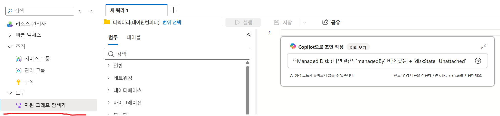
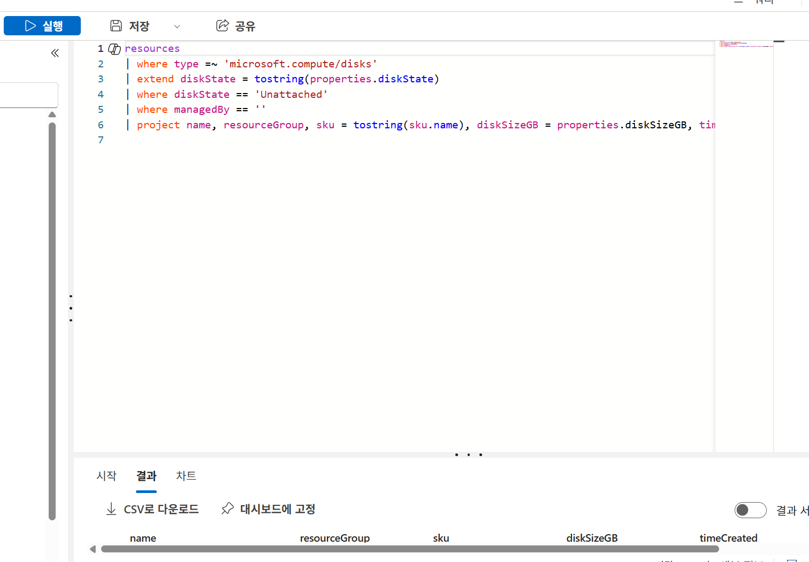

# Azure Resource Graph Explorer — 고아 리소스 탐색 가이드

Cost Analysis는 **비용 값**은 보여주지만 리소스의 **연결 상태**는 담지 않음. 따라서 고아(orphaned) 리소스의
**발굴**은 상태 기반 질의 도구인 **Azure Resource Graph(ARG) Explorer**로 수행하고, **비용 검증**은
Cost Analysis(`cost-dashboard-analyze.md` 3.8 고아 리소스 검증 / 액션 ID S8)로 분리함. 본 문서는 ARG 발굴 단계를 다룸.

## 1. 고아 리소스 탐색 리스트 (비용 영향 큰 순)

**Query** 열 값을 ARG Explorer의 Copilot 초안 작성에 붙여넣어 KQL을 생성함(2장 절차 참조). 비용 영향 큰 순으로 정렬함.

| Query | 탐색 사유 |
|---|---|
| **Stopped(미할당 아님) VM** 찾기 — `powerState`가 `PowerState/stopped`(deallocated 아님) | OS 중지만 되고 리소스는 유지 → **컴퓨팅이 계속 과금**(전체 낭비) |
| **미연결 관리 디스크** 찾기 — `managedBy` 비어있음 + `diskState=Unattached`, `diskSizeGB` 내림차순 | 미연결이어도 프로비저닝 GB당 과금(Premium SSD 특히 큼) |
| **미할당 공인 IP** 찾기 — `ipConfiguration`·`natGateway` 연결 없음 | Standard static IP는 미할당 상태에서도 시간당 과금, 다수 누적 |
| **서브넷 미연결 NAT Gateway** 찾기 — `subnets` 없음 | 시간당 + 데이터 처리 과금, 유휴 시 순손실 |
| **유휴 Application/VPN Gateway** 찾기 — 백엔드·연결 트래픽 0 | 시간당 고정비 큼(의도적 대기일 수 있어 확인 필요) |
| **백엔드 없는 Standard Load Balancer** 찾기 — `backendAddressPools` 비어있음 | 규칙당 과금, 백엔드 0이면 순손실 |
| **앱 0개 App Service Plan** 찾기 — `numberOfSites=0` | 앱이 없어도 플랜 티어별 과금 지속 |
| **고아 디스크 스냅샷** 찾기 — 생성 90일 초과 또는 원본 디스크 삭제 | 스토리지 과금 누적, 장기 방치 |
| **미사용 Public IP Prefix** 찾기 — 하위 IP 미할당 | 예약된 프리픽스 과금 |
| **미연결 NIC** 찾기 — `virtualMachine`·`privateEndpoint` 없음 | 자체 비용 0(고아 지표·정리 위생) |

> `{스냅샷보존일}` 변수(기본 **90일**)는 조직 백업 정책에 맞춰 조정함. 티어 예: `>90일` 검토 후보 · `>180일` 강한 회수 후보 · `>365일` 삭제 후보.

> **VM 낭비 추가 패턴** — (1) **장기 Deallocated(좀비) VM**(`PowerState/deallocated`): 컴퓨팅 과금은 0이나
> **연결 디스크·공인 IP가 계속 과금** → 위 디스크·IP 행과 교차 확인. (2) **유휴 실행 VM(저사용률)**: 사용률 메트릭이
> 필요해 **ARG로는 불가** → **Azure Advisor "미사용 VM 크기 조정/종료" 권장** 또는 Azure Monitor 메트릭으로 탐지함.
> 핵심: `PowerState/stopped`(과금) vs `PowerState/deallocated`(미과금)를 반드시 구분함.

## 2. ARG Explorer 사용법

1. Azure 포털 상단 검색창에 **Resource Graph Explorer** 입력 후 진입.
2. 좌상단 **Scope(범위)** 에서 조회할 **관리그룹/구독**을 지정함(미지정 시 접근 가능한 전 범위).
3. 쿼리 편집창에 Copilot 초안 작성 기능을 실행
4. 위 고아 리소스 탐색의 Query열 값을 복-붙하고 Enter
     
   
5. 생성된 초안을 수락하고 좌측의 **Run query** 실행.
      

6. 결과 그리드에서 **Download to CSV** 로 내보내 회수 워크시트·티켓 입력에 활용함.
7. 발굴 결과를 비용분석 대시보드에서 **월별 지속 과금**으로 검증한 뒤 회수 판정함.
   발굴된 후보에 대해 Cost Analysis에서   
   필터=Resource type = (해당 유형) + 그룹화 방법=None · 세분성=월별 · 차트=테이블로 **월별 지속 과금 여부** 확인.
   