# 비용 분석 레포트 — all-subscriptions

> ⚠️ **관리그룹 미확인**: 원본 PDF에 관리그룹명·스코프 ID가 표기되지 않아 자동추출 불가함 → 필터가 전부 "모두(All)"인 전체 구독 범위 export이므로 스코프 라벨 `all-subscriptions`로 대체함.  
> 모든 필터(Subscription·RegionName·Commitment discount·Service·Currency)가 "모두(All)"로 설정된 전체 범위 export임.

| 항목 | 값 |
|---|---|
| 청구기간(Charge period) | 2024-06-01 ~ 2024-07-08 (6월 전체 + 7월 1~8일 부분월) |
| 통화(Currency) | 필터 "모두(All)" — 화면에 통화기호 미표기(금액은 단위 없이 표기) |
| 생성일 | 2026-07-18 |
| PDF 출처 | `references/CostManagementConnector.pdf` |
| 리포트 원본 | FinOps toolkit "Cost Management connector report" v24.07.08 (FOCUS 기반, amortized 유효비용) |
| 관점(페이지) 수 | 16종 (PDF 총 17페이지 중 표지·소개 1페이지 제외) |
| 전체 유효비용 | 81,088.9 (81.1천) / 총 절감 1.08천 |

---

## 1. 종합분석 결과

### 총액·청구기간
- 전체 유효비용(Effective cost, amortized) **81,088.9**, 총 절감(Total savings) **1.08천** 규모임
- 청구기간 2024-06-01 ~ 2024-07-08 기준이며, 6월 합계 62,278.6 / 7월(1~8일) 18,810.3으로 분해됨
- **주의**: 7월은 8일치 부분월이므로 6월 절대액과 직접 비교 불가, 월 비교 시 일평균 정규화 필요함
- 누적 추이는 급증 스파이크 없이 단조 우상향하여 전반적 소비 패턴은 비교적 안정적임

### 집중 비용원 (구독·서비스·리소스 관점 교차)
- 세 관점이 동일 지점으로 수렴함 — 구독 축 **FTK Fabric 41,933.3**, 서비스명 축 **Microsoft Fabric 42,296.8**,
  서비스카테고리 축 **Analytics 43,720.4**가 모두 최상위로 정합함
- FTK Fabric 단일 구독이 전체의 **약 51.7%**(41,933.3÷81,088.9), Cost Management Research가 약 17.8%(14,455.4÷81,088.9)
- 상위 2개 구독 합산 **약 69.5%**로 소수 구독에 비용이 집중됨(집중 리스크)
- 서비스카테고리 후순위: Compute 17,108.2 / Databases 9,742.9 / Web 4,098.2 / Integration 2,173.7 (07 Sankey 확인값)

### 핵심 패턴
- **온디맨드 편중**: 약정 미적용 온디맨드(공백) 유효비용 79,832.0으로 전체의 **약 98%**(79,832.0÷81,088.9)를 차지함
- **약정 커버리지 낮음**: 약정 적용(Committed) 유효비용은 1,256.9에 불과, 약정 절감 비중 확대 여지가 큼
- **협상 할인 부재**: Negotiated discounts 0.00천이며 List(82.16천)=Contracted(82.16천)로 계약단계 협상 절감이 사실상 없음
- **절감률 저조**: 약정 절감 1,070.08 기준 절감률 **약 1.32%**(1,070.08÷81,088.9), 총 절감 1.08천 기준으로도 약 1.3% 수준
- **약정 절감 RI 편중**: 절감 전액(1,070.08)이 Reservation에서 발생, Savings Plan 기여는 0임
- **신규 약정 초기 단계**: 조회기간 신규 구매는 3년 B1s RI 3건·청구액 합계 27.33뿐으로 대형 비용원 대상 신규 약정 미발생

### 이상 신호
- **미사용 Savings Plan**: Azure Savings Plans for Compute 1건이 Utilization 0.0%·절감 0.00 — 매칭 사용량 없이 확약비용만
  발생하는 순수 낭비임(RI 8건은 사용률 100% 정상 소진)
- **Unassigned 고아 약정**: 그 미사용 SP가 Chargeback상 SubAccount=Unassigned로 남아 소유 조직 부재 상태로 방치 위험
- **AHB 미적용 대형 자원 leapv2**: Standard_NC24rs_v3(24 vCPU) 단일 자원이 AHB Not enabled이며 유효비용 390.6으로
  AHB 표 총액 403.2의 **약 96.9%**(390.6÷403.2) 차지 — 라이선스 절감 손실 집중
- **Trey Research Finance 7월 급증**: 7월(1~8일) 4,014.3이 합계 10,030.7의 **약 40%**(4,014.3÷10,030.7)로 부분월 대비 과다
- **6월 하순 증가 구간**: 서비스·리전 화면 공통으로 약 6월 23일부터 일 합계가 약 2천을 초과하는 신규 증가 패턴 관찰됨
- **6월 30일 음수 조정**: 리소스 화면 -1.9 음수 막대, Charge breakdown의 Adjustment -1.9와 정합(조정·크레딧 성격)
- **배분 사각지대**: 대소문자만 다른 중복 RG(ADAMHOURLYEXPORTTEST vs AdamHourlyExportTest), Global·Unassigned 미배정 행 존재

## 2. 최적화 추천

아래 추천은 비용영향·즉시성 기준으로 정렬함. 예상효과의 수치는 관점 블록에서 확인된 값만 병기하며,  
단계는 s2 정렬 검증 기준(가시화·조사=Inform / 구매·리사이징·SKU변경·티어링·협상·AHB활성화=Optimize)과 정합함.

| 우선순위 | 대상 | 조치 | 예상효과 | 단계 |
|---|---|---|---|---|
| 1 | 미사용 Savings Plan(Utilization 0.0%) | 매칭 워크로드·스코프 조사 후 스코프 변경·공유 조정, 회수 불가 시 갱신 중단 | 확약비용 낭비 중단(SP 유효비용 0.0·절감 0.00, Consumed 1.00) | Inform→Optimize |
| 2 | 온디맨드 steady-state 워크로드(전체 약 98%) | 정상성 워크로드 식별 후 RI/SP 신규 약정 구매 | 3년 예약 잠재절감 5,818.42(약정 9,770.56) / 1년 3,523.38(약정 9,695.90) | Optimize |
| 3 | leapv2(Standard_NC24rs_v3, 24 vCPU, AHB Not enabled) | Windows/SQL 라이선스 보유 확인 후 AHB 활성화 | AHB 표 유효비용의 약 96.9% 차지(leapv2 390.6÷403.2) | Inform→Optimize |
| 4 | Microsoft Fabric·Analytics 대형 지출 | 최대 지출원 대상 가격 협상(협상할인 현재 0.00천) | Microsoft Fabric 42,296.8 단일 최대 비용원, Negotiated 0.00천→절감 여력 | Optimize |
| 5 | Premium SSD P30/P20 등 고단가 SKU | 성능요건 재검토 후 스토리지 티어 다운·SKU 변경 | Prices 상위 다수 점유, List=Effective 할인 부재 SKU(금액 척도 상이, 절감액 미확정) | Optimize |
| 6 | FTK Fabric·Cost Management Research 집중 구독 | 태깅·비용배분·showback으로 오너십 확정 | 상위 2개 구독 약 69.5%(41,933.3·14,455.4÷81,088.9) 가시화 | Inform |
| 7 | Trey Research Finance 7월 급증 | 증가 서비스·리소스 드릴다운 이상탐지 | 7월 8일치가 합계의 약 40%(4,014.3÷10,030.7) 원인 규명 | Inform |
| 8 | 6월 23일경 신규 증가 구간 | 서비스·리전 교차 분해로 증가 원인 이상탐지 | 일 합계 약 2천 초과 구간 원인 식별(수치 미확정) | Inform |
| 9 | Unassigned 고아 약정·중복 RG·미태깅 자원 | SP 소유 지정, RG 명명 표준화, 필수 태그(CostCenter·env·org) 거버넌스 | 배분 사각지대 해소·chargeback 정합성 확보(수치 미확정) | Inform |

> 주석  
> - 2번 예약 구매의 잠재절감은 3년 권장에서 NCSv3(Standard_NC24rs_v3) 단건이 약 75%(4,367.83÷5,818.42) 기여함  
> - 5번의 Prices 합계(Quantity 551,133.99·Contracted 138,447.89)는 가격열 합으로 유효비용 총계(81,088.9)와 척도가 달라  
>   절감액으로 환산·혼용하지 않음  
> - 총 절감 1.08천 중 약정 절감은 1,070.08(전액 Reservation)이며 협상 할인은 0.00천으로 확인됨

---

## 3. 관점별 분석 결과

각 관점(페이지)을 표준 아젠다 6섹션으로 분석함. 이미지는 동일 폴더의 PNG를 상대참조함.

### 01. summary — 비용 요약(전체 유효비용·절감 현황)

한 줄 요약(TL;DR): 청구기간 2024-06-01 ~ 2024-07-08 전체 유효비용(amortized) 81.1천, 총 절감 1.08천을 한눈에 보여주는 대시보드 시작 화면임

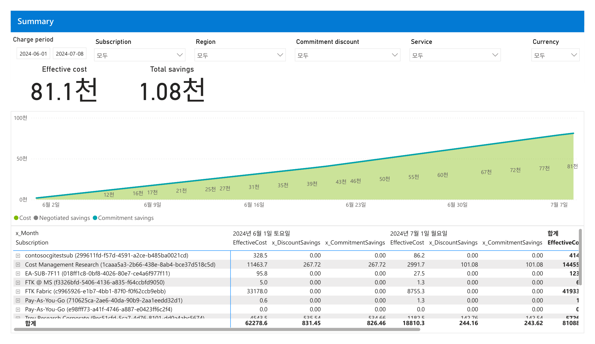

#### 1. 개요
- 리포트 전체 KPI(유효비용·총절감)와 일자별 누적 추이, 구독별 월 분해를 한 화면에 요약하는 시작 페이지임
- 데이터 범위: 청구기간 2024-06-01 ~ 2024-07-08 / 필터 6종 모두 "모두(All)" / 통화 "모두"(화면에 통화기호 미표기)

#### 2. 화면 구조·차트 읽는 법
- 상단: 필터 6종(Charge period·Subscription·Region·Commitment discount·Service·Currency)
- 좌측 중단: 핵심지표 카드 2개 — Effective cost 81.1천, Total savings 1.08천
- 중앙: 일자별 누적 추이 영역/선 차트, 세로축 0 ~ 100천
- 차트 범례: Cost(녹색)·Negotiated savings(회색)·Commitment savings(청록), 절감 계열은 화면상 미미하게 표시됨
- 하단: 표(x_Month × Subscription). 6월·7월 열마다 EffectiveCost·x_DiscountSavings·x_CommitmentSavings, 우측 합계 EffectiveCost

#### 3. 분석 요약
- Effective cost 81.1천(합계 81,088.9), Total savings 1.08천
- 월별 합계 EffectiveCost: 6월 62,278.6 / 7월(1~8일) 18,810.3
- 6월 절감: 정가대비 총 할인절감(x_DiscountSavings) 831.45, 약정 절감(x_CommitmentSavings) 826.46
- 7월 절감: 정가대비 총 할인절감(x_DiscountSavings) 244.16, 약정 절감(x_CommitmentSavings) 243.62
- 참고: Discount savings는 정가 대비 (협상+약정) 총 할인절감이며, 협상 단독 절감은 약 0천임(07 Charge breakdown의 Negotiated 0.00천과 정합)
- 구독별 합계 상위(가시 행): FTK Fabric 41,933.3, Cost Management Research 14,455.4, Trey Research Corporate 5,726.1
- 소액 구독: EA-SUB-7F11 123.3, FTK @ MS 6.3, Pay-As-You-Go 1.9 및 0.0
- 표는 스크롤되어 가시 행 합이 총계 미만 → 하단에 추가 구독 존재(총계 81,088.9)
- 누적 추이는 7월 7일 약 81천까지 단조 우상향(급증 스파이크 없음)

#### 4. 시사점
- 유효비용의 절반 이상이 FTK Fabric 단일 구독(41,933.3 ≈ 전체의 약 51.7%)에 집중 → 비용 집중 리스크
- 총 절감 1.08천은 유효비용 81.1천 대비 약 1.3% 수준으로 낮음 → 약정·협상 할인 적용 여지 큼
- 7월 열은 8일치(부분월)이므로 6월 대비 낮은 금액은 감소가 아닌 기간 차이임(월 비교 시 오독 주의)
- 누적 곡선의 단조 우상향은 이상 급증 없이 비교적 안정적인 소비 패턴을 시사

#### 5. 권고사항
- (Inform) 비용 집중 구독(FTK Fabric·Cost Management Research)에 태깅·비용배분 우선 적용, showback으로 오너십 명확화 — 우선순위 상
- (Inform) 총 절감 비중(약 1.3%) 저조 원인 진단: 약정 커버리지·미적용 리소스 식별 — 우선순위 상
- (Inform) 월 비교는 청구기간 정규화(일평균)로 환산 후 판단 — 우선순위 중
- (Inform→Optimize 이관) 식별된 후보를 약정(RI/Savings Plan) 구매·Right-sizing 검토로 이관 — 우선순위 중

#### 6. 용어·출처
- Effective cost(유효비용): 약정 구매를 상각(amortize)해 혜택 받은 리소스에 배분한 비용, 인보이스와 불일치 가능
- Total savings: 정가 대비 협상(Negotiated)+약정(Commitment) 할인 절감의 합
- 출처: FinOps toolkit "Cost Management connector report" v24.07.08(FOCUS 기반). MS Learn·FinOps Foundation URL 화면 내 판독 불가(미확인)

### 02. services — 서비스별 비용(카테고리·일자별 구성)

한 줄 요약(TL;DR): 동일 기간 유효비용 81.1천을 서비스 카테고리·서비스 단위로 분해하고, 일자별 스택 막대로 구성 변화를 보여주는 화면임

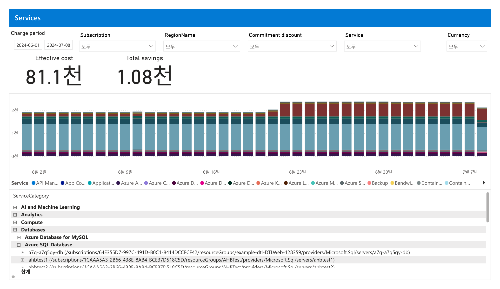

#### 1. 개요
- 유효비용을 ServiceCategory → Service → 리소스 계층으로 분해하고, 일자별 서비스 구성비를 보는 화면임
- 데이터 범위: 청구기간 2024-06-01 ~ 2024-07-08 / 필터 모두 "모두" / 통화 "모두"
- (헤더 라벨 참고) 화면 제목은 "Services", 지역 필터 항목은 RegionName으로 표기됨

#### 2. 화면 구조·차트 읽는 법
- 상단 필터 6종 + 핵심지표 2개(Effective cost 81.1천·Total savings 1.08천)
- 중앙: 일자별 누적(스택) 세로막대, 세로축 0천/1천/2천, 색상은 Service별
- 차트 범례: API Management·App Configuration·Application…·Azure 계열·Backup·Bandwidth·Container… 등 다수 서비스
- 하단: ServiceCategory 트리형 표(AI and Machine Learning·Analytics·Compute·Databases …)
- Databases 확장 시 Azure Database for MySQL·Azure SQL Database, 그 아래 서버 리소스(a7q-a7q5gy-db·ahbtest1·ahbtest2 …)

#### 3. 분석 요약
- 화면 표기 카테고리: AI and Machine Learning, Analytics, Compute, Databases(확장) 확인
- Databases > Azure SQL Database 하위 서버 리소스 3건 표기(a7q-a7q5gy-db, ahbtest1, ahbtest2)
- 일자별 스택 막대의 일 합계는 대략 1.9천 ~ 2천 수준을 유지함
- 6월 하순(약 6월 23일)부터 막대 최상단에 큰 적색 구간이 새로 나타나며 일 합계가 2천을 넘어서는 증가 패턴 관찰
- 마지막 막대(7월 7일 부근)는 낮음(부분일)
- 서비스 카테고리별 유효비용 금액은 이 화면 표에 수치로 표기되지 않음 → 미확인(판독 불가)

#### 4. 시사점
- 6월 23일경 신규 적색 서비스 구간 등장 + 일 합계 상승 → 특정 서비스의 사용량/비용 증가 신호(어느 서비스인지는 범례색만으로 미확인)
- Databases에 AHB 관련 SQL 서버(ahbtest1·ahbtest2) 존재 → Azure Hybrid Benefit 적용 여부 점검 여지
- 서비스별 금액이 화면에 수치로 노출되지 않아 정량 우선순위 판단은 표 드릴다운·raw 데이터 대조가 필요함

#### 5. 권고사항
- (Inform) 6월 23일경 증가한 적색 서비스 구간의 서비스명·리소스 식별(범례 확대·표 드릴다운)로 이상탐지 — 우선순위 상
- (Inform) ServiceCategory별 금액 컬럼을 표에 노출·정렬해 상위 원가동인(cost driver) 확정 — 우선순위 상
- (Inform→Optimize 이관) Compute·Databases 상위 서비스는 Right-sizing·SKU 변경·약정 후보로 이관 검토 — 우선순위 중
- (Inform→Optimize 이관) SQL 서버(ahbtest 계열)는 AHB 활성화 여부 확인 후 미적용 시 Optimize로 이관 — 우선순위 중

#### 6. 용어·출처
- ServiceCategory: FOCUS 표준의 서비스 분류(AI/ML·Analytics·Compute·Databases 등)
- AHB(Azure Hybrid Benefit): 보유 Windows/SQL 라이선스로 컴퓨트 비용을 절감하는 혜택
- 출처: FinOps toolkit Cost Management connector report v24.07.08(FOCUS). MS Learn·FinOps Foundation URL 미확인

### 03. subscriptions — 구독별 비용(월 분해·구성비)

한 줄 요약(TL;DR): 유효비용 81.1천을 구독(Subscription) 단위로 6월·7월로 분해하며, FTK Fabric·Cost Management Research가 비용을 주도함

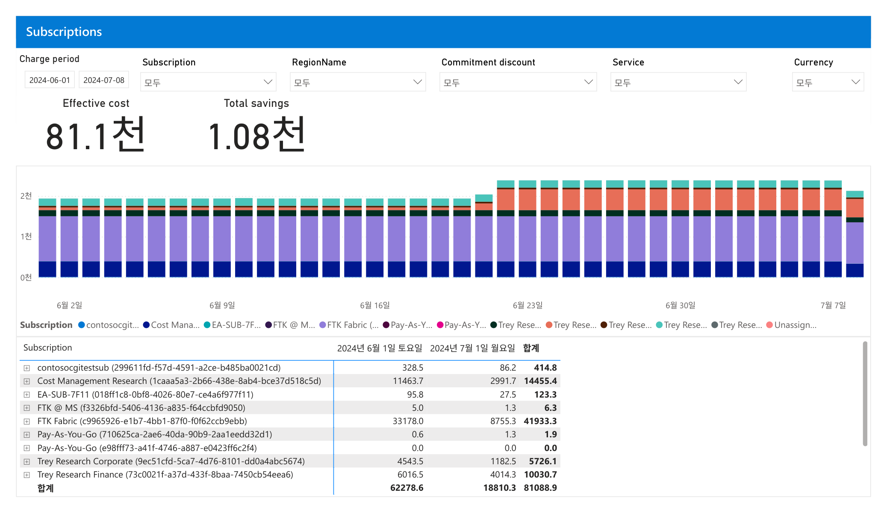

#### 1. 개요
- 유효비용을 구독별로 월(6월·7월) 분해하고, 일자별 스택 막대로 구독 구성비를 보는 화면임
- 데이터 범위: 청구기간 2024-06-01 ~ 2024-07-08 / 필터 모두 "모두" / 통화 "모두"

#### 2. 화면 구조·차트 읽는 법
- 상단 필터 6종 + 핵심지표 2개(Effective cost 81.1천·Total savings 1.08천)
- 중앙: 일자별 누적 세로막대, 색상은 Subscription별
- 차트 범례: contosocgi…·Cost Mana…·EA-SUB-7F…·FTK @ M…·FTK Fabric·Pay-As-Y…(2)·Trey Rese…(다수)·Unassign…
- 하단: 표(Subscription × 월). 열은 2024년 6월 1일 토요일 / 2024년 7월 1일 월요일 / 합계

#### 3. 분석 요약
- 구독별 (6월 / 7월(1~8일) / 합계):
  - FTK Fabric: 33,178.0 / 8,755.3 / 41,933.3
  - Cost Management Research: 11,463.7 / 2,991.7 / 14,455.4
  - Trey Research Finance: 6,016.5 / 4,014.3 / 10,030.7
  - Trey Research Corporate: 4,543.5 / 1,182.5 / 5,726.1
  - contosocgitestsub: 328.5 / 86.2 / 414.8
  - EA-SUB-7F11: 95.8 / 27.5 / 123.3
  - FTK @ MS: 5.0 / 1.3 / 6.3
  - Pay-As-You-Go(710625…): 0.6 / 1.3 / 1.9, Pay-As-You-Go(e98fff…): 0.0 / 0.0 / 0.0
- 합계: 62,278.6 / 18,810.3 / 81,088.9
- 가시 9개 구독 합(약 72,691.8)이 총계 81,088.9보다 작음 → 하단에 추가 구독 존재(범례상 Trey Research IT/R&D·Unassigned 등)

#### 4. 시사점
- FTK Fabric(41,933.3, 약 51.7%)·Cost Management Research(14,455.4, 약 17.8%) 2개 구독이 전체의 약 69.5% 차지 → 비용 집중
- 7월 열은 8일치(부분월)이므로 6월과 절대액 직접 비교 불가, 일평균 정규화 필요
- Trey Research Finance는 7월 8일치가 4,014.3으로 합계의 약 40% → 기간 대비 과다, 7월 급증 신호(정규화 시 이상)
- 다수 소액·0원 구독(FTK @ MS·Pay-As-You-Go 등) 존재 → 미사용/유휴 구독 정리 여지

#### 5. 권고사항
- (Inform) FTK Fabric·Cost Management Research 우선 태깅·비용배분·showback으로 오너십·용도 확정 — 우선순위 상
- (Inform) Trey Research Finance 7월 급증 원인 이상탐지(증가한 서비스/리소스 드릴다운) — 우선순위 상
- (Inform) 0원·소액 구독 유휴 여부 점검 후 정리(showback 통지) — 우선순위 중
- (Inform→Optimize 이관) 상위 구독의 안정적 컴퓨트 소비분은 약정(RI/SP)·Right-sizing 후보로 이관 — 우선순위 중

#### 6. 용어·출처
- Subscription(구독): Azure 청구·리소스 경계 단위, 여기서는 비용배분·showback의 기본 축
- 부분월(Partial month): 청구기간이 월 전체를 포함하지 않는 구간(여기 7월=1~8일)
- 출처: FinOps toolkit Cost Management connector report v24.07.08(FOCUS). MS Learn·FinOps Foundation URL 미확인

### 04. resource-groups — 리소스 그룹별 비용 배분

한 줄 요약(TL;DR): 리소스 그룹 단위로 비용을 묶어 보는 화면이며, 동일 이름 RG가 서로 다른 구독에 존재해
배분 경계 정리가 필요함을 시사함.

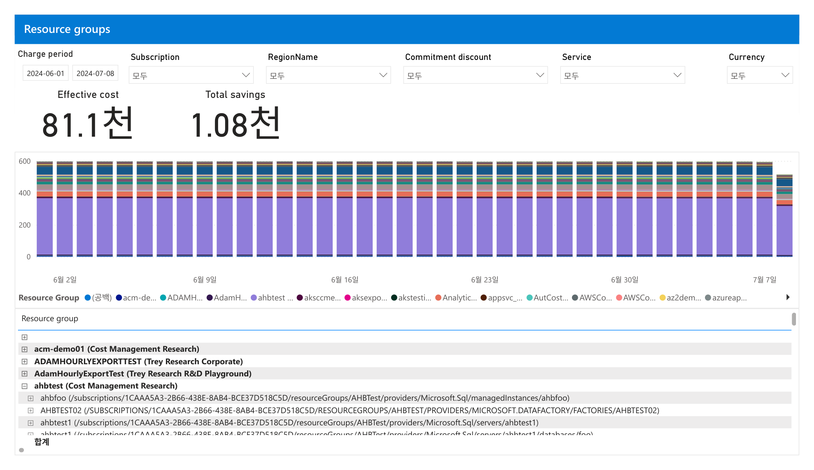

#### 1. 개요
- 목적: 비용을 리소스 그룹(RG) 단위로 집계해 조직·프로젝트 배분(showback)의 1차 경계를 확인하는 화면임
- 데이터 범위: 청구기간 2024-06-01 ~ 2024-07-08 / 필터는 Subscription·RegionName·Commitment discount·Service·
  Currency 모두 "모두(All)" / 통화기호 미표기(판독 불가)

#### 2. 화면 구조·차트 읽는 법
- 상단: Charge period·5개 드롭다운 필터 / 핵심지표 Effective cost·Total savings
- 중앙: 일별 누적 막대 차트(X축 6월2일 ~ 7월7일, Y축 0 ~ 600). 색상은 RG별 구분이며 하단 범례와 매칭함
- 범례: Resource Group — (공백)·acm-de…·ADAMH…·AdamH…·ahbtest…·aksccme… 등 다수 RG가 색으로 나열됨
- 하단 표: `RG명 (구독명)` 형식의 드릴다운 트리. `+` 확장 시 RG → 개별 리소스(전체 리소스 ID 경로)로 전개됨

#### 3. 분석 요약
- Effective cost 81.1천(=81,088.9), Total savings 1.08천 (전체 지표, 다른 페이지와 동일)
- 표 최상위 RG: acm-demo01(Cost Management Research), ADAMHOURLYEXPORTTEST(Trey Research Corporate),
  AdamHourlyExportTest(Trey Research R&D Playground), ahbtest(Cost Management Research) 순으로 표시됨
- ahbtest(Cost Management Research) 확장 시 하위에 ahbfoo(Sql/managedInstances)·AHBTEST02(DataFactory/factories)·
  ahbtest1(Sql/servers)·ahbtest1(databases/foo) 등 개별 리소스가 전개됨
- 각 RG는 라벨에 소속 구독명이 병기됨(예: `acm-demo01 (Cost Management Research)`)
- 개별 RG의 금액 수치는 화면 표에 컬럼으로 표시되지 않음 → 판독 불가(창작 금지)
- 차트에서 보라색 계열 1개 색상이 일별 막대 하단의 큰 비중을 차지하나, 어느 RG인지 라벨 매칭은 판독 불가

#### 4. 시사점
- 대소문자만 다른 동일 명칭 RG가 서로 다른 구독에 존재함(ADAMHOURLYEXPORTTEST vs AdamHourlyExportTest)
  → 명명 규칙 불일치로 배분·집계 시 혼동·중복 위험이 있음
- RG 라벨에 구독명이 병기되어 있어 구독-RG 계층이 배분의 기본 골격임을 확인 가능함
- 화면 표에 RG별 금액 컬럼이 없어 상위 비용 RG 식별이 즉시 불가함 → 배분 정밀도 한계로 작용함
- 차트에 특정 색상이 지속적으로 큰 비중을 차지 → 소수 RG가 비용을 견인하는 집중 패턴 가능성(수치 미확인)

#### 5. 권고사항
- (Inform) RG 명명 규칙 표준화: 대소문자·구독 간 중복 명칭을 감사하고 태깅 규칙으로 소유 조직을 명시함 [우선순위 상]
- (Inform) RG별 금액 표시 보강: 표에 EffectiveCost 컬럼을 추가하거나 정렬을 적용해 상위 비용 RG를 가시화함 [상]
- (Inform) 상위 비용 RG 후보를 식별해 showback 배분 초안을 작성함 [중]
- (Optimize 이관) 상위 비용 RG의 리소스 구성 확인 후 Right-sizing·약정·티어링 검토 대상으로 이관함 [중]

#### 6. 용어·출처
- 리소스 그룹(Resource group): Azure 리소스를 배포·관리하는 논리적 컨테이너
  (참조: <https://learn.microsoft.com/azure/azure-resource-manager/management/manage-resource-groups-portal>)
- Effective(amortized) cost: 약정 구매를 수혜 리소스에 배분한 유효비용, 청구서 금액과 불일치
  (참조: FinOps toolkit Cost Management connector report, <https://learn.microsoft.com/cloud-computing/finops/toolkit/>)
- Showback: 비용을 소비 조직에 배분해 보여주는 FinOps 실무(청구 없이 가시화)

---

### 05. resources — 리소스별 비용·태그 기반 배분

한 줄 요약(TL;DR): 개별 리소스 단위 비용을 태그(CostCenter 등)와 함께 보는 화면이며, 리소스명이 해시형이라
사람이 읽는 배분은 태그 의존도가 높음을 보여줌.

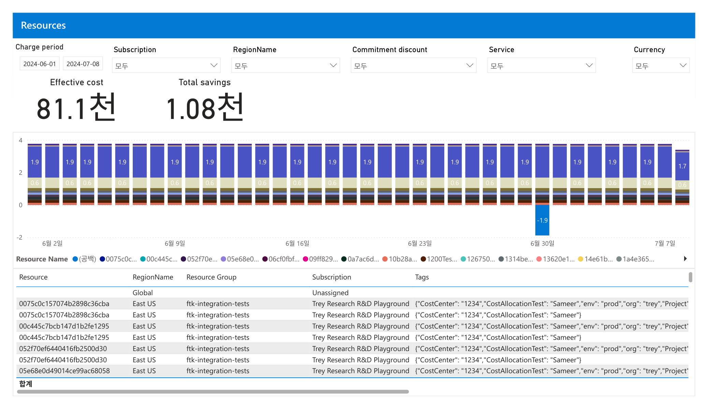

#### 1. 개요
- 목적: 최말단 개별 리소스 단위로 비용을 확인하고, 태그(JSON) 기반 비용배분 가능성을 점검하는 화면임
- 데이터 범위: 청구기간 2024-06-01 ~ 2024-07-08 / 필터 모두 "모두(All)" / 통화기호 미표기(판독 불가)

#### 2. 화면 구조·차트 읽는 법
- 상단: 동일한 필터 6종 / 핵심지표 Effective cost·Total savings
- 중앙: 일별 누적 막대 차트(Y축 -2 ~ 4). 막대 상단 파랑 조각에 1.9, 그 아래 베이지 조각에 0.6 라벨이 반복 표시됨
- 하단 표: 컬럼 = Resource(해시형 이름)·RegionName·Resource Group·Subscription·Tags(JSON 문자열)
- Tags 컬럼은 `{"CostCenter":"1234","CostAllocationTest":"Sameer","env":"prod","org":"trey","Project"…}` 형식임

#### 3. 분석 요약
- Effective cost 81.1천, Total savings 1.08천 (전체 지표)
- 첫 행은 RegionName=Global, Subscription=Unassigned, RG·태그 공란으로 표시됨(미배정 항목 존재)
- 표의 리소스는 East US / ftk-integration-tests / Trey Research R&D Playground 조합이 반복 표시됨
- 동일 리소스 ID가 두 행으로 나뉘어 표시됨: 한 행은 태그 전체, 다른 행은 `{"CostCenter":"1234",
  "CostAllocationTest":"Sameer"}`만 보유(태그 세트 차이로 행 분리)
- 리소스명은 사람이 식별 불가한 해시형 문자열임(예: 0075c0c157074b2898c36cba)
- 차트 일별 값은 대부분 1.9 + 0.6 조합이며, 7월7일은 1.7 + 0.6, 6월30일에 -1.9의 음수 막대가 관찰됨
- 개별 리소스의 금액 수치는 표에 금액 컬럼으로 표시되지 않음 → 리소스별 금액은 미확인

#### 4. 시사점
- 리소스명이 해시형이라 이름만으로 배분 불가 → CostCenter·org·env 등 태그가 사실상 유일한 배분 키임
- 태그 세트가 리소스마다 달라(전체 태그 vs CostCenter만) 태그 커버리지·일관성이 불완전함 → 배분 누락 위험
- Global·Unassigned 행 존재 → 리전·구독 미배정 비용이 있어 배분 사각지대가 존재함
- 6월30일 -1.9 음수 막대는 조정(Adjustment)·크레딧·환불 성격으로 해석됨(page 8 Charge breakdown의 Adjustment -1.9와 정합)

#### 5. 권고사항
- (Inform) 태그 거버넌스 강화: CostCenter·env·org를 필수 태그로 지정하고 미태깅 리소스를 주기 리포트함 [우선순위 상]
- (Inform) Azure Policy로 필수 태그 미부여 리소스 생성 차단·자동 상속 규칙을 검토함(적용은 거버넌스 팀) [상]
- (Inform) CostCenter 기준 태그 배분 집계를 시범 작성해 showback 배분표 초안을 만듦 [중]
- (Inform) 6월30일 음수(조정) 항목의 원인을 Charge breakdown·Raw data와 대조해 이상탐지 관점으로 기록함 [중]

#### 6. 용어·출처
- 태그(Tags): 리소스에 부여하는 key-value 메타데이터, 비용배분·거버넌스의 핵심 키
  (참조: <https://learn.microsoft.com/azure/cost-management-billing/costs/enable-tag-inheritance>)
- CostCenter: 조직 회계 단위. 본 데이터에서는 태그 값으로 배분 기준에 사용 가능함
- Adjustment: 청구 조정(크레딧·환불·정정) 항목, 음수로 표기될 수 있음

---

### 06. regions — 지역(리전)별 비용 분포

한 줄 요약(TL;DR): 리전별 비용 분포를 보는 화면이며, 표시된 리전 중 East US가 최대이나 지도(Azure Maps)는
테넌트 설정 제약으로 렌더링되지 않음.

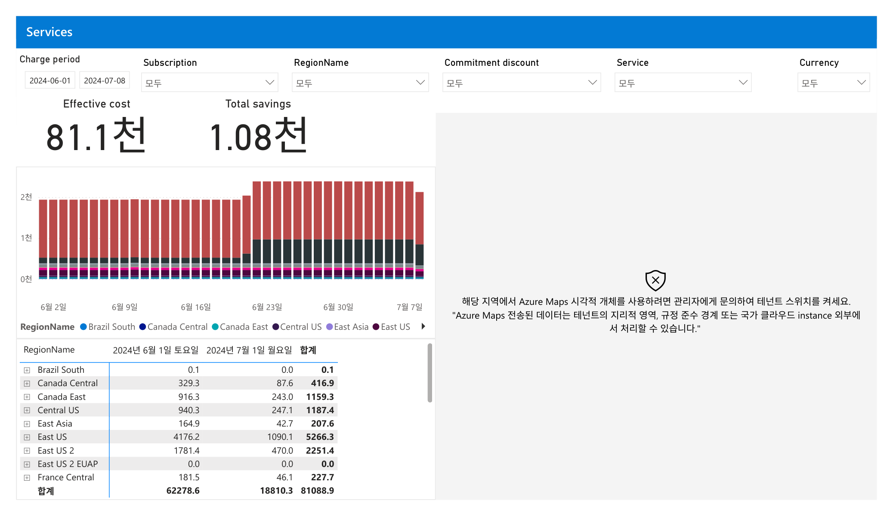

#### 1. 개요
- 목적: 비용을 Azure 리전(RegionName) 단위로 분해해 지리적 분포·집중을 확인하는 화면임
- 라벨 특이사항: 화면 헤더는 "Services"로 표기되나 실제 데이터 축은 RegionName이며 Azure Maps 개체가 배치됨 →
  기능상 "Regions(지역별)" 관점으로 처리함
- 데이터 범위: 청구기간 2024-06-01 ~ 2024-07-08 / 필터 모두 "모두(All)" / 통화기호 미표기(판독 불가)

#### 2. 화면 구조·차트 읽는 법
- 상단: 필터 6종 / 핵심지표 Effective cost·Total savings
- 좌측 중앙: 일별 누적 막대 차트(Y축 0천 ~ 2천), 색상은 리전별. 우측: Azure Maps 지도 영역
- 우측 지도는 렌더링되지 않고 안내 문구 표시: "Azure Maps 시각적 개체를 사용하려면 관리자에게 문의하여
  테넌트 스위치를 켜세요" → 지도 미표시(테넌트 권한 제약)
- 하단 표: RegionName / 2024년 6월 / 2024년 7월 / 합계 3개 금액 컬럼(월별 소계 + 합계)

#### 3. 분석 요약
- Effective cost 81.1천, Total savings 1.08천 (전체 지표). 표 합계행: 6월 62,278.6 / 7월 18,810.3 / 총 81,088.9
- 표시된 리전별 합계(상단 알파벳순 9개): East US 5,266.3 / East US 2 2,251.4 / Central US 1,187.4 /
  Canada East 1,159.3 / Canada Central 416.9 / France Central 227.7 / East Asia 207.6 / Brazil South 0.1 /
  East US 2 EUAP 0.0
- 표시 9개 리전 합계는 약 10,716.7로 총액 81,088.9의 일부에 불과함 → 나머지 리전은 스크롤로 가려져 미표시(미확인)
- 막대 차트는 6월 후반(약 6월23일 이후) 일별 막대 높이가 증가하는 패턴이 관찰됨

#### 4. 시사점
- 표시 리전 중 East US 계열(East US + East US 2 = 7,517.7)이 최대 비중 → 동부 미국 리전 집중 경향(표시분 한정)
- 표시 9개 합계가 총액의 일부에 그침 → 대형 비용 리전이 스크롤 하단에 존재할 가능성(FTK Fabric 등 대형 구독의
  리전 미확인) → 리전 관점 결론은 전체 리전 확인 후 확정 필요
- Azure Maps 미표시로 지리적 히트맵 해석 불가 → 표 기반 분석으로 대체해야 함(가시화 도구 제약)
- 6월 후반 비용 증가 패턴은 사용량 증가·신규 배포 가능성 → 이상탐지·추세 확인 대상임

#### 5. 권고사항
- (Inform) 표 정렬·전체 리전 펼침으로 상위 비용 리전을 완전 식별함(현재 화면은 상위 알파벳 9개만 표시) [우선순위 상]
- (Inform) Azure Maps 테넌트 스위치 활성화를 관리자에게 요청해 지리적 히트맵 가시화를 복구함(권한 필요) [중]
- (Inform) 6월 후반 증가 구간을 서비스·리전 교차로 분해해 증가 원인을 이상탐지 관점으로 기록함 [중]
- (Optimize 이관) 리전 집중·데이터 전송 비용 확인 후 리전 통합·이전 타당성을 별도 검토로 이관함 [하]

#### 6. 용어·출처
- RegionName(리전): 리소스가 배포된 Azure 데이터센터 지리 단위, 데이터 전송·규정 준수에 영향
  (참조: <https://learn.microsoft.com/azure/reliability/availability-zones-overview>)
- Azure Maps 시각적 개체: Power BI 지도 시각화 기능, 테넌트 관리자 스위치 활성화 필요
  (참조: <https://learn.microsoft.com/power-bi/visuals/power-bi-visualization-azure-maps>)
- Effective cost / Total savings: page 1(FOCUS 기반 amortized) 정의를 따름

### 07. Charge breakdown — 비용 발생 구조 계층 분해

한 줄 요약(TL;DR): 유효비용 81,088.9가 어떤 청구유형·가격유형·서비스로 흘러가는지 흐름(Sankey)으로 분해한 화면임.

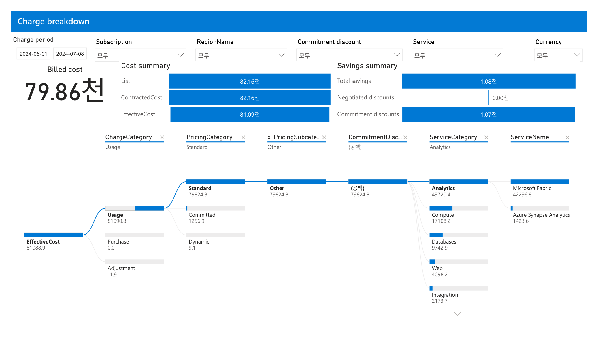

#### 1. 개요
- ChargeCategory→PricingCategory→서브카테고리→CommitmentDiscount→ServiceCategory→ServiceName 순으로 비용을 계층 분해하는 화면임
- 데이터 범위: 청구기간 2024-06-01 ~ 2024-07-08 / 필터 전부 "모두(All)" / 통화 "모두"(단위 미표기, 판독 불가)

#### 2. 화면 구조·차트 읽는 법
- 상단 좌: 단일지표 Billed cost. 중앙: Cost summary(List·ContractedCost·EffectiveCost). 우: Savings summary
- 중단: 현재 드릴 경로를 보여주는 6개 필터 칩(ChargeCategory=Usage, PricingCategory=Standard 등)
- 하단: Sankey 흐름도 — 왼쪽 노드에서 오른쪽 노드로 폭(비용 크기)에 비례해 분기됨. 파란 막대=상대 크기

#### 3. 분석 요약
- Billed cost 79.86천, EffectiveCost 81,088.9(=81.09천)로 유효비용이 청구비용보다 큼(상각 배분 결과)
- Cost summary: List 82.16천 / ContractedCost 82.16천 / EffectiveCost 81.09천
- Savings summary: Total savings 1.08천 / Negotiated discounts 0.00천 / Commitment discounts 1.07천
- Sankey: EffectiveCost 81,088.9 → Usage 81,090.8, Purchase 0.0, Adjustment -1.9
- Usage 81,090.8 → Standard 79,824.8, Committed 1,256.9, Dynamic 9.1
- Standard 79,824.8 → Other 79,824.8 → (공백) 79,824.8 로 동일 규모가 전달됨
- ServiceCategory 상위: Analytics 43,720.4, Compute 17,108.2, Databases 9,742.9, Web 4,098.2, Integration 2,173.7(이하 스크롤)
- ServiceName: Microsoft Fabric 42,296.8, Azure Synapse Analytics 1,423.6

#### 4. 시사점
- 절감액 1.08천 중 대부분이 약정(Commitment) 할인 1.07천이며 협상(Negotiated) 할인은 0.00천으로 협상여력 미활용 가능성
- 비용의 압도적 다수가 Standard(정가) 사용분 79,824.8이며 약정적용(Committed) 1,256.9는 소액 → 약정 커버리지 낮음
- ServiceCategory에서 Analytics 43,720.4가 최대이고 그 안에서 Microsoft Fabric 42,296.8이 단일 최대 비용원임(집중 리스크)
- List·Contracted가 82.16천으로 동일 → 계약(협상) 단계 할인이 사실상 없어 List 대비 절감은 약정에서만 발생함

#### 5. 권고사항
- (Inform) ChargeCategory·ServiceCategory·ServiceName 계층으로 비용배분·showback 정례화, Microsoft Fabric 단일 집중 비용을 상시 모니터링 대상으로 지정
- (Inform) Standard 대비 Committed 비중(약정 커버리지) 지표를 대시보드 KPI로 추가하여 최적화 후보 식별
- (Optimize 이관) 약정 커버리지가 낮은 Standard 사용분(Compute·Databases 등)에 대해 RI/Savings Plan 구매 검토
- (Optimize 이관) Negotiated 할인 0.00천 → 대형 지출(Analytics/Fabric) 대상 가격 협상 여지 검토

#### 6. 용어·출처
- Billed cost: 청구서에 표기되는 청구비용. Effective(amortized) cost: 약정 구매액을 수혜 자원에 상각 배분한 유효비용
- ChargeCategory(Usage/Purchase/Adjustment)·PricingCategory(Standard/Committed/Dynamic): FOCUS 표준 분류 차원
- Discount savings = 정가 대비 절감, Commitment savings = 온디맨드 대비 약정 절감(PAGE 1 리포트 설명 근거)
- 1차 출처: FinOps FOCUS 스펙 <https://focus.finops.org/> / MS Cost Management connector report(FinOps toolkit)

### 08. Azure Hybrid Benefit for Windows Server — AHB 라이선스 적용 현황

한 줄 요약(TL;DR): Windows/SQL 하이브리드 혜택(AHB) 적용·미적용 자원을 vCPU·유효비용 기준으로 점검하는 화면임.

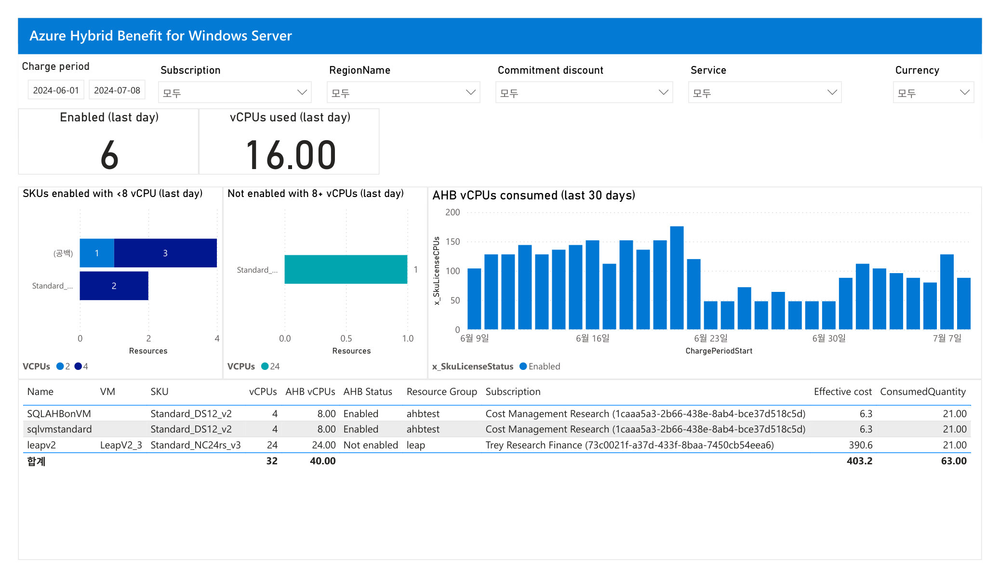

#### 1. 개요
- AHB(Azure Hybrid Benefit) 활성화 상태·vCPU·유효비용을 자원별로 보여 라이선스 최적화 대상을 식별하는 화면임
- 데이터 범위: 청구기간 2024-06-01 ~ 2024-07-08 / 필터 전부 "모두" / 통화 "모두"(단위 미표기)

#### 2. 화면 구조·차트 읽는 법
- 상단: 단일지표 카드 — Enabled(last day), vCPUs used(last day)
- 중단 좌 2개: 막대차트 "SKUs enabled with <8 vCPU", "Not enabled with 8+ vCPUs"(색=VCPUs 값, x축=Resources 수)
- 중단 우: "AHB vCPUs consumed(last 30 days)" 일자별 세로 막대(y축 x_SkuLicenseCPUs, 상태=Enabled)
- 하단: 자원 상세 표(Name·SKU·vCPUs·AHB vCPUs·AHB Status·RG·Subscription·Effective cost·ConsumedQuantity)

#### 3. 분석 요약
- 단일지표: Enabled(last day) 6, vCPUs used(last day) 16.00
- "Not enabled with 8+ vCPUs(last day)" 차트: 해당 자원 1건, VCPUs 24
- 표 3행(모두 ConsumedQuantity 21.00):
  - SQLAHBonVM / Standard_DS12_v2 / vCPU 4 / AHB 8.00 / Enabled / RG ahbtest / Cost Management Research / Eff 6.3
  - sqlvmstandard / Standard_DS12_v2 / vCPU 4 / AHB 8.00 / Enabled / RG ahbtest / Cost Management Research / Eff 6.3
  - leapv2 / Standard_NC24rs_v3 / vCPU 24 / AHB 24.00 / Not enabled / RG leap / Trey Research Finance / Eff 390.6
- 합계: vCPUs 32 / AHB vCPUs 40.00 / Effective cost 403.2 / ConsumedQuantity 63.00

#### 4. 시사점
- 총 유효비용 403.2 중 leapv2 단일 자원이 390.6(약 96.9%)으로 사실상 비용 전부를 차지함
- 그 leapv2가 유일하게 AHB "Not enabled"이고 vCPU 24로 최대 규모 → 라이선스 혜택 미적용 손실이 집중됨
- AHB 적용된 2개 SKU(각 6.3)는 비용 영향이 미미 → 최적화 여력은 미적용 대형 자원에 집중됨

#### 5. 권고사항
- (Inform→Optimize 이관) leapv2(Standard_NC24rs_v3, 24 vCPU, Not enabled)에 대해 AHB 활성화 가능 여부(Windows/SQL 라이선스 보유) 우선 확인 → 최우선 조치
- (Inform) AHB Status별 자원 목록·미적용 vCPU를 정기 리포트로 가시화하여 신규 미적용 자원 조기 탐지
- (Inform) "Not enabled with 8+ vCPUs" 지표를 라이선스 최적화 후보 트래킹 KPI로 채택

#### 6. 용어·출처
- AHB(Azure Hybrid Benefit): 보유 Windows Server/SQL Server 라이선스를 Azure에 적용해 라이선스 비용을 절감하는 혜택
- AHB vCPUs: 혜택이 적용/적용가능한 vCPU 수. AHB Status: Enabled(적용)/Not enabled(미적용)
- 1차 출처: Azure Hybrid Benefit(MS Learn) <https://learn.microsoft.com/azure/azure-hybrid-benefit/>

### 09. Prices — SKU별 단가·계약가·유효가 상세

한 줄 요약(TL;DR): SKU(미터)별 List·Contracted·Effective 값과 소비수량을 나열해 고단가 항목을 식별하는 화면임.

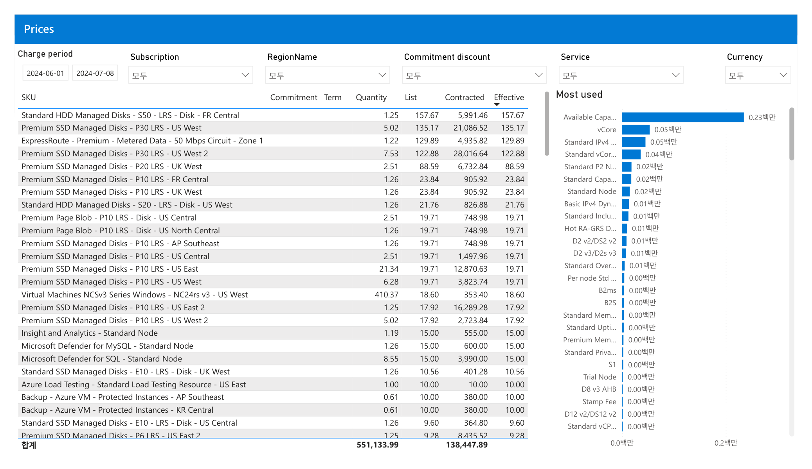

#### 1. 개요
- 개별 SKU의 List(정가)·Contracted(계약)·Effective(유효) 가격과 Quantity를 표로 보여 가격 구조를 점검하는 화면임
- 데이터 범위: 청구기간 2024-06-01 ~ 2024-07-08 / 필터 전부 "모두" / 통화 "모두"(단위 미표기)

#### 2. 화면 구조·차트 읽는 법
- 좌측: 표(SKU·Commitment·Term·Quantity·List·Contracted·Effective), Effective 열 기준 내림차순 정렬(헤더 정렬 표식)
- 우측: "Most used" 가로 막대 랭킹(단위 백만) — 사용 빈도 상위 SKU
- 하단: 합계(합계) 행 — 표 전체 총계

#### 3. 분석 요약
- 상위 행(Effective 내림차순): Standard HDD S50 LRS FR Central(Q 1.25, List 157.67, Contracted 5,991.46, Effective 157.67)
  - Premium SSD P30 LRS US West(Q 5.02, List 135.17, Contracted 21,086.52, Effective 135.17)
  - ExpressRoute Premium 50 Mbps Zone 1(Q 1.22, List 129.89, Contracted 4,935.82, Effective 129.89)
  - Premium SSD P30 LRS US West 2(Q 7.53, List 122.88, Contracted 28,016.64, Effective 122.88)
- 다수 행에서 List 값과 Effective 값이 동일(예 157.67=157.67, 19.71=19.71) → 해당 SKU 단가에는 할인 미반영
- 합계 행 수치: 551,133.99, 138,447.89 (2개 표기)
- 판독 주의: 정렬 위치상 551,133.99=Quantity 열, 138,447.89=Contracted 열 총계이며, PAGE 13(Savings)의 총 소비수량 551,133.99와 일치함
- "Most used" 상위: Available Capa… 0.23백만, vCore 0.05백만, Standard IPv4 0.05백만, Standard vCor… 0.04백만

#### 4. 시사점
- List=Effective 동일 행이 다수 → 이 SKU들은 약정·협상 할인 미적용 상태이므로 최적화 여지 존재
- Contracted 열 총계 138,447.89는 전체 유효비용 총계(81.1천)와 다른 척도(가격/확장 기준)로 보이므로 단순 합산 해석은 유의
- Premium SSD Managed Disks 계열(P30/P20/P10)이 표 상위를 다수 점유 → 스토리지 티어·디스크 단가가 비용 구조의 핵심 축

#### 5. 권고사항
- (Inform) Effective 상위 고단가 SKU(Premium SSD P30, ExpressRoute Premium 등) 목록을 최적화 후보 리스트로 상시 관리
- (Inform) List=Effective(할인 0) SKU를 별도 태그로 표시해 할인 미적용 지출 규모를 가시화
- (Optimize 이관) Premium SSD P30/P20 디스크는 워크로드 성능요건 재검토 후 스토리지 티어 다운·SKU 변경 검토
- (Optimize 이관) 고단가·고빈도 컴퓨트 SKU는 약정(RI/SP) 대상 후보로 이관하여 List 대비 절감 확보

#### 6. 용어·출처
- List price(정가) ≥ Contracted price(계약가) ≥ Effective price(유효가) 순으로 할인 반영. 본 화면 다수 행은 List=Effective로 할인 부재
- Quantity: 해당 SKU 소비수량. "Most used": 사용량 상위 SKU 랭킹(단위 백만)
- 판독 caveat: 합계 열 라벨(브리핑 힌트=List/Effective)과 화면 정렬(=Quantity/Contracted)이 상이 → S2 정합검증에서 확정 필요
- 1차 출처: FinOps FOCUS 가격 열 정의 <https://focus.finops.org/> / MS Cost Management(FinOps toolkit) Prices 페이지

### 10. purchases — 약정(RI) 구매 내역

한 줄 요약(TL;DR): 조회기간 중 신규 약정 구매는 3년 예약(RI) 3건뿐이며 청구액 합계는 27.33에 불과함.

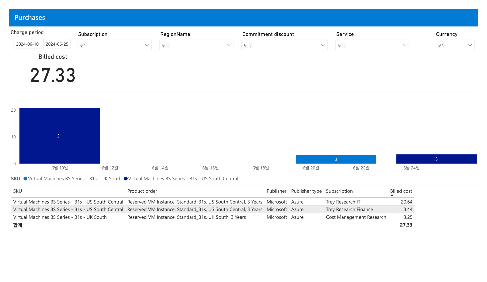

#### 1. 개요
- 조회기간 중 발생한 약정(Reservation/Savings Plan) **구매 거래**를 SKU·구독별로 보는 화면임
- 데이터 범위: 청구기간 2024-06-10 ~ 2024-06-25(다른 페이지의 2024-06-01 ~ 2024-07-08과 다름, 구매 발생일만 표시),
  필터 Subscription·RegionName·Commitment discount·Service·Currency 전부 "모두(All)", 통화기호 미표기(판독 불가)

#### 2. 화면 구조·차트 읽는 법
- 상단 KPI: Billed cost(청구비용) 27.33 — 유효비용(amortized)이 아닌 **구매 시점 청구액**임
- 중앙 세로막대: X축=구매일자(6월10일 ~ 6월24일), Y축=Billed cost, 색=SKU(파랑 UK South / 진파랑 US South Central)
- 하단 표: SKU·Product order·Publisher·Publisher type·Subscription·Billed cost 컬럼

#### 3. 분석 요약
- 구매 3건 모두 `Reserved VM Instance, Standard_B1s ... 3 Years`(3년 약정 RI), Publisher=Microsoft/Azure임
- Trey Research IT: B1s US South Central 20.64 / Trey Research Finance: B1s US South Central 3.44
- Cost Management Research: B1s UK South 3.25 / 합계 Billed cost 27.33
- 막대: 6월10일경 21, 6월20일경 3(UK South), 6월24일경 3(US South Central)으로 분산 구매됨

#### 4. 시사점
- 신규 약정 구매 규모(27.33)가 전체 유효비용(81.1천) 대비 극히 작음 — 아직 약정 커버리지 확대 초기 단계로 해석됨
- 구매 대상이 최소형 B1s VM에 한정됨 — 대형 비용원(Compute·AKS)에 대한 신규 약정은 이 기간 미발생
- 3년(3 Years) 약정만 존재 — 장기 확약 리스크는 낮은 규모지만 유연성(1년) 옵션 부재

#### 5. 권고사항
- (Inform) 이 구매 표를 12.savings·11.commitments와 대사하여 "신규 구매분이 실제 사용률·절감으로 이어졌는지" 추적 체계 수립
- (Inform→Optimize 이관) 14·15 reservation-recommendations의 후보(잠재절감 3년 5.82천/1년 3.52천)와 본 구매 이력을 비교,
  추가 약정 구매 우선순위 산정 — 구매 실행 자체는 Optimize 단계 과제
- 우선순위: 중(신규 구매 규모가 작아 즉시 리스크는 낮으나 커버리지 확대 기회 큼)

#### 6. 용어·출처
- Billed cost: 청구서에 실제 청구되는 금액(유효/amortized 비용과 구분됨)
- Reserved VM Instance(RI): VM을 1년/3년 선확약해 요금을 할인받는 약정 구매
- 출처: MS Learn — <https://learn.microsoft.com/azure/cost-management-billing/reservations/save-compute-costs-reservations>

---

### 11. commitments — 약정 할인 사용률(Utilization)

한 줄 요약(TL;DR): 기존 예약(RI) 8건은 사용률 100%로 완전 소진되나, Savings Plan 1건은 0.0%로 전혀 사용되지 않음.

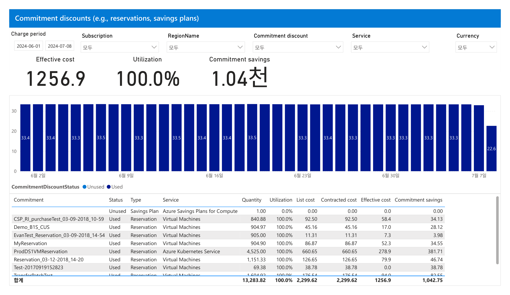

#### 1. 개요
- 보유한 약정 할인(Reservation·Savings Plan)의 **사용률(Utilization)·사용/미사용 상태**를 약정 단위로 보는 화면임
- 데이터 범위: 청구기간 2024-06-01 ~ 2024-07-08, 필터 전부 "모두(All)", 통화기호 미표기(판독 불가)

#### 2. 화면 구조·차트 읽는 법
- 상단 KPI 3종: Effective cost 1256.9 / Utilization 100.0% / Commitment savings 1.04천
- 중앙 세로막대: X축=일자(6/2 ~ 7/7), 색=CommitmentDiscountStatus(파랑 Unused / 진파랑 Used), 대부분 33.x, 말일 22.6
- 하단 표: Commitment·Status·Type·Service·Quantity·Utilization·List cost·Contracted cost·Effective cost·Commitment savings

#### 3. 분석 요약
- 전체 합계: Quantity 13,283.82 / Utilization 100.0% / List 2,299.62 / Contracted 2,299.62 / Effective 1256.9 / 절감 1,042.75
- Reservation 8건 모두 Status=Used, Utilization=100.0%(VM 7건 + AKS 1건)
- Savings Plan 1건(Azure Savings Plans for Compute)만 Status=Unused, Utilization=0.0%, 절감 0.00
- 최대 절감 건: ProdDS1VMReservation(AKS) Effective 278.9·절감 381.71 / TransferPatchTest 절감 82.55
- 특이: Test-20170919152823은 Effective 0.0인데 절감 38.78(List 38.78 전액 절감으로 표시됨)

#### 4. 시사점
- 예약(RI) 사용률 100%는 낭비 없는 이상적 상태 — 기존 RI 포트폴리오는 정상 소진 중으로 해석됨
- 그러나 Savings Plan 0.0%는 **구매했으나 매칭 사용량이 없는 순수 낭비** — 절감 0, 확약비용만 발생하는 리스크
- 시계열 말일(22.6) 하락은 조회 마지막 날 부분 집계(기간 절단) 가능성 — 추세 판단 시 주의 필요

#### 5. 권고사항
- (Inform) 미사용 Savings Plan(0.0%)의 스코프·매칭 대상 워크로드를 즉시 조사 — 왜 매칭 사용량이 0인지 원인 규명
- (Inform→Optimize 이관) 원인이 워크로드 부재면 SP 스코프 변경/공유 범위 조정, 회수 불가 시 향후 갱신 중단 검토
- 우선순위: 상(미사용 약정은 즉시 손실이므로 최우선 점검 대상)

#### 6. 용어·출처
- Utilization(사용률): 확약한 약정 용량 대비 실제 매칭 사용된 비율(100%=완전 소진, 0%=전혀 미사용)
- Savings Plan(SP): 시간당 일정 금액을 확약해 컴퓨트 요금을 할인받는 약정(RI보다 SKU 유연성 높음)
- 출처: MS Learn — <https://learn.microsoft.com/azure/cost-management-billing/reservations/reservation-utilization>

---

### 12. savings — 약정 유형별 절감(Reservation vs Savings Plan)

한 줄 요약(TL;DR): 약정 절감 1,070.08은 전액 Reservation에서 발생하고 Savings Plan 기여는 0임.

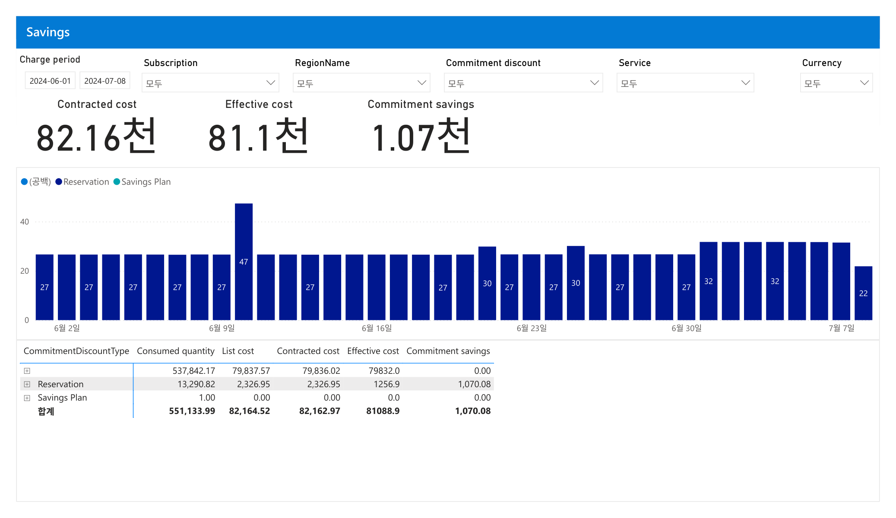

#### 1. 개요
- 약정 유형(CommitmentDiscountType)별로 List·Contracted·Effective 비용과 **약정 절감(Commitment savings)**을 비교하는 화면임
- 데이터 범위: 청구기간 2024-06-01 ~ 2024-07-08, 필터 전부 "모두(All)", 통화기호 미표기(판독 불가)

#### 2. 화면 구조·차트 읽는 법
- 상단 KPI 3종: Contracted cost 82.16천 / Effective cost 81.1천 / Commitment savings 1.07천
- 중앙 세로막대: X축=일자(6/2 ~ 7/7), 색=유형(공백/Reservation/Savings Plan), 값 대부분 27, 6/9 47로 급등, 말일 22
- 하단 표: CommitmentDiscountType·Consumed quantity·List cost·Contracted cost·Effective cost·Commitment savings

#### 3. 분석 요약
- 합계: Consumed 551,133.99 / List 82,164.52 / Contracted 82,162.97 / Effective 81088.9 / Commitment savings 1,070.08
- (공백=약정 미적용 온디맨드): Consumed 537,842.17 / Effective 79832.0 / 절감 0.00
- Reservation: Consumed 13,290.82 / List 2,326.95 / Contracted 2,326.95 / Effective 1256.9 / 절감 1,070.08
- Savings Plan: Consumed 1.00 / List 0.00 / Effective 0.0 / 절감 0.00
- 6월9일 막대 47로 단발 급등(단발성 비용 이벤트 추정, 원인 미확인)

#### 4. 시사점
- 절감 전액(1,070.08)이 Reservation에서만 발생 — 현 절감 효과는 RI에 100% 의존함
- Savings Plan은 절감 기여 0(11.commitments의 미사용 0.0%와 정합) — SP 도입 효과가 전혀 실현되지 않음
- 전체 비용의 대부분(Effective 79,832.0/81,088.9 ≈ 98%)이 약정 미적용 온디맨드 — 약정 커버리지 확대 여지 큼

#### 5. 권고사항
- (Inform) List(82,164.52) 대비 Effective(81,088.9) 절감률이 낮은 원인을 온디맨드 비중으로 설명, showback 근거로 활용
- (Inform→Optimize 이관) 온디맨드 79,832 중 정상성(steady-state) 워크로드를 식별해 RI/SP 신규 약정 후보로 이관
- 우선순위: 상(절감 여력이 가장 큰 영역이며 SP 무효화 원인 규명과 연계됨)

#### 6. 용어·출처
- Commitment savings: 온디맨드 대비 약정 할인만으로 절감한 금액(협상 할인 제외)
- Contracted cost: 협상·약정 적용 후 계약단가 기준 비용 / Effective cost: 약정을 수혜 리소스로 배분한 유효비용
- 출처: FinOps Foundation — <https://www.finops.org/framework/capabilities/rate-optimization/>

---

### 13. chargeback — 약정 할인 비용배분(SubAccount)

한 줄 요약(TL;DR): 약정 유효비용 1256.9는 Cost Management Research·Trey 계열 구독으로 배분되나, 미사용 Savings Plan은 Unassigned로 남음.

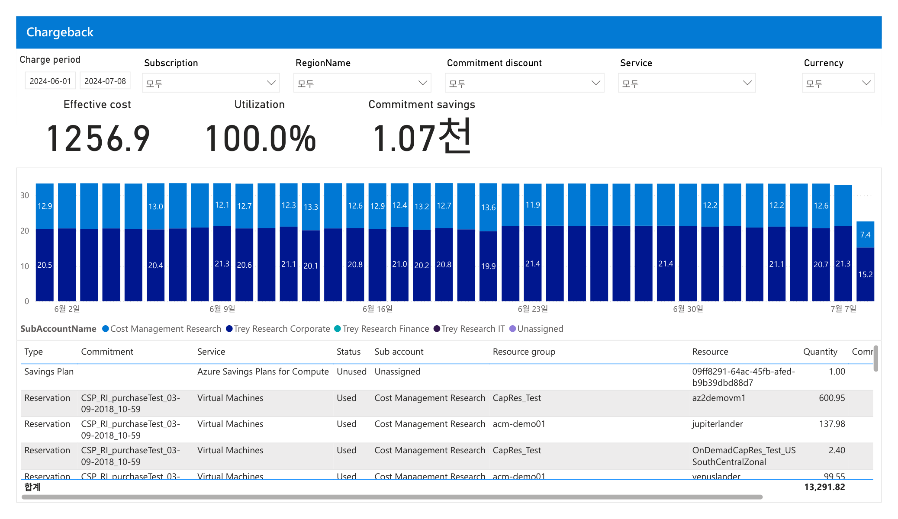

#### 1. 개요
- 약정 할인 유효비용을 **하위 계정(SubAccount)·리소스 단위로 배분(Chargeback)**하는 화면임 — 비용책임 소재를 보여줌
- 데이터 범위: 청구기간 2024-06-01 ~ 2024-07-08, 필터 전부 "모두(All)", 통화기호 미표기(판독 불가)

#### 2. 화면 구조·차트 읽는 법
- 상단 KPI 3종: Effective cost 1256.9 / Utilization 100.0% / Commitment savings 1.07천
- 중앙 누적세로막대: X축=일자(6/2 ~ 7/7), 색=SubAccountName 5종(Cost Management Research·Trey Corporate·Trey Finance·Trey IT·Unassigned)
- 하단 표: Type·Commitment·Service·Status·Sub account·Resource group·Resource·Quantity(우측 Comm. 컬럼 일부 판독 불가)

#### 3. 분석 요약
- 표 합계 Quantity 13,291.82(11.commitments 합계 13,283.82와 근사, 미사용 SP 1.00 포함 차이)
- Savings Plan(Azure Savings Plans for Compute): Status=Unused, Sub account=Unassigned, Resource=09ff8291-...-b9b39dbd88d7, Quantity 1.00
- Reservation CSP_RI_purchaseTest_...: 전부 Sub account=Cost Management Research, Service=Virtual Machines, Status=Used
  - CapRes_Test/az2demovm1 600.95 / acm-demo01/jupiterlander 137.98 / CapRes_Test/OnDemadCapRes_Test_USSouthCentralZonal 2.40 / acm-demo01/venuslander 99.55
- 누적막대 상단(파랑) 약 12 ~ 13대, 하단(진파랑) 약 20 ~ 21대로 SubAccount 2개가 주 비중

#### 4. 시사점
- 약정 절감 수혜가 특정 구독(Cost Management Research 등)에 집중 — 정확한 chargeback으로 책임비용 귀속 가능
- 미사용 Savings Plan이 Unassigned로 배분됨 — 어느 팀도 책임지지 않는 "고아 약정"으로 방치될 위험
- Utilization 100%(SP 제외)는 배분된 약정이 실제 리소스에서 소비됨을 확인시켜 chargeback 신뢰도를 뒷받침함

#### 5. 권고사항
- (Inform) SubAccount별 배분표를 showback/chargeback 리포트로 정례화해 각 구독에 약정 비용 책임을 귀속
- (Inform) Unassigned로 남은 미사용 SP의 소유 조직을 지정하고, 배분 규칙(공유 스코프)을 명문화
- (Inform→Optimize 이관) 소비가 집중된 구독을 대상으로 추가 약정 구매 타당성 검토
- 우선순위: 중(배분 체계는 정상 작동, 단 Unassigned 약정의 소유 지정이 선결 과제)

#### 6. 용어·출처
- Chargeback: 약정·공유비용을 실제 수혜 조직/구독에 직접 청구·귀속하는 비용배분 방식(showback은 통지만 함)
- SubAccount: FOCUS 스키마상 청구 하위 계정(Azure의 구독에 대응)
- 출처: FinOps Foundation — <https://www.finops.org/framework/capabilities/allocation/>

### 14. reservation-recommendations-3yr — VM 공유 예약(3년 약정) 권장

한 줄 요약(TL;DR): 지난 30일 사용량 기준 3년 예약 시 9.77천 약정으로 5.82천 절감이 가능하며,  
NCSv3(westus) 한 건이 절감의 대부분을 차지함.

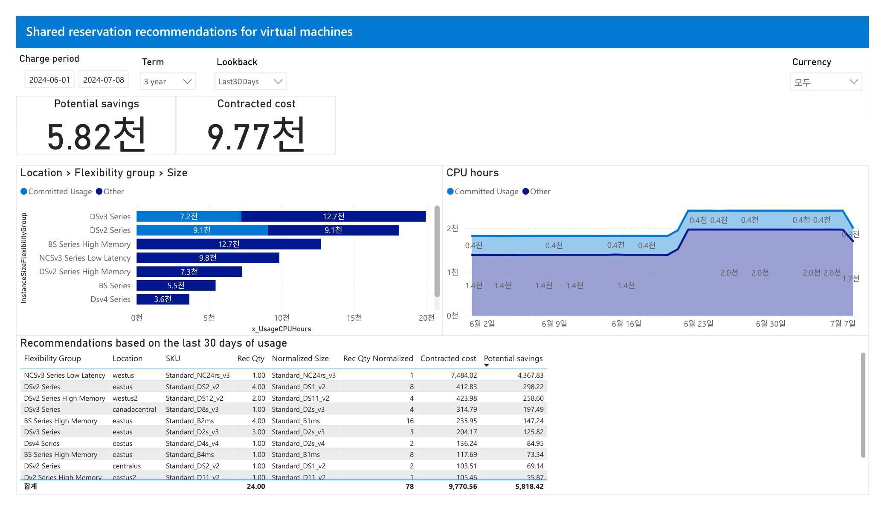

#### 1. 개요
- 목적: FinOps Toolkit이 지난 30일 VM 사용량을 분석해 **3년(Term=3 year)** 공유 예약(Reserved Instance)  
  구매 시 기대 절감액과 대상 SKU를 제시하는 최적화 후보 식별 화면임
- 데이터 범위: 청구기간 2024-06-01 ~ 2024-07-08 / Lookback Last30Days / Currency "모두"(통화기호 미표기, 단위 없이 표기)

#### 2. 화면 구조·차트 읽는 법
- 상단 필터: Charge period·Term(3 year)·Lookback(Last30Days)·Currency(모두)
- 핵심지표 카드 2개: Potential savings(잠재 절감), Contracted cost(약정 비용)
- 좌측 막대: `Location > Flexibility group > Size` 계층, x축 x_UsageCPUHours(CPU 사용시간),  
  색상 = Committed Usage(밝은 파랑, 예약 권장분) vs Other(진한 파랑, 예약 외 사용분)
- 우측 영역차트: CPU hours 시계열, Committed Usage와 Other의 일별 추이
- 하단 표: SKU별 권장 명세 — Flexibility Group·Location·SKU·Rec Qty·Normalized Size·  
  Rec Qty Normalized·Contracted cost·Potential savings(Potential savings 내림차순 정렬)

#### 3. 분석 요약
- Potential savings 카드 **5.82천**, Contracted cost 카드 **9.77천**
- 표 합계: Rec Qty **24.00**, Rec Qty Normalized **78**, Contracted cost **9,770.56**, Potential savings **5,818.42**
- 최상단 행: NCSv3 Series Low Latency / westus / Standard_NC24rs_v3 / Rec Qty 1.00 /  
  Normalized Standard_NC24rs_v3 / Contracted cost 7,484.02 / Potential savings **4,367.83**
- 2 ~ 3위 행: DSv2 Series/eastus/Standard_DS2_v2 → 298.22, DSv2 Series High Memory/westus2/Standard_DS12_v2 → 258.60
- 막대차트: Committed Usage 최대 그룹은 DSv2 Series(9.1천), DSv3 Series는 총량 최대(7.2천+12.7천)
- CPU hours 영역차트: 6월 23일 전후 Committed Usage가 0.4천 수준으로 상승(그 이전 구간 대비 증가)

#### 4. 시사점
- 절감액 5,818.42의 약 **75%(4,367.83)가 NCSv3 단일 SKU 1개**에서 발생 → 특정 GPU/고성능 VM에 절감이 집중됨
- Contracted cost 9,770.56 대비 절감 5,818.42로 **약정 대비 절감률이 높은** 워크로드 구성임
- 예약 권장은 지속 가동(steady-state) 워크로드에 유효 → 30일 상시 사용된 VM이 다수 존재함을 시사
- Normalized(78)가 Rec Qty(24)보다 큰 것은 인스턴스 크기 유연성 그룹 기준 소형 단위로 환산된 결과임

#### 5. 권고사항
- (Optimize 이관) NCSv3(Standard_NC24rs_v3, westus) 3년 예약을 최우선 검토 — 단건 최대 절감 기여
- (Optimize 이관) DSv2/DSv3 계열 상위 SKU 묶음 예약으로 후속 절감 확보, 크기 유연성 그룹 활용
- (Inform 현 단계) 3년 term의 장기 lock-in 리스크와 워크로드 지속성(폐기 예정 여부)을 예약 전 검증
- (Inform 현 단계) 동일 조건 1년 term(15번)과 절감·약정을 대조해 term별 트레이드오프를 의사결정에 반영
- 우선순위: NCSv3 예약(高) → DSv2/DSv3 묶음(中) → 소액 SKU(低)

#### 6. 용어·출처
- Shared reservation recommendation: 구독 전체에 공유 적용되는 예약 권장(단일 구독 한정 아님)
- Instance Size Flexibility Group: 동일 계열 내 크기 간 예약 혜택을 상호 적용하는 그룹
- Rec Qty Normalized: 유연성 그룹 최소 크기 기준으로 환산한 권장 수량
- 출처: FinOps toolkit "Cost Management connector report" v24.07.08 (FOCUS 기반). MS Learn 링크 미확인(공란)

---

### 15. reservation-recommendations-1yr — VM 공유 예약(1년 약정) 권장

한 줄 요약(TL;DR): 동일 워크로드에 **1년 예약** 적용 시 약정 9.70천으로 3.52천 절감이 가능하며,  
3년 대비 약정액은 거의 같으나 절감액은 크게 낮음.

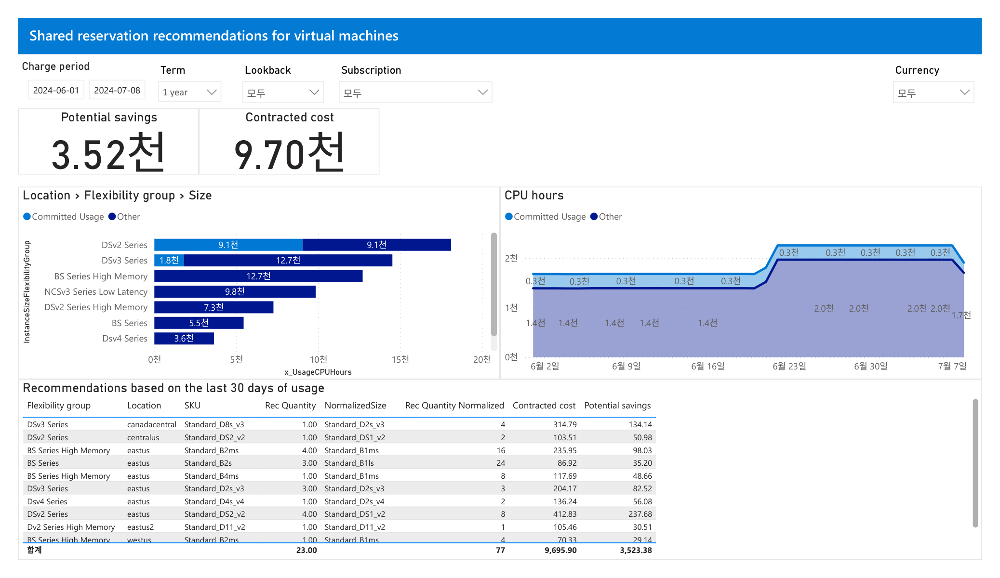

#### 1. 개요
- 목적: 14번과 동일한 화면의 **Term=1 year** 버전 — 1년 예약 구매 시 기대 절감액·대상 SKU 제시
- 데이터 범위: 청구기간 2024-06-01 ~ 2024-07-08 / Lookback "모두" / Currency "모두"(단위 없이 표기)
  - 주의: Lookback 필터가 14번(Last30Days)과 달리 화면상 "모두"로 표기됨(판독값 그대로 기록)

#### 2. 화면 구조·차트 읽는 법
- 구조는 14번과 동일(필터·지표 카드 2개·좌측 막대·우측 CPU hours 영역차트·하단 권장 표)
- 상단 필터에 Subscription(모두) 슬라이서가 추가로 노출됨
- 하단 표 헤더 표기가 14번과 미세하게 다름: Rec Quantity·NormalizedSize·Rec Quantity Normalized

#### 3. 분석 요약
- Potential savings 카드 **3.52천**, Contracted cost 카드 **9.70천**
- 표 합계: Rec Quantity **23.00**, Rec Quantity Normalized **77**, Contracted cost **9,695.90**, Potential savings **3,523.38**
- 표 상위 절감 행: DSv2 Series/eastus/Standard_DS2_v2/Rec Qty 4.00 → Standard_DS1_v2 ×8 → 절감 **237.68**
- 이어서 DSv3 Series/canadacentral/Standard_D8s_v3 → 134.14, BS Series High Memory/eastus/Standard_B2ms → 98.03
- 막대차트: 유연성 그룹 정렬이 14번과 달라져 DSv2 Series가 최상단, Committed Usage 9.1천 표기
- CPU hours 영역차트의 Committed Usage 라벨이 0.3천 수준(14번 3년 화면의 0.4천보다 낮게 표기됨)

#### 4. 시사점
- Contracted cost는 3년(9,770.56)과 1년(9,695.90)이 **거의 동일**하나, 절감은 5,818.42 → 3,523.38으로  
  **약 2,295(약 39%) 감소** → 장기 약정일수록 절감 폭이 커지는 term-절감 트레이드오프가 뚜렷함
- 1년은 lock-in 부담이 작아 워크로드 존속 불확실성이 높은 경우의 대안이 됨
- 표 상위 절감이 DSv2 계열에 분산되어 14번처럼 단일 SKU 집중도가 낮음(판독 상위 행 기준)

#### 5. 권고사항
- (Optimize 이관) 워크로드 지속성이 확실하면 3년(14번), 불확실하면 1년(15번)을 선택 — 절감 대 유연성 균형(예약 구매 의사결정)
- (Optimize 이관) 1년 선택 시 DSv2/DSv3 상위 절감 SKU부터 예약 적용
- (Inform 현 단계) 14·15 두 화면의 절감·약정 수치를 나란히 표로 정리해 경영 보고용 비교자료 작성
- (Inform 현 단계) Lookback 필터 설정 차이(Last30Days vs 모두)가 권장 산출에 미치는 영향 확인 필요
- 우선순위: term 선택 의사결정(高) → 상위 절감 SKU 예약(中) → 필터 조건 정합성 점검(中)

#### 6. 용어·출처
- Term: 예약 약정 기간(1년/3년). 기간이 길수록 단가 할인율이 커짐
- Lookback: 권장 산출에 사용한 과거 사용량 관찰 기간
- 출처: FinOps toolkit "Cost Management connector report" v24.07.08 (FOCUS 기반). MS Learn 링크 미확인(공란)

---

### 16. raw-data — FOCUS 원시 데이터(감사·검증용)

한 줄 요약(TL;DR): 리포트의 모든 집계가 근거하는 **FOCUS 원시 청구 레코드**를 행 단위로 보여주는  
감사·검증용 화면으로, 개별 합계보다 데이터 투명성 확인이 목적임.

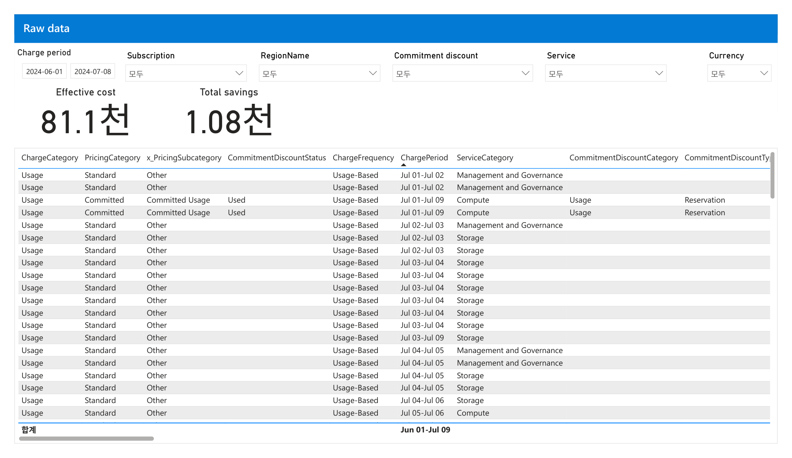

#### 1. 개요
- 목적: 앞선 요약·차트가 아니라 **집계 이전의 개별 청구 레코드(raw record)** 를 그대로 조회하는 화면 —  
  수치의 출처를 역추적·감사(audit)하고 FOCUS 스키마를 확인하는 용도임
- 데이터 범위: 청구기간 2024-06-01 ~ 2024-07-08 / Subscription·RegionName·Commitment discount·Service·Currency 모두 "모두"

#### 2. 화면 구조·차트 읽는 법
- 상단 필터 6종: Charge period + Subscription·RegionName·Commitment discount·Service·Currency(모두 "모두")
- 지표 카드 2개: Effective cost, Total savings(요약 페이지와 동일 전체 지표)
- 본문은 차트가 아닌 **표(레코드 리스트)** — 각 행이 하나의 FOCUS 청구 레코드임
- 주요 컬럼: ChargeCategory·PricingCategory·x_PricingSubcategory·CommitmentDiscountStatus·  
  ChargeFrequency·ChargePeriod·ServiceCategory·CommitmentDiscountCategory·CommitmentDiscountType
- 정렬: ChargePeriod 오름차순(헤더 화살표), 우측으로 가로 스크롤 시 추가 컬럼 존재

#### 3. 분석 요약
- Effective cost 카드 **81.1천**, Total savings 카드 **1.08천**(요약 페이지 전체 지표와 일치)
- 표 샘플 행: 대부분 ChargeCategory=Usage / PricingCategory=Standard / x_PricingSubcategory=Other /  
  ChargeFrequency=Usage-Based, ServiceCategory는 Management and Governance·Storage·Compute 등으로 분포
- 약정 관련 행: PricingCategory=Committed / x_PricingSubcategory=Committed Usage /  
  CommitmentDiscountStatus=Used / ServiceCategory=Compute / CommitmentDiscountType=Reservation
- ChargePeriod는 일 단위 버킷(예: Jul 01-Jul 02, Jul 03-Jul 04)으로 표기됨
- 합계행 ChargePeriod = **Jun 01-Jul 09**(전체 기간). 화면상 개별 금액 컬럼 합계는 판독 불가(가로 스크롤 밖)

#### 4. 시사점
- 이 화면은 "숫자를 만드는 원본"을 노출 → 요약·차트 수치의 **재현성·신뢰성 검증 기반**을 제공함
- Committed/Reservation 레코드가 Standard(정가) 레코드와 함께 존재 → 약정 적용분과 온디맨드분이 원시 데이터에서 구분됨
- FOCUS 표준 컬럼 구조라 다른 클라우드·리포트와 **동일 스키마로 대조 분석**이 가능함
- 특정 값 이상 발견 시 이 표에서 해당 레코드로 드릴다운해 원인(서비스·기간·약정 상태)을 특정 가능

#### 5. 권고사항
- (Inform 현 단계) 요약·예약 화면의 이상 수치 발견 시 이 raw-data에서 필터를 좁혀 근거 레코드를 감사
- (Inform 현 단계) ChargeCategory·PricingCategory·CommitmentDiscountStatus 기준으로 비용 배분·showback 검증
- (Inform 현 단계) FOCUS 컬럼 정의를 팀 공통 데이터 사전으로 문서화해 지표 정의 일관성 확보
- (주의) 이 화면은 집계·최적화 대상이 아닌 **검증 도구** → 개별 합계 인용 시 가로 스크롤로 실제 값 확인 후 사용
- 우선순위: 이상치 드릴다운 검증(高) → 데이터 사전화(中)

#### 6. 용어·출처
- FOCUS: FinOps Open Cost and Usage Specification, 클라우드 비용·사용 데이터의 개방 표준 스키마
- ChargeCategory: 청구 성격(Usage/Purchase 등), PricingCategory: 가격 유형(Standard/Committed 등)
- CommitmentDiscountStatus: 약정 할인 소진 상태(Used/Unused)
- 출처: FinOps toolkit "Cost Management connector report" v24.07.08 (FOCUS 기반). MS Learn·FOCUS 스펙 링크 미확인(공란)
