# 비용 분석 대시보드 레포트 — RAG_KT_AI_Academy_June_2025

| 항목 | 값 |
|---|---|
| 범위(Scope) | RAG_KT_AI_Academy_June_2025 (구독) |
| 기간 | 2025년 7월 ~ 2026년 6월 (지난 12개월) |
| 통화 | KRW |
| 총액 | ₩7,891,230 (실제 비용) |
| 예산 | ₩3,000,000 / 월 (monthly) |
| 입력 이미지 | 11개 — 그룹화 8(`01`~`08`) + 필터 드릴다운 3(`S2`·`A1`·`A2`) |
| 수집 방식 | Playwright MCP 자동 수집(Mode A) · 포털 네이티브 비용 분석 |

> 본 레포트는 포털 **비용 분석(누적 비용)** 화면에서 실제 판독한 값만 사용함. 추정·보간·창작 없음.
> 성격상 AI/ML 실습 교육용 구독(학생별 리소스그룹 다수)으로 확인됨.

---

## 1. 분석 요약 · 시사점 · 권고

### 분석 요약 (사실)

- 12개월 총액 **₩7,891,230**, 월 예산 ₩3M 대비 월평균 소비는 낮으나 **특정 월 집중**이 뚜렷함
- 월별 추이(`01`·`08`): **11월 2025 최고(~₩2.1M)**, 7월(~₩2M), 9~10월(~₩1.1~1.2M) 활발,
  **12월부터 급감**해 5~6월 2026은 사실상 ₩0 — 교육 과정 운영 주기와 정합하는 **bursty 패턴**
- 서비스축(`02`): **Virtual Machines ₩4,820,248(61.1%)** 지배, Storage ₩1,136,858(14.4%),
  Foundry Models ₩604,389(7.7%), Azure Cognitive Search ₩560,413(7.1%), API Management ₩340,457(4.3%)
- 리소스유형축(`04`): 최상위가 **microsoft.machinelearningservices/workspaces ₩4,999,228(63.4%)**,
  microsoft.compute/virtualmachines는 ₩997,664(12.6%)에 그침 — 서비스축 "VM"과 **관리 주체 상이**
- 리전축(`05`): **kr central ₩7,485,812(94.9%)** 로 사실상 단일 리전, 타 리전은 소액 실험성
- 태그축(`06`, project): **태그 없음 ₩3,293,115(41.7%)** 최대, lc-2509 ₩2,687,011(34.0%)
- 커버리지(`07`): **OnDemand 100%** — 예약/절감형/Spot 전무
- RG축(`03`): **155개 RG**, 공유 **00_ai_rg ₩1,186,281(15.0%)** 최상위, 나머지는 학생별 RG에 균등 분산

### 시사점 (의미)

- **집중 비용원은 ML 컴퓨팅**: 서비스축 "Virtual Machines"(₩4.82M)의 실체는 리소스유형축
  ML workspaces(₩4.99M) 하위 컴퓨팅으로, "VM 서비스 = ML 워크스페이스 컴퓨팅"임(`04` 교차 확증).
  최적화 1순위는 ML 컴퓨팅의 유휴·과대 프로비저닝임 (분모=총액 ₩7.89M)
- **VM 비용은 소수 타깃이 아닌 정책 대상**: S2 드릴다운 결과 VM ₩4.82M이 **92개 RG에 균등 분산**
  (각 ~₩130K~220K, 지배 RG 없음) → 특정 RG 저격 불가, **학생 RG 전반 정책 통제**가 유효
- **약정(Reservation/Savings Plan)은 부적합**: 커버리지 0%이나 워크로드가 bursty(7~11월 집중 후 급감)라
  상시 기저부하가 없어 약정 시 낭비 위험 — 커버리지 낮음이 곧 약정 기회는 아님(반증)
- **배분 신뢰성 위기**: project 태그 미태깅 41.7%(₩3.29M). 그 최대 블록은 **00_ai_rg(₩1.18M, 공유 RG의 ~99.5%)**.
  공유 AI 백본 비용이 프로젝트로 귀속되지 않아 학생·과정별 원가 산정 불가
- **공유 RG는 AI 서비스 허브**: 00_ai_rg는 컴퓨팅이 아닌 Foundry Models(48%)+API Management(29%)+
  Cognitive Search(20%) = 97% (A2). 전 학생 프로젝트가 소비하는 LLM/RAG 공유 서비스 → 공유비용 배분 대상
- **이상 신호**: 11월 2025 피크는 VM 외에 Foundry Models·API Management가 동반 상승(`08`) — 과정 집중 실습 구간

### 권고 사항 (행동)

| 우선순위 | 대상 | 조치 | 단계 |
|---|---|---|---|
| 1 | ML 컴퓨팅(ML workspaces ₩4.99M) | 컴퓨팅 인스턴스 **유휴 자동 종료(idle shutdown)·크기 표준·쿼터**를 학생 RG 전반 정책으로 적용 | Optimize (Workload) |
| 2 | 미태깅 ₩3.29M(41.7%), 특히 00_ai_rg ₩1.18M | 00_ai_rg 우선 태깅(단일 최대 개선) + **Azure Policy로 project 태그 필수화·상속** | Inform (Allocation) |
| 3 | 공유 00_ai_rg ₩1.19M(AI 백본) | Foundry/APIM/Search **공유비용 배분 규칙**(소비 비중 기반) 정의 | Inform (Allocation) |
| 4 | 커버리지 0%(OnDemand 100%) | 약정은 **보류**(bursty 반증). 상시 기저부하 형성 시 재평가 | Optimize (Rate) |
| 5 | 11월 피크·월별 급증 | 예산 알림·이상 탐지(Anomaly)로 과정 집중 구간 사전 인지 | Inform (Anomaly) |

---

## 2. 관점별(이미지별) 해설

### 1. 총액·월별 추이 — 가이드 §2.1 (None · 월별 · 누적 막대)

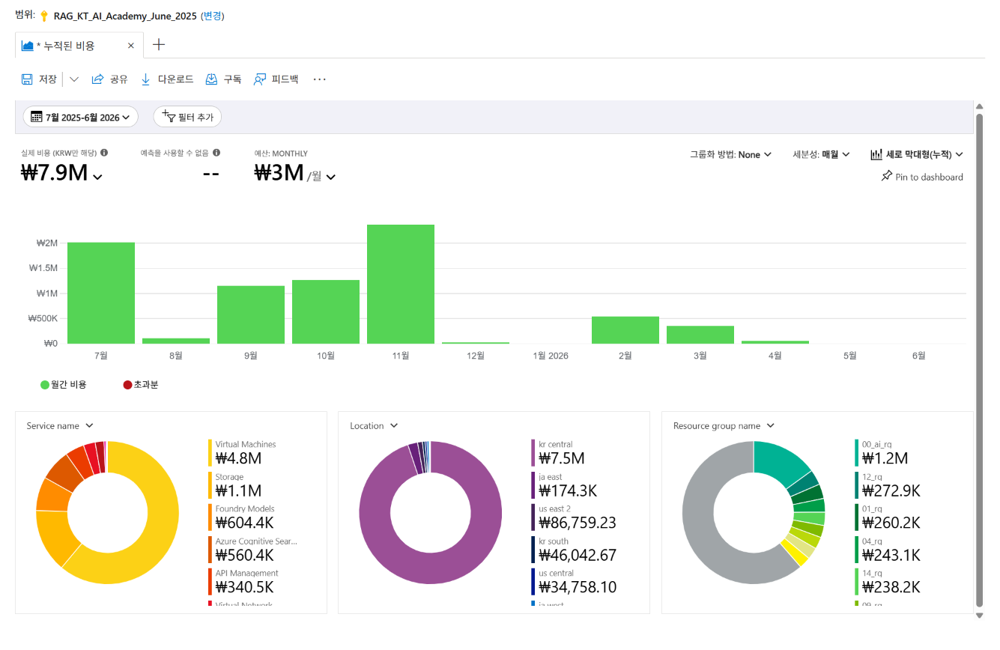

**액션(설정):** 그룹화=None · 세분성=매월 · 차트=세로 막대형(누적)
**관찰:** 총액 ₩7,891,230(2025.7~2026.6). 월별 — 11월 2025 최고(~₩2.1M), 7월(~₩2M), 9월(~₩1.1M),
10월(~₩1.2M) 활발. 12월부터 급감, 2월(~₩600K)·3월(~₩500K) 소폭, 5~6월 사실상 ₩0. 예산 ₩3M/월.
**해설:** 특정 월 집중형 **bursty 패턴**으로 상시 기저부하가 없음 → 약정형 최적화 부적합의 1차 근거.
과정 운영 주기와 비용 곡선이 정합. FinOps: Inform (Reporting)

### 2. 서비스별 집중 비용원 — 가이드 §2.2 (Service name)

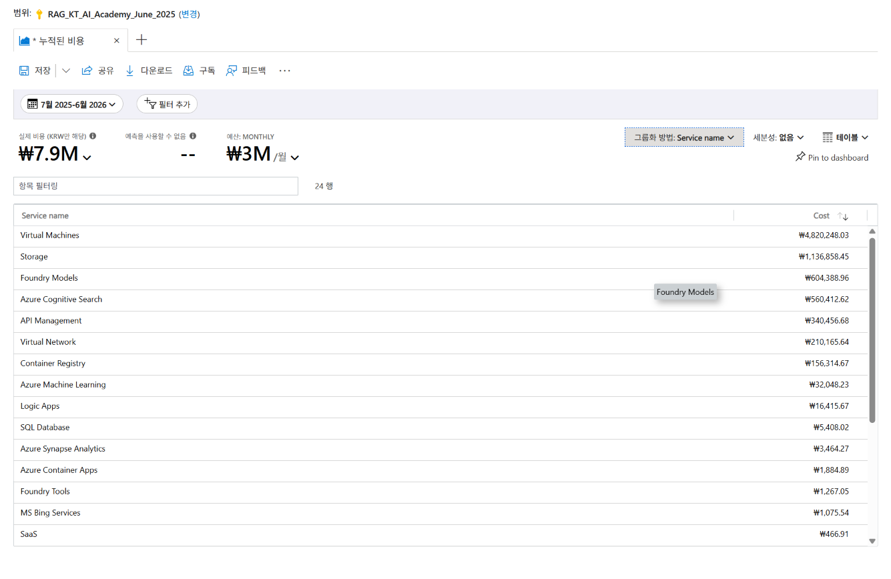

**액션(설정):** 그룹화=Service name · 세분성=없음 · 차트=테이블 (24행)
**관찰:** Virtual Machines ₩4,820,248(61.1%), Storage ₩1,136,858(14.4%), Foundry Models ₩604,389(7.7%),
Azure Cognitive Search ₩560,413(7.1%), API Management ₩340,457(4.3%), Virtual Network ₩210,166(2.7%),
Container Registry ₩156,315(2.0%), Azure Machine Learning ₩32,048, Logic Apps ₩16,416 …
**해설:** 상위 1개(VM)가 총액의 61% 차지 → 집중 리스크. 단 "VM" 서비스명이 관리 주체(ML 워크스페이스)와
다를 수 있어 §2.4 Resource type과 교차 필요(관점 4). FinOps: Inform (Reporting·Allocation)

### 3. 리소스그룹별 배분 — 가이드 §2.3 (Resource group name)

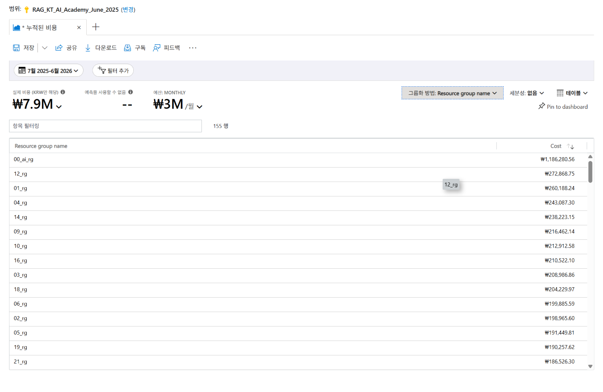

**액션(설정):** 그룹화=Resource group name · 세분성=없음 · 차트=테이블 (155행)
**관찰:** 00_ai_rg ₩1,186,281(15.0%) 최상위(공유), 이후 학생별 RG가 균등 — 12_rg ₩272,869, 01_rg ₩260,188,
04_rg ₩243,087, 14_rg ₩238,223, 09_rg ₩216,462, 10_rg ₩212,913, 16_rg ₩210,522 …
**해설:** 155개 RG 구조 = 학생별 실습 환경 + 공유 AI RG(00_ai_rg). 공유 RG가 단일 최대이므로 공유비용
배분 검토 대상(관점 A2 확대). 학생 RG는 저격 대상이 아니라 **정책 일괄 적용** 대상. FinOps: Inform (Allocation)

### 4. 리소스 유형별 실체 — 가이드 §2.4 (Resource type)

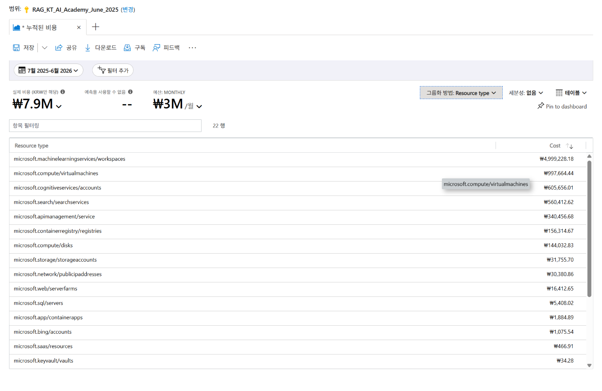

**액션(설정):** 그룹화=Resource type · 세분성=없음 · 차트=테이블 (22행)
**관찰:** microsoft.machinelearningservices/workspaces ₩4,999,228(63.4%), microsoft.compute/virtualmachines
₩997,664(12.6%), microsoft.cognitiveservices/accounts ₩605,656, microsoft.search/searchservices ₩560,413,
microsoft.apimanagement/service ₩340,457, microsoft.containerregistry/registries ₩156,315,
microsoft.compute/disks ₩144,033, microsoft.storage/storageaccounts ₩31,756 …
**해설:** **핵심 교차 관찰** — 서비스축 최상위 "Virtual Machines"(₩4.82M)와 달리 리소스유형 최상위는
**ML workspaces(₩4.99M)**. VM 미터 비용 대부분이 ML 워크스페이스 컴퓨팅(인스턴스/클러스터)에서 발생함을
확증. 최적화 타깃은 "ML 컴퓨팅"으로 특정됨. FinOps: Inform (Reporting) → Optimize (Workload)

### 5. 리전별 분포 — 가이드 §2.5 (Location)

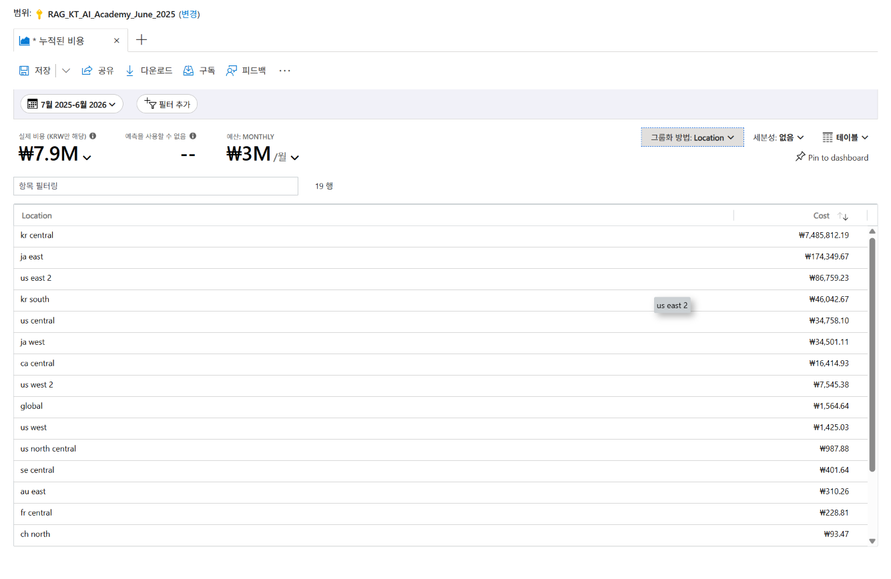

**액션(설정):** 그룹화=Location · 세분성=없음 · 차트=테이블 (19행)
**관찰:** kr central ₩7,485,812(94.9%) 지배. ja east ₩174,350, us east 2 ₩86,759, kr south ₩46,043,
us central ₩34,758, ja west ₩34,501, ca central ₩16,415 … (나머지 리전은 각 ₩10K 미만)
**해설:** 사실상 단일 리전(kr central) 운영으로 리전 분산 최적화 여지 낮음. 타 리전 소액은 실험·테스트로 추정
(기준 총액 ₩7.89M 대비 5% 미만). FinOps: Inform (Reporting)

### 6. 태그별 배분 커버리지 — 가이드 §2.6 (Tag: project)

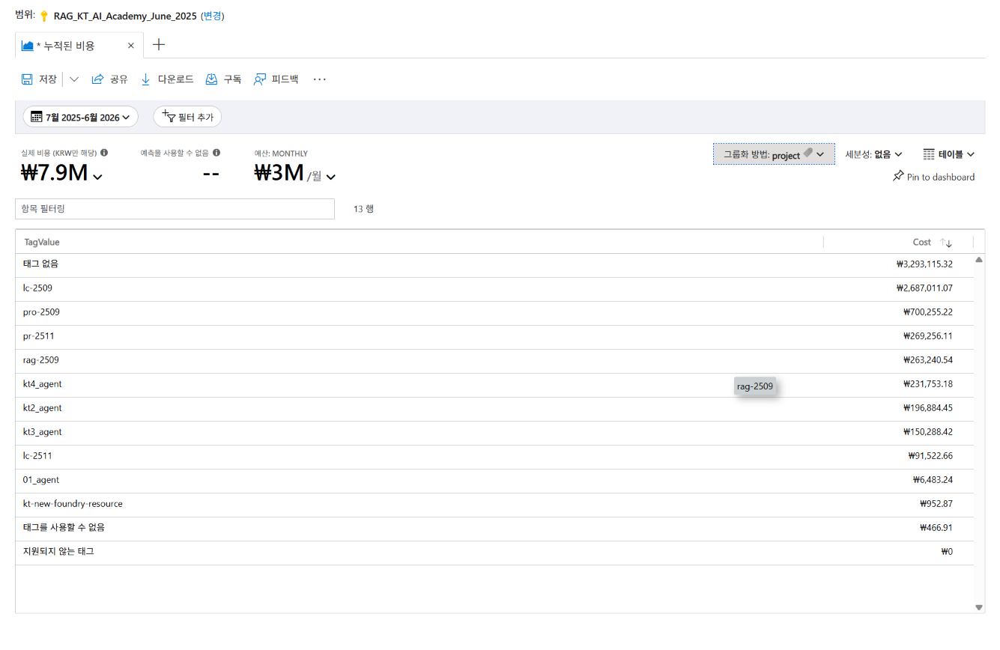

**액션(설정):** 그룹화=태그(project) · 세분성=없음 · 차트=테이블 (13행)
**관찰:** 태그 없음 ₩3,293,115(41.7%) 최대, lc-2509 ₩2,687,011(34.0%), pro-2509 ₩700,255(8.9%),
pr-2511 ₩269,256, rag-2509 ₩263,241, kt4_agent ₩231,753, kt2_agent ₩196,884, kt3_agent ₩150,288 …
**해설:** 조직 표준 키(CostCenter·project·env) 중 **project만 존재**, CostCenter·env는 미적용. project 기준
미태깅이 42%로 배분 신뢰성 저해 → A1 드릴다운으로 미태깅 소재 규명. FinOps: Inform (Allocation)

### 7. 커버리지(가격 모델) — 가이드 §2.7 (Pricing Model)

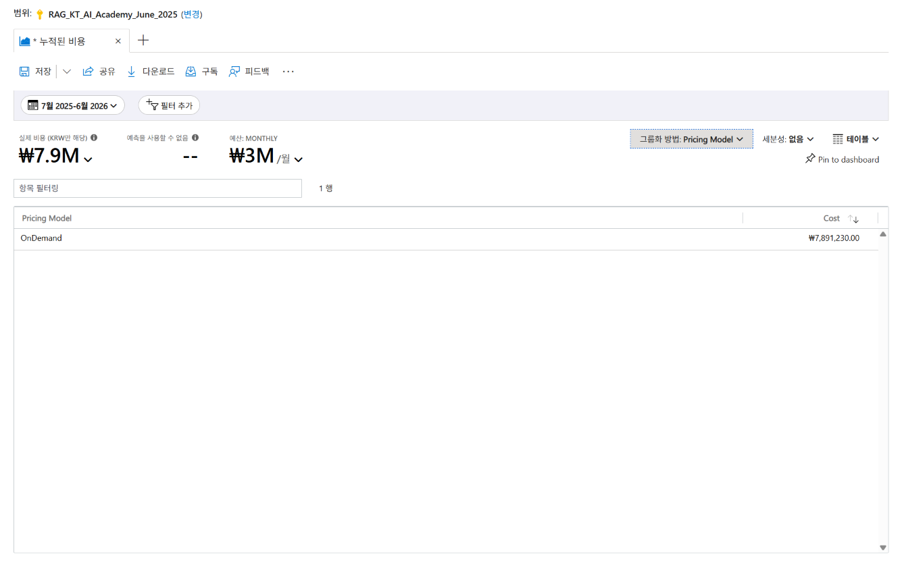

**액션(설정):** 그룹화=Pricing Model · 세분성=없음 · 차트=테이블 (1행)
**관찰:** OnDemand ₩7,891,230(100%). 예약(Reservation)·절감형(Savings Plan)·Spot 전무.
**해설:** 표면상 약정 여지 100%이나, 관점 1의 bursty 워크로드(상시 기저부하 부재)와 결합 시 약정은 낭비 위험
→ **약정 기각(반증)**. 커버리지 0%이 곧 약정 기회가 아님을 보여주는 사례. FinOps: Optimize (Rate) — 보류 판정

### 8. 이상 신호(월별×서비스) — 가이드 §2.8 (Service name · 월별 · 누적 막대)

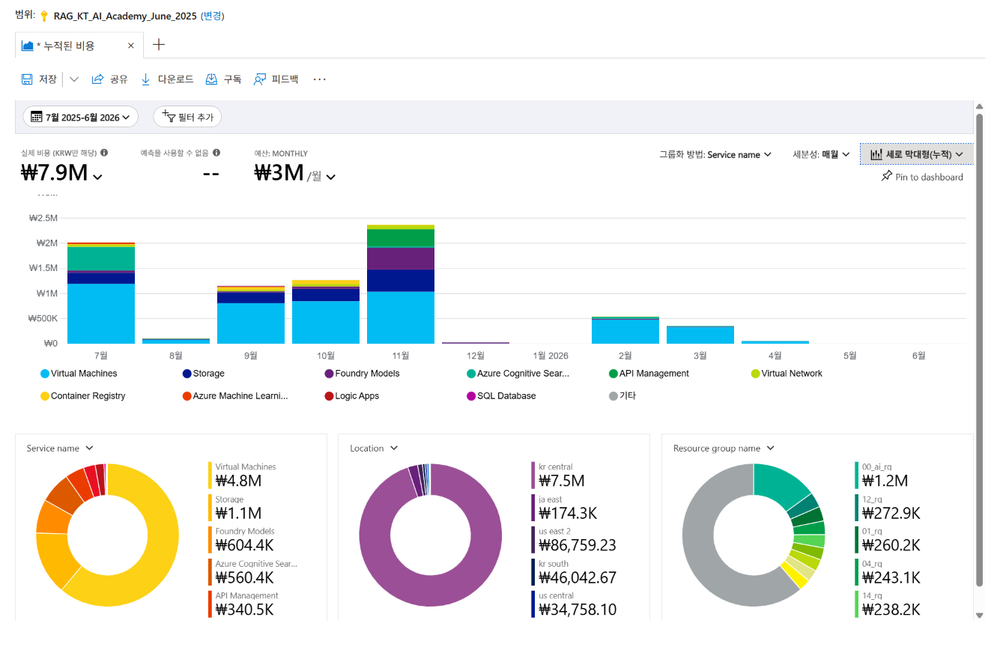

**액션(설정):** 그룹화=Service name · 세분성=매월 · 차트=세로 막대형(누적)
**관찰:** 전 활성월에서 Virtual Machines(하늘색) 층이 지배. **11월 2025 피크(~₩2.1M)** 에 Foundry Models·
API Management·Cognitive Search 층이 동반 상승해 구성이 가장 다양. 7·9·10월은 VM 위주, 12월 이후 급감.
**해설:** 피크월의 다서비스 동반 상승 = 과정 집중 실습 구간의 신호. 월별 VM 지속 지배는 관점 4(ML 컴퓨팅)와
정합. 이상 급증 대비 예산 알림·Anomaly 탐지 권고. FinOps: Inform (Anomaly)

---

## 2-확대. 필터 드릴다운(확대경) — 채택 가설 검증

### S2. VM 집중원의 소재 — 필터 Service=Virtual Machines → RG

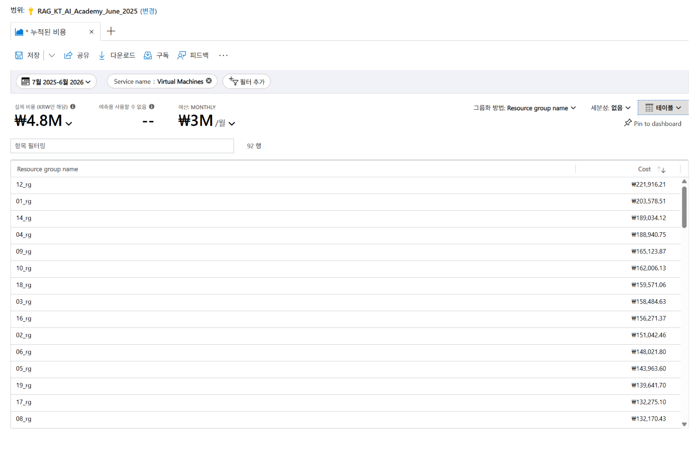

**액션(설정):** 필터=Service name : Virtual Machines · 그룹화=Resource group name · 테이블 (92행)
**관찰:** 필터 후 총액 ₩4,820,248. 92개 RG에 분산 — 12_rg ₩221,916, 01_rg ₩203,579, 14_rg ₩189,034,
04_rg ₩188,941, 09_rg ₩165,124, 10_rg ₩162,006, 18_rg ₩159,571, 03_rg ₩158,485 … (각 ~₩130K~220K)
**검증 결과(반증 성립):** "특정 소수 RG 집중"이 아닌 **92개 RG 균등 분산** → 소수 타깃 최적화 불가.
공유 00_ai_rg는 VM 상위에 없음(VM 위주 아님). **조치 방향 전환**: 학생 RG 전반 자동 종료·크기 표준·쿼터
정책. FinOps: Optimize (Workload)

### A1. 미태깅 비용의 소재 — 필터 project=값 없음 → RG

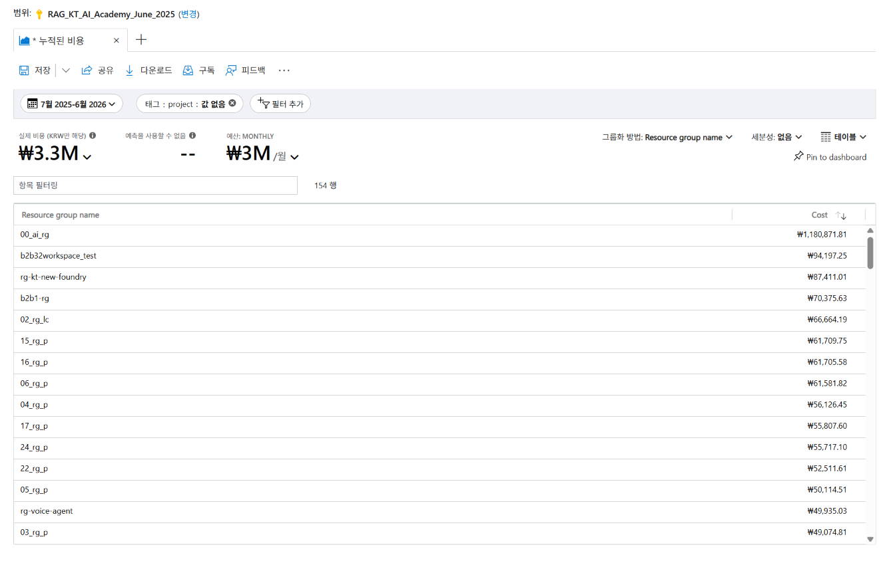

**액션(설정):** 필터=태그 project : 값 없음 · 그룹화=Resource group name · 테이블 (154행)
**관찰:** 필터 후 총액 ₩3.3M. 00_ai_rg ₩1,180,872 최대, 이후 b2b32workspace_test ₩94,197,
rg-kt-new-foundry ₩87,411, b2b1-rg ₩70,376, 02_rg_lc ₩66,664, 15_rg_p ₩61,710, 16_rg_p ₩61,706 …
**검증 결과(확증):** 미태깅의 단일 최대 블록은 **00_ai_rg ₩1,180,872** — 03의 00_ai_rg 총액(₩1,186,281)
대비 공유 RG의 **~99.5%가 미태깅**. 나머지는 학생 RG(*_rg_p·*_rg_lc)·테스트 RG에 분산.
**조치:** 00_ai_rg 우선 태깅(단일 최대 개선) + Policy 기반 project 필수화. FinOps: Inform (Allocation)

### A2. 공유 RG의 실체 — 필터 RG=00_ai_rg → Service name

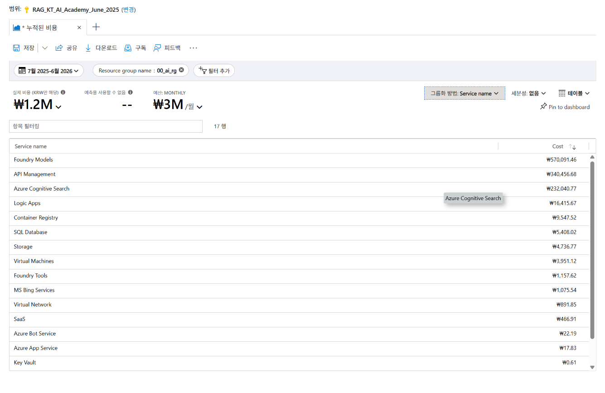

**액션(설정):** 필터=Resource group name : 00_ai_rg · 그룹화=Service name · 테이블 (17행)
**관찰:** 필터 후 총액 ₩1.2M. Foundry Models ₩570,091(48%), API Management ₩340,457(29%),
Azure Cognitive Search ₩232,041(20%) = 97%. 이후 Logic Apps ₩16,416, Container Registry ₩9,548,
SQL Database ₩5,408, Storage ₩4,737, Virtual Machines ₩3,951 …
**검증 결과(확증):** 공유 00_ai_rg는 컴퓨팅이 아닌 **AI 서비스 허브**(LLM Foundry + API 게이트웨이 +
RAG 검색). 전 학생 프로젝트 공용 백본이며 A1의 최대 미태깅 블록과 동일. API Management는 구독 전체 총액
(₩340,457)이 전부 이 RG에 존재. **조치:** 소비 비중 기반 공유비용 배분 규칙 정의. FinOps: Inform (Allocation)

---

## 부록 · 미채택 가설(반증 기록)

| 가설ID | 트리거 | 반증 근거 |
|---|---|---|
| S1 약정 여지 | 07 OnDemand 100% | 01·08 워크로드 bursty(7~11월 집중 후 12월 급감, 5~6월 ₩0). 상시 기저부하 부재로 약정 시 낭비 위험 → 약정 보류 |
| S6 리전 분산 | 05 다수 리전 존재 | kr central 94.9% 단일 집중, 타 리전 각 5% 미만·소액 실험성 → 리전 최적화 여지 낮음 |

> 미채택 가설은 관점 블록이 아닌 반증 근거로만 기록함(스킬 완료조건 준수).
