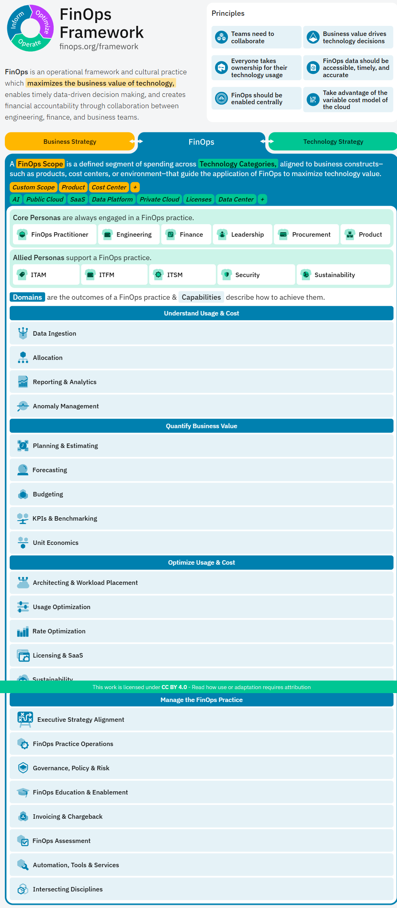

# M1. WHY & 성숙도 — FinOps 자리매김 (이론 50분)

> **과정**: Azure 클라우드 FinOps 실무 — 보이기·줄이기·체계화 핸즈온  
> **모듈 시간**: 09:00–09:50 (이론 50분) → 09:50–10:00 휴식 → M2 시작  
> **세션 구성**: M1-S1 「WHY·COVERS·3단계」(30분) + M1-S2 「성숙도 모델」(20분)  
> **실습 방식**: 커리큘럼에서 **유일한 순수 이론 모듈**. 수강생 클릭 실습이 아니라, 강사 deck + 아래 프레임워크 1장으로 개념을 짚는 강의식. (산출물·평가는 M2-S6 자가진단부터)
>
> 📚 **참조 자료**: [`FinOps.md`](../../교재/AM/finops/FinOps.md) (강사 deck `FinOps.pptx` 변환본). 본 스크립트는  
> **deck 슬라이드 흐름에 1:1로 맞춤**.  
> **슬라이드 매핑**: M1-S1 ← deck §1 (슬라이드 3·4·5·6) / M1-S2 ← deck §5 (슬라이드 16·17·18)

---

## 🎯 보조 비주얼 — FinOps Foundation 프레임워크 (전체 조망 1장)

> 출처: FinOps Foundation, <https://www.finops.org/framework/> (2026-03 캡처)  
> 📖 **1차 출처(FinOps Foundation)**: [Framework Overview](https://www.finops.org/framework/) · [Principles](https://www.finops.org/framework/principles/) · [Maturity Model](https://www.finops.org/framework/maturity-model/) · [Domains](https://www.finops.org/framework/domains/)  
> 💡 사용법: 강사님 deck 슬라이드(골든써클·COVERS)가 **주 교보재**. 이 공식 프레임워크 한 장은 **"전체 지도"**로 1회 띄워 "우리가 배울 게 여기 다 있다"를 보여줄 때 사용. 가능하면 실제  
> 사이트를 띄워 Capability 클릭 시연.

| 화면 구역 | 위치 | 연결 강의 포인트 |
|---|---|---|
| 원형 다이어그램 + "FinOps Framework" | 좌상단 | 3단계 순환(보이기→줄이기→체계화) · deck 슬라이드 6 |
| **Principles 6개 카드** | 우상단 | **COVERS 6원칙** · deck 슬라이드 5 |
| Scopes 바 (Public Cloud·SaaS·AI·Licensing…) | 중앙 띠 | 2025 트렌드 'Cloud+' 확장 · deck 슬라이드 18 |
| Core / Allied Personas | 중단 | 성숙도 Ownership(누가) 축 · deck 슬라이드 17 |
| Domains 4개 + Capabilities | 하단 | 3단계 펼침 / 성숙도 Capability(무엇을) 축 · deck 17 |

---

## 🟦 M1-S1 「WHY · COVERS · 3단계」 (09:00–09:30 · 30분)

**학습목표**: FinOps 정의·필요성·COVERS 6원칙·Inform→Optimize→Operate 순환 이해  
**대응 deck**: 슬라이드 3(개요·CapEx/OpEx) → 4(골든써클) → 5(COVERS) → 6(3전략 순환)

### ⏱ 타임박스
| 구간 | 시간 | 주 화면 |
|---|---|---|
| ① 도입 — 왜 FinOps인가 (CapEx→OpEx) | 0:00–0:06 | deck 슬라이드 3 |
| ② 골든써클 — WHY·HOW·WHAT | 0:06–0:12 | deck 슬라이드 4 |
| ③ COVERS 6원칙 | 0:12–0:20 | deck 슬라이드 5 (+ 프레임워크 이미지 Principles) |
| ④ 보이기→줄이기→체계화 3단계 순환 | 0:20–0:27 | deck 슬라이드 6 |
| ⑤ 마무리 + 성숙도 브릿지 | 0:27–0:30 | — |

### 🗣 강의 스크립트

**[① 0:00–0:06 · 도입 — 왜 FinOps인가]** *(deck 슬라이드 3)*
> "예전엔 서버를 *사서* 썼습니다. 한 번 크게 지르는 **CapEx**(고정비, 구매 후 감가상각). 클라우드는 **OpEx** — 쓴 만큼 매달 빠져나가는 변동비예요. (표 가리키며) 비용 예측이 어렵고,  
> 책임이 엔지니어·PO·재무로 **분산**되고, 최적화도 1회가 아니라 **계속** 해야 합니다.  
> 문제는 숫자로 드러납니다 — **클라우드 지출의 약 1/3이 낭비**입니다. 반대로 **FinOps를 제대로 하면 월 비용을 25~30% 절감**합니다.  
> 그래서 **FinOps**(Finance+DevOps) — *기술 비용 최적화와 투자 가치 극대화를 위해 재무·비즈니스·IT가 데이터 기반으로 협업하는 체계*입니다."  
> 💬 곁들임: "FinOps Foundation은 Linux Foundation 산하 비영리이고, 2026년 초 미션을 *Cloud→Technology*로 넓혔습니다. 이제 클라우드만이 아니라  
> SaaS·AI·라이선스까지 봅니다."

**[② 0:06–0:12 · 골든써클 — WHY·HOW·WHAT]** *(deck 슬라이드 4)*
> "FinOps를 골든써클로 한 장에 그리면 이렇습니다.
> - **WHY** — ① 투자 가치 극대화(기술 투자가 비즈니스 성과로 이어지는지 *증명*) ② 기술 비용 최적화(낭비 *제거*).
> - **HOW** — **보이기**(가시화) → **줄이기**(낭비 제거·효율화) → **체계화**(지속 가능한 구조로 정착). 오늘 과정 제목 그대로입니다.
> - **WHAT** — 8가지 실천: 이상비용 탐지 · 태그 기반 추적/할당 · Right-sizing · 스케일링 최적화 · 약정 할인 · FinOps 자동화 · KPI 관리 · 협업문화/거버넌스."
> 🧠 기억팁(그대로 외우게): **"이상 태그·사이즈 스캔하여 할인 받고, 자동 KPI로 협업문화 완성하자!"**  
> "오늘 오후 실습이 전부 이 WHAT입니다 — M2가 이상탐지·태그, M3~M5가 사이즈·스케일·약정, M6가 KPI·협업."

**[③ 0:12–0:20 · COVERS 6원칙]** *(deck 슬라이드 5 + 프레임워크 이미지 우상단 Principles)*
> "FinOps Foundation의 6대 원칙, 강사식 암기법은 **COVERS** — *'FinOps는 기술 비용의 모든 것을 **커버**한다'*."
>
> | | 원칙 | 한 줄 |
> |---|---|---|
> | **C** | **Collaboration** 팀 간 협업 | 엔지니어링·재무·비즈니스가 *함께* 의사결정, 사일로 제거 |
> | **O** | **Ownership** 오너십 | "내가 만든 서비스의 비용은 내가 관리" |
> | **V** | **Value-driven** 가치 중심 | 단순 절감이 아닌 **투자 가치 극대화**가 목표 |
> | **E** | **Elastic Utilization** 탄력적 활용 | 미사용 용량 최소화, 수요 따라 탄력 운영 |
> | **R** | **Right-time Report** 적시 리포팅 | 데이터의 접근성·적시성·정확성 (월말 청구서 ❌) |
> | **S** | **Steering** 중앙 주도 | 중앙 FinOps 팀(CCoE)이 거버넌스 드라이브 — *정책은 중앙, 실행은 각 팀(연합 거버넌스)* |
>
> *(프레임워크 이미지 우상단 6개 카드를 가리키며)* "공식 사이트의 이 6개 Principles가 바로 COVERS와 1:1입니다."

**[④ 0:20–0:27 · 보이기→줄이기→체계화 3단계 순환]** *(deck 슬라이드 6 + 프레임워크 이미지 좌상단 원형)*
> "핵심은 3단계가 **선형 완료가 아니라 반복 순환(Iterative Cycle)**이라는 점입니다. 성숙도가 오를수록 *더 깊은 수준에서 각 단계를 다시* 돕니다.  
> *(공식 정렬: FinOps Foundation의 3 Phases — **Inform · Optimize · Operate**. "The FinOps journey consists of Inform, Optimize and Operate." — [Framework Overview](https://www.finops.org/framework/))*
> - **보이기(Inform)** — 비용 데이터 수집 → 대시보드 → 태그 기반 할당 → 이상 비용 탐지. **가장 기본**입니다.
> - **줄이기(Optimize)** — 미사용 제거 → Right-sizing → 약정 할인 → 스케일링 최적화.
> - **체계화(Operate)** — 단위경제·KPI → 자동화 → 협업문화·거버넌스.
>
> 💬 인용: *"측정할 수 없으면 관리할 수 없다"* — 피터 드러커. "그래서 **보이기 없이는 줄이기도 체계화도 불가능**합니다."  
> *(브릿지)* "오늘 우리는 이 원을 **한 바퀴 직접** 돌립니다 — 오전 M2(보이기), 오후 M3~M5(줄이기), M6(체계화)."

**[⑤ 0:27–0:30 · 마무리 + 성숙도 브릿지]**
> "정리 — **WHY**(OpEx 시대·낭비 1/3) → **원칙**(COVERS 6개) → **방법**(3단계 순환). 이게 FinOps의 자리매김입니다.  
> 그럼 '우리 조직은 이 순환을 얼마나 잘 돌고 있나?' 그걸 진단하는 게 다음 5분, **성숙도 모델**입니다."

### 💬 예상 Q&A
- **"비용 절감팀과 뭐가 달라요?"** → 절감은 일회성 '깎기', FinOps는 **가치 기반 의사결정을 상시 순환**(원칙 V·반복순환).
- **"엔지니어가 왜 비용을?"** → 원칙 O(오너십). 가장 빠른 최적화는 만든 사람이 직접.
- **"COVERS가 공식 용어?"** → 6 Principles는 FinOps Foundation 공식. 'COVERS'는 강사 암기용 약어(딱 6원칙에 1:1 매핑).

### ✅ 강사 체크포인트
- [ ] CapEx/OpEx **표**로 시작했는가 / 숫자(1/3·25~30%)를 던졌는가
- [ ] COVERS 6글자를 **deck 정의 그대로** 설명했는가
- [ ] 3단계를 **오늘 커리큘럼(M2→M3~5→M6)과 1:1**로 연결했는가

---

## 🟦 M1-S2 「성숙도 모델」 (09:30–09:50 · 20분)

**학습목표**: Crawl→Walk→Run 단계와 **KT 현 위치** 인식, **Ownership×Capability 다차원 진단** 개념  
**대응 deck**: 슬라이드 16(성숙도 3단계) → 17(다차원 진단 전환) → 18(2025–2026 프레임워크 업데이트)

### ⏱ 타임박스
| 구간 | 시간 | 주 화면 |
|---|---|---|
| ① Crawl → Walk → Run | 0:00–0:07 | deck 슬라이드 16 |
| ② 다차원 진단 (Ownership×Capability) | 0:07–0:13 | deck 슬라이드 17 |
| ③ KT/한국 현 위치 + 2025–2026 트렌드 | 0:13–0:18 | deck 슬라이드 16·18 |
| ④ 휴식 브릿지 → M2 | 0:18–0:20 | — |

### 🗣 강의 스크립트

**[① 0:00–0:07 · Crawl → Walk → Run]** *(deck 슬라이드 16)*
> *(공식 정렬: FinOps Foundation **Maturity Model**의 3단계 — **Crawl · Walk · Run**. "A "Crawl, Walk, Run" approach … enables organizations to start small, and grow in scale, scope, and complexity." — [Maturity Model](https://www.finops.org/framework/maturity-model/))*  
> "FinOps 성숙도는 걷기 전에 기는 것부터입니다.
> - **Crawl(기초) — 비용 가시성 확보**: 태깅 전략, 청구 대시보드·월간 레포팅, 이해관계자·역할 정의, CCoE 구성, 기본 KPI.
> - **Walk(발전) — 최적화 실행**: 자동화된 비용 분석, Right-sizing, RI/SP 구매 전략, 단위경제 메트릭, 팀별 비용 책임.
> - **Run(고도화) — 자율 운영**: 실시간 거버넌스, 예측 기반 의사결정, 엔지니어 셀프서비스, 자동화 파이프라인, 문화 내재화, FOCUS 멀티클라우드 통합, AI/SaaS로 Scope 확장.
>
> "핵심은 *'전부 Run일 필요 없다'* — **Capability마다 단계가 다릅니다.** 보이기는 Walk인데 약정은 Crawl일 수 있어요."  
> *(공식 근거: "an organization's goal should never be simply to achieve a "Run" maturity in every Capability." · "Prioritize maturing the Capabilities that provide your organization the highest business value." — [Maturity Model](https://www.finops.org/framework/maturity-model/))*

**[② 0:07–0:13 · 다차원 진단 — Ownership × Capability]** *(deck 슬라이드 17 + 프레임워크 이미지 Personas×Capabilities)*
> "2025년 프레임워크의 가장 큰 변화 — **'전사 단일 점수'를 버리고 '다차원 입체 진단'으로** 갔습니다. 평균의 함정 때문이죠.
> - **Ownership(누가)** — 전체 회사가 아니라 *실제 운영 주체*(서비스팀·플랫폼팀)·*환경*(Prod/Dev) 단위로 세분화. → 병목 팀이 보이고, 잘하는 팀의 Best Practice를 발굴.
> - **Capability(무엇을)** — *공식 22개 Capability*(4 Domain 소속 — 비용 할당·데이터 분석·이상 탐지·약정 관리…)을 각각 점검. → *"데이터 분석은 뛰어난데 최적화 실행력이 약하다"* 식의 정밀 진단.
>
> *(프레임워크 이미지의 Personas[가로] × Domains·Capabilities[세로]를 가리키며)* "이 두 축을 곱한 매트릭스에 Crawl/Walk/Run을 채우면 **우리 조직의 약한 칸**이  
> 한눈에. 오후 **M2-S6 자가진단 워크시트**에서 직접 채웁니다."

**[③ 0:13–0:18 · KT/한국 현 위치 + 2025–2026 트렌드]** *(deck 슬라이드 16·18)*
> "한국 현실 — **대부분 Crawl~Walk, Run 도달은 소수**. 국내+글로벌 CSP 조합이라 멀티클라우드 통합 복잡도가 높습니다. 선도 사례는 **우아한형제들**(트래픽 1건 처리 비용 =  
> 클라우드비÷트래픽 으로 가치 측정).  
> 최신 트렌드도 짚고 갑니다(deck 슬라이드 18):
> - **Scopes 도입(2025)**: Public Cloud·SaaS·Data Center·AI·Licensing — 비용 대상이 넓어짐(Cloud+).
> - **Executive Strategy Alignment(2026 신규)**: FinOps 팀 78%+가 CTO/CIO 직속, '비용 보고'에서 '전략적 기술 역량'으로 재위치.
> - **FinOps for AI**: 응답자 98%가 AI 지출 관리(2024 31%→2026 98%). GPU 활용률·LLM 호출 비용 메트릭이 화두.
>
> 💡 실전 조언: *"전사 평균 점수에 집착하지 말고, **가장 비용 큰 부서**부터, **비용 가시성(보이기)**부터, **3~6개월** 안에 끌어올려라."*"

**[④ 0:18–0:20 · 휴식 브릿지]**
> "각자 머릿속에 그려보세요 — *우리 팀은 어느 칸이 비었나?* 그 빈칸을 채우러, 지금부터 **보이기(Inform)**부터 직접 합니다. 10분 쉬고 M2에서 만나요."

### 💬 예상 Q&A
- **"우리는 지금 어디예요?"** → 대개 보이기=Walk 진입, 줄이기·체계화=Crawl. M2-S6에서 점수로 확인.
- **"한 번에 Run 가능?"** → 비권장. Capability별 한 단계씩, 비용 큰 부서 우선.
- **"성숙도를 왜 팀별로?"** → 전사 평균은 '평균의 함정'. 팀·환경별이라야 병목·모범이 보임(2025 변화).

---

## 📎 부록

### A. COVERS ↔ 6 Principles (deck 슬라이드 5 — 정확판)
> 우측 열은 [FinOps Foundation 공식 Principle](https://www.finops.org/framework/principles/) 영문명을 **verbatim**으로 표기.  
> 공식 안내: 6개 원칙은 *우선순위(순서)가 없으며 각각이 FinOps 성공에 똑같이 중요*함("These principles are in no particular order").  
> ⚠️ **COVERS**는 강사 암기용 약어(공식 용어 아님)로 6원칙에 1:1 매핑한 것임.

| 머리글자 | 원칙 (deck) | finops.org Principle (verbatim) |
|---|---|---|
| **C** | Collaboration 팀 간 협업 | Teams need to collaborate |
| **O** | Ownership 오너십 | Everyone takes ownership for their technology usage |
| **V** | Value-driven 가치 중심 | Business value drives technology decisions |
| **E** | Elastic Utilization 탄력적 활용 | Take advantage of the variable cost model of the cloud |
| **R** | Right-time Report 적시 리포팅 | FinOps data should be accessible, timely, and accurate |
| **S** | Steering 중앙 주도(CCoE) | FinOps should be enabled centrally |
> 암기 문장: **"COVERS — FinOps는 기술 비용의 모든 것을 커버한다."**

### B. 3단계 ↔ Domain ↔ 오늘 커리큘럼
| 3단계(과정명) | Phase | Framework Domain | 오늘 모듈 | deck §|
|---|---|---|---|---|
| **보이기** | Inform | Understand Usage & Cost / Quantify Business Value | **M2** | §2 |
| **줄이기** | Optimize | Optimize Usage & Cost | **M3·M4·M5** | §3 |
| **체계화** | Operate | Manage the FinOps Practice | **M6** | §4 |
| (종합·도구) | — | — | **M7** | §4 도구 |

### C. 강의 중 던질 핵심 수치·인용 (deck 출처)
> ⚠️ 아래 수치(1/3·25~30%·3~6개월·31%→98% 등)는 **강사 deck 기준의 교육용 인용값**이며 FinOps Framework 공식 정의 수치가 아님.  
> 성숙도 자체 임계값(예: allocation 70/85/90%)을 인용할 경우 data.finops.org **샘플 값**(절대 기준 아님)임을 병기할 것.
- 클라우드 지출 **1/3이 낭비** / FinOps 도입 시 **월 25~30% 절감** (슬라이드 3)
- FinOps Foundation 미션 **Cloud→Technology 확장(2026 초)** (슬라이드 3)
- *"측정할 수 없으면 관리할 수 없다"* — 피터 드러커 (슬라이드 6)
- 성숙도 **다차원 진단, 3~6개월 재평가**, 한국 대부분 **Crawl~Walk** (슬라이드 16·17)
- AI 지출 관리 **2024 31% → 2026 98%** (슬라이드 18)

---

*작성: 강의 운영용 스크립트 · 주 교보재 = `FinOps.pptx`(→ `FinOps.md`) · 보조 = finops.org/framework 캡처(2026-03)*  
*1차 출처 = FinOps Foundation [Framework Overview](https://www.finops.org/framework/) · [Principles](https://www.finops.org/framework/principles/) · [Maturity Model](https://www.finops.org/framework/maturity-model/) · [Domains](https://www.finops.org/framework/domains/)*
