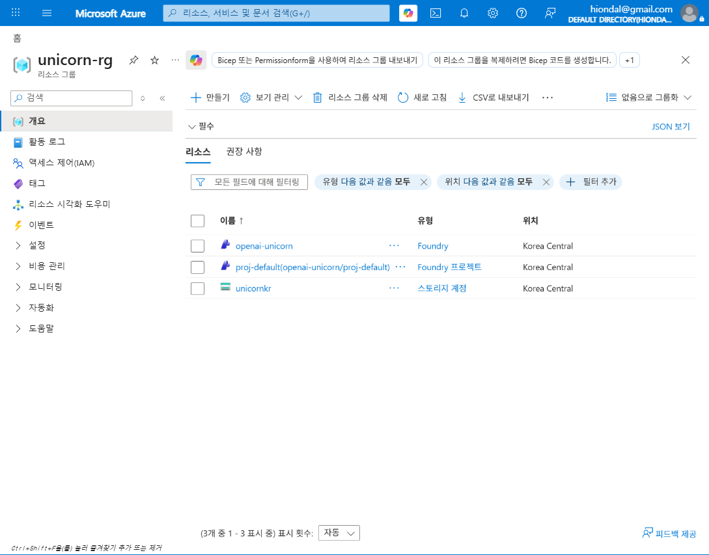
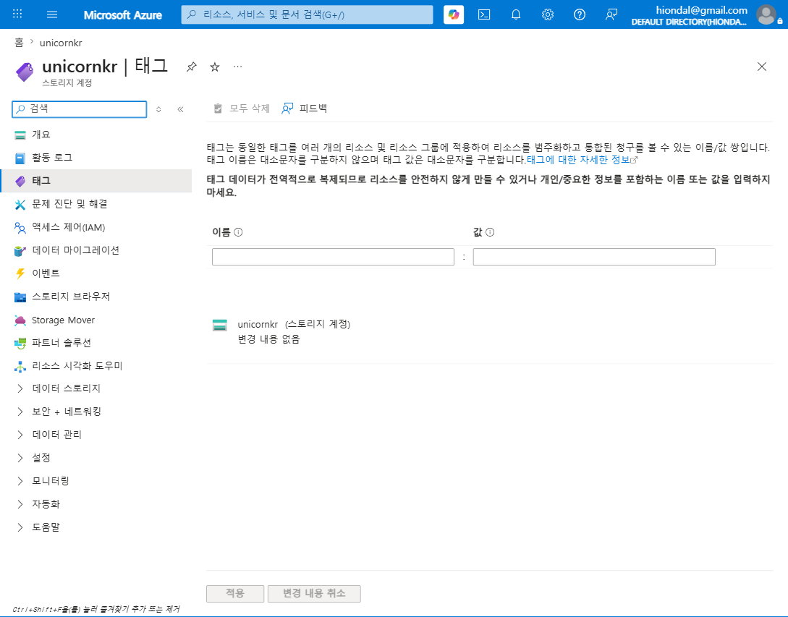
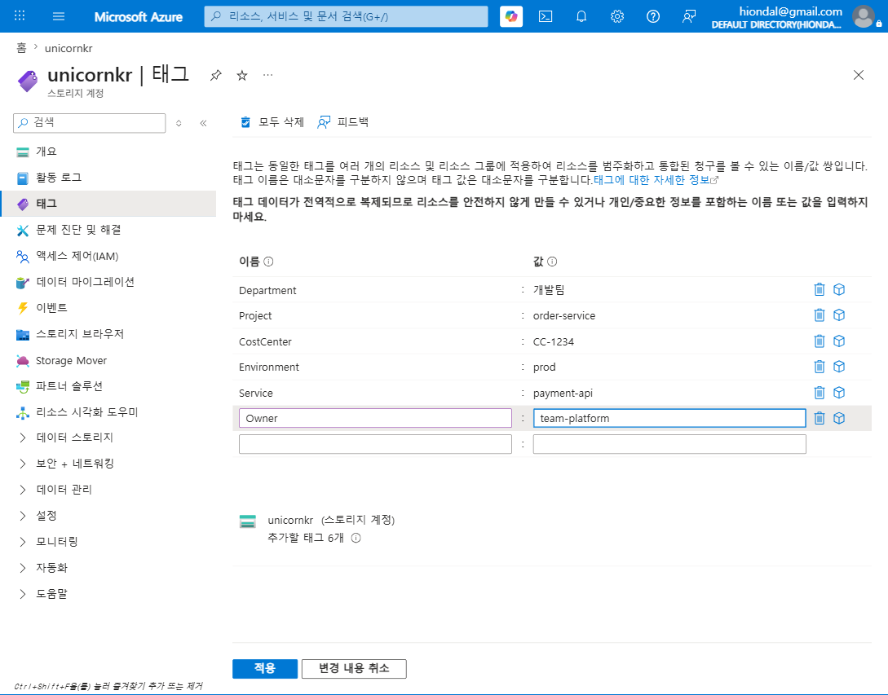
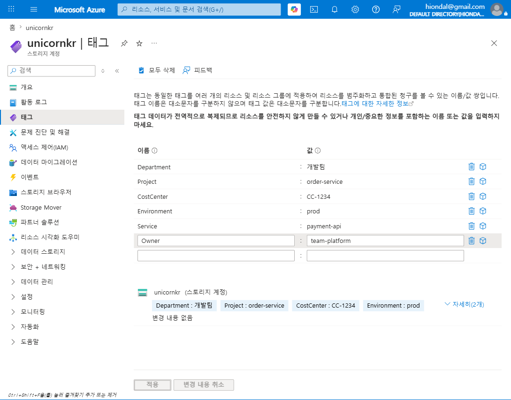
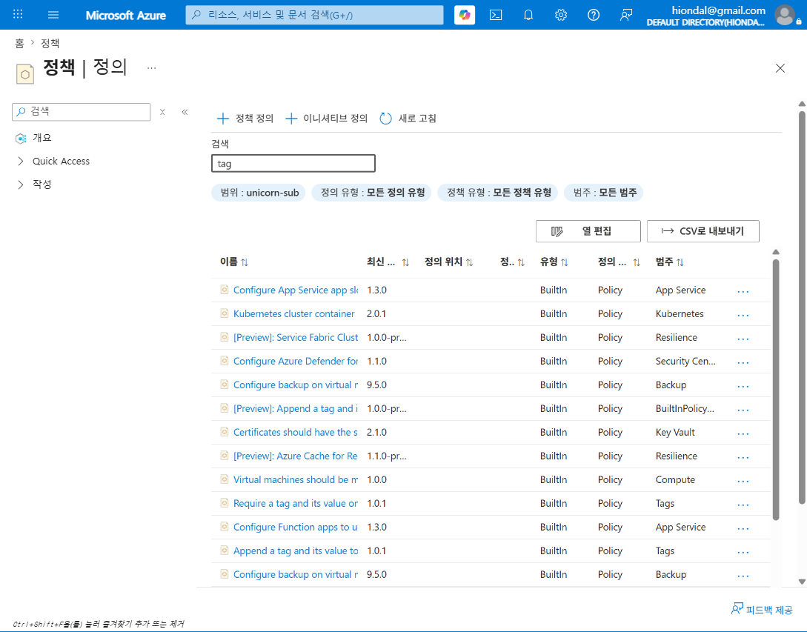
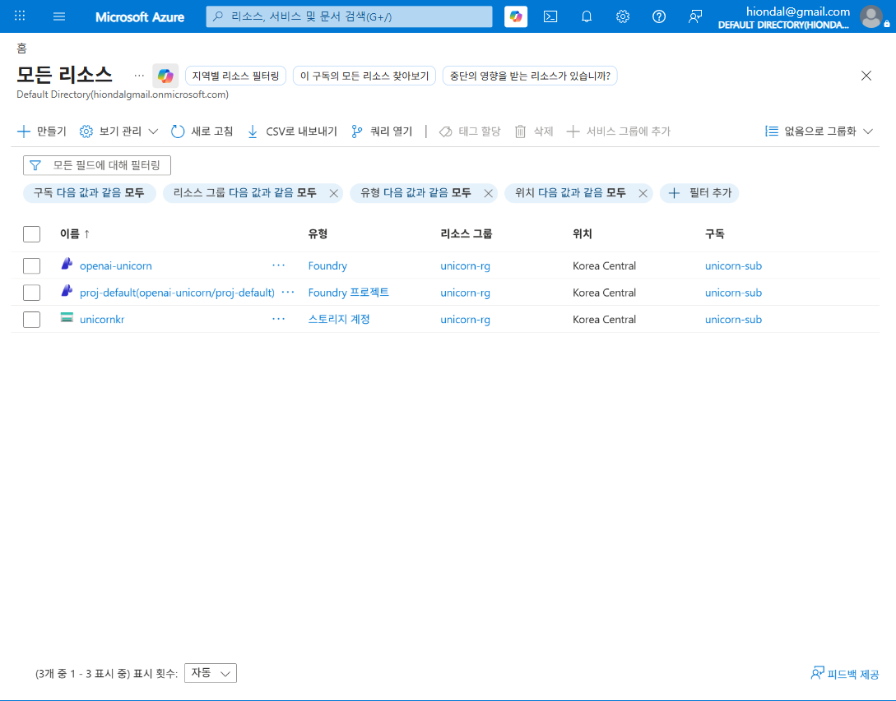

# M2-S1. 태그·명명 거버넌스 (실습, 30분)

> **모듈**: M2 보이기(Inform) — 비용·사용량 가시화  
> **시간**: 10:00–10:30 (30분) · **유형**: 이론+실습 · **MUST 산출물**: 리소스에 6대 태그 부여 스크린샷  
> **학습목표**: 필수 태그 체계·명명 규칙 수립, 태그 정책 강제 이해  
> **사용 Azure 서비스**: Tags, Azure Policy(태그 강제)  
> 📚 **참조**: [`FinOps.md`](../../교재/AM/finops/FinOps.md) 슬라이드 8(태그 기반 추적/할당) · 슬라이드 9(Amortized 별첨)  
> 📖 **1차 출처(FinOps Foundation)**: [Allocation](https://www.finops.org/framework/capabilities/) · [Data Ingestion](https://www.finops.org/framework/capabilities/) · [Governance, Policy & Risk](https://www.finops.org/framework/capabilities/) · [Domains](https://www.finops.org/framework/domains/)  
> 🖥 **실습 환경**: 구독 `unicorn-sub` / 리소스 그룹 `unicorn-rg` / 대상 리소스 `unicornkr`(스토리지 계정)

---

## 🎯 세션 핵심 개념 (deck 슬라이드 8)

> **태깅의 목적** — 비용을 **누가·왜·어디에** 썼는지 추적·할당(공식 Capability **Allocation** · Understand Usage & Cost Domain).  
> **목표: 태그 미적용 리소스 비율 5% 이하** (교육용 자체 기준 · 공식 수치 아님).  
> *"태그가 없으면 비용은 '주인 없는 돈'이 된다."* — 보이기(Inform)의 출발점.

**필수 태그 체계 (6종)** — 비즈니스 3 + 기술 3

| 구분 | 태그 키 | 예시 값 | 용도 |
|---|---|---|---|
| 비즈니스 | `Department` | 개발팀 | 부서별 비용 추적 |
| 비즈니스 | `Project` | order-service | 프로젝트별 비용 할당 |
| 비즈니스 | `CostCenter` | CC-1234 | 비용센터(회계) 연계 |
| 기술 | `Environment` | prod / staging / dev | 환경별 비용 분리 |
| 기술 | `Service` | payment-api | 서비스별 비용 추적 |
| 기술 | `Owner` | team-platform | 비용 책임자 식별 |

**태그 거버넌스 3종** — ① 정책 강제(Tag Policy) ② 미태깅 탐지(주간 스캔) ③ 태그 표준화(명명 규칙)

---

## 🧭 라이브 실습 흐름 (강사 시연 → 수강생 따라하기)

| STEP | 내용 | 화면 | 분 |
|---|---|---|---|
| 0 | 도입 — 왜 태그인가 | (멘트) | 3 |
| 1 | 실습 대상 리소스 확인 | RG 리소스 목록 | 3 |
| 2 | 태그 블레이드 (부여 전) | Tags 블레이드 | 2 |
| 3 | **6대 필수 태그 부여** | 이름/값 입력 | 8 |
| 4 | 적용 & 검증 | 저장 결과 | 4 |
| 5 | 거버넌스① 정책 강제 | Azure Policy | 5 |
| 6 | 거버넌스②③ 미태깅 탐지·표준화 | 모든 리소스 | 3 |
| 7 | 비용 할당 모델 + 브릿지 | (멘트) | 2 |

---

## 🗣 단계별 실습 스크립트 (이미지 덤프 포함)

### STEP 0 · 도입 — 왜 태그인가 (멘트, 3분)
> "M1에서 FinOps의 첫 단계가 **보이기**라고 했죠. 그런데 *무엇으로* 보이게 할까요? 답은 **태그**입니다.  
> 클라우드 청구서엔 '스토리지 계정 1개 $30'만 찍힙니다. 이게 *어느 팀, 어느 서비스, 어느 환경*의 비용인지는 **태그가 없으면 영원히 알 수 없어요.**  
> 그래서 오늘 첫 실습은, 리소스에 **6개의 필수 태그**를 직접 붙여보는 겁니다. 목표는 *미태깅 5% 이하*."

### STEP 1 · 실습 대상 리소스 확인 (3분)
**클릭 경로**: 포털 상단 검색 → `리소스 그룹` → **unicorn-rg**
> "우리 실습 구독 `unicorn-rg`에 리소스 3개가 있습니다. 이 중 표준 리소스인 **`unicornkr`(스토리지 계정)**에 태그를 붙이겠습니다."

### STEP 2 · 태그 블레이드 (부여 전) (2분)
**클릭 경로**: `unicornkr` 클릭 → 왼쪽 메뉴 **태그**
> "리소스 왼쪽 메뉴 **태그**로 들어가면, 지금은 **비어 있습니다**(이름/값 칸이 텅 빔). 바로 이 상태가 *미태깅 리소스* — 비용 추적 불가 상태예요."

### STEP 3 · 6대 필수 태그 부여 (8분) — 핵심 실습 🟢
**입력 방법**: `이름` 칸에 키, `값` 칸에 값 입력 → 한 쌍 입력하면 **새 빈 행이 자동 생성** → 6개 반복
> "이름/값을 한 쌍씩 입력합니다. 한 줄 채우면 아래에 빈 줄이 자동으로 생기니, 6개를 쭉 입력하세요. 값은 실제 팀·서비스에 맞게."

| 이름 | 값 |
|---|---|
| Department | 개발팀 |
| Project | order-service |
| CostCenter | CC-1234 |
| Environment | prod |
| Service | payment-api |
| Owner | team-platform |

> ⚠️ 주의(화면 상단 경고): *"태그 데이터는 전역 복제되므로 개인/민감정보를 이름·값에 넣지 마세요."* / 태그 **이름은 대소문자 무시, 값은 대소문자 구분**.

### STEP 4 · 적용 & 검증 (4분)
**클릭 경로**: 하단 **적용** 클릭 → 저장 → (검증) 새로고침
> "**적용**을 누르면 실제 리소스에 저장됩니다. 저장 후 하단에 태그 칩(Department:개발팀 …)이 뜨고 **'변경 내용 없음'**으로 바뀌면 성공. 이제 이 리소스는 **비용 추적이 가능한 리소스**가  
> 됐습니다."

✅ **MUST 산출물**: 이 화면(6개 태그가 저장된 상태) 스크린샷을 체크리스트에 제출.

### STEP 5 · 거버넌스 ① 태그 정책 강제 (5분)
**클릭 경로**: 포털 검색 → `정책` → **정의** → 검색창에 `tag` 입력
> "사람이 매번 6개를 손으로 붙이면 반드시 빠뜨립니다. 그래서 **Azure Policy로 강제**합니다. `tag`로 검색하면 **Tags 범주 빌트인 정책**들이 나옵니다."
> 💠 태그 정책 강제는 공식 Capability **Governance, Policy & Risk**(Manage the FinOps Practice Domain) 영역 — 태그·할당의 전제를 정책으로 보장.
> - **Require a tag and its value on resources** → 필수 태그 없으면 **생성 차단(Deny)** *(deck: IaC 배포 시 미적용 시 배포 차단)*
> - **Append a tag and its value to resources** → 누락 시 **자동 추가(Modify)**
> - **Inherit a tag from the resource group** → RG 태그를 리소스에 **상속**
>
> 💡 시연만 하고 *할당(Assign)은 설명*으로 — 구독 전체 Deny는 기존 배포에 영향을 줄 수 있어 운영 합의 후 적용.

### STEP 6 · 거버넌스 ② 미태깅 탐지 · ③ 표준화 (3분)
**클릭 경로**: 포털 검색 → `모든 리소스`
> "전체 리소스를 보면 `unicornkr`만 태그가 있고 나머지(`openai-unicorn`, `proj-default`)는 **미태깅**입니다. 이런 미태깅 리소스를 어떻게 *자동으로* 찾을까요?"
> - **Policy 규정 준수(Compliance)**: 위 Require-tag 정책 할당 시, 미준수(=미태깅) 리소스가 목록으로 집계
> - **Resource Graph 쿼리**: `resources | where tags == '{}' or isnull(tags)` → 미태깅 일괄 추출
> - **주간 스캔 리포트**(deck): 위 쿼리를 자동화해 주간 미태깅 리포트 생성
> - **③ 표준화**: 키 철자·대소문자 통일(`Environment` 값은 `prod/staging/dev`만 허용) → 명명 규칙 문서화 + 정책 자동 검증

### STEP 7 · 비용 할당 모델 + 브릿지 (2분, 멘트)
> "태그가 붙으면 이제 **비용을 할당**할 수 있습니다. 성숙도에 따라 4가지 모델이 있어요(deck 슬라이드 8)."
> 📖 공식 정의(FinOps Foundation): "Allocation defines how costs should be apportioned to those responsible  
> for each component of that cost, whether directly or as a shared element." — 즉 비용을 책임 주체에 **직접(direct)**  
> 또는 **공유(shared)**로 배분하는 것이며, 아래 표의 '직접 할당'·'공유 비용 분배'가 이 두 방식에 대응함.

| 모델 | 설명 | 적합 단계 |
|---|---|---|
| Showback | 비용 현황을 *보여주기만* | 초기(Crawl) |
| Chargeback | 실제 비용을 *부서 예산에 청구* | 성숙(Walk~Run) |
| 직접 할당 | 태그 기반 리소스 비용 직접 할당 | 단일 팀 전용 |
| 공유 비용 분배 | 공용 리소스를 사용량 비례 배분 | 공통 인프라(K8s 등) |

> 💡 RI/SP 비용을 서비스별로 공정히 나누려면 **Amortized(분할 상환)** 방식 (→ 별첨, deck 슬라이드 9).  
> *(브릿지)* "이제 태그가 생겼으니, 다음 **M2-S2**에서 이 태그로 **부서·서비스별 비용을 시각화**해 봅니다."

---

## 📋 수강생 실습 체크리스트
- [ ] `unicornkr`(또는 본인 리소스)에 **6대 필수 태그** 부여
- [ ] **적용 후 저장 확인** 스크린샷 (MUST 산출물)
- [ ] Policy 정의에서 `Require a tag…` 빌트인 정책 찾기
- [ ] 본인 구독의 **미태깅 리소스 수** 확인(모든 리소스 / 쿼리)

## 💬 예상 Q&A
- **"태그를 몇 개나 붙여야 하나요?"** → 필수 6개부터. 너무 많으면 관리 안 됨. *미적용 5% 이하*가 1차 목표(교육용 자체 기준 · 공식 수치 아님).
- **"리소스 그룹에만 붙이면 안 되나요?"** → RG 태그는 **리소스에 자동 상속되지 않음**. Inherit 정책으로 상속 필요.
- **"한글 값 써도 되나요?"** → 가능(Department=개발팀). 단 키는 영문 표준 권장, 값 대소문자 구분 주의.
- **"이미 만든 리소스는?"** → Append/Modify 정책으로 일괄 보정 또는 주간 스캔으로 추적.

## 📎 부록 — 명명 규칙(표준화) 권장안
- **키**: PascalCase 영문 고정 (`Department`, `CostCenter`, `Environment` …)
- **값 허용 목록**: `Environment ∈ {prod, staging, dev}` / `CostCenter = CC-숫자4자리` / `Owner = team-*`
- **검증**: Policy `Allowed values` 또는 배포 파이프라인 lint로 자동 검사

---

*작성: 라이브 실습 스크립트(이미지 덤프 포함) · 캡처 = Azure Portal(unicorn-sub, 2026-06) · 개념 출처 = `FinOps.pptx` 슬라이드 8·9*  
*1차 출처 = FinOps Foundation [Capabilities](https://www.finops.org/framework/capabilities/)(Allocation · Data Ingestion · Governance, Policy & Risk) · [Domains](https://www.finops.org/framework/domains/)*
