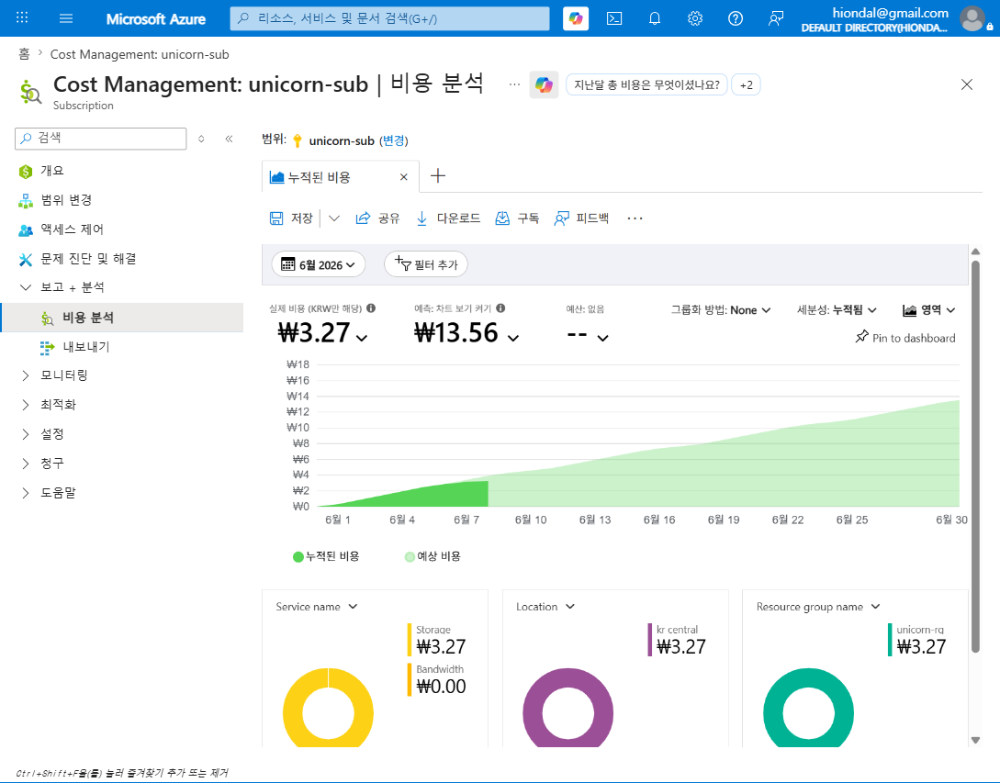
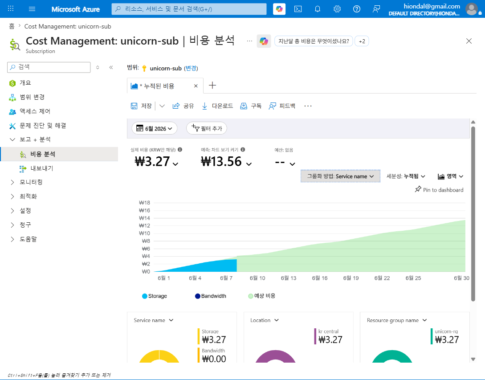
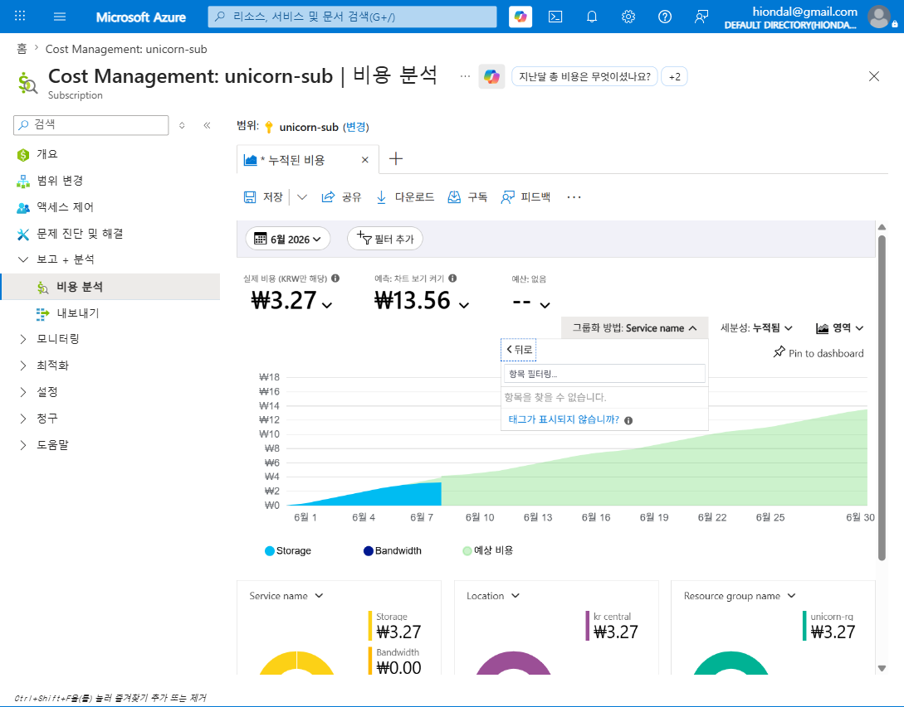
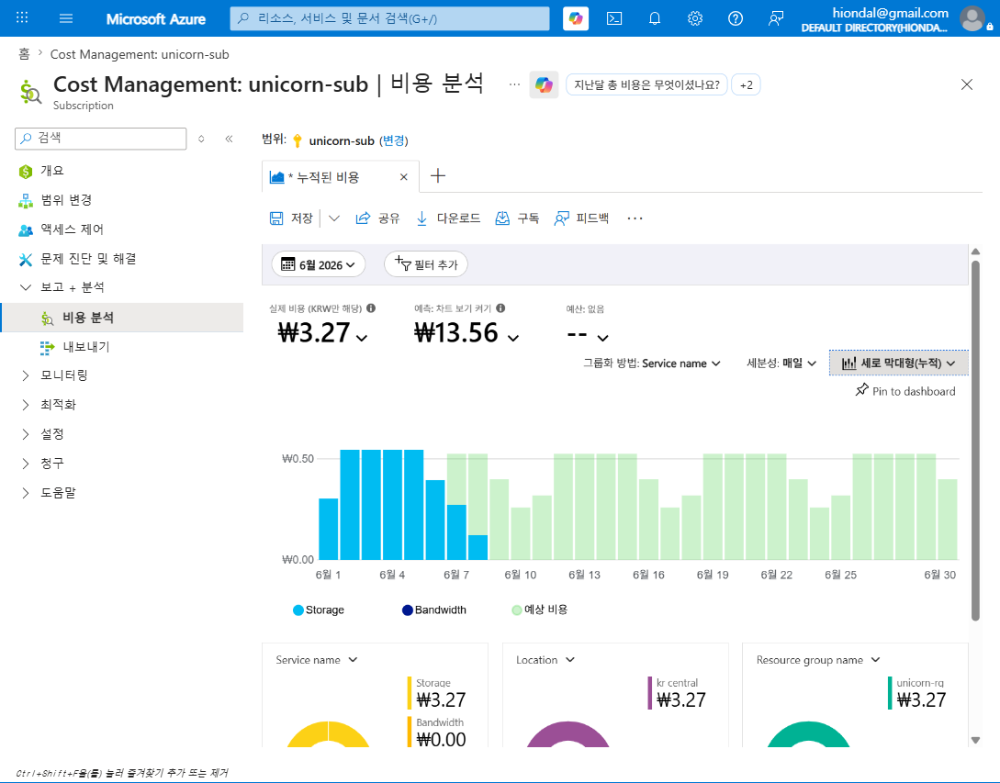

# M2-S2. 비용 가시화 기초 (실습, 25분)

> **모듈**: M2 보이기(Inform) — 비용·사용량 가시화  
> **시간**: 10:30–10:55 (25분) · **유형**: 실습  
> **학습목표**: 조직/서비스별 **월간 비용·추이·증감 요소 시각화**  
> **사용 Azure 서비스**: Cost Management — Cost analysis(비용 분석)  
> 📚 **참조**: [`FinOps.md`](../../교재/AM/finops/FinOps.md) 슬라이드 6(보이기 — 대시보드 구성·비용 할당) · 슬라이드 7(Azure Cost Management 도구)  
> 📖 **1차 출처(FinOps Foundation)**: [Phases — Inform(Visibility & Allocation)](https://www.finops.org/framework/phases/) · [Capabilities — Reporting & Analytics · Allocation](https://www.finops.org/framework/capabilities/) · [Domains — Understand Usage & Cost](https://www.finops.org/framework/domains/)  
> 🖥 **실습 환경**: 구독 `unicorn-sub`(범위) · 앞 세션 M2-S1에서 부여한 태그 활용

---

## 🎯 세션 핵심 개념

> **"측정할 수 없으면 관리할 수 없다."(M1)** — 그 *측정·시각화* 도구가 **Cost Management의 비용 분석**입니다.  
> M2-S1에서 **태그를 붙였고**, 이번엔 그 데이터로 **누가·어디에·얼마를 쓰는지** 그림으로 봅니다. = 보이기(Inform)의 실제 실행.

> 📌 **공식 프레임워크 정렬**: 이 세션의 비용 시각화·분석은 공식 Phase **Inform(부제 "Visibility & Allocation")** 에 속하며, 공식 Capability **Reporting & Analytics**(보고·분석)와 **Allocation**(비용 할당) — 모두 **Understand Usage & Cost** Domain — 의 실습임.

**이번 실습에서 다루는 4가지 조작**
1. **기간/통화/예측** 확인 — 이번 달 실제 비용 vs 예측
2. **그룹화(Group by)** — 서비스·리소스그룹·**태그**별로 쪼개 보기
3. **세분성(Granularity)** — 누적 ↔ 일별/월별 **추이**
4. **필터·저장·공유·예약** — 보기 재사용·정기 메일

---

## 🧭 라이브 실습 흐름 (타임박스)

| STEP | 내용 | 화면 | 분 |
|---|---|---|---|
| 0 | 도입 — 무엇을 보나 | (멘트) | 2 |
| 1 | 비용 분석 진입 + 누적 비용 기본 뷰 | 영역 차트 | 6 |
| 2 | 서비스별 그룹화 | 색상 분해 | 5 |
| 3 | **태그별 그룹화 + 반영 지연** | 태그 그룹 | 5 |
| 4 | 일별 **추이 차트** | 세로 막대 | 5 |
| 5 | 필터·저장·공유·예약 + 브릿지 | (멘트) | 2 |

---

## 🗣 단계별 실습 스크립트 (이미지 덤프 포함)

### STEP 0 · 도입 (멘트, 2분)
> "청구서엔 '이번 달 ₩X' 한 줄만 옵니다. 이걸 *어느 서비스·어느 팀·며칠에* 썼는지로 **쪼개 보는 것**이 비용 분석이에요. M2-S1에서 붙인 태그가 여기서 빛을 발합니다."

### STEP 1 · 비용 분석 진입 + 누적 비용 기본 뷰 (6분)
**클릭 경로**: 포털 검색 → `비용 관리`(Cost Management) → **비용 분석** → (범위가 `unicorn-sub`인지 확인) → 새 경험이면 **모든 보기 찾아보기 → 누적된 비용**
> "왼쪽 위 **범위(Scope)**가 핵심 — 구독/RG/관리그룹 단위로 비용을 봅니다. 기본 **누적된 비용** 뷰는 *이번 달 실제 비용*과 *월말 예측*을 함께 보여줘요."
> - 화면: **실제 비용 ₩3.27**(KRW 표기) · **예측 ₩13.56** · 영역 그래프(진한 색=실제, 옅은 색=예측)
> - 하단 **도넛 3개**(Service name / Location / Resource group name)로 자동 분해 — 한눈에 "어디에 썼나"
> 💡 금액이 작은 건 실습용 eval 구독이라 그렇고, **분석 방법은 실제 운영과 동일**합니다.

### STEP 2 · 서비스별 그룹화 (5분)
**클릭 경로**: **그룹화 방법: None** → **Service name** 선택
> "그룹화를 **Service name**으로 바꾸면 차트가 서비스별 색으로 갈립니다 — 여기선 **Storage(파랑)·Bandwidth(남색)**. '비용의 정체'가 드러나는 순간이에요. 같은 방식으로  
> *리소스 그룹·위치·미터(Meter)* 별로도 볼 수 있습니다."

### STEP 3 · 태그별 그룹화 + ⚠️ 반영 지연 (핵심 학습, 5분)
**클릭 경로**: **그룹화 방법** → **태그** → (태그 키 선택)
> "이제 M2-S1에서 붙인 태그로 그룹화해 봅니다. 그런데 — **'항목을 찾을 수 없습니다'**가 뜹니다. 왜일까요?"  
> 📌 태그별 비용 귀속은 공식 Capability **Allocation**(비용을 책임 주체별로 배분)의 핵심 — *"costs should be apportioned to those responsible"*(FinOps Foundation 정의).  
> 🔑 **핵심 포인트**: **태그는 '붙인 시점 이후의 사용분'부터 비용 레코드에 반영**됩니다(보통 **24시간 이상 지연**). 방금 붙인 태그는 아직 비용 데이터에 없어요.  
> → 교훈: **태그는 비용이 발생하기 *전에*, 리소스 생성 시점에 붙여야** 한다(그래서 M2-S1의 *정책 강제*가 중요). 며칠 뒤 다시 보면 `Department`/`Service`별로 비용이 갈립니다.

### STEP 4 · 일별 추이 차트 (5분)
**클릭 경로**: **세분성: 누적됨** → **매일** + 차트 종류 **영역** → **세로 막대형(누적)**
> "세분성을 **매일**로, 차트를 **세로 막대(누적)**로 바꾸면 **일별 추이**가 보입니다. 막대가 갑자기 *튀는 날* = 이상 비용 후보예요. (옅은 막대는 예측분)  
> 이 '추이로 증감을 읽는 법'이 다음 **M2-S3 이상비용 탐지**(공식 Capability **Anomaly Management** · Understand Usage & Cost Domain)의 출발점입니다."

### STEP 5 · 필터·저장·공유·예약 + 브릿지 (멘트, 2분)
> "마지막으로 상단 도구:
> - **필터 추가**: 특정 RG·서비스·태그만 한정해서 보기
> - **저장**: 만든 뷰를 *내 보기*로 저장 → 재사용
> - **공유/다운로드(CSV)**: 보고용 내보내기
> - **구독(예약)**: 이 뷰를 **정기 이메일**로 자동 발송(주간 비용 리포트 자동화)
>
> *(브릿지)* "추이에서 '튀는 날'을 사람이 매번 볼 순 없죠. 그래서 다음 **M2-S3**에서 **이상 비용을 자동 탐지·알림**으로 잡습니다."

---

## 📋 수강생 실습 체크리스트
- [ ] 비용 분석에서 **범위 = 본인 구독** 확인
- [ ] **그룹화: Service name** 으로 서비스별 비용 확인
- [ ] **그룹화: 태그** 시도 → (반영 지연이면) 캡처 + 이유 메모
- [ ] **세분성: 매일 + 세로 막대** 로 추이 차트 작성 (스크린샷)

## 💬 예상 Q&A
- **"방금 붙인 태그가 왜 안 보여요?"** → 태그는 *이후 사용분*부터 반영(24h+ 지연). 생성 시점 태깅 + 정책 강제가 답.
- **"실제 비용 vs 상각(Amortized) 차이?"** → 상단 '실제 비용' 드롭다운에서 *상각 비용*으로 전환 가능(RI/SP 분배 시 중요, deck 슬라이드 9).
- **"통화가 원(₩)이네요?"** → 청구 통화 기준 표기. 멀티 통화는 FOCUS/Export로 정규화(M2-S4).
- **"매번 들어와서 봐야 하나요?"** → 뷰 저장 + **구독(예약 이메일)**으로 주간 자동 발송.

## 📎 부록
**그룹화(Group by) 주요 차원**: Service name · Resource group name · Location · Meter(category) · Resource type · **태그** ·  
Charge type · Reservation  
**세분성**: 없음 / 누적됨 / 매일 / 매월 · **차트 종류**: 영역 / 꺾은선형 / 세로 막대형(누적·그룹화) / 테이블

---

*작성: 라이브 실습 스크립트(이미지 덤프 포함) · 캡처 = Azure Cost Management(unicorn-sub, 2026-06) · 개념 출처 = `FinOps.pptx` 슬라이드 6·7*  
*1차 출처 = FinOps Foundation [Phases](https://www.finops.org/framework/phases/) · [Capabilities](https://www.finops.org/framework/capabilities/) · [Domains](https://www.finops.org/framework/domains/)*
