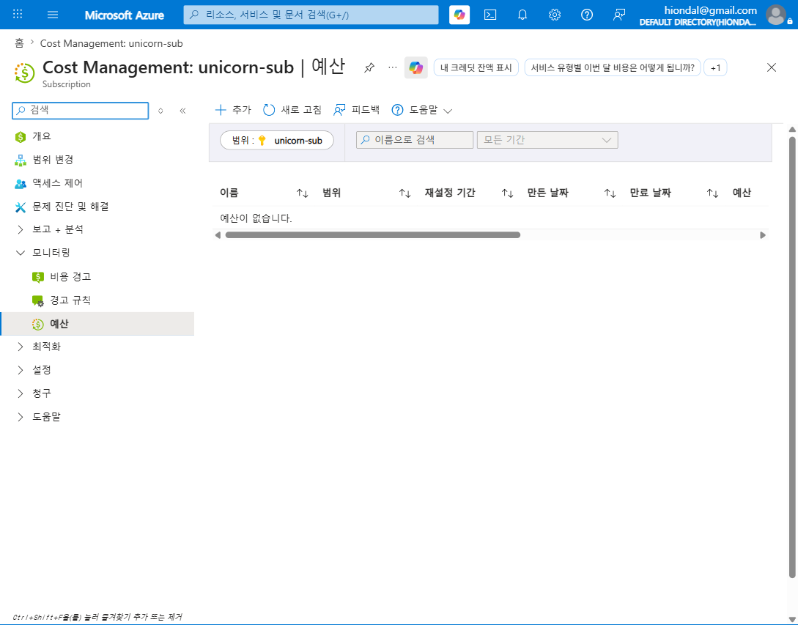
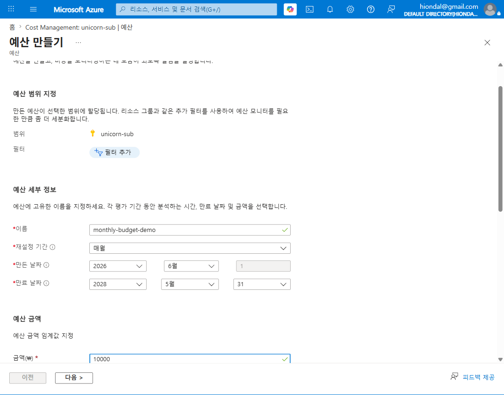
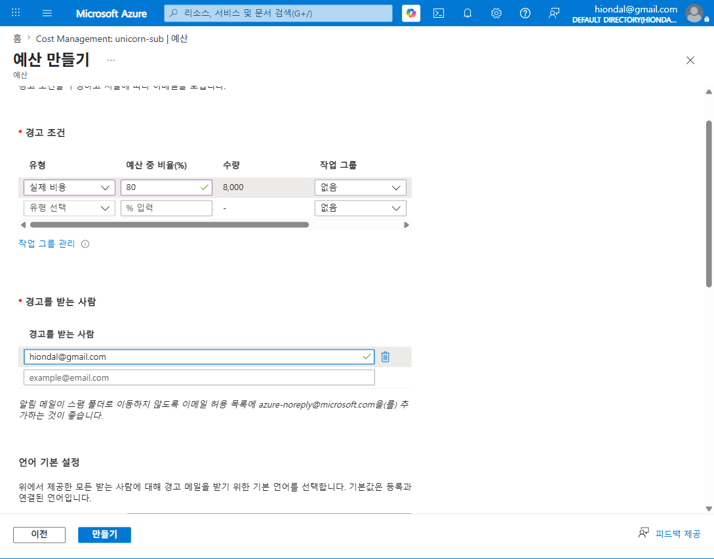
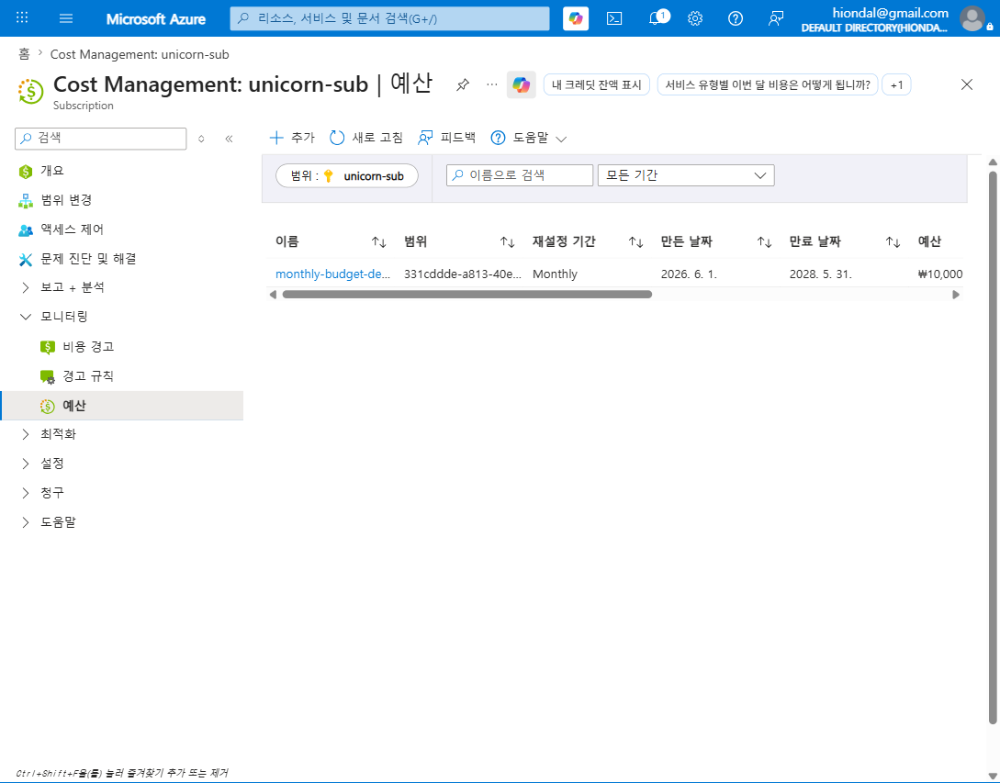
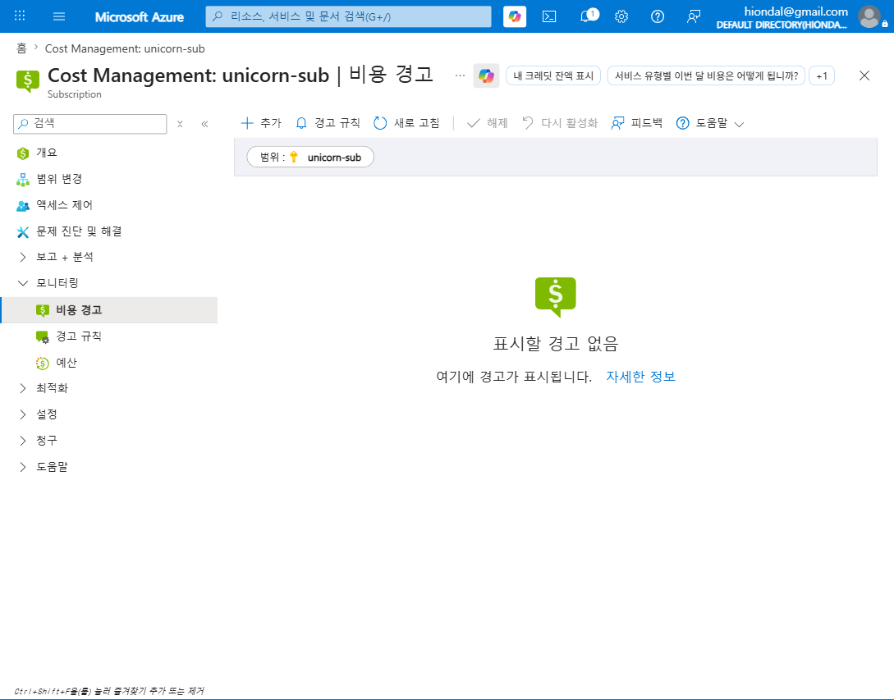

# M2-S3. 이상비용 탐지·알림 (실습, 30분)

> **모듈**: M2 보이기(Inform) — 비용·사용량 가시화  
> **시간**: 10:55–11:25 (30분) · **유형**: 실습  
> **학습목표**: 리소스 단위 이상탐지 설정 → 알림 수신 → **메시지 해석·증감 원인 파악**  
> **사용 Azure 서비스**: Budgets, Cost alerts, Cost anomaly  
> 📚 **참조**: [`FinOps.md`](../../교재/AM/finops/FinOps.md) 슬라이드 7(이상 비용 탐지 체계)  
> 📖 **1차 출처(FinOps Foundation)**: [Capabilities — Anomaly Management](https://www.finops.org/framework/capabilities/) ·
> [Domains — Understand Usage & Cost](https://www.finops.org/framework/domains/)  
> 🖥 **실습 환경**: 구독 `unicorn-sub` · 알림 수신 이메일 `hiondal@gmail.com`

---

## 🎯 핵심 개념 — 이상 비용 탐지 체계 (deck 슬라이드 7)

> 이 세션은 공식 Capability **Anomaly Management**(Understand Usage & Cost Domain)에 정렬됨 —
> FinOps Foundation 정의는 "비정상 비용 이벤트를 **적시에 탐지·식별·규명·알림·관리**(detect, identify, clarify,
> alert on, and manage unexpected cost events in a timely manner)하여 비즈니스 영향을 최소화하는 역량"임.
> 예산 알림은 별도 Capability **Budgeting**(Quantify Business Value Domain)에 속함.

> **수집 → 분석 → 탐지 → 대응 → 예측** 의 5단계 순환. 오늘은 그중 **탐지·대응의 입구**인 *예산·알림*을 만듭니다.

| 단계 | 활동 | 도구/방법 |
|---|---|---|
| 수집 | 청구 데이터 자동 중앙화 | Cost Management Exports |
| 분석 | 일/주별 추이 파악 | 비용 분석(M2-S2) |
| **탐지** | 예상 범위 벗어난 비용 식별 | **Budget 임계값 / Anomaly 자동 감지** |
| **대응** | 원인 분석·조치 | **알림 메시지 → 리소스/증감액/태그 추적** |
| 예측 | 월말 예측·예산 대비 | Forecasting |

**두 가지 탐지 방식 — 반드시 구분**
| | **예산(Budget) 알림** | **이상(Anomaly) 탐지** |
|---|---|---|
| 트리거 | *내가 정한 한도*(예: 월 ₩10,000)의 80% 초과 | *AI가* 평소 패턴 대비 **비정상 급증** 자동 감지 |
| 설정 | 직접 생성(임계값·이메일) | 설정 불필요(자동) |
| 성격 | 능동적 한도 관리 | 수동적 패턴 이탈 경보 |

---

## 🧭 라이브 실습 흐름 (타임박스)

| STEP | 내용 | 화면 | 분 |
|---|---|---|---|
| 0 | 도입 — 왜 알림인가 | (멘트) | 3 |
| 1 | 예산 목록 진입 | Budgets | 3 |
| 2 | **예산 만들기**(범위·이름·기간·금액) | 생성 폼 1단계 | 7 |
| 3 | **경고 조건**(실제 80% + 이메일) | 생성 폼 2단계 | 7 |
| 4 | 예산 생성 확인 | 목록 | 3 |
| 5 | 비용 경고/이상 탐지 + **메시지 해석** | Cost alerts | 5 |
| 6 | 대응 프로세스 + 브릿지 | (멘트) | 2 |

---

## 🗣 단계별 실습 스크립트 (이미지 덤프 포함)

### STEP 0 · 도입 (멘트, 3분)
> "M2-S2에서 일별 추이로 '튀는 날'을 눈으로 봤죠. 그런데 **사람이 매일 대시보드를 볼 순 없습니다.** 그래서 *자동으로 잡아 이메일로 쏘는* 장치가 **예산 알림**과 **이상 탐지**예요. 오늘은  
> 직접 예산+알림을 만들고, 알림이 오면 어떻게 읽는지 배웁니다."

### STEP 1 · 예산 목록 진입 (3분)
**클릭 경로**: Cost Management → **모니터링 > 예산** → (범위 `unicorn-sub` 확인)
> "처음엔 **'예산이 없습니다'**. 상단 **추가**로 새 예산을 만듭니다."

### STEP 2 · 예산 만들기 — 범위·이름·기간·금액 (7분)
**클릭 경로**: **추가** → ① 예산 만들기
> "입력 항목:
> - **범위**: `unicorn-sub` (필터로 RG·태그 단위 세분화 가능)
> - **이름**: `monthly-budget-demo`
> - **재설정 기간**: 매월(Monthly) — 매달 0부터 다시 카운트
> - **만든/만료 날짜**: 평가 기간
> - **예산 금액**: **₩10,000** (이 달에 쓸 한도)"

### STEP 3 · 경고 조건 — 실제 80% + 이메일 (7분)
**클릭 경로**: 다음 → ② 경고 설정
> "여기가 핵심입니다.
> - **유형**: **실제 비용**(이미 쓴 돈) / *예측*(이대로면 넘을 돈) 중 선택 → **실제 비용** 선택
> - **예산 중 비율(%)**: **80** → 한도의 80%(=**₩8,000**) 도달 시 발동(수량 자동 계산)
> - **경고 받는 사람**: `hiondal@gmail.com`
>
> 💡 *팁*: 보통 **실제 80% + 예측 100%** 두 줄을 같이 겁니다. 스팸 방지로 허용목록에 `azure-noreply@microsoft.com` 추가."

### STEP 4 · 예산 생성 확인 (3분)
**클릭 경로**: **만들기**
> "목록에 **`monthly-budget-demo` / Monthly / ₩10,000**이 생기면 완료. 이제 이 달 실제 비용이 ₩8,000을 넘는 순간 자동으로 메일이 옵니다."

### STEP 5 · 비용 경고 / 이상 탐지 + 메시지 해석 (5분)
**클릭 경로**: 모니터링 → **비용 경고**
> "**비용 경고**는 *예산 초과 알림*과 *이상 탐지 알림*이 모이는 곳입니다. 지금은 한도를 안 넘었고 이상도 없어 **'표시할 경고 없음'**이에요(정상)."
>
> 🔑 **알림이 오면 이렇게 읽는다 (대응의 핵심)**:
> 1. **어느 리소스/리소스그룹?** — 범위 식별
> 2. **얼마나 늘었나(증감액)?** — 영향 규모
> 3. **원인은?** — 어느 *서비스/태그*에서 발생 → **여기서 M2-S1 태그가 빛난다**(Owner/Department 태그로 *누구 책임*까지 즉시 추적)
>
> ⚙️ **이상 탐지(Anomaly)** 는 별도 설정 없이 Azure가 **평소 패턴 대비 급증을 ML로 자동 감지**해 이 화면에 띄웁니다.

### STEP 6 · 대응 프로세스 + 브릿지 (멘트, 2분)
> "알림은 *끝*이 아니라 **대응의 시작**입니다(deck: 탐지→**대응** = 원인 분석 → *권고·승인·적용·검증*). '왜 늘었지?'를 태그로 추적해 조치하는 거죠.  
> *(브릿지)* "그런데 알림 메시지는 '비용(₩)'을 말합니다. '얼마나 *썼는지*(사용량)'는 다른 축이에요. 다음 **M2-S4**에서 **사용량(Usage Quantity) 전용 분석**을 봅니다."

---

## 📋 수강생 실습 체크리스트
- [ ] 본인 구독에 **월 예산 생성**(이름·금액·기간)
- [ ] **실제 80% 알림 + 이메일** 설정
- [ ] 예산 목록에 생성 확인 (스크린샷)
- [ ] **비용 경고** 위치 확인 + 알림 메시지 3요소(리소스/증감액/원인) 숙지

## 💬 예상 Q&A
- **"예산 알림 vs 이상 탐지 차이?"** → 예산=*내가 정한 한도* 기준 / 이상=*AI 자동* 패턴 이탈. 둘 다 켜라.
- **"예측(Forecasted) 알림은?"** → '이대로 가면 월말에 넘는다'를 미리 경고. 실제 80% + 예측 100% 조합 권장.
- **"알림 왔는데 원인을 모르겠어요."** → 태그(Service/Owner)로 비용 분석 그룹화 → 발생원 추적. *그래서 태깅이 선행되어야 함*(M2-S1).
- **"리소스 단위로 더 잘게?"** → 예산 범위에 RG/태그 **필터** 추가 또는 작업 그룹(Action Group)으로 Webhook/Logic App 연동.

## 📎 부록 — 알림 메시지 해석 체크리스트
| 읽을 항목 | 질문 | 활용 |
|---|---|---|
| 리소스/RG | 어디서? | 범위 좁히기 |
| 증감액(₩) | 얼마나? | 우선순위 |
| 원인 서비스/태그 | 무엇이·누가? | 책임자 통보(Owner 태그) |
| 발생 시점 | 언제부터? | 배포·이벤트 연관 |

---

*작성: 라이브 실습 스크립트(이미지 덤프 포함) · 실제 생성 = 예산 `monthly-budget-demo`(unicorn-sub, ₩10,000/월, 실제 80% 알림) ·  
개념 출처 = `FinOps.pptx` 슬라이드 7*  
*1차 출처 = FinOps Foundation [Capabilities](https://www.finops.org/framework/capabilities/) ·
[Domains](https://www.finops.org/framework/domains/) — 본 세션 정렬 Capability: **Anomaly Management** ·
**Budgeting**. 예산 금액 ₩10,000 / 임계 80%는 교육용 자체 실습값(공식 수치 아님)*
