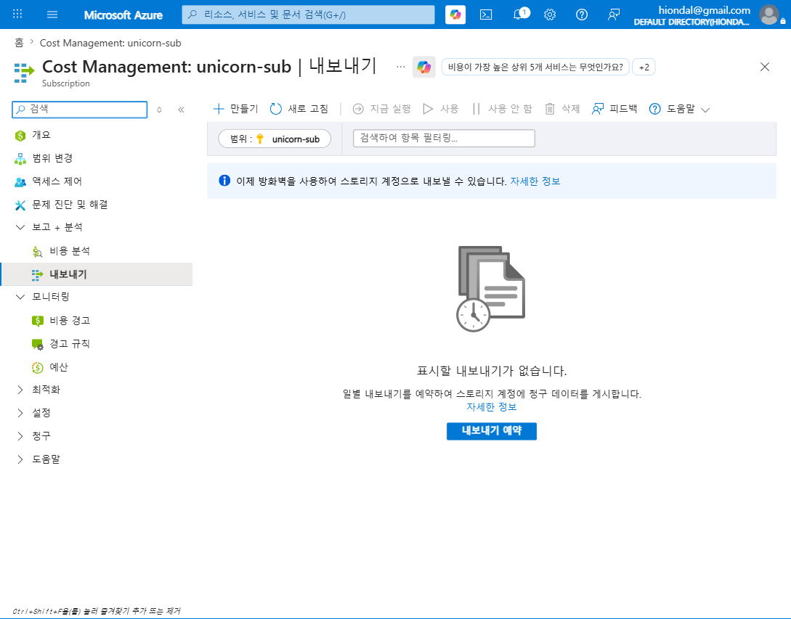
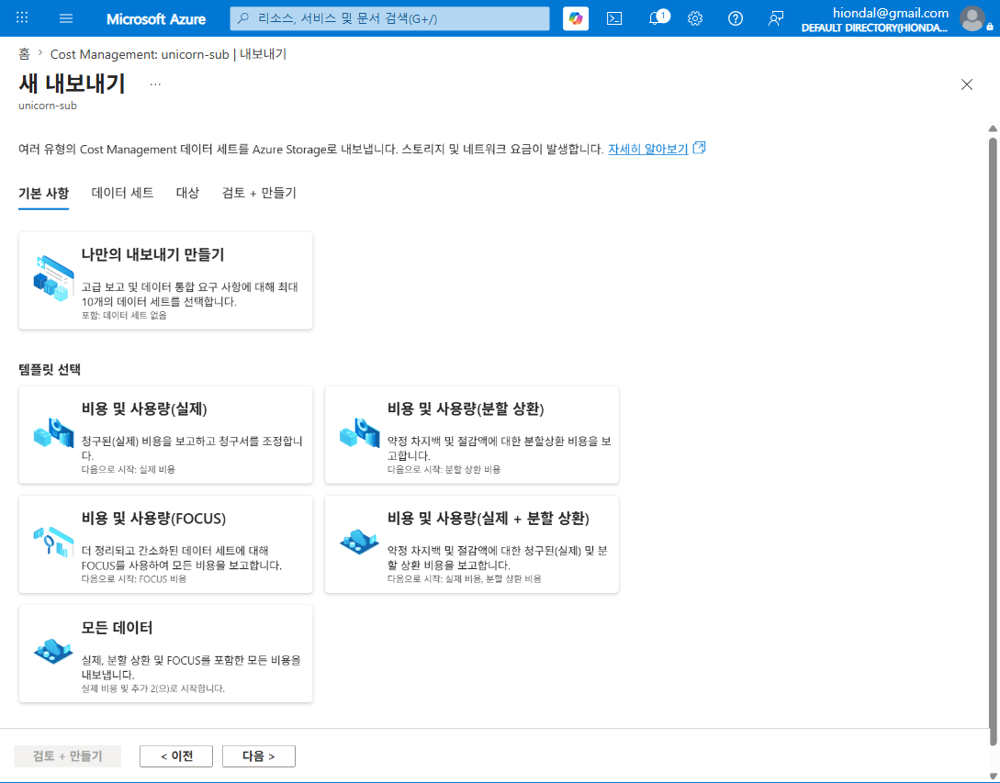
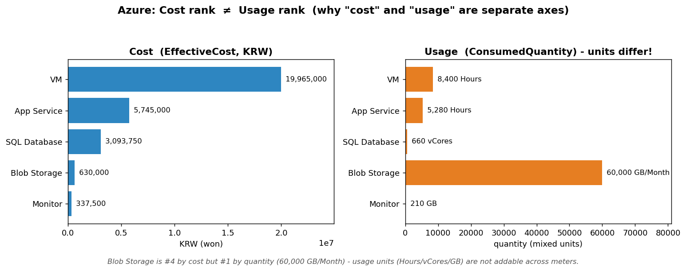

# M2-S4. 사용량(Usage) 전용 분석 (실습, 25분 · 독립 세션)

> **모듈**: M2 보이기(Inform) · **시간**: 11:25–11:50 (25분) · **유형**: 실습  
> **독립 세션**('묻히기 쉬운 항목') — *비용(₩)이 아닌 **사용량(Usage Quantity)**을 분리 분석*  
> **학습목표**: 청구데이터에서 '비용'과 '사용량(Usage/Consumed Quantity)'을 **분리**하여 추이·효율 분석  
> **사용 Azure 서비스**: Cost Management **Exports(FOCUS)**  
> 📚 **참조**: [`FinOps.md`](../../교재/AM/finops/FinOps.md) 슬라이드 7(Azure 도구·FOCUS), 13(FOCUS 표준)  
> 📖 **1차 출처(FinOps Foundation)**: [Reporting & Analytics](https://www.finops.org/framework/capabilities/) ·
> [Understand Usage & Cost Domain](https://www.finops.org/framework/domains/) · [Inform Phase](https://www.finops.org/framework/phases/)  
> 🖥 **데이터**: 동봉 FOCUS 샘플 `out/focus-normalized.csv`(멀티 CSP 2,335행 중 **Azure 930행** 필터)

---

## 🎯 핵심 — 왜 '사용량'을 따로 보나

> 사용량 분리 분석은 공식 Capability **Reporting & Analytics**(Understand Usage & Cost Domain)에 속하며,
> 공식 Phase **Inform**("Visibility & Allocation")의 활동임 — 청구데이터를 검토해 비용·사용량·효율을 가시화함.

> **비용(₩)** = "얼마 *냈나*" / **사용량** = "얼마나 *썼나*". **서로 다른 축**입니다.
> - 사용량 그대로인데 **비용↑** → 단가 인상 (내 탓 아님)
> - 비용 그대로인데 **사용량↑** → 효율 개선/할인 적용 (잘한 것)
> - 진짜 효율(**단위당 비용** = 비용 ÷ 사용량)은 **사용량 없이는 계산 불가** → M6 단위경제의 토대

⚠️ **실무 포인트(라이브 확인됨)**: 새 **Cost analysis 화면엔 '사용량' 메트릭이 없습니다**(실제 비용 / 상각된 비용만). → **사용량은 FOCUS Export(CSV)로 분리 분석**해야  
합니다. *그래서 이 세션이 독립 세션입니다.*

---

## 🧭 라이브 실습 흐름

| STEP | 내용 | 화면/자료 | 분 |
|---|---|---|---|
| 0 | 도입 — 비용≠사용량 | (멘트) | 3 |
| 1 | FOCUS 데이터는 어디서 나오나 | Exports 블레이드 | 4 |
| 2 | **FOCUS 내보내기 템플릿** | 새 내보내기 | 5 |
| 3 | FOCUS CSV 컬럼 구조 | 컬럼 표 | 5 |
| 4 | **비용 vs 사용량 분리 분석** | 차트+표 | 6 |
| 5 | 단위당 비용 + 브릿지 | (멘트) | 2 |

---

## 🗣 단계별 실습 스크립트 (이미지 덤프 포함)

### STEP 0 · 도입 (멘트, 3분)
> "지금까지 본 건 전부 '돈(₩)'이었죠. 그런데 *'우리가 GPU를 몇 시간 돌렸나', 'Blob에 몇 GB 쌓였나'* 는 비용과 **다른 숫자**입니다. 이걸 따로 봐야 *진짜 효율*이 보여요."

### STEP 1 · FOCUS 데이터는 어디서 나오나 — Exports (4분)
**클릭 경로**: Cost Management → **보고 + 분석 > 내보내기(Exports)**
> "비용 분석 화면은 '보기'용이고, **원본 상세 데이터(사용량 컬럼 포함)**는 **Exports**로 스토리지에 내보내 받습니다. 처음엔 '표시할 내보내기가 없습니다' — **만들기**로 생성합니다."

### STEP 2 · FOCUS 내보내기 템플릿 (5분)
**클릭 경로**: **만들기** → 템플릿 선택
> "템플릿이 5종 — 실제 / 분할 상환 / **FOCUS** / 실제+분할상환 / 모든 데이터. 우리는 **비용 및 사용량(FOCUS)**를 고릅니다.  
> **FOCUS**(FinOps Open Cost & Usage Specification)는 *CSP마다 다른 청구 포맷을 통일된 스키마로 정규화*한 표준이에요(AWS/Azure/GCP를 같은 컬럼으로). 이후:  
> 대상(스토리지 계정) 지정 → **일별 예약** → CSV가 매일 적재."

### STEP 3 · FOCUS CSV의 컬럼 구조 — 비용 칸 vs 사용량 칸 (5분)
> "내보낸 FOCUS CSV를 열면, **비용 컬럼과 사용량 컬럼이 명확히 분리**돼 있습니다. (샘플 37컬럼 중 핵심)"

| 성격 | 컬럼 | 예시 | 의미 |
|---|---|---|---|
| 💰 **비용** | `BilledCost` / `EffectiveCost` | 19824.0 | 청구/실효 비용(₩) |
| 💰 비용 | `AmortizedCost_KRW` | 13824.0 | 분할상환 비용 |
| 📏 **사용량** | `ConsumedQuantity` | 24.0 | **얼마나 썼나** |
| 📏 사용량 | `ConsumedUnit` | Hours | 사용량 **단위** |
| 🏷 차원 | `ServiceName` / `ServiceProviderName` | VM / Microsoft Azure | 서비스·CSP |
| 🏷 차원 | `Tags` | {"Owner":...} | 태그(M2-S1) |
| 🤖 AI확장 | `TokenCountInput/Output`,`GpuHours` | … | AI 사용량(슬라이드 18) |

> 💡 Azure 네이티브 컬럼명은 `UsageQuantity`, **FOCUS 표준명은 `ConsumedQuantity`/`PricingQuantity`** — 같은 '사용량'을 표준화한 것.

### STEP 4 · 비용 vs 사용량 분리 분석 (6분) 🟢 핵심
**실습**: Azure 930행을 서비스별로 집계 → **비용(₩)** 과 **사용량(ConsumedQuantity)** 을 *나란히* 비교

| 서비스 | 비용(₩) | 사용량 | 비용순위 | 사용량순위 |
|---|--:|---|:--:|:--:|
| Virtual Machines | 19,965,000 | 8,400 Hours | 1 | 2 |
| App Service | 5,745,000 | 5,280 Hours | 2 | 3 |
| SQL Database | 3,093,750 | 660 vCores | 3 | 4 |
| **Blob Storage** | 630,000 | **60,000 GB/Month** | 4 | **1** |
| Monitor | 337,500 | 210 GB | 5 | 5 |

> 🔑 **핵심 발견**: **Blob은 비용 4위인데 사용량은 1위(60,000 GB/Month)**. 왜? *단위(Hours·vCores·GB)가 제각각이고 단가가 다르기 때문*. →  
> **사용량은 미터(meter)별로만 의미 있고, 서비스 간 단순 합산은 무의미.** 비용처럼 ₩으로 더할 수 없습니다.  
> ※ 위 표의 비용·사용량 수치는 동봉 FOCUS 샘플(HBT 가상 데이터) 기반 **교육용 자체 수치(공식 수치 아님)**임.

### STEP 5 · 단위당 비용(효율) + 브릿지 (멘트, 2분)
> "비용과 사용량을 **나누면** '효율'이 나옵니다 — **단위당 비용**:
> - VM: 19,965,000 ÷ 8,400h ≈ **₩2,377/시간**
> - SQL: 3,093,750 ÷ 660 ≈ **₩4,687/vCore**
> - Blob: 630,000 ÷ 60,000 ≈ **₩10.5/GB·월**
>
> 이 '단위당 비용'이 **줄고 있으면 건강한 성장**입니다(M6 단위경제). *(브릿지)* "그런데 이 비용·사용량을 *조직(부서/서비스)* 관점으로 묶으려면 태그+조직정보 결합이 필요하죠. 다음  
> **M2-S5 CMDB 조인**입니다."

---

## 📋 수강생 실습 체크리스트
- [ ] Exports에서 **FOCUS 템플릿** 위치 확인
- [ ] FOCUS CSV에서 **비용 컬럼(EffectiveCost)** 과 **사용량 컬럼(ConsumedQuantity/Unit)** 구분
- [ ] 한 서비스의 **단위당 비용**(비용÷사용량) 직접 계산
- [ ] "사용량은 왜 서비스 간 합산이 안 되나" 한 줄 설명

## 💬 예상 Q&A
- **"포털에서 바로 사용량 못 보나요?"** → 새 비용 분석엔 사용량 메트릭 없음. **FOCUS Export CSV**로 봐야 함(또는 구버전 분석).
- **"UsageQuantity와 ConsumedQuantity 차이?"** → 전자=Azure 네이티브 명, 후자=FOCUS 표준 명. 같은 '사용량'.
- **"사용량을 다 더하면 안 되나요?"** → 단위가 달라 무의미(Hours+GB=?). 미터별·서비스별로 보고, 비교는 *단위당 비용*으로.
- **"AI 사용량은?"** → FOCUS 확장 컬럼 `TokenCountInput/Output`, `GpuHours`로 추적(슬라이드 18, FinOps for AI).

## 📎 부록 — FOCUS 핵심 컬럼 빠른표
| 비용 | 사용량 | 차원 |
|---|---|---|
| BilledCost, EffectiveCost, ListCost, AmortizedCost | ConsumedQuantity, ConsumedUnit, PricingQuantity | ServiceName, ServiceCategory, ServiceProviderName, RegionName, ResourceId, Tags |

---

*작성: 라이브 실습 스크립트(이미지 덤프 포함) · 라이브 = Cost Management Exports(FOCUS), unicorn-sub ·  
데이터 = FOCUS 샘플 CSV(Azure 930행, `make_chart.py`로 차트 생성) · 개념 출처 = `FinOps.pptx` 슬라이드 7·13 ·  
1차 출처 = FinOps Foundation [Reporting & Analytics](https://www.finops.org/framework/capabilities/) ·
[Inform Phase](https://www.finops.org/framework/phases/)*
