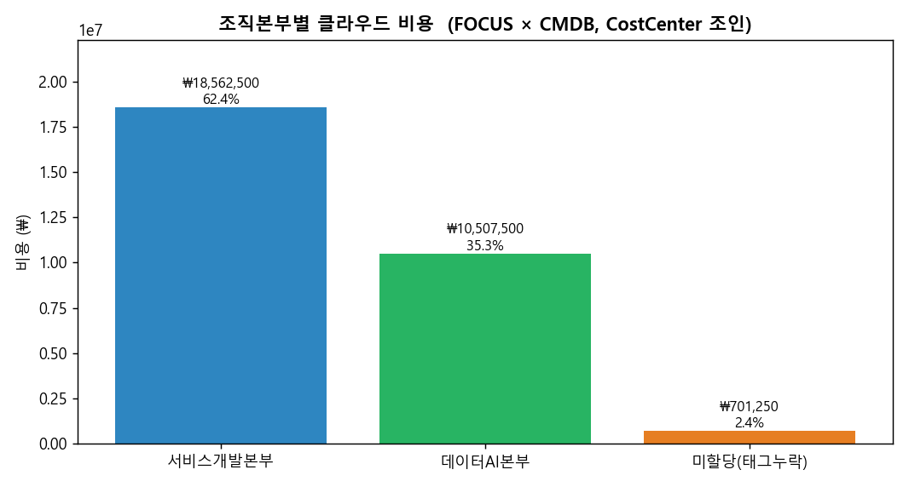
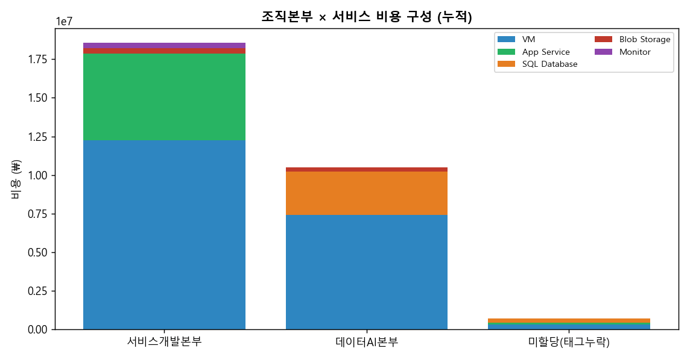

# M2-S5. CMDB 조인 분석 (실습, 30분 · 독립 세션)

> **모듈**: M2 보이기(Inform · 공식 **Understand Usage & Cost** Domain) · **시간**: 11:50–12:20 (30분) · **유형**: 실습  
> **독립 세션**('묻히기 쉬운 항목') — *청구비용 + 조직정보를 **태그를 join key로 결합***  
> **학습목표**: 비용 데이터에 조직 매핑 참조표(CostCenter↔조직)를 **CostCenter/Owner/Project** 키로 join → **조직·서비스 단위 비용** 집계·현황  
> **사용 Azure 서비스**: Cost Management **Exports**, **Tags**  
> 📚 **참조**: [`FinOps.md`](../../교재/AM/finops/FinOps.md) 슬라이드 8(태그·비용 할당), 6(비용 할당)  
> 📖 **1차 출처(FinOps Foundation)**: [Allocation](https://www.finops.org/framework/capabilities/) · [Understand Usage & Cost](https://www.finops.org/framework/domains/)  
> 🗂 **데이터**: FOCUS CSV(Azure 930행, Tags 포함) ⨝ **강사 준비 조직 매핑(비용배분) 참조표** [`data/cmdb-org-mapping.csv`](data/cmdb-org-mapping.csv)

---

## 🎯 핵심 — 태그만으론 부족하다, '조직 매핑'을 붙여라

> 비용 데이터의 태그엔 **`CostCenter="CC-200"`** 까지만 있습니다. *"CC-200 = 서비스개발본부"* 라는 의미는  
> **조직 매핑 참조표**(`CostCenter↔조직본부`)에 있어요. 이 매핑의 원천(source of truth)은 **재무/ERP·HR 시스템**이고,  
> CMDB(Configuration Management Database·구성관리 DB)는 리소스(CI)에 CostCenter·Owner 속성이 있을 때 **보조 출처**가 됩니다.  
> → **CostCenter를 join key로** 비용 데이터와 조직 매핑표를 **결합**하면, 비용이 *경영진의 언어(본부/부문)* 로 번역됩니다.  
> ※ 이 비용 귀속 작업이 공식 Capability **Allocation**(direct/shared 비용을 책임 주체에 배분 · Understand Usage & Cost Domain)에 해당합니다.

```
 [FOCUS 비용데이터]                 [조직 매핑 참조표]
 ResourceId | EffectiveCost | Tags.CostCenter      CostCenter | 조직본부
 vm-001     |   2,376,000   | CC-200        ⨝      CC-100     | 플랫폼인프라본부
 sql-002    |     937,500   | CC-300     (CostCenter) CC-200  | 서비스개발본부
 blob-003   |     360,000   | CC-200       =키      CC-300     | 데이터AI본부
                    │                                   │
                    └──────────►  조직본부별 비용 집계  ◄──┘
```

---

## 🧭 라이브 실습 흐름

| STEP | 내용 | 자료 | 분 |
|---|---|---|---|
| 0 | 도입 — 왜 조인하나 | (멘트) | 3 |
| 1 | 두 데이터 준비 (FOCUS Tags + 조직 매핑) | CSV 2종 | 6 |
| 2 | **조인** (CostCenter = join key) | 개념도 | 6 |
| 3 | 조직본부별 비용 집계 | 차트 | 6 |
| 4 | 조직 × 서비스 cross-tab | 차트+표 | 6 |
| 5 | 미할당(태그누락) 회수 + 브릿지 | (멘트) | 3 |

---

## 🗣 단계별 실습 스크립트 (이미지 덤프 포함)

### STEP 0 · 도입 (멘트, 3분)
> "M2-S4까지 우리는 *서비스별*로 비용을 봤죠. 그런데 임원은 *'데이터AI본부가 얼마 썼나'* 를 묻습니다. 비용 데이터엔 '본부'가 없어요. 있는 건 **CostCenter 태그**뿐. 이걸  
> **조직 매핑표와 붙여서** 본부 언어로 바꾸는 게 오늘 실습입니다."

### STEP 1 · 두 데이터 준비 (6분)
**① FOCUS 측** — Tags 컬럼(JSON)에 비용 귀속 단서:
```json
{"Project":"api","Environment":"prod","Owner":"apiteam@hbt.co.kr","CostCenter":"CC-200"}
```
**② 조직 매핑 측** — 강사 준비 `data/cmdb-org-mapping.csv` (조직 매핑 참조표):

| CostCenter | 조직본부 | 부문 | 담당PO |
|---|---|---|---|
| CC-100 | 플랫폼인프라본부 | Platform | infra@hbt.co.kr |
| CC-200 | 서비스개발본부 | ServiceDev | apiteam@hbt.co.kr |
| CC-300 | 데이터AI본부 | DataAI | datateam@hbt.co.kr |

> 💡 조직 매핑표의 원천은 보통 **재무/ERP·HR 시스템**(또는 사내 조직표·Excel). CMDB(ServiceNow 등)도 CI에 CostCenter가 달려 있으면 보조 출처가 됨.  
> 핵심은 **CostCenter(또는 Owner/Project)가 양쪽에 공통**이라는 점.

### STEP 2 · 조인 — CostCenter를 join key로 (6분)
**방법**: 각 비용 행의 `Tags.CostCenter`로 조직 매핑표를 lookup → `조직본부` 컬럼을 비용 행에 추가 → 조직별 합계
> "엑셀이면 VLOOKUP, SQL이면 JOIN, 파이썬이면 dict lookup. **키는 CostCenter.** CostCenter가 없으면(태그 누락) → **'미할당'** 으로 떨어집니다(중요)."  
> 우선순위: **CostCenter**(회계 단위) → 없으면 **Owner**(팀) → 없으면 **Project**.

### STEP 3 · 조직본부별 비용 집계 (6분) 🟢


| 조직본부 | 비용(₩) | 비중 |
|---|--:|--:|
| 서비스개발본부 | 18,562,500 | 62.4% |
| 데이터AI본부 | 10,507,500 | 35.3% |
| **미할당(태그누락)** | **701,250** | **2.4%** |
| **합계** | **29,771,250** | 100% |

> "이제 *'서비스개발본부가 전체의 62%'* 라고 **경영 보고**가 됩니다. 이게 Showback/Chargeback(M2-S1)의 실제 입력값이에요."

### STEP 4 · 조직 × 서비스 cross-tab (6분)


| 조직본부 | VM | App Service | SQL DB | Blob | Monitor |
|---|--:|--:|--:|--:|--:|
| 서비스개발본부 | 12,240,000 | 5,625,000 | 0 | 360,000 | 337,500 |
| 데이터AI본부 | 7,425,000 | 0 | 2,812,500 | 270,000 | 0 |
| 미할당(태그누락) | 300,000 | 120,000 | 281,250 | 0 | 0 |

> "**서비스개발본부**는 VM+App Service 중심(웹/API), **데이터AI본부**는 VM+SQL 중심(데이터 처리). 조직마다 *비용 구조가 다름* → 최적화 처방도 달라야 합니다(M3~M5)."

### STEP 5 · 미할당(태그누락) 회수 + 브릿지 (멘트, 3분)
> "주목할 건 **미할당 ₩701,250(2.4%)** — *CostCenter 태그가 없는 비용*입니다. 이건 '주인 없는 돈'이라 어느 본부에도 못 물립니다.  
> → **회수 방법**: M2-S1의 **태그 정책 강제 + 미태깅 탐지**로 이 2.4%를 0%에 가깝게(목표 5% 이하 달성). *조인 분석이 곧 태깅 거버넌스의 성적표*입니다.  
> *(브릿지)* "지금까지 *비용을 보는 법*(M2 보이기)을 다 했습니다. 점심 후 **M2-S6 자가진단**으로 우리 조직의 *보이기 성숙도*를 점수화하고, 오후엔 본격 **줄이기(M3~)**로 갑니다."

---

## 📋 수강생 실습 체크리스트
- [ ] FOCUS Tags에서 **CostCenter** 추출
- [ ] 조직 매핑 CSV와 **CostCenter로 조인**(VLOOKUP/JOIN/lookup)
- [ ] **조직본부별 비용 합계** 산출
- [ ] **미할당(태그누락) 비중** 확인 → 회수 대상 식별

## 💬 예상 Q&A
- **"태그에 본부명을 직접 넣으면 안 되나요?"** → 조직개편 때마다 모든 리소스 재태깅은 비현실적. **코드(CostCenter)만 태깅 → 조직 매핑표에서 의미 관리**가 유지보수에 유리.
- **"CostCenter가 여러 개 섞이면?"** → 공유 리소스는 사용량 비례 배분(공유 비용 분배 모델, M2-S1).
- **"미할당은 어떻게 줄이나?"** → 정책 강제(생성 시 필수) + 주간 미태깅 스캔(M2-S1·S3).
- **"조직 매핑표가 없으면?"** → 최소한 'CostCenter↔조직' 매핑 한 장(Excel)부터. 재무/HR에서 코스트센터 코드표를 받으면 충분.

## 📎 부록
- **join key 우선순위**: CostCenter(회계) > Owner(팀) > Project(서비스)
- **강사 준비물**: [`data/cmdb-org-mapping.csv`](data/cmdb-org-mapping.csv) (CC-100/200/300 → 본부)
- **재현 스크립트**: `교재/AM/finops/m2s5_join.py` (FOCUS ⨝ 조직 매핑표 → 집계·차트)

---

*작성: 라이브 실습 스크립트(이미지 덤프 포함) · 데이터 = FOCUS 샘플(Azure 930행) ⨝ 강사 조직 매핑 CSV · 차트 = `m2s5_join.py` ·  
개념 출처 = `FinOps.pptx` 슬라이드 8·6 · 1차 출처 = FinOps Foundation [Allocation](https://www.finops.org/framework/capabilities/) · [Understand Usage & Cost Domain](https://www.finops.org/framework/domains/)*
