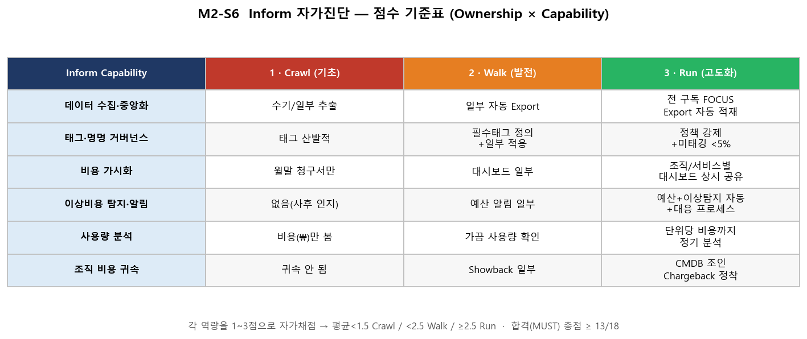

# M2-S6. Inform 자가진단 (이론+실습, 15분 · 독립 세션 · 🟡 MUST 평가)

> **모듈**: M2 보이기(Inform) 마무리 · **시간**: 13:20–13:35 (15분, 점심 직후)  
> **학습목표**: FinOps **Capability 기반** Inform 현재 수준 자가진단  
> **평가**: 🟡 **MUST 평가항목 (비중 0.2)** — Ownership×Capability 워크시트 작성·점수화·제출  
> 📚 **참조**: [`FinOps.md`](../../교재/AM/finops/FinOps.md) 슬라이드 16·17(성숙도 **다차원 진단**)  
> 📖 **1차 출처(FinOps Foundation)**: [Maturity Model](https://www.finops.org/framework/maturity-model/) · [Capabilities](https://www.finops.org/framework/capabilities/) · [Framework 2026](https://www.finops.org/insights/2026-finops-framework/)  
> 📤 **제출 산출물**: [`m2-s6.Inform자가진단_워크시트.xlsx`](m2-s6.Inform자가진단_워크시트.xlsx) (점수 자동 집계·판정 내장)

---

## 🎯 핵심 — '전사 평균'이 아니라 '역량별'로 진단 (2025 변화)

> 이 자가진단 행위 자체가 공식 Capability **FinOps Assessment**(Manage the FinOps Practice Domain)에 해당함 —  
> 공식 정의: *FinOps 실천의 효과성을 스스로 측정하고, 활동을 조직 목표에 매핑하며, 성숙시킬 가치가 있는 영역을 식별*하는 역량임  
> ([FinOps Assessment](https://www.finops.org/framework/capabilities/finops-assessment/)).

> deck 슬라이드 17: **단일 점수(평균의 함정) → Ownership × Capability 입체 진단**.  
> "우리 팀은 *어느 칸이 비었나?*" 를 찾는 게 목적입니다. 오전에 배운 **M2의 6개 역량(S1~S5)**을 각각 **1~3점**으로 자가채점합니다.

| 워크시트 역량 | 대응 세션 | Ownership(누가 책임?) |
|---|---|---|
| 데이터 수집·중앙화 | M2-S4(Export) | 플랫폼/인프라 |
| 태그·명명 거버넌스 | **M2-S1** | FinOps팀 + 엔지니어 |
| 비용 가시화 | M2-S2 | FinOps팀 |
| 이상비용 탐지·알림 | M2-S3 | FinOps팀 + 운영 |
| 사용량 분석 | M2-S4 | 서비스팀 |
| 조직 비용 귀속 | M2-S5 | FinOps팀 + 재무 |

---

## 📊 점수 기준표 (Rubric)

> 평균 **< 1.5 = Crawl** / **< 2.5 = Walk** / **≥ 2.5 = Run** · **합격(MUST) 총점 ≥ 13/18 (평균 2.2↑)**

> 🔎 **출처 구분 (공신력)**  
> · **공식**: Crawl/Walk/Run 3단계 성숙도와 *역량(Capability)별 진단* 방식은 FinOps Foundation 공식 모델임 — [Maturity Model](https://www.finops.org/framework/maturity-model/) · [Capabilities](https://www.finops.org/framework/capabilities/)  
> · **공식 철학**: "모든 역량을 Run으로"가 목표가 아니라 *환경에 맞는 적정 성숙도* 달성이 핵심 — 본 자가진단의 '평균의 함정 회피'와 정합  
> · **자체 기준**: 6역량 분류·각 셀 문구·임계값(미태깅 <5%·합격선 13/18·평균 2.2 등)은 **HBT 교육용 자체 설정**으로, FinOps Foundation 공식 수치가 아님

---

## 🧭 진행 (15분)

| STEP | 내용 | 분 |
|---|---|---|
| 0 | 도입 — 왜 자가진단 | 2 |
| 1 | 점수 기준 안내(Rubric) | 2 |
| 2 | **자가채점**(6역량 1~3점) | 6 |
| 3 | 집계·판정·강약점(자동) | 3 |
| 4 | 개선 1순위 도출 + 제출 | 2 |

### 🗣 스크립트
**[STEP 0]** > "오전에 보이기(Inform)를 6가지로 쪼개 배웠죠(태그·가시화·이상탐지·사용량·조인). 이제 *우리 조직은 각각 어디쯤인지* 솔직하게 점수 매겨봅니다. 점수가 낮은 칸이 곧  
*오늘 오후 이후 우리의 숙제*예요."  
**[STEP 1]** > (위 Rubric 제시) "각 역량을 Crawl(1)/Walk(2)/Run(3)으로. 애매하면 낮게 — 보수적으로."  
**[STEP 2]** > "워크시트(xlsx) 또는 아래 표에 6개 점수 + **근거**를 적으세요. 근거가 없으면 점수도 없습니다."  
**[STEP 3]** > "xlsx는 총점·평균·성숙도·강점·약점이 **자동 계산**됩니다."  
**[STEP 4]** > "**약점 역량 = 즉시 개선 1순위.** 이걸 한 줄 액션으로 적어 제출하면 MUST 완료. 오후 줄이기(M3~)로 갑니다."

---

## ✍️ 자가진단 작성표 (xlsx 미사용 시 대체)

| No | Inform Capability | 진단 질문 | 현재수준(1~3) | 담당(Ownership) | 근거/증거 | 개선 우선순위 |
|:--:|---|---|:--:|---|---|:--:|
| 1 | 데이터 수집·중앙화 | 비용 데이터가 자동 중앙 수집(Export)되는가? | ☐ | | | |
| 2 | 태그·명명 거버넌스 | 필수 태그가 정책 강제되고 미태깅이 관리되는가? | ☐ | | | |
| 3 | 비용 가시화 | 조직/서비스별 비용·추이를 대시보드로 보는가? | ☐ | | | |
| 4 | 이상비용 탐지·알림 | 예산·이상 알림이 자동 수신·대응되는가? | ☐ | | | |
| 5 | 사용량 분석 | 비용과 별개로 사용량(Usage)을 분리 분석하는가? | ☐ | | | |
| 6 | 조직 비용 귀속 | 비용이 조직·서비스로 귀속(Showback/Chargeback)되는가? | ☐ | | | |
| | **총점 / 18** | | ☐ | **성숙도**: Crawl/Walk/Run | **강점**: | **약점**: |

---

## 📋 제출(MUST) 체크리스트
- [ ] 6개 역량 **모두 점수**(1~3) 기재
- [ ] 각 점수에 **근거** 1줄
- [ ] **총점·성숙도 판정** 산출(합격 ≥13/18)
- [ ] **약점 역량 1개 + 개선 액션 1줄** 도출
- [ ] 워크시트 제출(스크린샷/파일)

## 💬 예상 Q&A
- **"점수가 다 낮으면요?"** → 정상입니다. 한국 대부분 Crawl~Walk(deck 16). 낮은 칸을 *아는 것*이 1단계.
- **"팀마다 점수가 다른데?"** → 그게 2025 다차원 진단의 핵심. 팀별로 따로 매기고 약한 팀 집중 지원.
- **"왜 평균만 안 보고 강·약점을?"** → 평균은 함정. 강점은 모범사례화, 약점은 개선 타겟.

## 📎 부록 — 워크시트 사용법
- xlsx **시트1 'Inform 자가진단'**: 점수만 입력 → 총점/평균/판정/강점/약점 **자동**
- xlsx **시트2 '점수기준(Rubric)'**: 채점 가이드
- 점수 셀은 **드롭다운(1/2/3)**, 우선순위는 **상/중/하**

---

*작성: 진단 워크시트 가이드 · 산출물 = `m2-s6.Inform자가진단_워크시트.xlsx`(`create_m2s6.py`) · 점수표 이미지 = `create_m2s6_img.py` ·  
개념 출처 = `FinOps.pptx` 슬라이드 16·17 · 1차 출처 = FinOps Foundation [Maturity Model](https://www.finops.org/framework/maturity-model/)*
