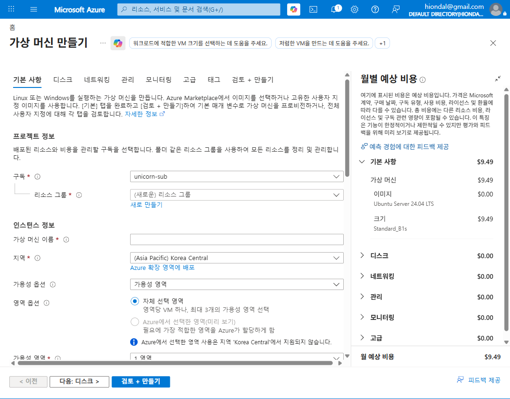

# M3-S1. VM vs VMSS 차이 (이론+실습, 20분 · 🟡 MUST)

> **모듈**: M3 줄이기(Optimize)-1 — 스케일링 · **시간**: 13:35–13:55 (20분)  
> **학습목표**: 단일 VM과 **VMSS**의 **구조·비용·확장성** 차이 명확화  
> **사용 Azure 서비스**: Virtual Machines, **Virtual Machine Scale Sets(VMSS)**  
> **평가**: 🟡 **MUST**(합격 요건) · 오후 핵심 시간대 정규 배정  
> 📚 **참조**: [`FinOps.md`](../../교재/AM/finops/FinOps.md) 슬라이드 6(줄이기-스케일링 정책 최적화), 4(WHAT)  
> 📖 **1차 출처(FinOps Foundation)**: [Optimize Usage & Cost (Domain)](https://www.finops.org/framework/domains/) · [Usage optimization (Optimize Phase)](https://www.finops.org/framework/phases/) · [Architecting & Workload Placement (Capability)](https://www.finops.org/framework/capabilities/)  
> 💡 deck의 스케일링은 K8s(HPA/VPA) 예시 — **VMSS는 그 '자동 확장' 원리의 Azure IaaS 버전**

---

## 🎯 핵심 — 왜 VMSS가 비용 효율적인가

> 🧭 **공식 정렬**: VM/VMSS 아키텍처 선택은 공식 Capability **Architecting & Workload Placement**,  
> 자동 확장으로 *허용 결과를 더 적은 리소스로* 달성하는 것은 **Usage Optimization** Capability에 해당 —  
> 둘 다 **Optimize Usage & Cost** Domain · Optimize Phase의 **Usage optimization** 축에 정렬됨.

> **단일 VM**: 1대를 항상 켜둠 → 피크에 맞춰 크게 잡으면 *평소엔 낭비*, 작게 잡으면 *피크에 장애*.  
> **VMSS**: 동일 VM **N대 집합** + **자동 크기 조정(Autoscale)** → *평소엔 적게, 피크에만 늘림* → **평균 비용↓ + 피크 대응**.  
> 👉 VMSS 만들기 화면 문구: *"VMSS는 **추가 비용 없이** 자동 크기 조정·성능 최적화·인프라 유연성을 제공"* (확장 집합 자체는 무료, 인스턴스 비용만).

---

## 🗣 실습 스크립트 (이미지 덤프)

### STEP 1 · 단일 VM — 구조와 고정 비용 (8분)
**클릭 경로**: 포털 → `가상 머신` → 만들기
> "단일 VM은 1대입니다. 크기를 고르면 **우측에 월 예상 비용**이 바로 떠요 — 여기선 **Standard_B1s = $9.49/월**(고정). 트래픽이 0이든 폭주든 *이 1대는 그대로* 과금됩니다. 더  
> 필요하면? **사람이 직접 VM을 또 만들어야**(수동 확장) 합니다."

### STEP 2 · VMSS — 확장 집합과 자동 확장 (8분)
**클릭 경로**: 포털 → `Virtual Machine Scale Sets` → 만들기
> "VMSS는 **'확장 집합 모델'** 로 동일 VM을 **N대 묶음**으로 관리합니다(오케스트레이션). 인스턴스 수를 바꾸면 모델에 따라 *자동으로* 인스턴스가 추가/제거돼요. 부하 분산(LB)도 통합 제공.  
> 그리고 핵심 — **Autoscale 룰**로 *CPU/요청에 따라 스스로 늘었다 줄었다* 합니다(다음 M3-S2)."

### STEP 3 · 비교 정리 (4분)

| 구분 | 단일 VM | **VMSS** |
|---|---|---|
| 구조 | VM 1대 | 동일 VM **N대 집합**(확장 집합 모델) |
| 확장 | **수동**(VM 추가 생성) | **자동**(Autoscale 룰) + 수동 |
| 부하 분산 | 별도 LB 구성 | 통합 LB |
| 비용 | **고정**(1대분, 예 B1s $9.49/월) | **가변**(N × 인스턴스, 부하 따라 증감) |
| 적합 워크로드 | 상시 단일·소규모 | **트래픽 변동 큰** 서비스 |
| FinOps 효과 | 끄거나 right-size(M4) | **평소 적게 → 평균 비용↓** |

> 🔑 **FinOps 포인트**: "VMSS가 *무조건 싸다*가 아니라, **부하가 변하는** 워크로드에서 *'필요할 때만 늘려'* 평균 비용을 낮춘다." 상시 1대면 단일 VM이 단순·저렴.

---

## 📋 수강생 체크리스트 (MUST)
- [ ] VM 만들기에서 **월 예상 비용**(크기별) 확인
- [ ] VMSS 만들기에서 **확장 집합·오케스트레이션** 개념 확인
- [ ] "수동 확장 vs 자동 확장"과 **비용 영향** 한 줄 설명
- [ ] 본인 워크로드가 VM/VMSS 중 무엇에 적합한지 판단

## 💬 예상 Q&A
- **"VMSS가 항상 더 싸요?"** → 아니요. *변동 부하*에서 평균 비용이 낮아짐. 상시 일정 부하면 단일 VM이 단순.
- **"확장 집합도 돈 내나요?"** → 집합 자체는 무료, **인스턴스(VM) 비용만** 과금.
- **"VM 여러 대 vs VMSS?"** → VM 수동 N대는 관리·LB·확장이 모두 수작업. VMSS는 자동.
- **"K8s HPA랑 같나요?"** → 원리는 동일(자동 확장). VMSS=IaaS VM 단위, HPA=컨테이너 Pod 단위(deck 슬라이드 11).

## 📎 부록 — 비용 영향 계산 예시
> ℹ️ 아래 인스턴스 수(2~5대)·절감률(~60%)·단가는 **교육용 자체 기준(공식 수치 아님)** — 실제 부하 패턴·단가에 따라 달라짐.
- 단일 VM(B1s): 24/7 → 약 **$9.49/월** 고정
- VMSS(B1s × 평소 2 ~ 피크 5): 평균 인스턴스 수 × 단가 → *피크에만 5대, 평소 2대*면 5대 상시 대비 **약 60% 절감** (부하 패턴 의존)
- → 다음 **M3-S2**에서 Autoscale 룰로 이 '필요할 때만 늘리기'를 직접 설정·관찰

---

*작성: VM/VMSS 비교 실습 스크립트(이미지 덤프 포함) · 캡처 = Azure Portal 만들기 마법사(unicorn-sub, 2026-06) · 개념 출처 = `FinOps.pptx` 슬라이드 6·4*  
*1차 출처 = FinOps Foundation [Domains](https://www.finops.org/framework/domains/) · [Phases](https://www.finops.org/framework/phases/) · [Capabilities](https://www.finops.org/framework/capabilities/)*
