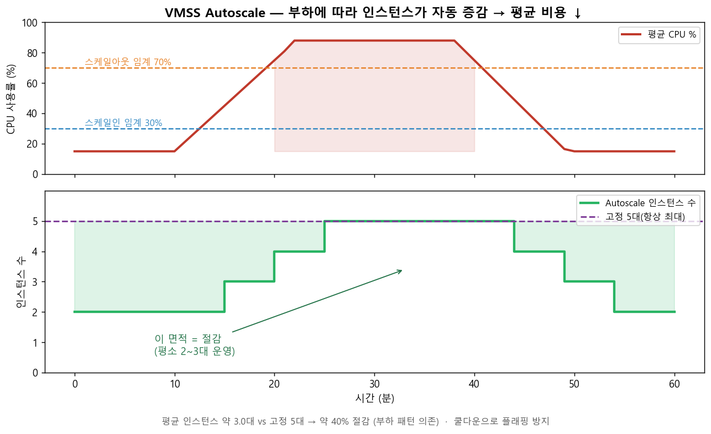
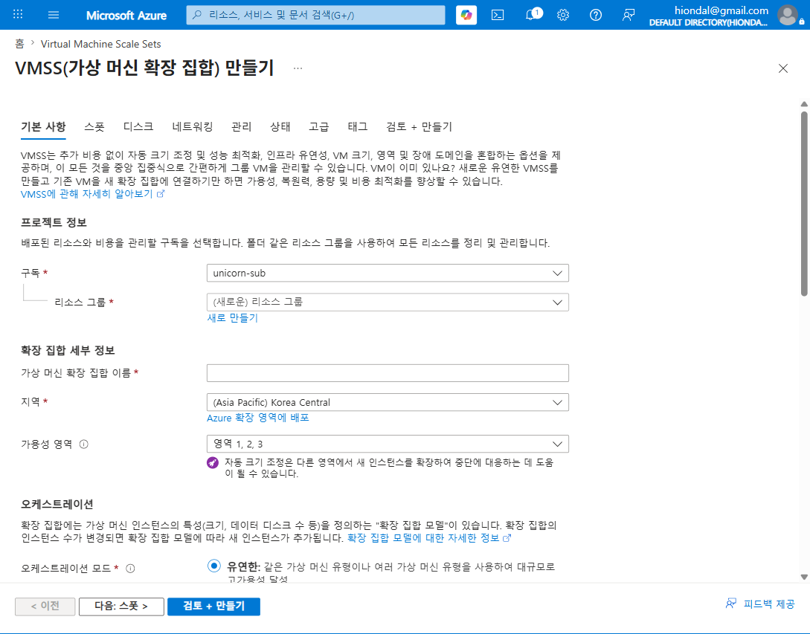

# M3-S2. VMSS Auto Scaling (실습, 40분 · 🟡 MUST)

> **모듈**: M3 줄이기(Optimize)-1 — 스케일링 · **시간**: 13:55–14:35 (40분) · 오후 핵심 시간대 정규 배정  
> **학습목표**: 트래픽에 따른 **VMSS Autoscale 룰 설정·동작 관찰**  
> **사용 Azure 서비스**: VMSS Autoscale, **Azure Monitor**, 부하생성기(stress-ng/AB/Locust)  
> **평가**: 🟡 **MUST**(합격 요건)  
> 📚 **참조**: [`FinOps.md`](../../교재/AM/finops/FinOps.md) 슬라이드 11(스케일링 비용 트레이드오프), 6(줄이기-스케일링)  
> 📖 **1차 출처(FinOps Foundation)**: [Usage Optimization · Optimize Usage & Cost Domain](https://www.finops.org/framework/domains/) ·  
> [Optimize Phase(Rates & Usage)](https://www.finops.org/framework/phases/) · [Architecting & Workload Placement](https://www.finops.org/framework/capabilities/)
>
> ⚠️ **작성 메모(정직 보고)**: 라이브 VMSS 배포는 *네트워킹 필수 설정(부하 분산)* 검증에서 멈춰 **실제 배포·과금 없이** 중단했습니다(rg-finops-demo 미생성 확인). 본 세션은  
> **autoscale 룰·부하·관찰 워크플로우를 정확히 문서화**한 버전이며, *autoscale 설정·스케일 이벤트 라이브 스크린샷은 현장 실습 시 보강* 권장합니다. VMSS 만들기 화면은 M3-S1 캡처를  
> 재사용합니다.

---

## 🎯 핵심 — Autoscale = '필요할 때만 늘려' 평균 비용 ↓

> 부하가 임계(CPU 70%)를 넘으면 **인스턴스를 늘리고(스케일아웃)**, 한가하면(CPU 30% 미만) **줄입니다(스케일인)**. 평소 2~3대로 돌다가 피크에만 5대 →  
> **고정 5대 대비 약 40% 절감**[^edu](부하 패턴 의존). *쿨다운*으로 잦은 증감(플래핑) 방지.  
> 오토스케일은 '허용 가능한 결과를 더 적은 리소스로 달성'하는 것으로, 공식 Capability **Usage Optimization**(공식 **Optimize Usage & Cost** Domain) ·  
> 공식 Phase **Optimize**(Rates & Usage)에 해당하며, 비용 상한 설계는 **Architecting & Workload Placement** Capability와 맞닿습니다.

[^edu]: **교육용 자체 기준(공식 수치 아님)** — "약 40% 절감"은 부하 패턴 가정에 따른 예시 수치이며 실제 절감률은 환경별로 다름.

---

## 🧭 라이브 실습 흐름 (40분)

| STEP | 내용 | 화면/도구 | 분 |
|---|---|---|---|
| 1 | (선행) 소형 VMSS 준비 | VMSS 만들기(M3-S1) | 8 |
| 2 | **Autoscale 룰 설정** | VMSS → 크기 조정 | 12 |
| 3 | **부하 생성** | stress-ng / AB / Locust | 8 |
| 4 | **스케일아웃 관찰** | VMSS 인스턴스 + Azure Monitor | 7 |
| 5 | 부하 해제 → 스케일인 + 비용 정리 | 인스턴스 감소 | 5 |

---

## 🗣 단계별 실습 스크립트

### STEP 1 · 소형 VMSS 준비 (8분)
**클릭 경로**: `Virtual Machine Scale Sets` → 만들기 → RG=`rg-finops-demo`(전용, 정리용) · 이름 `vmss-demo` · 크기 **Standard_B1s**(최소  
비용) · 인스턴스 **2** · 인증 암호 → 검토+만들기
> ⚠️ 네트워킹 탭에서 **부하 분산 옵션(Load Balancer)** 을 반드시 설정해야 검증 통과(Autoscale 트래픽 분산에 필요).

### STEP 2 · Autoscale 룰 설정 (12분) 🟢 핵심
**클릭 경로**: 생성된 `vmss-demo` → **설정 > 크기 조정** → **사용자 지정 자동 크기 조정** 선택

**① 인스턴스 한도**
| 최소 | 최대 | 기본 |
|:--:|:--:|:--:|
| **2** | **5** | 2 |

**② 스케일 규칙 2종**
| 규칙 | 메트릭 | 조건 | 기간(평균) | 작업 | 쿨다운 |
|---|---|---|---|---|---|
| **스케일 아웃** | Percentage CPU | **> 70%** | 5분(grain 1분) | 인스턴스 **+1** | 5분 |
| **스케일 인** | Percentage CPU | **< 30%** | 5분 | 인스턴스 **−1** | 5분 |

> ℹ️ 위 임계·한도(70/30%, 최소2/최대5, 쿨다운 5분)는 **교육용 자체 기준(공식 수치 아님)** 으로, 실습 편의를 위한 Azure 일반값이며 조직별로 조정함.

> "임계값을 낮출수록(예 50%) 더 빨리·자주 늘어 **성능↑·비용↑**, 높일수록 **비용↓·피크 지연 위험**. 쿨다운은 *방금 늘렸는데 바로 줄이는* 플래핑을 막습니다(deck 슬라이드 11 표)."

### STEP 3 · 부하 생성 (8분)
**선택지** (둘 중 하나):
- **CPU 부하(가장 단순)**: 인스턴스에 SSH → `sudo apt install -y stress-ng && stress-ng --cpu 0 --timeout 300s` (모든 코어 100%)
- **HTTP 부하**: 외부에서 LB 공인 IP로 `ab -n 200000 -c 300 http://<LB-IP>/` (Apache Bench) 또는 **Locust** 스크립트
> "부하생성기로 *진짜 트래픽*을 만들어 CPU를 70% 위로 올립니다. 5분 평균이 임계를 넘으면 autoscale 발동."

### STEP 4 · 스케일아웃 관찰 (7분)
**클릭 경로**: `vmss-demo` → **인스턴스**(개수 변화) + **모니터링 > 메트릭**(Percentage CPU) + **크기 조정 > 실행 기록**
> "관찰 포인트:
> - **인스턴스 수**: 2 → 3 → 4 → 5 로 *자동* 증가
> - **Azure Monitor**: CPU 차트가 70% 돌파하는 지점, **Autoscale 이벤트 로그**(‘scaled out to 3’)
> - **비용 직결**: 인스턴스가 늘수록 시간당 과금↑ — *그래서 임계·최대값 설정이 곧 비용 상한 설계*"

### STEP 5 · 부하 해제 → 스케일인 + 비용 정리 (5분)
> "부하생성기를 끄면 CPU가 30% 아래로 → 쿨다운 후 인스턴스가 **5 → … → 2**로 감소. *평균 인스턴스 수 × 단가 = 실제 비용* — 위 차트의 '절감 면적'을 눈으로 확인.  
> ✅ **세션 종료 시 반드시 정리**: `rg-finops-demo` **리소스 그룹째 삭제**(Delete resource group) → 과금 중단."

---

## 📋 수강생 체크리스트 (MUST)
- [ ] VMSS에 **CPU 기반 스케일아웃/인 룰** 설정(최소2/최대5)
- [ ] 부하생성기로 **스케일아웃 유발** + 인스턴스 수 증가 캡처
- [ ] **Azure Monitor**에서 CPU·autoscale 이벤트 확인
- [ ] 부하 해제 후 **스케일인** 확인
- [ ] **rg-finops-demo 삭제**(정리)로 과금 종료

## 💬 예상 Q&A
- **"임계값은 몇 %가 적당?"** → 보통 70%(아웃)/30%(인). 핵심 서비스는 보수적(낮게), 개발은 공격적(높게). deck 슬라이드 11 표 참조.
- **"왜 쿨다운이 필요?"** → 늘리자마자 줄이는 *플래핑* 방지. 보통 5분.
- **"요청 수 기반도 되나요?"** → 됩니다(Application Gateway/LB 메트릭 또는 커스텀 메트릭). CPU가 가장 단순.
- **"최대값은 왜 중요?"** → **비용 상한**. max=5면 폭주해도 5대분까지만 과금.
- **"K8s HPA랑?"** → 같은 자동확장 원리. VMSS=VM 단위, HPA=Pod 단위(deck 11).

## 📎 부록 — Autoscale 비용 설계 체크
| 설정 | 비용 영향 |
|---|---|
| 스케일아웃 임계(70→50%) | 낮을수록 빨리 늘어 비용↑ |
| 최소 인스턴스 | 높을수록 유휴 비용↑(평소 비용 바닥) |
| **최대 인스턴스** | **피크 비용 상한** |
| 쿨다운(짧게/길게) | 짧으면 불안정, 길면 불필요 비용 지속 |

---

*작성: 라이브 실습 워크플로우 문서(autoscale 룰·부하·관찰) · 비용 차트 = `make_m3s2_chart.py` · VMSS 화면 = M3-S1 재사용 ·  
⚠️라이브 autoscale 캡처는 현장 보강 · 개념 출처 = `FinOps.pptx` 슬라이드 11·6 ·  
1차 출처 = FinOps Foundation [Domains](https://www.finops.org/framework/domains/) · [Phases](https://www.finops.org/framework/phases/)*
