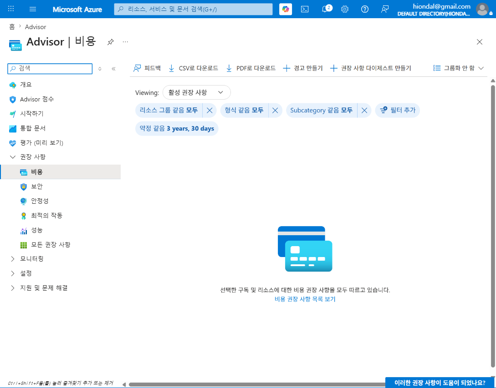
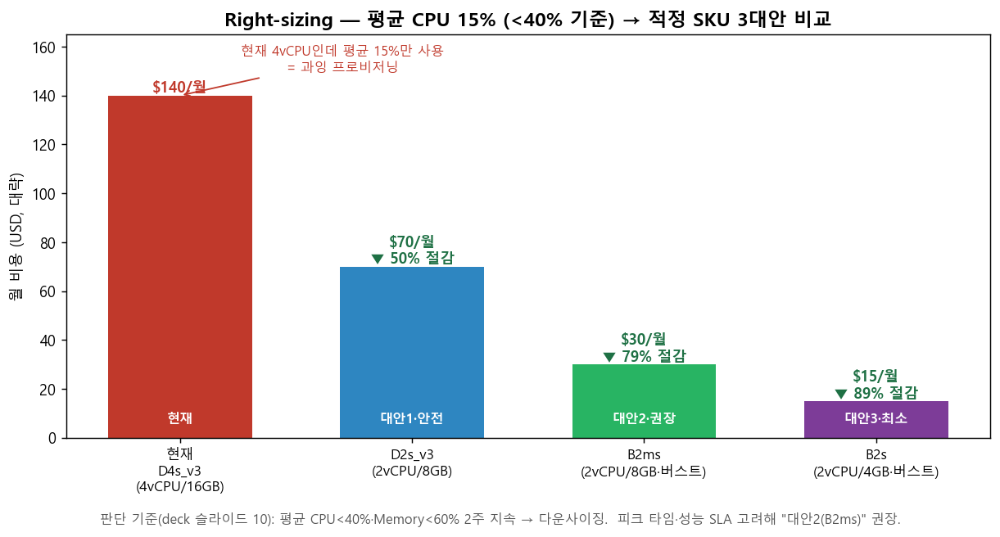

# M4-S1. 적정 SKU 판단법 (실습, 15분)

> **모듈**: M4 줄이기(Optimize)-2 — Right-sizing · **시간**: 14:45–15:00 (15분) · **유형**: 실습  
> **학습목표**: CPU 사용률 기반 VM/DB **적정 SKU(상품코드) 판단**  
> **사용 Azure 서비스**: Azure Monitor 메트릭, **Azure Advisor**  
> 📚 **참조**: [`FinOps.md`](../../교재/AM/finops/FinOps.md) 슬라이드 10(Right-sizing 절차·판단 기준)  
> 📖 **1차 출처(FinOps Foundation)**: [Usage Optimization · Optimize Usage & Cost Domain](https://www.finops.org/framework/domains/) · [Optimize Phase — Usage optimization](https://www.finops.org/framework/phases/) · [Architecting & Workload Placement](https://www.finops.org/framework/capabilities/)

---

## 🎯 핵심 — "큰 옷"을 입고 있지 않은가

> Right-sizing = 실제 사용량 분석 → **과잉 프로비저닝된 인스턴스를 적정 사양으로**. 비용 최적화의 *가장 확실한* 방법(미사용 제거 다음).  
> (공식 Capability **Usage Optimization** · Optimize Usage & Cost Domain · Optimize Phase의 **Usage optimization** 축 — "허용 가능한 결과를 더 적은 리소스로". SKU 계열 재선택은 **Architecting & Workload Placement**도 관여)  
> **판단 기준(deck 슬라이드 10, 교육용 자체 기준 · 공식 수치 아님)**: 평균 **CPU < 40%** · **Memory < 60%** 가 **2주 이상 지속** → 다운사이징 후보.

---

## 🗣 실습 스크립트 (이미지 덤프)

### STEP 1 · Advisor 비용 권고 확인 (5분)
**클릭 경로**: 포털 검색 → `Advisor` → **권장 사항 > 비용**
> "Azure가 알아서 *'이 VM은 과한데요'* 를 띄워주는 곳입니다. 여기서 **Right-sizing 권고**(SKU 다운사이징, 미사용 디스크 등)가 나와요. 지금 이 구독은 *'모두 따르고 있습니다'* —  
> 권고 대상이 없다는 뜻(작은 환경). 운영 구독이면 여기에 *'$X 절감 가능'* 권고가 줄줄이 뜹니다."

### STEP 2 · 메트릭으로 사용률 확인 (4분)
**클릭 경로**: 대상 VM → **모니터링 > 메트릭** → `Percentage CPU`(2주, 평균) / `Available Memory`
> "Advisor만 믿지 말고 **직접 메트릭**으로 확인합니다. 평균 CPU 15%? → 4 vCPU가 과합니다. **단, 피크 타임**을 함께 봐야 해요(평균만 보면 피크에 장애)."

### STEP 3 · 적정 SKU 3대안 비교·선정 (6분) 🟢

> ℹ️ 아래 SKU·월 비용·절감률은 **교육용 자체 예시(공식 수치 아님)** — 실제 단가는 리전·약정에 따라 다름.

| 대안 | SKU | 월 비용 | 절감 | 성격 |
|---|---|--:|--:|---|
| 현재 | D4s_v3 (4vCPU/16GB) | $140 | – | 과잉 |
| 대안1·안전 | D2s_v3 (2vCPU/8GB) | $70 | **50%** | 같은 계열 한 단계↓ |
| **대안2·권장** | **B2ms (2vCPU/8GB·버스트)** | **$30** | **79%** | 변동부하에 버스터블 |
| 대안3·최소 | B2s (2vCPU/4GB·버스트) | $15 | 89% | 공격적(메모리 주의) |

> 🔑 **3대안을 주는 이유**: 무조건 최소가 답이 아님. *피크·SLA*를 고려해 — 상시 안정 필요 → 대안1, 변동부하·비용중시 → **대안2(권장)**, 개발/테스트 → 대안3.

### STEP 4 · 적용 순서 (멘트)
> "적용은 **비운영(dev/staging)부터 → 검증(성능 SLA 충족 확인) → 운영**. *재부팅 필요*하므로 변경 창에서. Advisor 권고는 *클릭 한 번*으로 적용 가능하지만,  
> **검증 없이 운영에 바로 적용 금지**."

---

## 📋 수강생 체크리스트
- [ ] Advisor 비용 권고 위치 확인
- [ ] 대상 리소스 **평균 CPU(2주)** 메트릭 확인
- [ ] **적정 SKU 3대안** 비용 비교
- [ ] 피크·SLA 고려해 1개 선정 + 적용 순서(비운영→검증→운영) 설명

## 💬 예상 Q&A
- **"평균만 보면 되나요?"** → ❌. **피크(P95)** 필수. 평균 낮아도 피크에 100%면 다운사이징 위험.
- **"버스터블(B시리즈)이 왜 싸요?"** → 평소 낮게 쓰다 가끔 튀는 워크로드용. CPU 크레딧 소진 시 성능 제한 — 상시 고부하엔 부적합.
- **"DB도 되나요?"** → 예. Azure SQL은 vCore/DTU 다운, 메트릭(DTU%·CPU%) 기반.
- **"한 번 하면 끝?"** → 아니요. 사용 패턴은 변함 → **정기 재검토**(Operate, M6).

## 📎 부록 — Right-sizing 5단계 (deck 슬라이드 10)
수집(2주~1개월) → 분석·탐색(피크 포함) → **권고·승인(3대안)** → 적용(비운영부터) → **검증(SLA)**

---

*작성: 라이브(Advisor) + 생성 차트(`make_m4s1_chart.py`) · 개념 출처 = `FinOps.pptx` 슬라이드 10*  
*1차 출처 = FinOps Foundation [Domains](https://www.finops.org/framework/domains/) · [Phases](https://www.finops.org/framework/phases/) · [Capabilities](https://www.finops.org/framework/capabilities/)*
