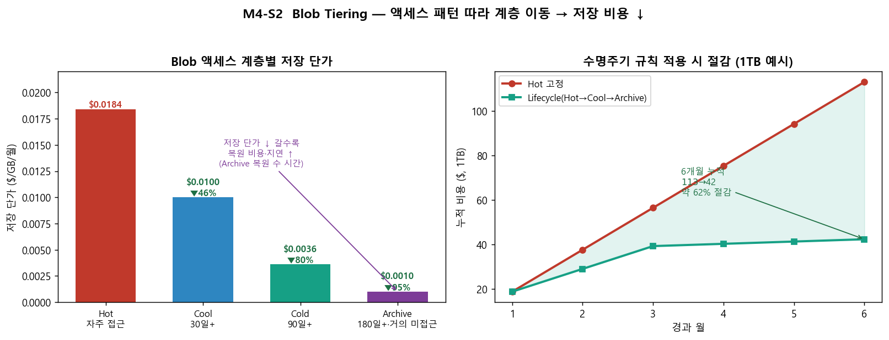

# M4-S2. Blob Tiering (실습, 20분)

> **모듈**: M4 줄이기(Optimize)-2 — Right-sizing · **시간**: 15:00–15:20 (20분) · **유형**: 실습  
> **학습목표**: Blob Storage 데이터 유형별 **Tiering 비용 최적화**  
> (공식 Capability **Usage Optimization** · **Optimize Usage & Cost** Domain · **Optimize** Phase)  
> **사용 Azure 서비스**: Blob Storage, **수명 주기 관리(Lifecycle management)**, Pricing Calculator  
> 📚 **참조**: [`FinOps.md`](../../교재/AM/finops/FinOps.md) 슬라이드 6(미사용·스토리지 최적화)  
> 📖 **1차 출처(FinOps Foundation)**: [Capabilities](https://www.finops.org/framework/capabilities/) · [Domains](https://www.finops.org/framework/domains/)

---

## 🎯 핵심 — 데이터에도 '옷'이 있다

> 모든 데이터를 **Hot(자주 접근)** 에 두면 낭비. 안 보는 데이터는 **싼 계층**으로 내려야 합니다.  
> **트레이드오프**: 저장 단가가 쌀수록 **복원 비용·지연**이 큼(Archive는 복원에 수 시간).

| 계층 | 저장 단가($/GB/월) | 적합 | 복원 |
|---|--:|---|---|
| **Hot** | ~0.0184 | 자주 접근(서비스 데이터) | 즉시 |
| **Cool** | ~0.0100 (46%↓) | 30일+ 가끔(월1회) | 즉시 |
| **Cold** | ~0.0036 (80%↓) | 90일+ 드묾 | 즉시 |
| **Archive** | ~0.0010 (95%↓) | 180일+ 거의 미접근(백업·규제) | **수 시간(rehydrate)** |

> ※ 위 단가·절감률(46%/80%/95%↓), 계층 전환 기준일(30/90/180/365일)은 **교육용 자체 기준(공식 수치 아님)** —  
> 실제 단가는 리전·시점별로 다르므로 Pricing Calculator로 확인 필요.

---

## 🗣 실습 스크립트 (이미지 덤프)

### STEP 1 · 액세스 계층 개념 + 단가 (6분)
> "위 왼쪽 그래프 — Hot에서 Archive로 갈수록 **저장 단가가 95%까지** 떨어집니다. 대신 Archive는 *읽으려면 먼저 복원(rehydrate)* 해야 하고 수 시간 걸려요.  
> **핵심은 '액세스 빈도에 맞춰 배치'**."

### STEP 2 · 수명 주기 관리(Lifecycle) 규칙 작성 (8분) 🟢
**클릭 경로**: `unicornkr`(스토리지 계정) → **데이터 관리 > 수명 주기 관리** → **규칙 추가**
> "사람이 일일이 옮길 순 없죠. **수명 주기 규칙**으로 *자동화*합니다. 예시 규칙:
> - 마지막 수정 후 **30일** → **Cool**로 이동
> - **90일** → **Cold**
> - **180일** → **Archive**
> - **365일** → 삭제(선택)
>
> 조건: blob의 *마지막 수정/액세스 시점* 기준. prefix(컨테이너/폴더)로 범위 지정 가능."

### STEP 3 · 절감 효과 확인 (6분)
> "위 오른쪽 그래프 — **1TB 데이터**를 Hot에 6개월 두면 **$113**, 수명주기로 Hot→Cool→Archive 자동 이동하면 **$42** → **약 62% 절감**(교육용 자체 산정 예시·공식 수치 아님).  
> *데이터는 시간이 지나면 식는다*는 걸 비용으로 증명."  
> 💡 **Pricing Calculator**로 본인 데이터량·접근 패턴 넣어 시뮬레이션 권장.

---

## 📋 수강생 체크리스트
- [ ] 4개 계층(Hot/Cool/Cold/Archive) **단가·복원 트레이드오프** 이해
- [ ] 수명 주기 **규칙 1개 작성**(예: 30일→Cool)
- [ ] 본인 데이터 **절감액 추정**(Pricing Calculator)

## 💬 예상 Q&A
- **"Archive가 제일 싼데 다 Archive로?"** → ❌. 복원에 수 시간 + 복원 비용. *접근 가능성 있으면* Cool/Cold.
- **"이동 비용은?"** → 계층 이동·쓰기 작업에 소액 트랜잭션 비용. 그래도 장기 저장이면 이득.
- **"실수로 중요한 걸 Archive하면?"** → 규칙은 prefix로 범위 한정 + 미리 검증. 중요 데이터 컨테이너는 제외.
- **"Cold랑 Cool 차이?"** → Cold가 더 싸고 더 오래 안 보는 데이터용(90일+). 최근 추가된 계층.

## 📎 부록 — 수명 주기 규칙 예시(JSON 개념)
`수정 후 30일 → Cool` · `90일 → Cold` · `180일 → Archive` · `365일 → Delete`  (prefix·blob 형식으로 범위 지정)

---

*작성: 생성 차트(`make_m4s2_chart.py`, 단가·수명주기 절감) + 라이브(수명 주기 관리 블레이드 안내) · 개념 출처 = `FinOps.pptx` 슬라이드 6*  
*1차 출처 = FinOps Foundation [Capabilities](https://www.finops.org/framework/capabilities/)(Usage Optimization) · [Domains](https://www.finops.org/framework/domains/)(Optimize Usage & Cost) — 단가·절감 수치는 교육용 자체 기준*
