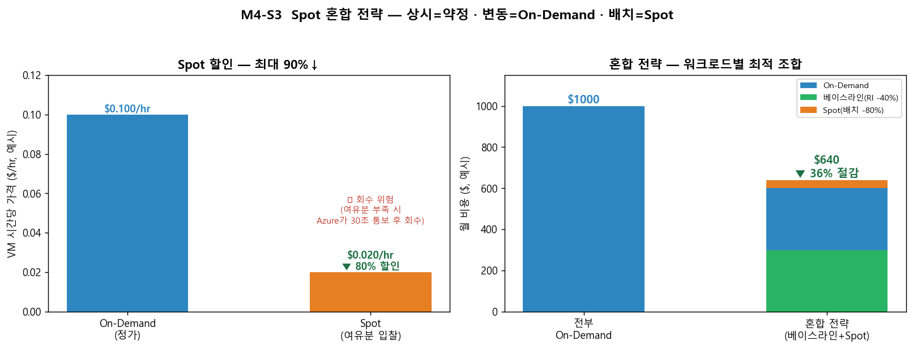

# M4-S3. Spot 혼합 전략 (실습, 15분)

> **모듈**: M4 줄이기(Optimize)-2 — Right-sizing · **시간**: 15:20–15:35 (15분) · **유형**: 실습  
> **학습목표**: VM **Spot 인스턴스 혼합**으로 비용 극소화  
> **사용 Azure 서비스**: Azure Spot VM, VMSS Spot, Pricing Calculator  
> 📚 **참조**: [`FinOps.md`](../../교재/AM/finops/FinOps.md) 슬라이드 12(약정 비교·혼합 전략)  
> 📖 **1차 출처(FinOps Foundation)**: [Optimize Usage & Cost Domain](https://www.finops.org/framework/domains/) · [Rate Optimization · Architecting & Workload Placement](https://www.finops.org/framework/capabilities/) · [Phases — Optimize(Rates & Usage)](https://www.finops.org/framework/phases/)

---

## 🎯 핵심 — 남는 자리를 싸게, 단 '회수' 각오

> **Spot** = Azure의 *여유 용량*을 **최대 90% 할인**으로 입찰. 단, 여유가 없어지면 **Azure가 30초 통보 후 회수(eviction)**.  
> Spot 할인 활용은 공식 Capability **Rate Optimization**(Optimize Usage & Cost Domain · Phase **Optimize: Rates & Usage**)에 해당.  
> → **중단돼도 괜찮은** 워크로드(배치·CI/CD·데이터 분석·렌더링)에 적합. 상태 비저장(stateless) + 재시작 가능해야.

---

## 🗣 실습 스크립트 (이미지 덤프)

### STEP 1 · Spot 가격·회수 위험 (5분)
**클릭 경로**: VM/VMSS 만들기 → **스팟 인스턴스** 체크 → 회수 정책(중지/삭제) · 최대 가격
> "왼쪽 그래프 — On-Demand $0.10/hr이 Spot은 $0.02/hr(**80% 할인**). 공짜처럼 보이지만 **회수 위험**이 가격입니다. 회수 정책: *중지(재가동 대기)* 또는 *삭제*. 최대  
> 가격 설정 가능."

### STEP 2 · 혼합 전략 설계 (7분) 🟢
> 워크로드 특성별 구매옵션 혼합 설계는 공식 Capability **Rate Optimization**(구매모델 선택으로 단가 절감)·**Architecting & Workload Placement**(중단 허용 배치 설계)(Optimize Usage & Cost Domain)에 해당.  
> "오른쪽 그래프 — **전부 On-Demand $1000 → 혼합 $640(36% 절감)**. 핵심은 *워크로드 특성별로 섞기*(deck 슬라이드 12):

| 워크로드 | 추천 | 이유 |
|---|---|---|
| **상시·핵심**(DB·기간계) | **RI/Savings Plans**(약정) | 24/7 → 약정 할인 최대 |
| **변동·예측 어려움** | On-Demand | 유연성 |
| **배치·CI/CD·분석** | **Spot** | 중단 허용 → 극한 할인 |

> "**베이스라인은 약정(안정)**, **피크는 On-Demand**, **배치는 Spot**. 이 조합이 비용 최적점."  
> ※ 위 `$1000 → $640(36% 절감)`은 교육용 예시 수치(공식 수치 아님). 실제 절감률은 워크로드 구성·Spot 회수율에 따라 달라짐.

### STEP 3 · VMSS + Spot (3분)
> "VMSS는 **Spot 인스턴스를 혼합**할 수 있어요(유연한 오케스트레이션). 베이스라인 N대는 일반, 추가 확장분은 Spot으로 → 스케일아웃 비용까지 절감. 회수돼도 VMSS가 다른 인스턴스로 보충."

---

## 📋 수강생 체크리스트
- [ ] Spot **할인율·회수 위험** 이해
- [ ] 본인 워크로드 중 **Spot 적합(중단 허용)** 식별
- [ ] 베이스라인(약정)+변동(OD)+배치(Spot) **혼합 설계** 1개
- [ ] Pricing Calculator로 혼합 비용 추정

## 💬 예상 Q&A
- **"Spot이 회수되면 데이터 날아가나요?"** → 인스턴스는 사라짐. 그래서 **상태는 외부(Blob/DB)**에, 작업은 **재시작 가능**하게 설계.
- **"왜 다 Spot 안 쓰나요?"** → 회수 위험. 핵심 서비스 중단 불가 → 약정/OD. Spot은 *중단 허용* 워크로드만.
- **"최대 가격은?"** → 그 가격 넘으면 회수. 보통 On-Demand 가격으로 두면 가격 회수는 거의 없고 용량 회수만.
- **"약정(RI)이랑 같이?"** → 예. *상시=RI, 배치=Spot* 가 정석 혼합. (다음 M5에서 약정 상세)

## 📎 부록 — 3대 구매 옵션 비교 (deck 슬라이드 12)
| | RI/Savings Plans | On-Demand | **Spot** |
|---|---|---|---|
| 할인 | 최대 72% | 0% | **최대 90%** |
| 약정 | 1·3년 | 없음 | 없음 |
| 중단 위험 | 없음 | 없음 | **있음(회수)** |
| 적합 | 24/7 상시 | 불확실 | **배치·중단 허용** |

---

*작성: 생성 차트(`make_m4s3_chart.py`, Spot 할인·혼합 절감) · 개념 출처 = `FinOps.pptx` 슬라이드 12*  
*1차 출처 = FinOps Foundation [Optimize Usage & Cost](https://www.finops.org/framework/domains/) · [Capabilities](https://www.finops.org/framework/capabilities/) · [Phases](https://www.finops.org/framework/phases/)*
