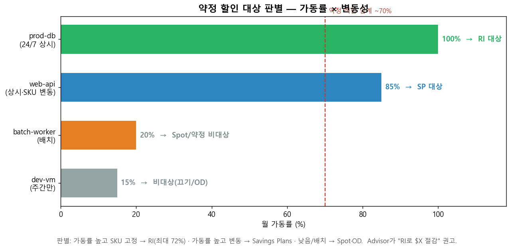

# M5-S1. 할인 대상 판별 (실습, 18분 · 독립 세션)

> **모듈**: M5 줄이기(Optimize)-3 — 약정 전략 · **시간**: 15:35–15:53 (18분) · **유형**: 실습  
> **독립 세션**('묻히기 쉬운 항목') — *내가 쓰는 제품이 RI/SP 할인 대상인지 알아내는 법*  
> **학습목표**: 사용 SKU·리전 확인 → **Reservations 권고·Advisor에서 대상 여부·예상 절감** 확인  
> **사용 Azure 서비스**: Azure Advisor, **Reservations 권고**  
> 📚 **참조**: [`FinOps.md`](../../교재/AM/finops/FinOps.md) 슬라이드 12(약정 비교)  
> 📖 **1차 출처(FinOps Foundation)**: [Rate Optimization](https://www.finops.org/framework/capabilities/) · [Optimize Usage & Cost Domain](https://www.finops.org/framework/domains/) · [Optimize Phase — Rate optimization](https://www.finops.org/framework/phases/)

---

## 🎯 핵심 — "약정은 아무 거나 거는 게 아니다"

> 약정(RI/SP) 할인 대상 판별은 공식 Capability **Rate Optimization**(Optimize Usage & Cost Domain),  
> 공식 Phase **Optimize**의 **Rate optimization** 축(써야 하는 리소스에 적정 금액 지불 · 구매·리더십 협업 중심)에 해당.  
> 약정(RI/SP)은 **할인 대상이 맞을 때만** 이득. 대상 판별 기준 = **가동률(상시성)** × **SKU 변동성**.  
> 짧게 쓰는 걸 약정하면 **오히려 손해**(안 쓰는 약정 비용). 그래서 *판별이 먼저*입니다.

| 리소스 | 가동률 | 판별 | 이유 |
|---|--:|---|---|
| prod-db (24/7 상시) | 100% | **RI 대상** | 상시·SKU 고정 → 최대 할인(72%) |
| web-api (상시·SKU 변동) | 85% | **SP 대상** | 상시지만 인스턴스 바뀜 → SP 유연 |
| batch-worker (배치) | 20% | Spot/약정 비대상 | 중단 허용 → Spot |
| dev-vm (주간만) | 15% | 비대상 | 끄기/On-Demand |

---

## 🗣 실습 스크립트 (이미지 덤프)

### STEP 1 · 사용 SKU·리전 확인 (5분)
**클릭 경로**: Cost Management → 비용 분석 → 그룹화 **Meter/Service** + 필터 리전
> "먼저 *내가 뭘, 어디서, 얼마나 오래* 쓰는지 확인. 약정은 **인스턴스 타입 + 리전 + 상시성**으로 대상이 정해집니다. 24/7 도는 동일 SKU가 1순위 후보."

### STEP 2 · Advisor 약정 권고 확인 (7분)
**클릭 경로**: `Advisor` → **권장 사항 > 비용** → *Reservations 권고*
> "Azure가 *지난 사용 패턴(보통 30일)* 을 분석해 **'이 SKU를 RI로 사면 월 $X 절감'** 을 띄워줍니다. 여기에 **예상 절감액 + 권장 수량**까지 나와요. (이 실습 구독은 사용량이 적어  
> 권고 없음 — 운영 구독이면 줄줄이 뜸. M4-S1 Advisor 화면 참고)"  
> ⚠️ **중요(deck 슬라이드 12)**: 약정 구매 전 **최소 3~6개월 사용 데이터 분석 필수**.

### STEP 3 · 대상/비대상 분류 (6분) 🟢
> "위 그래프처럼 분류: **가동률 높고 SKU 고정 → RI**, **가동률 높고 변동 → Savings Plans**, **낮음/배치 → Spot·On-Demand**. *'상시성'이 핵심 잣대*. 70% 미만  
> 가동이면 약정은 신중히."

---

## 📋 수강생 체크리스트
- [ ] 본인 리소스의 **SKU·리전·가동률** 확인
- [ ] Advisor에서 **RI 권고·예상 절감** 확인(위치)
- [ ] 리소스별 **RI/SP/비대상** 분류
- [ ] "3~6개월 데이터 확인 후 구매" 원칙 숙지

## 💬 예상 Q&A
- **"RI랑 Savings Plans 차이?"** → RI=특정 인스턴스·리전 고정(할인↑·유연성↓), SP=컴퓨트 시간당 $ 약정(인스턴스 변경 자유). 변동 많으면 SP.
- **"얼마나 써야 약정?"** → 대략 **가동률 70%↑** + 1년 이상 지속 예상. 그 미만은 손익분기 안 맞을 수 있음.
- **"약정했는데 안 쓰면?"** → 그대로 과금(낭비). 그래서 *보수적으로*, Advisor 권고 수량 참고.
- **"여러 구독에 걸쳐?"** → 공유 범위(다음 M5-S2)로 테넌트/관리그룹 단위 적용 가능.

## 📎 부록 — 판별 한 줄 기준
**가동률 ≥ 70% & 1년+ 지속 → 약정**(고정 SKU=RI / 변동=SP) · **그 외 → On-Demand·Spot**  
> 주: 가동률 70%·72% 할인·30일/3~6개월 데이터 등 수치는 **교육용 자체 기준 및 Azure 제품 기준(공식 FinOps Foundation 수치 아님)**.

---

*작성: 생성 차트(`make_m5s1_chart.py`, 약정 적합도) + 라이브(Advisor 권고 위치, M4-S1 참조) · 개념 출처 = `FinOps.pptx` 슬라이드 12*  
*1차 출처 = FinOps Foundation [Rate Optimization (Capabilities)](https://www.finops.org/framework/capabilities/) · [Optimize Usage & Cost (Domains)](https://www.finops.org/framework/domains/) · [Optimize Phase (Phases)](https://www.finops.org/framework/phases/)*
