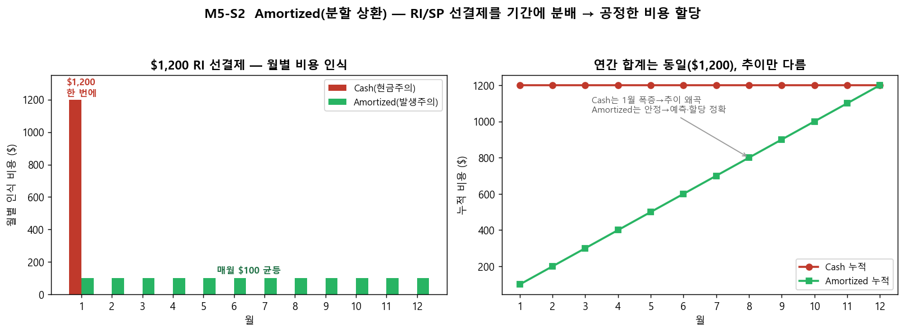

# M5-S2. 약정 구매 절차 (실습·시뮬레이션, 12분)

> **모듈**: M5 줄이기(Optimize)-3 — 약정 전략 · **시간**: 15:53–16:05 (12분) · **유형**: 실습  
> **학습목표**: RI/SP **구매하는 법(시뮬레이션)** — 기간·범위·결제옵션 선택 + **Amortized 분배** 개념 *(실제 결제 미수행)*  
> **사용 Azure 서비스**: Azure Reservations, Savings Plans for compute  
> 📚 **참조**: [`FinOps.md`](../../교재/AM/finops/FinOps.md) 슬라이드 9(Amortized), 12(약정)  
> 📖 **1차 출처(FinOps Foundation)**: [Rate Optimization](https://www.finops.org/framework/capabilities/) · [Optimize Usage & Cost Domain](https://www.finops.org/framework/domains/) · [Phases(Optimize)](https://www.finops.org/framework/phases/)  
> ⚠️ **실제 구매하지 않습니다** — 선택 플로우만 시연.

---

## 🎯 핵심 — 3가지 선택이 비용을 좌우

> M5-S1에서 *대상*을 골랐다면, 이제 **어떻게 살지**. 세 가지 선택지가 할인·유연성·회계를 결정합니다.

> 📌 RI/SP 약정 구매는 *반드시 써야 하는 리소스에 적정 단가를 지불*하는 활동으로, 공식 Capability **Rate Optimization**  
> (Optimize Usage & Cost Domain)에 해당하며 Optimize Phase(Rates & Usage)의 **Rate optimization** 축에 정렬됨.

---

## 🗣 실습 스크립트 (구매 플로우 시뮬레이션)

### STEP 1 · 구매 플로우 (7분)
**클릭 경로**: 포털 검색 → `Reservations`(예약) → **추가** → 제품 선택 → 옵션 선택 → 검토 *(구매 버튼은 누르지 않음)*

```
제품 선택        →  기간        →  범위(Scope)        →  결제 옵션         →  검토
(VM/SQL/Storage     1년 / 3년       공유 vs 단일          선결제 vs 월별        (구매 안 함)
 또는 SP for         (길수록           (구독전체 vs            (둘 다 할인 동일)
 compute)            할인↑)            단일 구독/RG)
```

| 선택 | 옵션 | 권장 | 효과 |
|---|---|---|---|
| **기간** | 1년 / 3년 | 확실하면 3년 | 길수록 할인↑(최대 72% — 교육용 예시 수치, 공식 수치 아님) |
| **범위** | 공유(Shared) / 단일(Single) | **공유** | 여러 구독이 나눠 써 **활용률↑**(낭비↓) |
| **결제** | 선결제(Upfront) / 월별(Monthly) | 현금흐름 따라 | 할인율 **동일**, 현금 부담만 다름 |

> 💡 "**범위는 웬만하면 '공유'** — 단일로 묶으면 그 구독이 안 쓸 때 약정이 논다. **결제는 월별도 할인 동일**하니 현금흐름 부담되면 월별."

### STEP 2 · Amortized 분배 — 회계 처리의 핵심 (5분) 🟢


> "$1,200을 RI로 **선결제**하면 — *현금주의(Cash)* 는 1월에 $1,200 폭증, 나머지 $0. 이러면 **비용 추이가 왜곡**되고 *어느 부서/서비스가 썼는지* 할당이 불공정해요.  
> **Amortized(발생주의)** 는 $1,200을 **12개월 $100씩 분배** → 추이 안정 + 혜택 받은 서비스에 정확히 할당. **연간 합계는 $1,200로 동일**, *추이만 다름*.  
> → M2-S2/S5의 비용 분석·조직 할당이 **Amortized 기준**이어야 공정(M2-S1에서 예고한 그 개념)."

---

## 📋 수강생 체크리스트
- [ ] 예약 구매 플로우 **3선택**(기간·범위·결제) 이해
- [ ] **공유 범위**가 활용률에 유리한 이유 설명
- [ ] **Amortized vs Cash** 차이 설명(추이·할당)
- [ ] (시뮬레이션) 구매 직전까지 진행 후 **취소**

## 💬 예상 Q&A
- **"선결제가 더 싼가요?"** → 보통 할인율은 월별과 **동일**(또는 미세差). 현금흐름 선택 문제.
- **"3년 약정했는데 워크로드 바뀌면?"** → RI는 교환/환불 정책 있음(일부 수수료). 불확실하면 **1년** 또는 **SP**(유연).
- **"Amortized는 어디서 봐요?"** → Cost analysis 메트릭에서 *상각 비용(Amortized)* 선택(M2-S4 STEP에서 본 그 토글).
- **"공유 범위 단점?"** → 특정 구독에 우선 배분 제어가 약함. 대부분은 공유가 유리.

## 📎 부록 — 약정 구매 의사결정 한 줄
**대상 확인(M5-S1) → 3~6개월 데이터 → 기간(불확실=1년) · 범위(공유) · 결제(현금흐름) → 구매 → Amortized로 추적**  
> *3~6개월 데이터 기준은 교육용 자체 기준(공식 수치 아님)임 — 실제 권고 전 충분한 이용률 데이터 확보 원칙을 예시화함.*

---

*작성: 생성 차트(`make_m5s2_chart.py`, Cash vs Amortized) + 구매 플로우 시뮬레이션 · 개념 출처 = `FinOps.pptx` 슬라이드 9·12*  
*1차 출처 = FinOps Foundation [Capabilities(Rate Optimization)](https://www.finops.org/framework/capabilities/) · [Phases](https://www.finops.org/framework/phases/)*
