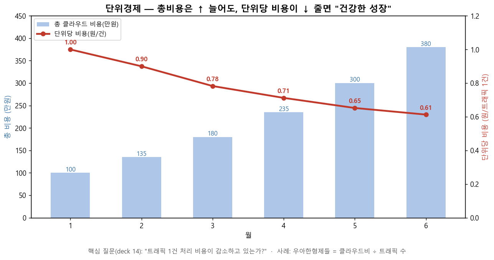

# M6. 단위경제 KPI & 협업 문화 (이론+실습, 20분 · S1~S5 통합)

> **모듈**: M6 체계화(Operate) — 단위경제 KPI & 협업 문화 · **시간**: 16:05–16:25 (20분)  
> **구성(통합)**: S1 단위경제 KPI 수립 / S2 Capability 구성요소 / S3 Persona별 역할 / S4 PO·BA의 FinOps 범위 / S5 타사 사례  
> **사용**: Cost Management 데이터 + KPI 계산  
> 📚 **참조**: [`FinOps.md`](../../교재/AM/finops/FinOps.md) 슬라이드 14(단위경제·KPI), 15(협업·거버넌스·Persona), 16(사례)  
> 📖 **1차 출처(FinOps Foundation)**: [Domains](https://www.finops.org/framework/domains/) · [Capabilities](https://www.finops.org/framework/capabilities/) · [Principles](https://www.finops.org/framework/principles/)

---

## 🟦 S1 · 단위경제 KPI 수립 (8분) 🟢 핵심 실습

> **총 비용 증가 ≠ FinOps 실패.** 비즈니스 성장을 수반한 비용 증가는 *건강*. 핵심 질문은 **"트래픽 1건 처리 비용이 줄고 있는가?"**(deck 14).  
> 단위경제는 공식 Capability **Unit Economics**(Domain **Quantify Business Value**)에 해당하며, 공식 원칙  
> **"Business value drives technology decisions"** — 집계 지출보다 단위경제·가치 기반 지표가 비즈니스 임팩트를 더 잘 보여줌 — 과 정렬됨.



**실습: 단위당 비용 계산** (Cost Management 데이터 사용)
```
단위당 비용 = 총 클라우드 비용 ÷ 비즈니스 단위(트래픽/주문/MAU/추론)
비용÷vCPU   = 총 컴퓨트 비용 ÷ 총 vCPU 시간   (인프라 효율)
```
> 위 그래프: 총비용 100→380만원(↑)인데 **단위당 비용 1.00→0.61원/건(↓)** = *효율 개선*. 이게 보고할 진짜 지표.

**대표 KPI (deck 14)** — KPI 운영·벤치마킹은 공식 Capability **KPIs & Benchmarking**(Domain **Quantify Business Value**)에 해당.  
> ※ 아래 표의 목표 수치(95%·5%·70%·10% 등)는 *교육용 자체 기준(공식 수치 아님)* — 환경에 맞게 조정.

| 구분 | KPI | 목표 예시 |
|---|---|---|
| 활성화 | 태깅 커버리지 | 95%↑ |
| 활성화 | 미할당 비용 비율 | 5%↓ |
| 활성화 | RI/SP 커버리지 | 70%↑ |
| 성과 | **단위당 비용**(주문/MAU/추론 1건) | *지속 하락* |
| 성과 | 예측 정확도(MAPE) | 10% 이내 |
| 성과 | 회수된 낭비(월) | 추적 |

---

## 🟦 S2 · Capability 구성요소 (3분)
> FinOps 역량은 *단일 점수가 아니라* **기능별 묶음**(M1 프레임워크의 Domain/Capability):  
> **보이기**(데이터 수집·할당·리포팅·이상관리) · **줄이기**(사용/요율 최적화·워크로드 배치) · **체계화**(예측·예산·KPI·자동화·거버넌스·교육).  
> → M2~M5에서 한 게 곧 이 Capability들. *팀마다 강·약 Capability가 다름*(M2-S6 자가진단).  
> ※ 본 모듈의 예측·예산·KPI·단위경제는 공식 Domain **Quantify Business Value**(Capability **Forecasting · Budgeting ·  
> KPIs & Benchmarking · Unit Economics**), 협업·리뷰 운영은 Domain **Manage the FinOps Practice**(Capability  
> **FinOps Practice Operations**)에 매핑됨.

## 🟦 S3 · Persona별 역할 (3분) — deck 15
> Persona·연합 거버넌스·리뷰 주기 등 협업 운영은 공식 Capability **FinOps Practice Operations**(Domain  
> **Manage the FinOps Practice**)에 해당하며, 공식 원칙 **"Teams need to collaborate"**(재무·기술·제품·리더 협업)와 정렬됨.

| Persona | 책임 | 소속 |
|---|---|---|
| **FinOps Practitioner** | 전사 비용 거버넌스·정책·도구 | FinOps팀(중앙) |
| 엔지니어 | 서비스별 최적화 실행·아키텍처 | 개발팀(분산) |
| 재무 | 예산·비용 보고·ROI | 재무팀 |
| **Product Owner** | 비즈니스 가치 기반 우선순위 | 사업팀 |
| 경영진 스폰서 | 전략 의사결정·조직 변화 지원 | C-Level |
> *"정책은 중앙(Steering), 실행은 각 팀"* = COVERS의 S(M1). 연합 거버넌스.

## 🟦 S4 · PO·BA의 FinOps 범위 (3분)
- **PO(Product Owner)**: *단위경제 KPI 정의*(우리 서비스의 '1건'은?), 비용을 **백로그 우선순위**에 반영(비싼 기능 vs 가치). "이 기능, vCPU당 가치 있나?"
- **BA(Business Analyst)**: 요구사항에 **비용 영향 분석** 포함(Shift-Left FinOps), 단위경제 데이터 정의·검증.
> → PO·BA가 *비용을 비즈니스 언어로 번역*해야 엔지니어 최적화가 가치로 연결.

## 🟦 S5 · 타사 실행 사례 (3분) — deck 16
- **우아한형제들(배달의민족)**: FinOps를 *단순 절감*이 아닌 **비즈니스 가치 극대화**로. **단위경제(트래픽 1건 처리 비용)** 기반 성과 측정. 국내 선도, 기술 블로그로 경험 공유.
- **한국 현실**: 대부분 **Crawl~Walk**, Run 소수. 국내+글로벌 CSP 멀티클라우드로 통합 복잡도↑.

---

## 📋 수강생 체크리스트
- [ ] **단위당 비용**(비용÷트래픽) 직접 계산
- [ ] "총비용↑인데 건강한가?"를 단위경제로 판단
- [ ] 우리 조직 **Persona별 역할** 1줄씩 정의
- [ ] **비용 리뷰 주기**(주/월/분기) 설계

## 💬 예상 Q&A
- **"비용이 늘었는데 잘한 거라고요?"** → 트래픽이 더 빨리 늘어 *단위당 비용이 줄면* 효율 개선 = 건강.
- **"단위(1건)는 뭘로?"** → 비즈니스마다 다름: 이커머스=주문, SaaS=MAU, AI=추론 요청. PO가 정의.
- **"FinOps팀이 다 해야?"** → ❌. 중앙은 정책·도구, 실행은 각 팀(연합). 엔지니어 오너십 필수(COVERS-O).

## 📎 부록 — 비용 리뷰 운영 주기 (deck 15)
| 주기 | 참석 | 내용 |
|---|---|---|
| 주간 | FinOps팀+엔지니어 | 이상비용 리뷰·최적화 액션 추적 |
| 월간 | +재무·사업 | 예산 대비 실적·KPI·트렌드 |
| 분기 | +경영진 | 전략 정렬·투자 결정·성숙도 평가 |

---

*작성: 단위경제 KPI 계산 실습(`make_m6_chart.py`) + S2~S5 개념 정리 · 개념 출처 = `FinOps.pptx` 슬라이드 14·15·16*  
*1차 출처 = FinOps Foundation [Domains](https://www.finops.org/framework/domains/) · [Capabilities](https://www.finops.org/framework/capabilities/) · [Principles](https://www.finops.org/framework/principles/)*
