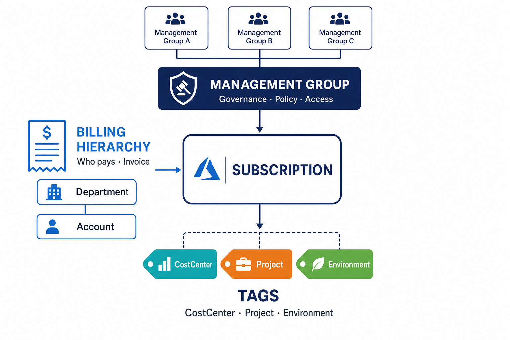

# 쉽게 배우는 Azure 비용 정리 3형제 — 관리그룹 · 청구 계층 · 태그

> **누구를 위한 문서**: "관리그룹, 청구 프로파일, 태그… 뭐가 뭔지 헷갈려요"라는 분  
> **한 문장 요약**: 세 가지는 **목적이 다른 별개의 도구**이므로 하나로 합치지 말고, **각자 역할을 나눠** 쓰는 것이 정답임  
> **핵심 결론**: 관리그룹 = **규칙 담당**, 청구 계층 = **정산(청구서) 담당**, 태그 = **세부 분류 담당**

---

## 🖼 먼저 그림으로 한눈에 보기

- 위(파랑 방패): **관리그룹** — "규칙과 권한"을 담당
- 왼쪽(영수증): **청구 계층** — "누가 돈을 내는가(청구서)"를 담당
- 아래(색깔 라벨): **태그** — "이건 무슨 용도인가"를 세밀하게 표시
- 가운데: **구독(Subscription)** — 세 가지가 **모두 만나는 지점**

> 세 화살표가 전부 가운데 **구독**으로 모이는 것이 핵심임. 구독이 세 도구의 **교차점**임.

---

## 🏢 쉬운 비유 — "공유 오피스" 이야기

여러 회사가 입주한 **공유 오피스 건물**을 떠올리면 쉬움. 각 **호실**이 Azure의 **구독**임.

| 현실 세계 (공유 오피스) | Azure | 하는 일 |
|---|---|---|
| 🛡 **건물 관리 규칙·출입증** | 관리그룹 | "이 층은 야근 금지, 이 구역은 A팀만 출입" 같은 **규칙**을 정함 |
| 🧾 **관리비 고지서** | 청구 계층 | "이 호실 관리비는 **마케팅부 앞으로** 청구" — **누가 낼지**를 정함 |
| 🏷 **물건에 붙인 이름표** | 태그 | 책상·노트북마다 "프로젝트A용", "테스트용" 스티커를 붙여 **용도**를 표시 |
| 🚪 **개별 호실** | 구독 | 규칙·고지서·이름표가 **모두 적용되는 실제 공간** |

핵심: 규칙(관리그룹)과 고지서(청구 계층)와 이름표(태그)는 **서로 다른 목적**임.  
관리비 고지서를 이름표(스티커)로 대신하려 하면 안 되듯, Azure에서도 역할을 섞으면 문제가 생김.

---

## 📚 네 가지 용어, 쉽게 정리

### 1. 관리그룹 (Management Group) — "규칙 담당"
여러 구독을 **묶어서 한꺼번에 규칙을 거는** 폴더임.  
- 예: "모든 개발용 구독은 비싼 VM 생성 금지" 규칙을 **한 번에** 적용
- 담당: **권한(누가 접근)** + **정책(무엇을 금지/허용)**
- 특징: 모든 구독은 **반드시 하나의 관리그룹**에 들어감 → 빠짐없이 덮음(커버리지 100%)

### 2. 청구 계층 — "정산(청구서) 담당"
**청구서가 실제로 발행되는 단위**임. 계약 종류에 따라 이름이 다름 → (아래 표 참고)  
- 담당: **법적으로 누구에게 얼마를 청구할지**
- 특징: 청구서에 고정되어 **바꾸기 어렵고, 감사(audit)의 기준**이 됨 → 그래서 믿을 수 있음

### 3. 태그 (Tag) — "세부 분류 담당"
리소스에 붙이는 **이름표 스티커**임. `키=값` 형태 (예: `CostCenter=CC-1234`)  
- 담당: 부서·프로젝트·환경 등 **세밀한 분류**
- 특징: **사람이 직접 붙임** → 깜빡하거나 오타가 나면 **빠짐** → 빈틈이 생김(커버리지 100% 불가) ⚠️

### 4. 구독 (Subscription) — "세 가지가 만나는 곳"
위 세 가지가 **동시에 적용되는 실제 단위**임.  
- 구독 1개 = 관리그룹 **1개** + 청구 스코프 **1개** + 태그 **여러 개**

---

## 💡 가장 중요한 원칙 3가지 (왜 합치면 안 되는가)

### 원칙 ①  "정산의 기준"은 빠짐없는 도구로 — 태그로 청구서를 만들지 말 것
태그는 **사람이 깜빡하면 빠짐**. 그래서 태그로 정산(청구·비용 정산)을 하면 **"주인 없는 비용"**이 남아  
청구서 총액과 안 맞음. 👉 **정산은 청구 계층·구독**(빠짐없이 덮는 도구)으로, **태그는 참고용 분석**으로.

### 원칙 ②  관리그룹과 청구 계층을 억지로 똑같이 맞추지 말 것 (느슨하게 연결)
"규칙 폴더 구조 = 청구서 구조"로 1:1로 딱 맞추면, **조직이 바뀔 때 양쪽이 동시에 무너짐**.  
👉 두 개는 **따로 노는 축**으로 두고, 구독에서만 만나게 함.

### 원칙 ③  관리그룹을 "회사 조직도"처럼 만들지 말 것
관리그룹은 **규칙 경계**이지 조직도가 아님. 부서 트리처럼 만들면 조직 개편 때마다  
규칙과 비용이 뒤엉켜 **다시 짜는 비용이 폭발**함. 👉 조직 정보(부서·비용센터)는 **태그**에 담을 것.

---

## ✅ 그래서 어떻게 구성하면 좋은가 (권고안)

> **규칙은 관리그룹, 청구는 청구 계층, 분류는 태그에 각각 맡기고, 구독을 이 셋이 딱 맞아떨어지는 최소 단위로 나눈다.**

실제로 이렇게 하면 됨:

1. **구독 나누는 기준** — "같은 규칙 + 같은 청구 대상"이 되는 묶음을 하나의 구독으로 (예: `마케팅-운영`, `마케팅-개발`)
2. **필수 태그 정하기** — 최소 4종: `CostCenter`(비용센터) · `Owner`(책임자) · `Environment`(환경) · `Project`(프로젝트)
3. **태그 빠짐 방지** — Azure Policy로 **강제**
   - 태그 없으면 리소스 생성 **차단**(deny)
   - 상위(리소스그룹·구독)의 태그를 **자동으로 물려받기**(inherit)
4. **조직 변경 대비** — 부서명은 태그에 직접 쓰지 말고 **"코드 → 부서 매핑표"**로 관리 → 조직 개편 시 **표만 수정**
5. **빠진 비용 챙기기(매우 중요)** — 태그만으로는 100%가 안 됨 👇

---

## ⚠️ 자주 하는 실수 & 놓치기 쉬운 부분

| 실수 | 왜 문제인가 | 해결 |
|---|---|---|
| 태그로 청구서를 대신함 | 미태깅 비용이 빠져 총액 불일치 | 정산은 청구 계층으로, 태그는 분석용 |
| 관리그룹을 조직도로 만듦 | 조직 개편 때 규칙·비용 붕괴 | 규칙 경계로만 사용, 조직은 태그로 |
| "태그 합계 = 전체 비용"이라 착각 | 미태깅분을 숨기면 배분율 왜곡 | **"미태깅(Untagged)"을 항상 표면에 표시** |
| 태그 붙이면 과거 비용도 정리될 거라 기대 | 태그는 **소급 적용 안 됨**(붙인 이후만) | 과거분은 별도 소급 배분 규칙 필요 |
| 예약·Savings Plan 비용도 태그로 잡힐 거라 기대 | 이들은 **태그가 안 붙음** | 공유비용 배분(amortization) 규칙 별도 마련 |

> 💡 **정리**: 태그가 못 잡는 3종 — ①미태깅 리소스 ②과거(소급) 비용 ③예약·SP·마켓플레이스 구매.  
> 이 셋은 **구독·리소스그룹 기준의 배분 규칙**으로 따로 100% 채워줘야 함.

---

## 🧾 헷갈리지 말기 — EA vs MCA (계약 종류부터 확인)

"청구 프로파일·청구서 섹션"이라는 말은 **MCA 계약** 용어임. **EA 계약**에는 이 단어가 **없음**.  
👉 우리 회사 계약이 EA인지 MCA인지 **먼저 확인**해야 청구 계층 구조를 올바로 잡을 수 있음.

| 계약 종류 | 청구 계층 구조 | 비용 조회 |
|---|---|---|
| **EA** (기업 계약) | 청구계정 → **부서(Department)** → 등록계정 → 구독 | 관리그룹별 비용 조회 지원 |
| **MCA** (고객 계약) | 청구계정 → **청구 프로파일** → **청구서 섹션** → 구독 | 청구 프로파일·섹션별 조회 |

> EA인데 "청구 프로파일"을 찾으면 안 나옴 — EA에서는 그 자리가 **부서/등록계정**임.

---

## 🚶 처음이라면 이 순서로 (성숙도 단계)

| 단계 | 무엇을 | 목표 |
|---|---|---|
| **1단계 (Crawl · 기어가기)** | 필수 태그 4종 정하고 붙이기, 청구 계층으로 총액 맞추기 | 일단 **"보이게"** 만들기 (Showback) |
| **2단계 (Walk · 걷기)** | Azure Policy로 태그 강제, 미태깅 리포트, 커버리지율 관리 | 태그 **빈틈 줄이기** |
| **3단계 (Run · 뛰기)** | 부서별 실제 정산(Chargeback), 예약·SP 배분 자동화 | **정확한 비용 책임** 배분 |

---

## 📌 한 장 요약

| | 관리그룹 | 청구 계층 | 태그 |
|---|---|---|---|
| **한마디로** | 규칙 담당 | 청구서 담당 | 이름표 담당 |
| **목적** | 권한·정책(거버넌스) | 법적 정산 기준 | 세밀 분류·배분 |
| **빠짐없이 덮나?** | ✅ 100% | ✅ 100% | ❌ 빈틈 있음 |
| **정산 기준 삼아도 되나?** | 보조 가능 | ✅ 주력 | ❌ 단독 불가 |
| **무엇을 담나** | 환경·규제 경계 | 부서/청구서섹션 | CostCenter·Project·Owner·Env |
| **누가 채우나** | 관리자(정책) | 계약 구조(고정) | 사람(+Policy 강제) |

> **한 줄 결론**: 세 도구를 **합치지 말고 역할을 나누되**, 구독을 딱 맞는 크기로 자르고,  
> 태그는 **Policy로 강제 + 못 잡는 비용은 배분 규칙으로 보완**하면 됨.

---

📖 **함께 보기**: [`m2-s1.태그-명명-거버넌스.md`](m2-s1.태그-명명-거버넌스.md) (태그 실습) ·
[`m2-s2.비용가시화기초.md`](m2-s2.비용가시화기초.md) (비용 보이기)  
🔗 **1차 출처(참고)**: [FinOps Framework — Allocation](https://www.finops.org/framework/capabilities/) ·
[Microsoft Learn — Management groups](https://learn.microsoft.com/azure/governance/management-groups/overview) ·
[Microsoft Learn — MCA billing](https://learn.microsoft.com/azure/cost-management-billing/manage/mca-section-invoice)
